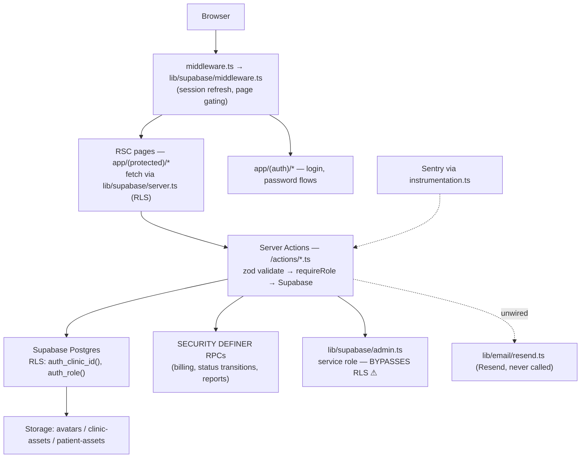

# ClinicFlow → Multi-Tenant SaaS: Platform, Arabic-First i18n, Per-Tenant WhatsApp & AI Assistant Agent — Feasibility & Implementation Plan

**Status:** Approved plan — **P0, P1 (P1A–P1D), P1.5 (P1.5A–P1.5D), P2 (P2A–P2C), P4, and P4.5 are completed, reviewed, approved, and merged to `main`.** The post-P2 production-hardening work is also merged: the finalized production marketing website (PR #38), SEO production hardening (PRs #39/#40 — `docs/SEO_PRODUCTION_HARDENING.md`), UX production hardening (states/accessibility, merged in PR #40 — `docs/UX_PRODUCTION_HARDENING.md`), and the marketing CTA smooth-scroll follow-up. **P3A–P3D are implemented on `feat/p3a-messaging-core`; P3 is feature-complete on that branch. P4.6 is implemented. P4.7A/P4.7B are implemented and the comprehensive-review fixes are applied, pending focused re-review before merge. P4.8–P6 have not started.**
**Date:** 2026-07-09
**Revised:** 2026-07-11 — incorporates the approved product & UX revisions (official roadmap changes, not feature creep): dashboard shell redesign, operator executive analytics + extensible Reports module, marketing website at `/`, popup-based UX, runtime language & display-currency switching, country-aware currency selector, international E.164 phone input, and one-click invitation email. These land as the new **P1.5** phase (§8) plus amendments to P2/P3. Engineering philosophy, architecture, security model, multi-tenancy, and the RLS-first approach are unchanged.
**Revised:** 2026-07-14 — records four approved decisions taken after the Pre-P2 polish sprint merged (`cf139cb`). **Nothing is implemented by this revision; it is a planning update only.** (1) **Thmanyah** — a licensed Arabic font purchased by the founder — becomes the primary Arabic UI face in P2 (§4.3). (2) The P2 **language switchers** are specified for three independent surfaces — the marketing site, the **clinic user's Preferences page**, and a dedicated **Operator-header switcher for the Platform Admin (SaaS Owner)** — with **English as the default language** and **no clinic language at all**: dashboard language is always a per-user preference (§4, §4.1, §4.3, P2/P2A/P2C in §8). (3) The product's commercial model is now **per active staff user, with the clinic owner/primary admin seat free**, provisionally **USD 9/month** per additional active staff user (§3.3, §13-Q1) — recorded for the future billing phase, not built. (4) A future **legal-acceptance & agreement-history** capability is defined prospectively (new §3.7) — the data does not exist today and must never be synthesized. (5) Per-user UI preferences (theme + locale, for clinic users **and** the Platform Admin) get one approved auth-user-keyed store, **`user_ui_preferences`** (new §4.5) — architecture approved now, **implemented in P2A**, including its RLS, profile-migration strategy, and backfill. Sub-phase numbering, completed phases, and all other scope are unchanged. Immediate post-Pre-P2 UX work lives in `docs/POST_PRE_P2_MANUAL_POLISH.md`, which is **documentation and UI work only and introduces no migration**.
**Revised:** 2026-07-17 — **Phase 6 is restructured to absorb the approved enterprise WhatsApp onboarding & integration-health product direction. Planning only; nothing is implemented by this revision.** P6C is rescoped from a bare adapter migration into the full in-product **Embedded Signup onboarding experience** — a four-step connect wizard, a derived connection-state machine (with sanitized failure reasons), and hybrid webhook + reconciliation-poll state refresh — and a new **P6D — WhatsApp Health, diagnostics & production-readiness** sub-phase is added (P6 becomes 4 sub-phases; 23 execution sub-phases total; P6 estimate 10–15 → 15–21 days). The shipped P3B 360dialog connect flow is unchanged and remains the launch path; Embedded Signup is the P6 migration target, never a P3 dependency. Two honesty rules bind the new scope: **no Meta review-time estimates are ever shown** (Meta exposes decisions, not ETAs), and **quality rating / conversation-limit / verification data is surfaced only where the connection model actually provides it** (Meta-direct channels; 360dialog channels get the honest §3.7-style placeholder). Details in §8 (P6C/P6D).
**Revised:** 2026-07-17 — **SMS/Unifonic is removed from the product scope. SMS is not a supported channel anywhere in the product, and Unifonic is not a provider or sub-processor. Phase 3 supports exactly two messaging channels: WhatsApp and Email.** Automated sends (reminders, invoice follow-ups) attempt WhatsApp first and fall back to Email; a clinic with no WhatsApp channel, template, or phone operates directly on Email from day one. The `sms` feature key and `sms_messages` usage metric that P1 shipped in the billing vocabulary (`plans.features`, `usage_metric` enum, §3.4/§3.5) are **retained as inert legacy vocabulary** — removing enum values would force a destructive migration for zero product benefit — but nothing reads or increments them. Where §5/§7/§8 below still name SMS or Unifonic in historical planning text, this revision supersedes it.
**Revised:** 2026-07-18 — **Approved product direction: appointment notifications and invoice delivery become event-driven; scheduled work collapses to one daily morning cron.** This supersedes the cron-centric §7 design where it conflicts. (1) **Event-driven appointment notifications** — WhatsApp + Email are sent **immediately** (not by cron) at four appointment lifecycle events: **created** (initial/pending), **confirmed**, **rescheduled** (a `rescheduled` status will be added later), and **cancelled**. These fire inline from the appointment mutations (create/`updateAppointmentStatus`/reschedule), through the same `lib/messaging/` send boundary, WhatsApp-first with Email fallback. (2) **Daily reminders remain the only recurring appointment job** — a **single scheduled job that runs once every morning**, sending reminders for **all confirmed appointments scheduled for today and tomorrow** (replacing the per-offset hourly reminder model of §7.2). (3) **Event-driven invoice delivery** — as soon as an invoice is **issued**, it is delivered **immediately** to the patient via **both WhatsApp and Email**, with no wait for any scheduled task. (4) **Invoice delivery is template-agnostic in P3** — P3 ships the **invoice-issued event and immediate WhatsApp+Email delivery workflow** using the *existing* appointment/billing invoice representation (or a minimal system-generated invoice summary), records the delivery attempts/statuses on `outbound_messages`, and is deliberately structured so a later rendered document can be dropped in **without changing the event-driven delivery workflow**. The **professional invoice template, unique serial/invoice numbering, PDF/print layout, and the full document-template engine are NOT built in P3** — they move to the new **P7 — System Templates & Document Engine** (§8, added 2026-07-18). (5) **Scheduled invoice processing is retained only where still valuable after immediate delivery** — initial invoice delivery (formerly the D0 cron step) is gone; only the unpaid-balance **dunning follow-up** remains worth scheduling, and it **folds into the single daily morning cron** rather than a separate hourly job. (6) **Cron configuration** — the hourly `reminders`/`invoice-followups` crons are replaced by **one daily morning cron**, satisfying the **Vercel Hobby free-tier limit (max 2 cron jobs, each once daily)**: `fx-rates` (existing daily) + the daily morning messaging cron. Where §7/§8 below describe hourly crons, cron-driven initial appointment/invoice notifications, or a P3 invoice template/serial, this revision supersedes them.
**Revised:** 2026-07-19 — **Approved messaging flow refinements (implemented on `feat/p3a-messaging-core`).** Refines the 2026-07-18 direction: (1) **Independent channels** — Email and WhatsApp are no longer a fallback chain; each patient notification attempts **Email whenever the patient has one** and **WhatsApp only when the clinic has an active integration**, and one channel never blocks the other (partial success is normal). Applies to appointment notifications, reminders, invoice delivery, and dunning. (2) **Manual invoice send** — invoice delivery is **no longer automatic** on billing completion. The employee saves the invoice, clicks **"Send to patient"**, and confirms in a popup; only then is it delivered (still template-agnostic, professional document → P7). (3) **Configurable overdue-invoice reminders** — the hardcoded D+3/D+7 dunning is replaced by **per-clinic settings**: on/off, first-reminder days, second-reminder days, and email subject/body (WhatsApp wording stays the clinic's `invoice_followup` template). (4) **Per-channel idempotency** — a `message_dispatches` ledger records each `(clinic, logical message, channel)` send; a duplicate is never sent, and if one channel fails while the other succeeds only the **failed channel** retries. This supersedes the reminder-specific `reminders_sent 'daily'` lease from 2026-07-18. §7 below reflects this.
**Revised:** 2026-07-18 — **Phase 4 manual-testing authorization amendment (implemented).** The in-app Assistant is a normal clinic module for all four clinic roles (`admin`, `manager`, `doctor`, `receptionist`) when the clinic is entitled and the administrator has left that user's Assistant page visible. Doctors retain the clinical persona and patient-profile launcher; the other roles receive an explicitly non-clinical administrative persona. This amendment also makes §3.8's page-registration rule permanent for every future clinic-facing module and makes §6.8 authoritative where older P4 doctor/staff wording conflicts.
**Revised:** 2026-07-18 — **Phase 4.5 — AI Platform & Provider Architecture is added between P4 and P5. Planning only; nothing is implemented by this revision.** P4.5 records the recommended long-term commercial and technical AI platform before patient-facing automation begins: Starter has no AI; Professional uses ClinicFlow-managed AI with an included pooled allowance; Enterprise supports managed AI plus optional strict BYOK and explicitly contracted hybrid fallback. It adds the future provider-policy abstraction, model certification registry, tenant credential lifecycle, immutable usage/cost ledger, namespaced AI entitlements, plan/billing integration, and operator controls. P5 and all later AI work depend on this decision gate. Details: §8 and `docs/reports/P4_5_ARCHITECTURE_PROPOSAL.md`.
**Revised:** 2026-07-19 — **Approved AI commercialization & scope decisions after architectural review. Planning only; nothing is implemented by this revision, and no completed phase (P0–P4) or the shipped §6.8 matrix is changed.** (1) **AI is the exclusive differentiator of the top tier.** Basic and Professional carry **no AI whatsoever**; Professional is a complete non-AI platform (reports, analytics, messaging, notifications, calendar, all non-AI features). **All** AI — staff assistant, future patient AI, AI analytics, AI financial insights, AI follow-up generation, AI scheduling, future AI capabilities, higher AI limits, and future BYOK — lives only in **Pro + AI (`pro_ai`)**. This overrides the earlier P4.5 draft that placed a Staff Assistant in Professional; it matches the current DB seed (`pro.ai_assistant:false`), so **no entitlement migration is required** to keep AI out of `pro`. The P4.5C commercial-contract table (§8) is revised accordingly. (2) **New phase P4.6 — Staff Analytics & Financial Assistant** is added between P4.5 and P5 (`pro_ai`-only, post-v1, non-blocking): read-only operational + financial insight tools (`get_clinic_summary`, `get_revenue_summary`, report lookups) backed by purpose-built `SECURITY DEFINER` clinic-scoped aggregate RPCs, with a dedicated `ai.financial_insights` entitlement **plus a per-user financial permission (default OFF for managers)** because current RLS already permits `admin/receptionist/manager` financial reads. (3) **AI follow-up generation and AI scheduling** are recorded as committed `pro_ai` scope slotted into P5/P6, bound by the existing human-in-the-loop guarantee (agent drafts `pending`/draft output only; never auto-mutates or auto-sends). Doctor data scope is unchanged (assigned-OR-same-department RLS). Details: §8 (P4.5C, new P4.6) and §13.
**Revised:** 2026-07-21 — **Phase 7 adopts a design-first premium-document strategy: business requirements → visual design → engineering, split across explicit deliverables. Planning only; nothing is implemented by this revision.** P7's goal is raised from "printable documents" to a **premium, brandable, extensible document system** whose visual quality is specified and designed *before* it is engineered, and P7 is restructured from 2 sub-phases into 5: **P7A — Document Requirements Catalog** (a complete written spec for the committed system-template set — purpose, generation point/actor/trigger, paper size, formats, every dynamic/optional field, sections/tables/signatures/QR, numbering, localization + RTL/LTR, branding placeholders, delivery channels, and legal requirements — plus a documented **additive extension pattern** so a new document is a new definition, not a redesign); **P7B — Document Design System & approved visual designs** (a shared document design system — tokens, grid, type scale, and the engine's layout primitives: header/footer band, branding block, signature block, QR block, table and pagination/`@page` rules, RTL mirroring — then per-document visual designs produced in an external tool, e.g. Stitch/Figma, that **conform to those primitives**, approved one document at a time); **P7C — Clinic branding model & settings** (the branding data the placeholders require does not exist today — `clinics` has only `name/phone/logo_url/address` — so P7C adds the branding schema: website, email, social links, tax/VAT, license numbers, custom footer, and an extensible metadata bag, plus logo/asset storage, a clinic branding settings UI, and clinic-scoped RLS on top of the §3.2 `fix_clinics_cross_tenant_policies` fix); **P7D — Document engine core** (registry + typed per-document contracts, the P7B primitives with **graceful optional-field degradation**, branding injection, per-document numbering/serial incl. the P3-deferred invoice serial, and PDF/print rendering in ar/en + RTL/LTR); **P7E — System templates on the engine** (each approved design implemented — invoice, receipt, prescription, medical report, sick-leave, referral & lab-request, consent forms — with the rendered **invoice** plugged into the unchanged §7.3a delivery). Three corrections bind the proposal rather than accepting it verbatim: (a) the catalog covers the **committed** template set + an extension pattern, **not** "every document the system will ever need" (that ambition is uncapped and unmaintainable; the registry precedent is P1.5B's report registry); (b) external design tools produce specs **constrained by the engine's real print/PDF/pagination/RTL and optional-field capabilities**, never free-form art that cannot be reproduced faithfully; (c) e-signature / legal-acceptance **capture** stays out of scope (rendering consent forms only — future work tied to §3.7). Estimate 12–18 → **20–30 days**; execution sub-phases 41 → **44**; total range ~128–181 → **~136–193 developer-days**. Details in §8 (P7).
**Revised:** 2026-07-19 — **Approved in-system operating-assistant direction (planning only; nothing is implemented by this revision).** After an architecture review of the Pro + AI assistant vision ("ask almost anything about the clinic" — operational, reporting, search, navigation, and how-do-I questions in natural language), four decisions are recorded: (1) **The admin persona stays non-clinical** — the shipped §6.8 matrix is unchanged, and individual clinical summaries, lab results, and note contents remain doctor-only — but the admin/manager assistant gains broad **aggregate, privacy-safe clinic intelligence**: patient/appointment counts and trends, counts by department, new-patient statistics, no-show/cancellation rates, aggregate blood-type distribution (with small-cell suppression so aggregates cannot be reversed into individuals), staffing/operational metrics, and permitted financial metrics. (2) **P4.6 is extended** from three aggregate tools into the full **Analytics, Reporting & Operational Query Assistant**: a declarative AI tool registry, typed operational list/stat tools for admin/manager/receptionist, financial tools behind the existing `ai.financial_insights` + per-user permission gate, and a `run_clinic_report` tool over the existing `lib/reports/data.ts` cores. Receptionists are now excluded from **financial** tools only, not from the whole phase (estimate 7–10 → 10–14 days). (3) **New phase P4.7 — System Knowledge, Guidance & Capability Transparency** is added between P4.6 and P5 (4–6 days, `pro_ai`-only, parallelizable with P4.6B): a curated in-repo ar/en help corpus, `search_help` and permission-aware `get_navigation_target` tools, a cheap `staff_help` task class, and an always-visible, server-derived **capability panel** in the assistant UI (`list_my_capabilities` — one registry resolver produces both the cross-task authorized union and every narrower active-turn mount). (4) **A generic query engine (text-to-SQL or any "run arbitrary queries" tool) is permanently rejected** — assistant coverage grows only by adding typed, allow-listed, RLS-enforced tools. "Patients waiting for lab results" is recorded as a **data-model gap** (no lab-order/result-status entity exists); per the §3.7 honesty rule the assistant must decline such questions honestly until that domain is built. Details: §8 (P4.6 revised, new P4.7).
**Revised:** 2026-07-20 — **Operating-assistant expansion: entity search, contextual launchers, and premium assistant placement (P4.6C implemented; the rest planning only).** An audit of the shipped P4/P4.5 assistant against the operating-assistant vision (full analysis: `docs/reports/OPERATING_ASSISTANT_EXPANSION_PROPOSAL.md`) confirmed that the aggregate/reporting and help/navigation gaps are already owned by P4.6/P4.7, but three capabilities were missing from the roadmap entirely. (1) **New sub-phase P4.6C — Intelligent entity search & name resolution** (merge-first within P4.6; **implemented 2026-07-20**): deterministic database-native search — an immutable Arabic/English normalizer (`normalize_search_text`: alef/hamza/taa-marbuta/alef-maqsura folding, diacritic and tatweel stripping, Arabic-Indic digit mapping), generated `patients.search_name`/`search_phone` columns with trigram indexes, a `SECURITY INVOKER` ranked RPC (`search_patients_ranked`: trigram similarity + word-similarity over the normalized query and a deterministic ar↔en transliteration variant, exact file-number and phone-suffix identifiers, score + match-kind metadata), and server-computed confidence (`high`/`medium`/`low`) with a clarification contract — the model proceeds only on a confident unique match and otherwise asks the user to choose; it never fuzzy-matches names itself. The same pattern extends to staff/departments/services in P4.6A. P4.6 grows 10–14 → 13–18 days. (2) **New phase P4.8 — Contextual Assistant Launchers & Page-Context Contract** (5–7 days): one reusable launcher component + a typed, zod-validated `AssistantPageContext` contract (patient, appointments, dashboard, revenue, reports, invoices, staff, departments, doctor schedule); context is advisory prompt input only and never widens tool access. (3) **New phase P4.9 — AI Assistant Customization** (4–6 days, `pro_ai`-only, entitlement `ai.assistant_customization`): the primary admin configures launcher placement per area × role with optional per-user overrides; customization edits UI visibility only and can never alter authorization. §6.3's `search_authorized_patients` row is superseded by the P4.6C ranked contract. Execution sub-phases 32 → 37; total estimate ~142–201 → ~154–218 dev-days.
**Revised:** 2026-07-20 (second revision) — **Approved founder additions completing the operating-assistant vision: conversational entity context and multi-step workflow execution. Planning only; nothing is implemented by this revision.** (1) **New phase P4.10 — Conversational Entity Context (Session Memory)** (4–6 days, `pro_ai`-only, after P4.9): the assistant tracks the currently discussed entity (patient, appointment, invoice, staff member, department, report — extensible) **server-side, per conversation, session-scoped only — never persistent memory**. "Open Mohamed Hassan" followed by "when was his last visit?" resolves to the same patient without re-asking; context is set only from a high-confidence P4.6C resolution or an explicit user choice, switches naturally on request, and is **advisory identity default only** — every tool call still revalidates role, entitlement, visibility, and RLS on every turn, so context can never bypass permissions or widen access beyond what the same user could reach by naming the entity explicitly. (2) **New phase P4.11 — Multi-Step AI Workflow Execution** (8–12 days, `pro_ai`-only, after P4.10): the assistant orchestrates **multiple registry tools** to complete higher-level tasks ("find tomorrow's unconfirmed appointments and send reminders", "find overdue invoices and send reminder emails", "generate this month's revenue report and summarize it"). Built entirely on the P4.6A typed tool registry — no unrestricted database access, every step individually authorized and audited, **plan → dry-run preview → explicit human confirmation** for any action step (all writes remain draft/`pending`/confirm-to-send under the existing human-in-the-loop guarantee), partial-failure reporting, and cost-aware execution (per-workflow step/budget caps through `prepareAiExecution`). New entitlement `ai.workflows`; additive `ai_workflow_runs` audit ledger. Execution sub-phases 37 → 41; total estimate ~154–218 → ~166–236 dev-days. Details in §8 (P4.10, P4.11) and `docs/reports/OPERATING_ASSISTANT_EXPANSION_PROPOSAL.md` §16–§17.
**Scope of this document:** Master architecture, roadmap, and approved product rules. Implementation evidence and validation results live in the phase reports under `docs/reports/`.
**Supersedes:** The earlier single-clinic AI-agent plan direction. In particular, the previously proposed "patient portal prerequisite" phase is **explicitly retired** — WhatsApp is now the patient channel (see §5, §6).

---

## Roadmap Summary (decision table)

| Phase | Duration (dev-days) | Deliverable | Depends on |
|---|---|---|---|
| **P0 — Tenant hardening & per-clinic config** | 8–12 | ⛔ BLOCKING security fixes (clinics RLS policies, admin-client wrapper), per-clinic timezone/currency/locale columns and threading | — |
| **P1 — SaaS foundation** | 15–20 | Invite-only early-access registration (operator-switchable to open) + setup wizard, provider-agnostic billing architecture (`plans`/`subscriptions`/`usage_counters`/trials — **no payment gateway yet**), coupons/promotions, invitation management, entitlements + per-clinic feature flags, operator Mission Control panel, rate limiting, data export | P0 |
| **P1.5 — Premium UX, marketing site & platform analytics** | 18–26 | Dashboard shell redesign (collapsible sidebar, modern header, global theme/user/logout utilities — UI-only), operator executive analytics dashboard + extensible Reports module, one-click invitation email, marketing website at `/` with integrated early access + popup UX + premium motion, display-currency preference (9 currencies) + country-aware currency selector + international E.164 phone input | P1 stabilized |
| **P2 — Arabic i18n & RTL** | 12–18 | `next-intl` (**English default** — amended 2026-07-14), **real language switcher on the marketing site + authenticated header, runtime switching without sign-out**, full RTL retrofit (file/occurrence inventory re-measured after P1.5A), **Thmanyah** Arabic typography (licensed; §4.3), localized zod errors — staff UI fully Arabic-capable | P0 (P2A parallelizable with P1/P1.5); P2B requires P1.5A; **licensed font files required from the founder before P2 starts** |
| **P3 — Messaging layer + manual WhatsApp inbox + notifications** | 15–20 | Channel-abstracted `outbound_messages` (WhatsApp via BSP, email — **no SMS**, 2026-07-17 revision), inbound webhook, **staff manual WhatsApp inbox**, **event-driven appointment notifications** (created/confirmed/rescheduled/cancelled — 2026-07-18 revision), **single daily morning reminder job** (confirmed appts today+tomorrow), **event-driven invoice delivery** (template-agnostic; professional document deferred to P7), unpaid dunning follow-up (folded into the daily cron), in-app notification center, template management | P0, P1 (usage counters) |
| **P4 — Doctor AI assistant (read-only)** | 10–14 | Staff chat UI, patient-summary/search tools, audit logging, AI entitlement gating | P0, P1; P2 for Arabic answers |
| **P4.5 — AI Platform & Provider Architecture** | 11–16 | Provider-neutral AI policy/execution layer; ClinicFlow-managed, Enterprise BYOK, and explicit hybrid modes; certified model registry and safe failover; encrypted per-clinic key lifecycle; immutable request/token/cost ledger; namespaced AI entitlements; Starter/Professional/Enterprise commercial rules and billing integration | P4, P1B/P1D |
| **P4.6 — Analytics, Reporting & Operational Query Assistant** (`pro_ai`-only; post-v1, non-blocking; *extended 2026-07-19; entity search added 2026-07-20*) | 13–18 | Declarative AI tool registry; read-only aggregate analytics + financial tools (`get_clinic_summary`, `get_revenue_summary`, `compare_revenue_periods`, patient/appointment stats incl. blood-type distribution with small-cell suppression) on purpose-built `SECURITY DEFINER` clinic-scoped RPCs; typed operational list tools (`list_appointments`, `count_new_patients`, `list_pending_followups`, `list_outstanding_invoices`) for admin/manager/receptionist; `run_clinic_report` over the existing `lib/reports/data.ts` cores; `ai.financial_insights` entitlement + per-user financial permission (default OFF for managers); receptionists/doctors excluded from **financial** tools only | P4, P4.5 |
| **P4.7 — System Knowledge, Guidance & Capability Transparency** (`pro_ai`-only; ∥ P4.6B; *added 2026-07-19*) | 4–6 | Curated in-repo ar/en help corpus + authoring convention; `search_help` + permission-aware `get_navigation_target` tools (navigation registry on the existing `PageSlug`/`user_page_permissions` machinery); cheap `staff_help` certified task class; server-derived assistant **capability panel** (`list_my_capabilities`) | P4B, P4.5; P4.6A (tool registry) |
| **P4.8 — Contextual Assistant Launchers & Page-Context Contract** (`pro_ai`-only; *added 2026-07-20*) | 5–7 | Reusable `AssistantLauncher` component + typed zod-validated `AssistantPageContext` contract; "Ask Assistant" entry points on patient profile, appointments, dashboard, revenue, reports, invoices, staff, departments, doctor schedule; context is advisory only — never widens tool access | P4.6B; P4.7A (navigation registry) |
| **P4.9 — AI Assistant Customization** (`pro_ai`-only premium; *added 2026-07-20*) | 4–6 | Primary-admin launcher-placement configuration per area × role + optional per-user overrides (`assistant_launcher_settings`, `assistant_launcher_user_overrides`, entitlement `ai.assistant_customization`); UI visibility only, never authorization | P4.8 |
| **P4.10 — Conversational Entity Context (Session Memory)** (`pro_ai`-only; *added 2026-07-20*) | 4–6 | Server-side, conversation-scoped active-entity context (patients, appointments, invoices, staff, departments, reports — extensible); set only by high-confidence P4.6C resolution or explicit user choice; natural context switching; session-scoped, never persistent; advisory identity default only — every tool call revalidates authorization | P4.6C, P4.6B; P4.9 ordering |
| **P4.11 — Multi-Step AI Workflow Execution** (`pro_ai`-only; *added 2026-07-20*) | 8–12 | Reusable workflow orchestration over the P4.6A typed tool registry: plan → dry-run preview → explicit confirmation for action steps (writes stay draft/`pending`/confirm-to-send), per-step authorization + audit, partial-failure reporting, per-workflow step/cost caps, `ai.workflows` entitlement, `ai_workflow_runs` ledger | P4.10; P4.6, P4.7; P3 (messaging cores) for send-type steps |
| **P5 — Patient WhatsApp AI + preliminary booking** | 12–16 | AI auto/suggested replies in the P3 inbox, availability checks, pending-slot booking with caps, cancellation | P3, P4, **P4.5** |
| **P6 — Hardening, eval & Tech Provider migration** | 15–21 | Prompt-injection test suite, eval sets (ar/en), load & cost dashboards, Meta Tech Provider / Embedded Signup migration with in-product onboarding wizard + connection-state machine, WhatsApp Health & diagnostics page | P3–P5 |
| **P7 — Premium Document System (design-first)** | 20–30 | **Design-first** document system built business requirements → visual design → engineering: a written **document requirements catalog** for the committed system-template set (+ additive extension pattern); a shared **document design system** and per-document approved visual designs (external tool, engine-constrained); a **clinic branding model + settings** (schema for website/email/social/tax-VAT/license/custom-footer/extensible metadata — none exist today — plus logo storage and clinic-scoped RLS); a reusable **document engine** with typed contracts, QR/signature/branding primitives, graceful optional-field degradation, per-document numbering/serial (incl. the invoice serial deferred from P3), and professional PDF/print in ar/en + RTL/LTR; the **system templates** — invoice, receipt, prescription, medical report, sick-leave, referral & lab-request, consent forms — with preview/print/download and the rendered invoice plugged into §7.3a **without changing the event-driven delivery workflow** | P3 (messaging/delivery); P2 (RTL/i18n); clinic branding from P1.5 |
| **Total** | **~166–236** (≈ 10–15 months, single developer) | | |

**Recommended v1 cut line:** ship **P0–P4.5 (P1.5 included) with the manual WhatsApp inbox**. P4.5 is required before AI is sold commercially: it turns the P4 product capability into a supportable, provider-neutral, metered offering. **P4.6 (staff analytics/financial AI) and P5 (patient AI booking) may both slip without blocking launch** — clinics get real patient messaging on day one via the staff inbox, and both the analytics tools and the patient AI layer plug into the same infrastructure later. Within P1.5 itself, P1.5C (marketing site) is the only sub-phase that gates public launch; P1.5B/P1.5D can ship in fast-follow releases if launch pressure demands.

### Execution sub-phase plan (branch/PR boundaries)

Phases P1–P7 are too large for one branch/PR each. They are split below into **44 execution sub-phases** (the 2026-07-18 Phase 4.5 revision adds P4.5A–P4.5C; the 2026-07-19 revisions add P4.6A–P4.6B and P4.7A–P4.7B; the 2026-07-20 revisions add P4.6C, P4.8A–P4.8B, P4.9A–P4.9B, P4.10A–P4.10B, and P4.11A–P4.11B; the 2026-07-21 revision restructures P7 from P7A–P7B into P7A–P7E, the design-first premium document system), each sized for one focused implementation session, one rigorous review, one branch, and one PR. Product scope, phase numbering, and dependencies are unchanged — this is an execution-planning split only (full per-sub-phase detail lives in each phase's *Execution split* block in §8). P0 is complete and is not part of this table; P1 (P1A–P1D), P1.5 (P1.5A–P1.5D), P2 (P2A–P2C), P3 (P3A–P3D), P4 (P4A–P4B), and P4.5 (P4.5A–P4.5C) are all merged to `main`; **P4.6C, P4.6A, and P4.6B are implemented (2026-07-20), completing phase P4.6**; **P4.7A and P4.7B are implemented and their comprehensive-review fixes are applied (2026-07-21); P4.7 is pending focused re-review before merge. P4.8A has not started.**

| Parent | Sub-phase | Deliverable | Depends on | Est. days | Recommended PR boundary (branch) |
|---|---|---|---|---|---|
| P1 | **P1A** | SaaS platform schema + RLS + platform-admin guard (all P1 tables, no UI) | P0 | 4–5 | `feat/p1a-saas-platform-schema` |
| P1 | **P1B** | Billing domain + entitlements engine (`lib/billing/`, `lib/entitlements.ts`, trial gate, coupons logic) | P1A | 4–5 | `feat/p1b-billing-entitlements` |
| P1 | **P1C** | Early-access request + invitations + invited signup + onboarding wizard + rate limiting | P1A (∥ P1B) | 4–6 | `feat/p1c-early-access-signup` |
| P1 | **P1D** | Operator Mission Control panel + data export | P1A–P1C | 3–4 | `feat/p1d-operator-panel` |
| P1.5 | **P1.5A** | Dashboard shell redesign: collapsible sidebar, modern header, global utilities (theme toggle, user menu, logout) — UI-only | P1 stabilized | 4–6 | `feat/p15a-dashboard-shell` |
| P1.5 | **P1.5B** | Operator executive analytics dashboard + extensible Reports module + one-click invitation email | P1D (∥ P1.5A) | 5–7 | `feat/p15b-operator-analytics-reports` |
| P1.5 | **P1.5C** | Marketing website at `/` (integrated early access, popup UX, CTA → login, premium motion) | P1C (∥ P1.5A/B/D) | 5–7 | `feat/p15c-marketing-site` |
| P1.5 | **P1.5D** | International UX foundations: display-currency preference + country-aware currency selector + E.164 phone input | P1A schema; before P2C | 4–6 | `feat/p15d-intl-ux-foundations` |
| P2 | **P2A** | i18n infrastructure (next-intl, locale resolution + runtime switching plumbing, zod message keys, typography) | P0 (∥ P1/P1.5) | 4–5 | `feat/p2a-i18n-infrastructure` |
| P2 | **P2B** | RTL retrofit (shadcn regeneration, logical-properties codemod, icon mirroring, CI grep-gate) | P2A, **P1.5A** | 4–6 | `feat/p2b-rtl-retrofit` |
| P2 | **P2C** | String extraction + Arabic translation + digits/date/currency polish + full RTL QA | P2A, P2B | 4–7 | `feat/p2c-arabic-strings-qa` |
| P3 | **P3A** | Messaging schema + channel abstraction + email adapter + credential encryption | P1B (usage/entitlements) | 4–5 | `feat/p3a-messaging-core` |
| P3 | **P3B** | WhatsApp (360dialog) integration: connect flow, webhooks, signature verification, template sync | P3A | 3–4 | `feat/p3b-whatsapp-integration` |
| P3 | **P3C** | Manual inbox UI (threading, realtime, 24h window, template picker, triage) | P3A (∥ P3D; P3B for live traffic) | 5–7 | `feat/p3c-manual-inbox` |
| P3 | **P3D** | Event-driven appointment/invoice notifications + single daily morning cron (reminders + dunning) + template-agnostic immediate invoice delivery (professional document → P7) + template management + notification center | P3A (∥ P3C) | 3–4 | `feat/p3d-reminders-notifications` |
| P4 | **P4A** | AI foundation + doctor tools + per-tool authorization + audit (no UI) | P1B, P1A; P2A for ar prompts | 6–8 | `feat/p4a-ai-doctor-tools` |
| P4 | **P4B** | Staff assistant chat UI (streaming route, assistant page, patient-profile launcher) | P4A | 4–6 | `feat/p4b-assistant-ui` |
| P4.5 | **P4.5A** | AI policy/provider abstraction + certified model registry + immutable usage/cost ledger and atomic budget reservations | P4B, P1B | 4–6 | `feat/p45a-ai-platform-foundation` |
| P4.5 | **P4.5B** | Managed/BYOK/hybrid routing + encrypted tenant credential lifecycle + primary-admin provider controls | P4.5A | 4–5 | `feat/p45b-ai-provider-connections` |
| P4.5 | **P4.5C** | Starter/Professional/Enterprise catalog mapping + namespaced entitlements + billing/operator usage integration | P4.5A, P4.5B, P1D | 3–5 | `feat/p45c-ai-commercial-integration` |
| P4.6 | **P4.6C** | Intelligent entity search & name resolution (normalization functions, generated search columns + trigram indexes, ranked `SECURITY INVOKER` search RPC, ar↔en transliteration helper, rewritten `search_authorized_patients` with confidence + clarification contract) — **merges first within P4.6**; *implemented 2026-07-20* | P4B (independent of P4.5C and the registry) | 3–4 | `feat/p46c-entity-search` |
| P4.6 | **P4.6A** | *Implemented 2026-07-20 (`docs/reports/P4_6A_IMPLEMENTATION.md`).* Declarative AI tool registry + aggregate analytics/financial RPCs (`SECURITY DEFINER`, clinic-scoped, small-cell suppression) + operational list/stat tools + `run_clinic_report` on `lib/reports/data.ts` cores + `ai.financial_insights` entitlement + per-user financial permission + per-tool authorization + tool-authorization tests (no UI) | P4.5A, P4.5C | 6–9 | `feat/p46a-staff-analytics-tools` |
| P4.6 | **P4.6B** | *Implemented 2026-07-20 (`docs/reports/P4_6B_IMPLEMENTATION.md`).* Analytics/operational/financial tools mounted into the existing staff assistant UI + entitlement/permission-gated affordances derived from the P4.6A mount + upgrade/permission UX (ar/en) + operational-vs-financial result presentation + report deep links + admin settings surface for the financial grant + the P4.6A access-path carry-forwards | P4.6A, P4B | 4–5 | `feat/p46b-staff-analytics-ui` |
| P4.7 | **P4.7A** | *Implemented 2026-07-21 (`docs/reports/P4_7A_IMPLEMENTATION.md`).* Curated ar/en help corpus + authoring convention + `search_help` (deterministic ar/en retrieval) + permission-aware `get_navigation_target` + navigation registry over `PageSlug`/`user_page_permissions` + cheap `staff_help` task class (first genuinely narrower tool mount) + full authorization/localization/retrieval/honesty tests (no UI) | P4B, P4.5A; P4.6A (registry) | 2–3 | `feat/p47a-system-knowledge` |
| P4.7 | **P4.7B** | *Implemented 2026-07-21; comprehensive-review fixes applied, pending re-review (`docs/reports/P4_7B_IMPLEMENTATION.md`, `docs/reports/P4_7_COMPREHENSIVE_FIXES.md`).* Server-derived capability panel + `list_my_capabilities` tool exposing the authorized union across supported task classes; each active turn mounts an authorized subset from the same registry resolution. Includes dynamic ar/en capability descriptions, structured cited help/deep links, permission-aware grouped UI, focus/accessibility coverage, and union↔active-mount authorization tests. | P4.7A | 2–3 | `feat/p47b-capability-panel` |
| P4.8 | **P4.8A** | Typed `AssistantPageContext` contract + reusable `AssistantLauncher` + launcher registry/resolver + first entry points (patient, appointments, dashboard) | P4.6B, P4.7A | 3–4 | `feat/p48a-contextual-launchers` |
| P4.8 | **P4.8B** | Remaining entry points (revenue, reports, invoices, staff, departments, doctor schedule) + context-aware suggested prompts + launcher-visibility tests | P4.8A | 2–3 | `feat/p48b-launcher-rollout` |
| P4.9 | **P4.9A** | `assistant_launcher_settings` + `assistant_launcher_user_overrides` schema/RLS + `ai.assistant_customization` entitlement + server-side placement resolution + tests (no UI) | P4.8 | 2–3 | `feat/p49a-assistant-customization-core` |
| P4.9 | **P4.9B** | Primary-admin placement settings UI (area × role matrix, per-user overrides, upgrade gate) | P4.9A | 2–3 | `feat/p49b-assistant-customization-ui` |
| P4.10 | **P4.10A** | Server-side conversation context core: `agent_conversations.active_context` (session-scoped, jsonb, cleared on conversation end), set/clear/switch semantics from high-confidence resolution or explicit choice, context injection into tools as advisory identity defaults, per-turn re-authorization tests — patients first (no UI) | P4.6C, P4.6B | 2–3 | `feat/p410a-conversation-context-core` |
| P4.10 | **P4.10B** | All entity types (appointments, invoices, staff, departments, reports) + natural context-switch UX + visible active-context chip in the assistant UI + cross-entity tests | P4.10A | 2–3 | `feat/p410b-conversation-context-entities` |
| P4.11 | **P4.11A** | Workflow orchestration engine over the tool registry: typed workflow plan representation, read-only multi-step execution, dry-run preview, per-step authorization/audit/ledger (`ai_workflow_runs`), partial-failure reporting, step/cost caps, `ai.workflows` entitlement (no action steps, no UI) | P4.10, P4.6A, P4.7A | 4–6 | `feat/p411a-workflow-engine` |
| P4.11 | **P4.11B** | Action steps behind explicit confirmation: draft/`pending`/confirm-to-send integrations with the messaging + booking + report cores, confirmation & dry-run UX in the assistant, resumable partial failures, workflow suggestion prompts | P4.11A, P3D | 4–6 | `feat/p411b-workflow-actions` |
| P5 | **P5A** | Booking-core hardening (pending caps/TTL) + patient tools + identity gating (no channel wiring) | P4A, P3A, **P4.5** | 6–8 | `feat/p5a-patient-tools-booking` |
| P5 | **P5B** | Inbox AI integration: suggest/auto modes, escalation, confirmation flows, FAQ content UI | P5A, P3B, P3C | 6–8 | `feat/p5b-inbox-ai-booking` |
| P6 | **P6A** | Prompt-injection suite + evaluation set (ar/en) in CI | P4B, P5B | 4–5 | `feat/p6a-adversarial-eval` |
| P6 | **P6B** | Load tests + cost dashboards + delivery/cost alerting | P3, P1D | 3–4 | `feat/p6b-ops-load-cost` |
| P6 | **P6C** | Meta Tech Provider / Embedded Signup migration: in-product 4-step onboarding wizard, connection-state machine, hybrid webhook+poll state refresh + per-clinic runbook | P3B; Meta verification (external) | 5–8 | `feat/p6c-tech-provider-migration` |
| P6 | **P6D** | WhatsApp Health page: connection/webhook/template/message health, provider-aware verification + quality + limits, activity timeline (from `audit_logs`), diagnostics & production-readiness checks | P3B, P3D, P1.5B; P6C for Meta-direct panels | 3–4 | `feat/p6d-whatsapp-health` |
| P7 | **P7A** | Document Requirements Catalog (planning deliverable): a complete written spec per committed system document — purpose, generation point/actor/trigger, paper size, formats, every dynamic/optional field, sections/tables/signatures/QR, numbering, localization + RTL/LTR, branding placeholders, delivery channels, legal requirements — plus a documented additive extension pattern (`docs/documents/`) | P3D, P2 | 2–3 | `feat/p7a-document-catalog` |
| P7 | **P7B** | Document design system + approved visual designs: tokens/grid/type scale and engine layout primitives (header/footer band, branding block, signature block, QR block, table + pagination/`@page`, RTL mirroring), then per-document designs (external tool e.g. Stitch/Figma, engine-constrained) approved one document at a time | P7A | 4–6 | `feat/p7b-document-design-system` |
| P7 | **P7C** | Clinic branding model & settings: branding schema (website, email, social, tax/VAT, license, custom footer, extensible metadata), logo/asset storage, clinic branding settings UI, clinic-scoped RLS (on the §3.2 `fix_clinics_cross_tenant_policies` fix) | P1.5 (branding assets) | 3–4 | `feat/p7c-clinic-branding` |
| P7 | **P7D** | Document engine core: template registry + typed per-document contracts, the P7B primitives with graceful optional-field degradation, branding injection, per-document numbering/serial (incl. the P3-deferred invoice serial), professional PDF/print in ar/en + RTL/LTR | P7B, P7C | 6–8 | `feat/p7d-document-engine` |
| P7 | **P7E** | System templates on the engine: invoice, receipt, prescription, medical report, sick-leave, referral & lab-request, consent forms — preview/print/download; plug the rendered **invoice** document into the P3 §7.3a delivery without changing the workflow | P7D, P3D | 6–9 | `feat/p7e-system-templates` |

---

## 1. Executive Summary

**Verdict: Feasible as a staged build.** The codebase is a genuinely solid foundation for a multi-tenant SaaS: every one of the 23 application tables already has row-level security scoped by `clinic_id` (via `auth_clinic_id()`), transactional business logic already lives in `SECURITY DEFINER` Postgres RPCs that re-verify clinic ownership, storage buckets are clinic-scoped, and the appointment state machine (`pending → confirmed → arrived → in_session → completed`) with its partial unique index design is *already* the right shape for AI-driven preliminary booking. What is missing is the commercial layer (onboarding, billing, entitlements), internationalization (the app is English-only, LTR, hardcoded to Istanbul time and Turkish lira), any messaging channel at all, and the agent itself.

**Total effort estimate: ~136–193 developer-days (~8–12 months for a single developer)**, sequenced P0–P7 above. The 2026-07-18 revision adds P4.5 at 11–16 days so provider policy, BYOK security, usage accounting, and AI commercial rules are settled before patient-facing AI begins. The 2026-07-21 revision grows P7 from 12–18 to 20–30 days as it becomes a design-first premium document system (requirements catalog + design system + clinic branding model + engine + templates), raising the total from the earlier ~128–181. This is an honest estimate that budgets for the commonly underestimated RTL/i18n retrofit, Meta's WhatsApp Business verification bureaucracy, and the operational work required to sell variable-cost AI safely rather than treating a model API call as a complete platform.

**Top 5 risks:**

1. **Meta verification & Embedded Signup approval timeline (external, uncontrollable).** Becoming a Meta Tech Provider with Embedded Signup takes weeks to months. Mitigation: launch on a BSP (360dialog) in P3; migrate in P6. (§5, §12-HP2)
2. **RTL/i18n retrofit breadth.** 87 files, 339 physical-direction class occurrences, zero logical properties today, plus every zod validation message in `lib/validations/` and every date/currency call site (~50 files). Mitigation: codemod + regeneration strategy in §4. (§12-HP3)
3. **Service-role client as single point of tenant-leak failure.** ~40 call sites of `createAdminClient()` bypass RLS and rely solely on developers remembering `.eq("clinic_id", ...)`. One omission = silent cross-tenant PHI leak = end of a healthcare SaaS's reputation. Fixed in P0 as a blocking item. (§2.4, §12-HP8)
4. **PHI through LLM + WhatsApp across multiple jurisdictions.** Saudi PDPL, UAE PDPL, Egypt PDPL each constrain processing/transfer of health data. Mitigation: data minimization, provider zero-data-retention agreements, per-clinic consent flows, and a data-residency decision before Saudi launch. (§9)
5. **Unit economics.** WhatsApp template messages and LLM tokens are per-message costs paid by the platform. Without hard per-tenant caps wired into `usage_counters` from day one, a single busy clinic on a flat plan can be unprofitable. (§11, §12-HP7)

---

## 2. Current System Analysis

### 2.1 Architecture as found

Single Next.js 16 (App Router, React 19, TypeScript) application, deployed on Vercel. There is **no REST API layer** — the backend is Next.js Server Actions in [/actions](../actions/) (18 files) calling **Supabase** (Postgres + Auth + Storage) directly, with the security-critical logic pushed into Postgres RLS policies and `SECURITY DEFINER` RPCs across 52 migrations in [supabase/migrations/](../supabase/migrations/). The single existing Route Handler is [app/(protected)/appointments/export/route.ts](../app/(protected)/appointments/export/route.ts).



- **Auth:** Supabase Auth (email/password, cookie sessions). Guards in [lib/rbac.ts](../lib/rbac.ts) — `getAuthedUser()` (line 18), `requireUser()` (line 46), `requireRole()` (line 52). Roles enum `user_role = admin | receptionist | manager | doctor`. **Patients have no accounts** — they are data records only.
- **UI:** Tailwind CSS v4 + shadcn/ui ([components.json](../components.json) — note `"rtl": false`), react-hook-form + zod (schemas in [lib/validations/](../lib/validations/)), data fetched in Server Components, mutations via server actions returning `{ error?, fieldErrors?, success? }`.
- **Testing:** Vitest 4 ([vitest.config.ts](../vitest.config.ts), mock pattern in [tests/unit/helpers/server-action-mocks.ts](../tests/unit/helpers/server-action-mocks.ts)); Playwright ([playwright.config.ts](../playwright.config.ts), not run in CI). CI: [.github/workflows/ci.yml](../.github/workflows/ci.yml) (lint, typecheck, unit tests, build smoke).
- **Ops:** Sentry wired ([instrumentation.ts](../instrumentation.ts), `sentry.*.config.ts`). **No rate limiting, no cron/queues, no feature flags, no notifications of any kind.** Resend email is scaffolded in [lib/email/resend.ts](../lib/email/resend.ts) but never invoked anywhere.

### 2.2 Data model (relevant subset, actual names)

All tenant tables carry `clinic_id`. Baseline schema: [supabase/migrations/20260504000000_baseline_schema.sql](../supabase/migrations/20260504000000_baseline_schema.sql).

| Table | Purpose | Notes |
|---|---|---|
| `clinics` | Tenant root | Columns: name, phone, logo_url, address, `reminder_lead_hours` (1–168, default 24), working hours, `time_format` (12h/24h, added `20260514155418`). **No timezone/currency/locale/country columns.** |
| `profiles` | Staff users (FK → `auth.users`) | `role` distinguishes admin/receptionist/manager/doctor |
| `patients` | Patient records (no accounts) | `phone` column — becomes the WhatsApp identity key (§5.4) |
| `appointments` | Core booking table | Status enum `pending, confirmed, arrived, in_session, completed, cancelled, no_show`; transitions in `STATUS_TRANSITIONS` ([lib/validations/appointment.ts:112](../lib/validations/appointment.ts#L112)), enforced by DB trigger. Has dormant `reminder_sent_at` + partial index `idx_appointments_reminder` (baseline line 441) — ready-made for P3 reminders. |
| `doctor_schedules`, `clinic_working_hours` | Availability inputs | `20260514120000_doctor_schedules_clinic_working_hours.sql` |
| `medical_notes`, `medical_note_attachments`, `patient_documents`, `follow_ups` | Clinical history | RLS scoped by role + author + clinic |
| `patient_packages`, `package_templates`, `services`, `departments`, `insurance_providers` | Catalog/packages | |
| `patient_deposits`, `outstanding_settlements`, `appointment_services` | **Patient** billing (not SaaS billing) | Transactional RPCs `complete_appointment_billing` etc. (`20260506050000`) |
| `audit_logs` | Audit trail (baseline line 198) | Generic trigger `write_audit_log()`; reusable for agent tool-call auditing (§6.6) |
| `feedback`, `staff_invitations`, `user_page_permissions`, `user_customizations` | Misc | |

**Key booking mechanics (reused heavily later):**

- Availability: `getAvailableTimeSlots(doctorId, dateIso)` in [actions/time-slots.ts:32](../actions/time-slots.ts#L32) — doctor schedule → clinic shifts → 08:00–18:00 fallback; 15-minute slots; 15-minute buffer around active appointments; pending appointments do **not** block slots.
- Creation: `createAppointment` in [actions/appointments.ts:213](../actions/appointments.ts#L213) — zod validation, past-time and closed-day checks, reference validation, overlap + buffer conflict check, insert defaulting to `pending`.
- Concurrency: partial unique index `appointments_doctor_active_slot_key` `WHERE status = 'confirmed' AND deleted_at IS NULL` ([20260516000000_allow_pending_same_slot.sql](../supabase/migrations/20260516000000_allow_pending_same_slot.sql)) — only **confirmed** appointments claim a slot exclusively. Pending is deliberately non-exclusive. This is exactly "preliminary booking with human confirmation" already, and the AI agent inherits it for free (with a pile-up cap added in P5 — §12-HP1).

### 2.3 Tenant-isolation audit results

Audited: every table's RLS policies, every `SECURITY DEFINER` RPC, every service-role call site, and storage policies.

**Strong (verified):**

- All 23 tables have `ENABLE ROW LEVEL SECURITY` with policies scoping by `clinic_id = auth_clinic_id()` (tables without their own `clinic_id` — `feedback`, `medical_notes` — scope via joins to `appointments`/`patients`). Doctor read-scoping added in `20260505220000_scope_patient_and_appointment_rls_for_doctors.sql`; role-only write policies on `services`/`insurance_providers` were fixed in `20260506000000`.
- Every business RPC re-resolves `v_clinic_id := auth_clinic_id()` and filters all reads/writes by it — spot-verified on `complete_appointment_billing`, `undo_appointment_billing`, `settle_patient_outstanding` (`20260506050000`), `start_appointment_session` (`20260519007000`), `undo_appointment_status` (`20260517000000`).
- Storage: `clinic-assets` and `patient-assets` object policies require the path's clinic-id segment to equal `auth_clinic_id()` (policies in `20260505210000`, `20260506110000`, `20260511130000`); `avatars` is per-user (`auth.uid()` path match).

**⛔ Flaw 1 — cross-tenant `clinics` policies (BLOCKING).** Baseline lines 586–587, never dropped:

- `clinics_select_admin_all` — `FOR SELECT USING (auth_role() = 'admin')`: **any admin of any clinic can read every clinic row** (names, phones, addresses, logos of all customers).
- `clinics_insert_admin` — `FOR INSERT WITH CHECK (auth_role() = 'admin')`: any admin can insert arbitrary clinic rows.

Harmless in a single-clinic deployment; disqualifying in a SaaS. Fixed first thing in P0.

**⛔ Flaw 2 — ~40 unscoped-by-design service-role call sites (BLOCKING as policy, not as active leak).** [lib/supabase/admin.ts](../lib/supabase/admin.ts) `createAdminClient()` bypasses RLS. Call sites: [lib/cache/reference-data.ts](../lib/cache/reference-data.ts) (4), [actions/settings.ts](../actions/settings.ts) (staff provisioning, lines 77/286/321/366), [actions/page-permissions.ts](../actions/page-permissions.ts) (7), [actions/patients.ts](../actions/patients.ts) (12), [actions/appointments.ts](../actions/appointments.ts) (lines 528, 741), [actions/package-templates.ts](../actions/package-templates.ts#L100), [lib/primary-admin.ts](../lib/primary-admin.ts#L8), [app/(protected)/patients/[id]/page.tsx](../app/(protected)/patients/[id]/page.tsx#L101), [app/(protected)/settings/staff/page.tsx](../app/(protected)/settings/staff/page.tsx#L24). Every site currently filters by `clinic_id` correctly — but there is no defense-in-depth; one future omission leaks PHI across tenants silently. Fixed in P0 with a scoped wrapper + lint ban.

**No self-serve onboarding.** There is no signup route (auth routes are login/forgot/reset/change-password only), no `createClinic` action, no seed script — clinics and their first admin are provisioned by manual DB insert today.

**No SaaS commercial layer.** Zero matches repo-wide for subscriptions, plans, entitlements, feature flags, Stripe/Paddle, or super-admin/operator tooling. `lib/primary-admin.ts` is clinic-scoped, not a platform role.

### 2.4 Hardcoding audit (i18n/TZ/currency)

- [lib/datetime.ts:4](../lib/datetime.ts#L4): `export const CLINIC_TZ = "Europe/Istanbul"` — baked into all six shared formatters, plus Monday-first week start.
- [components/reports/report-formatters.ts:17](../components/reports/report-formatters.ts#L17): `formatCurrency` hardcodes `Intl.NumberFormat("en-GB", { currency: "TRY" })`.
- Spread: **159 lines** of TZ/locale API usage and **58 currency lines across 18 files**; ~50 files total touch date/currency formatting. Heaviest: [components/revenue/revenue-report.tsx](../components/revenue/revenue-report.tsx) (28 lines), [components/appointments/billing-dialog.tsx](../components/appointments/billing-dialog.tsx) (21).
- Known correctness inconsistency: `createAppointment` does closed-day/overlap math with **local-server-timezone** `Date` methods, while `getAvailableTimeSlots` uses explicit Istanbul TZ. Properly fixed by P0's per-clinic timezone work.
- RTL: **87 of 176** TSX files in `app/` + `components/` contain **339 occurrences** of physical-direction classes (`ml-/mr-/pl-/pr-/left-/right-/text-left/text-right/border-l|r/rounded-l|r`); **zero** logical-property usage (`ms-/me-/ps-/pe-`) exists. [components.json](../components.json) has `"rtl": false`; root layout is `lang="en"` with no `dir`. No i18n library installed.

### 2.5 Gaps summary (what the SaaS needs that doesn't exist)

| Gap | Needed by | Planned in |
|---|---|---|
| Fix 2 cross-tenant `clinics` policies; admin-client guardrails | Any external customer | **P0 (blocking)** |
| Per-clinic timezone/currency/locale/country | Kuwait launch (`Asia/Kuwait`, KWD, ar) | P0 |
| Invite-gated clinic signup (early access) + setup wizard | Selling at all | P1 |
| Subscriptions/plans/entitlements/usage counters | Selling at all; AI as add-on tier | P1 |
| Rate limiting; operator panel; per-clinic data export | SaaS operations | P1 |
| Arabic/RTL + i18n | Target market | P2 |
| Any outbound/inbound messaging channel | Reminders, patient contact | P3 |
| Cron/background execution | Reminders, follow-up sequences | P3 |
| In-app staff notifications | Inbox, reminders visibility | P3 |
| Agent infrastructure (LLM client, tools, conversations, eval) | AI assistant | P4–P6 |

---

## 3. SaaS Foundation Plan (Requirement 1)

### 3.1 ⛔ Tenant-isolation remediation (first tasks of P0 — BLOCKING, must be complete before any SaaS customer onboarding)

1. **Migration `fix_clinics_cross_tenant_policies`:** `DROP POLICY clinics_select_admin_all` and `DROP POLICY clinics_insert_admin` on `public.clinics`. Reads are already covered by `clinics_select_own` (`id = auth_clinic_id()`); inserts move exclusively to the new signup RPC (§3.2), so no authenticated-role insert policy is needed at all.
2. **Scoped admin-client wrapper** in [lib/supabase/admin.ts](../lib/supabase/admin.ts): add `createClinicScopedAdminClient(clinicId: string)` returning a thin proxy whose `.from(table)` pre-applies `.eq("clinic_id", clinicId)` for tenant tables (allow-list of exceptions: `auth.admin.*` operations, `user_page_permissions` keyed by `user_id`). Migrate the ~40 call sites listed in §2.3 to it.
3. **Lint rule:** ESLint `no-restricted-imports`/`no-restricted-syntax` entry in [eslint.config.mjs](../eslint.config.mjs) banning direct `createAdminClient()` outside `lib/supabase/admin.ts` and an explicit allow-list file — CI ([.github/workflows/ci.yml](../.github/workflows/ci.yml)) already runs `pnpm lint`, so violations fail the pipeline.
4. **Acceptance criterion / test:** extend [tests/unit/integration/rls-security.test.ts](../tests/unit/integration/rls-security.test.ts) with a **two-clinic fixture**: create clinic A and clinic B with an admin each; assert admin-A cannot select clinic B's row, cannot insert a clinics row, and cannot read B's patients/appointments/notes/storage paths. This two-clinic denial suite becomes a permanent CI fixture reused by every later phase.

### 3.2 Clinic onboarding — invite-only early access (default), operator-switchable

Today: manual DB inserts (§2.3). **Approved product decision (post-P0): registration defaults to Invite Only.** Public visitors request an invitation; they do not create a clinic directly. Plan:

- **Registration Mode — a global platform setting, not code.** New `platform_settings` table (single-row or key/value; operator-writable only via `platform_admins` RLS) holding at minimum `registration_mode` (`'invite_only'` **default** | `'open'`) and `weekly_invite_limit` (default **20**, configurable — never hardcoded). The public registration surface reads the setting at request time, so the operator flipping the toggle in the Operator Panel (§3.6) changes behavior **immediately, with no deploy or code change**. **Public read path:** `platform_settings` stays platform-admin-only at the table level; anonymous surfaces read exclusively through a dedicated anon-safe `get_public_registration_status()` SECURITY DEFINER RPC returning **only** the registration mode, the weekly invite limit, and the accepted-clinics-this-week count — never operator-only fields (`updated_by`, expiry defaults, etc.).
- **Early Access flow (replaces the public signup experience)** at `app/(public)/early-access/` (parallel to `app/(auth)/`). *2026-07-11 revision:* the **standalone early-access page is retired in P1.5C** — the same form, RPC boundary, validation, deduplication, and rate limiting move into an Early Access section of the marketing site at `/`, submitted through a modal dialog; `/early-access` becomes a redirect to `/#early-access`. Everything below about the flow's *semantics* (fields, RPC, weekly limit, dedupe) is unchanged:
  - **Request Invitation form** — fields: **Clinic Name, Owner Name, Phone, Email** → stored as an invitation request for operator review. Because `clinic_invitations` RLS is platform-admin-only, the public form writes through a **reviewed RPC or equivalent service-role server boundary** with: strict validation, per-IP rate limiting (§3.6), email normalization (lowercase + trim), phone normalization consistent with the existing codebase (trim + length validation, no new E.164 scheme **in P1**; P1.5D standardizes E.164 platform-wide with backfill — §8), **silent deduplication of duplicate pending requests per email**, and **no raw token generation at request time** — a request is a token-less `pending` row.
  - Displays: *"We currently accept only 20 clinics per week to ensure the highest quality onboarding."* (copy sourced from the configurable `weekly_invite_limit`, i18n-ready for P2).
  - **Dynamic progress indicator** showing accepted clinics for the current week vs. the configured weekly limit (e.g., "14 of 20 spots taken this week"), computed from accepted invitations via `get_public_registration_status()` — never a hardcoded number.
  - **Approved product decision — weekly progress counting.** The weekly count increases **only** when an invited clinic successfully completes signup and its invitation transitions to `accepted`; creating, approving, sending, or resending an invitation never increments it. The authoritative source is `clinic_invitations.status = 'accepted'` with `accepted_at` (set transactionally inside `create_clinic_with_owner`, so "invitation accepted" and "clinic created" are atomically the same event). Open-registration signups do not count toward the invite-only weekly progress. **The weekly limit never rejects a valid invitation at acceptance time** — the operator is warned or blocked at *issuance* in the Operator Panel (§3.6), but an already-issued, unexpired invitation remains redeemable. The week is defined in **one shared SQL function** as the ISO week from Monday 00:00 UTC through the following Monday — never per-clinic timezone.
- **Invitation system (operator-managed; expands the concept behind the existing staff `staff_invitations` pattern to the platform level).** New `clinic_invitations` table: recipient details (from the request or operator-entered), single-use token, `expires_at` (**tokens expire**; default 7 days, configurable), status `pending | accepted | revoked | expired`, optional coupon assignment (§3.3). The operator can **create, resend (fresh token/expiry), revoke, and monitor pending and accepted invitations** from the Operator Panel. **Token lifecycle:** raw tokens are generated **only when an invitation is issued** (never at request time); only **SHA-256 token hashes** are stored (`token_hash` — as shipped in P1A); resend rotates the hash and expiry; revoke invalidates the token; tokens are **single use**. Token validity is rechecked and **consumed atomically inside the signup RPC** — a single conditional write, never read-then-update. Raw tokens must never be logged.
- **Invited signup** `app/(public)/signup/[token]`: validates a live, unexpired token, then runs the clinic registration form (clinic name, country, phone, owner name/email/password, locale). In `registration_mode = 'open'`, the same signup form is reachable without a token — the flow is identical from this point on.
- **Signup transaction boundary (approved architecture).** Supabase Auth user creation goes through the Auth API and is **outside the Postgres transaction** — the plan must never describe it as part of the database transaction. The approved flow, driven by a new `signUpClinic` action in [actions/auth.ts](../actions/auth.ts) (the **only** application boundary that invokes the RPC):
  1. **Pre-validate** registration mode and invitation state (advisory read) *before* creating the Auth user, so routine failures never create an orphan.
  2. Create the owner via normal server-side **`supabase.auth.signUp()`** (not `admin.createUser`), stamping signup-flow user metadata (flow marker + invitation id).
  3. Call **`create_clinic_with_owner(...)`** — SECURITY DEFINER, **`SET search_path = ''`**, fully qualified identifiers, **executable by `service_role` only** (ordinary authenticated clinic users must never be able to call it directly).
  4. The RPC, in **one transaction**, atomically: revalidates registration mode; (invite-only) **claims and consumes the invitation in one conditional statement** (`UPDATE … WHERE status='pending' AND expires_at > now()` — never read-then-update); inserts the `clinics` row (with per-clinic config columns, §3.5); creates the owner `profiles` row; seeds default `user_page_permissions`; creates the **14-day trial `subscriptions` row** (required — the P1B mutation gates fail closed on a missing subscription, so a clinic born without one cannot complete onboarding); and **applies any invitation-assigned coupon (§3.3) in the same transaction**.
  5. If the RPC fails, attempt **best-effort deletion** of the newly created Auth user as compensation.
  6. Compensation can itself fail, so **orphaned Auth users must be resumable**: on a later signup attempt hitting "email already registered," an Auth user carrying the signup-flow metadata **and** having no `profiles` row is treated as a resumed signup and the RPC re-runs for that user.
  7. The RPC is **idempotent keyed on the owner profile primary key** (`profiles.id` = Auth user id): a safe retry returns the existing clinic instead of creating a second one.
- **Email verification (approved behavior):** Supabase email verification is required before the first authenticated dashboard session; the clinic and trial are created during signup, **before** confirmation; after confirmation, the first login enters the onboarding flow.
- **Setup wizard** `app/(protected)/onboarding/` shown until complete: steps reuse existing actions verbatim — working hours (`upsertClinicWorkingHours`), departments/services/insurance (CRUD in [actions/settings.ts](../actions/settings.ts)), doctors & staff invites (`createStaff`, `staff_invitations` table), doctor schedules (`upsertDoctorSchedule`). New columns `clinics.onboarding_completed_at`; middleware gate in [lib/supabase/middleware.ts](../lib/supabase/middleware.ts) (same pattern as the existing `must_change_password` gate). **Explicit middleware gate order:** (1) authentication/session → (2) profile existence → (3) password-change requirement → (4) subscription/trial access → (5) onboarding completion → (6) page visibility/role checks. `/onboarding` remains reachable while onboarding is incomplete; the wizard's Server Action POSTs pass the P1B mutation gate because the new clinic holds an active trial subscription. `onboarding_completed_at` changes only through an explicit completion action; wizard steps are safe and idempotent on retry.

### 3.3 Billing architecture — provider-agnostic (no payment gateway in P1)

**Approved product decision (post-P0): P1 builds the complete billing architecture only — subscriptions, plans, entitlements, trials, usage tracking, coupons, and the billing domain model. No payment gateway is integrated in P1.** The final provider will be chosen later; the architecture must support any future provider through a provider abstraction.

- **Provider abstraction:** new `lib/billing/provider.ts` interface (`createCheckout`, `syncSubscriptionFromProvider`, `cancelSubscription`, `parseWebhook`/`verifySignature`) mirroring the `lib/messaging/` adapter pattern (§5.2). **P1 ships exactly one implementation: `manual`** — the operator grants, extends, comps, or cancels subscriptions from the Operator Panel (§3.6). No checkout UI, no PSP webhooks, no provider SDK in P1.
- **Non-binding future provider candidates:** Paddle, Stripe, Lemon Squeezy, Polar, Tap. Nothing in the P1 schema or code may assume any one of them; `subscriptions.provider` is free-form text (`'manual'` in P1). Adding the chosen provider later means one new adapter + one webhook route — no domain-model changes.

**Provider comparison (Arab-market lens — retained as non-binding input for the future provider decision, not a P1 dependency):**

| Provider | Coverage for our sellers/buyers | Model | Notes |
|---|---|---|---|
| **Stripe** | Not generally available for merchants in Kuwait/Saudi/Egypt (UAE supported) — *verify current country list at execution* | PSP | Fine only if founder incorporates in a Stripe-supported country |
| **Paddle** | Merchant of record — sells globally regardless of founder's incorporation country; handles VAT (KSA 15%, Egypt 14%) and invoicing | MoR, ~5% + fees (approx., as of 2026-07-09 — verify at https://www.paddle.com/pricing) | Best fit: founder doesn't need a local payment license; subscription tooling built in |
| **Tap Payments** | GCC-native (Kuwait HQ) — KNET (Kuwait), mada (Saudi), local cards | PSP, per-txn ~2.x% (approx., as of 2026-07-09 — verify at https://www.tap.company) | Needed because many Kuwaiti/Saudi clinics pay by KNET/mada, which MoRs handle poorly |
| Paymob | Egypt/KSA strong | PSP | Candidate when Egypt becomes a focus market |
| Moyasar | Saudi-only | PSP | Too narrow as primary |

**New tables (migration `saas_billing`):**

```sql
plans               (id, slug 'basic'|'pro'|'pro_ai', name_ar, name_en, monthly_price_usd,
                     features jsonb, limits jsonb, is_active)
subscriptions       (id, clinic_id FK unique, plan_id FK, provider text /* 'manual' in P1 */,
                     provider_subscription_id nullable,
                     status 'trialing'|'active'|'past_due'|'cancelled',
                     trial_ends_at, current_period_start/end, created_at, updated_at)
usage_counters      (id, clinic_id FK, period_start date, metric
                     'ai_messages'|'wa_messages'|'sms_messages'|'emails',
                     used int, limit_snapshot int, unique(clinic_id, period_start, metric))
coupons             (id, code unique, kind 'lifetime_free'|'months_free'|'percent_discount',
                     months int nullable /* months_free: X months; 12 = one year */,
                     percent int nullable /* percent_discount */,
                     expires_at nullable, max_redemptions int nullable, redemption_count int,
                     clinic_id FK nullable    /* clinic-specific assignment */,
                     invitation_id FK nullable /* invitation-specific assignment (§3.2) */,
                     is_active, created_at)
coupon_redemptions  (id, coupon_id FK, clinic_id FK, subscription_id FK, redeemed_at,
                     unique(coupon_id, clinic_id))
```

All RLS'd: clinics read their own `subscriptions`/`usage_counters` (and any coupon applied to them); writes only via SECURITY DEFINER RPCs (`increment_usage(clinic_id, metric, amount)` with atomic `insert ... on conflict do update`) and operator/billing paths using the scoped admin wrapper. **14-day trial** default (`status = 'trialing'`, `trial_ends_at`), enforced in middleware alongside the auth gates.

**Coupons / promotions (P1, operator-managed from §3.6):** supported kinds — **lifetime free**, **one year free** (`months_free` with `months = 12`), **X months free**, and **percentage discounts**. Every coupon supports **expiration** (`expires_at`), **usage limits** (`max_redemptions`), **clinic-specific assignment**, and **invitation-specific assignment** (attached to a `clinic_invitations` row so the discount applies automatically on accepted signup). Redemption effects live in the domain model (extended trial/comped period on `subscriptions`, discount recorded for the future provider), so they survive whichever gateway is chosen later.

**Plans philosophy (approved):** the entry plan must remain genuinely useful — full core clinic management (patients, appointments, billing, reports) works well without AI. P4.5 maps the stable internal slug `basic` to the **Starter** product name. Plans differentiate mainly by **limits, automation, AI, messaging, and advanced capabilities** — never by intentionally crippling Starter's core workflows.

Webhook routes for the eventual provider are explicitly **out of P1**; when the provider is chosen, its adapter adds `app/api/webhooks/<provider>/route.ts` (signature-verified), following the route-handler precedent of `appointments/export`.

#### Pricing model — approved 2026-07-14 (recorded for the future billing phase; **not implemented**)

The founder's product-pricing decision, superseding the flat per-plan anchors previously listed as open (§13-Q1):

- **Pricing model: per active staff user (per seat).**
- The **clinic owner / primary admin seat is free** — a solo practitioner pays nothing for their own seat.
- Each **additional active staff user** is initially **USD 9 per month**.
- **Pending invitations do not count** toward billable seats (an issued `staff_invitations` row that has not been accepted is not a seat).
- **Disabled / inactive users do not count** toward billable seats.
- The **USD 9 amount is provisional** and may change before GA.
- Billing must count seats **deterministically and auditably**: a seat count must be reproducible from the data as of a point in time, and every increase/decrease must be attributable to an event in the audit trail. Seat counting is a **billing-phase deliverable** — the current schema has no `is_active`/`disabled_at` flag on `profiles`, so the billing phase must add one (or an equivalent derivation) and define "active" precisely (§13-Q13).
- **Do not implement billing in this sprint or in any phase before the billing phase, and do not change current subscription behavior now.** The `plans`/`subscriptions` domain model shipped in P1 already denominates prices in USD (`plans.monthly_price_usd`) and is provider-agnostic (§3.3/HP4), so per-seat pricing is an additive quantity/metering concern on top of it — no domain-model rewrite is implied.

**This is not the display-currency feature, and the two must never be conflated.** `profiles.display_currency` + `fx_rates` (P1.5D, refined by the Pre-P2 Preferences work) is a **per-user presentation preference** for how the *clinic's own* money is displayed to that user; it never rewrites canonical amounts. Per-seat pricing is the **platform's commercial model** for what a clinic pays ClinicFlow, denominated in USD.

### 3.4 Entitlements & per-clinic feature flags (P1 — approved mechanism for selling AI as an add-on)

No third-party flag service. **Feature flags are a P1 deliverable: per-clinic flags exist from the SaaS foundation onward**, so every later phase (AI, WhatsApp, SMS, beta features, future modules) gates on infrastructure that already exists rather than retrofitting it.

- **Two layers, one resolution:** `plans.features jsonb` (e.g. `{"ai_assistant": true, "whatsapp": true, "sms": false}`) + `plans.limits jsonb` (e.g. `{"ai_messages_month": 1000, "staff_seats": 10}`), overlaid by **per-clinic overrides** (new relational clinic_feature_overrides table; feature overrides must not be stored as JSONB on clinics, operator-writable from §3.6) — effective entitlements = plan defaults ⊕ clinic overrides. Example flags: `ai_assistant`, `whatsapp`, `sms`, `beta_features`, plus namespaced keys for future modules.
- **New module `lib/entitlements.ts`:** `getEntitlements(clinicId)` (cached with `unstable_cache` + tag, same pattern as [lib/cache/reference-data.ts](../lib/cache/reference-data.ts)), `hasFeature(ents, "ai_assistant")`, `checkUsageLimit(clinicId, "ai_messages")` — the resolution of plan + override happens here, callers never read the raw jsonb.
- Enforced in three places, mirroring existing RBAC layering: middleware (hide gated pages — extends the existing page-visibility mechanism in [lib/page-permissions.ts](../lib/page-permissions.ts) by adding entitlement-conditional slugs), server actions (guard at top, next to `requireRole`), and the agent/messaging send paths (hard usage caps, §6.7/§11).
- **Plan-differentiation guardrail (approved):** flags and limits are how Professional/Enterprise add value on top of a **genuinely useful Starter** (§3.3/P4.5) — differentiation by limits/automation/AI/messaging/advanced capabilities, not by switching off core clinic management. Stable internal slugs remain `basic`/`pro`/`pro_ai`.

### 3.5 Per-clinic configuration (fixes the TZ inconsistency properly)

**Migration `clinic_localization_columns`:** `ALTER TABLE clinics ADD COLUMN timezone text NOT NULL DEFAULT 'Asia/Kuwait', currency char(3) NOT NULL DEFAULT 'KWD', locale text NOT NULL DEFAULT 'ar', country char(2) NOT NULL DEFAULT 'KW', week_start smallint NOT NULL DEFAULT 6 /* Saturday */, digits text NOT NULL DEFAULT 'latin' CHECK (digits IN ('latin','arabic'))` (joins the existing `time_format` column from `20260514155418`).

**Code threading:**

- Refactor [lib/datetime.ts](../lib/datetime.ts): every formatter takes a `ClinicLocale` object (`{ tz, locale, weekStart, timeFormat, digits }`) instead of reading the `CLINIC_TZ` constant; delete `CLINIC_TZ`. Same for `formatCurrency`/`formatPercent` in [components/reports/report-formatters.ts](../components/reports/report-formatters.ts) (currency becomes a parameter).
- Serve the object from the existing [contexts/clinic-settings-context.tsx](../contexts/clinic-settings-context.tsx) (client) — it already carries `timeFormat`, so this extends an established pattern — and from a `getClinicLocale()` helper for server actions/RSCs.
- Sweep the ~50 direct `toLocale*`/`Intl.*` call sites (§2.4 list) to the shared helpers. This is mechanical but wide; budgeted 4–6 days inside P0.
- Fix `createAppointment`'s local-server-TZ math ([actions/appointments.ts:213](../actions/appointments.ts#L213) internals: `isPastScheduledAt`, closed-day weekday check, `validateAppointmentSlot` day bounds) to use the clinic timezone — eliminating the Istanbul-vs-server-TZ inconsistency.

### 3.6 Operational must-haves

- **Rate limiting (previously missing entirely):** Upstash Redis (Vercel Marketplace) sliding-window limiter in a new `lib/rate-limit.ts`; applied to auth actions in [actions/auth.ts](../actions/auth.ts) (login, password reset), the early-access request form and signup routes, all webhook routes, and (later) agent/messaging endpoints. Per-IP for public routes, per-clinic for authenticated. **Backend-failure posture:** if the rate-limit backend is unavailable, the anonymous early-access and signup surfaces **fail closed** (deny with a retry message); login and password recovery **remain available with a monitored fallback** (Sentry alert) rather than causing a total authentication outage. Open registration stays rate-limited and must not bypass abuse controls.
- **Per-clinic data export ("can I get my data out?"):** extend the existing export pattern ([app/(protected)/appointments/export/route.ts](../app/(protected)/appointments/export/route.ts)) into `app/(protected)/settings/export/route.ts` — admin-only ZIP of CSVs (patients, appointments, notes metadata, invoices) + signed URLs for documents. Sales objection-killer and practical PDPL data-portability answer.
- **Operator (super-admin) panel — a Mission Control dashboard.** Its purpose is to **detect platform issues before customers discover them**, not merely to list tenants. A **new `platform_admins` table** (`user_id` FK) — deliberately *not* a new value in the clinic `user_role` enum, keeping tenant RBAC untouched. New route group `app/(operator)/` with its own guard (`requirePlatformAdmin()` added to [lib/rbac.ts](../lib/rbac.ts)) and layout. It **monitors**: clinics, trials (starting/expiring), subscriptions, usage vs. limits, invitations (pending/accepted, weekly early-access progress), coupons and redemptions, feature flags in effect, health indicators (delivery rates, job failures, webhook errors once P3 lands), error summaries (Sentry-fed), recent platform activity, and — as an operational backstop for the P1C signup compensation path — **Auth users marked as clinic-owner signup attempts that still have no profile** (orphaned signups awaiting resume or cleanup). It **manages**: the global Registration Mode setting and `weekly_invite_limit` (§3.2 — effective immediately, no deploy), invitation create/resend/revoke, coupon CRUD and assignment (§3.3), per-clinic feature-flag overrides (§3.4), and manual subscription grants/extensions (the P1 `manual` billing provider, §3.3). RLS: `platform_admins`-only policies on the SaaS tables; **the operator panel must never expose patient PHI** — tenant clinical data stays invisible except aggregate counts.
- **Backups/monitoring posture:** Supabase PITR add-on (paid tier) before first paying customer; Sentry env separation (staging/prod DSNs); uptime check on `/api/health` (new trivial route); weekly `pg_dump` to founder-controlled storage as belt-and-braces. Documented as an ops runbook item, not code.

### 3.7 Legal acceptance & agreement history — future phase (recorded 2026-07-14; **not implemented, no schema today**)

**Approved future requirement:** the operator clinic-history page must eventually show the clinic's signed agreements, accepted policies, privacy terms, and related acceptance evidence.

**Honest status — this must never be softened in the product:**

- **None of this data exists today.** There is no acceptance table, no versioned legal-document store, and no acceptance capture in the signup or onboarding flow. The `/privacy` and `/terms` pages shipped in the Pre-P2 sprint are **placeholders carrying a pending-legal-review notice** and bind nothing.
- **Historical agreements cannot be reconstructed if they were never stored.** Clinics onboarded before this feature exists will legitimately have *no* acceptance history, and the operator surface must say exactly that.
- **The operator clinic history must show only real, available data.** The existing "Payments & contracts — available after billing integration" honest placeholder is the correct pattern; a legal-acceptance section may be added the same way. **Acceptance rows must never be synthesized, inferred, or backfilled.**
- **Implementation belongs to a later legal/compliance or billing/onboarding phase** — not to P2, and not to any UX-polish sprint.

**Prospective record shape (to be designed in that later phase):** an append-only, immutable acceptance record capturing, per acceptance — the **legal document type** (terms of service / privacy policy / DPA / clinic agreement), the **document version**, an **immutable document snapshot or content hash** (so the exact text accepted can be proved later), the **accepted timestamp**, the **accepting user**, the **clinic**, the **acceptance mechanism** (signup checkbox, onboarding step, re-consent prompt, operator-recorded countersignature), the **source IP** *where legally and operationally appropriate*, the **user agent or other evidence** *where appropriate* (both subject to PDPL/GDPR data-minimization — see §9.5), the **revocation/supersession state** (superseded-by pointer, withdrawn-at), and an **audit trail** (corrections are new rows, never edits).

**Guardrails for that phase:** acceptance records are platform-admin-readable and clinic-readable for their own rows; they are **never patient data**; the document-snapshot store is versioned and immutable; the operator surface stays read-only. Placement in the roadmap is §13-Q12.

### 3.8 Clinic page/module registration and visibility — permanent product rule (recorded 2026-07-18)

Every future clinic-facing page or module must be registered in the existing page customization system in the same change that introduces its route. Registration means adding the stable `PageSlug` and route definition, declaring role-eligible defaults, supplying localized navigation/customization copy, and exposing the page in the administrator's per-user visibility controls. A page is not complete if it only appears in navigation or relies on a feature-specific toggle.

The clinic administrator is the authority that changes user page visibility. A hidden page must be denied on direct navigation and at every server/API/tool boundary; hiding a sidebar item is not authorization. Persisted database state is authoritative, and unsigned client state such as cookies, query parameters, local storage, or submitted role/user ids must never grant access. Visibility lookup failures fail closed at authorization boundaries.

Three decisions remain deliberately independent and must be tested independently:

1. **Entitlement:** whether the clinic's plan/override enables the module.
2. **Visibility:** whether the administrator exposes the registered page to that user, within the page's role-eligible set.
3. **Data authorization:** which records and operations the authenticated role/user may access after entering the module, enforced server-side and by RLS.

Future module acceptance must cover role defaults, administrator changes, forged client visibility state, direct-route denial, entitlement denial, and RLS/data-boundary behavior.

---

## 4. Arabic-First / i18n & RTL Plan (Requirement 2)

**Founder decision baked in:** the staff dashboard itself ships **fully Arabic-capable** (complete RTL, complete Arabic translation, Arabic-quality typography) in v1 — not just patient-facing surfaces. Arabic is a first-class locale, not an afterthought.

**Default-language & language-ownership decision — amended 2026-07-14 (approved, final).** The *default* language is now **English**, not Arabic, and **language is owned by the individual user, never by a clinic**. This changes the resolution model and the marketing/login defaults; it does **not** reduce Arabic scope, weaken the RTL retrofit, or move any Arabic work out of P2.

**Terminology, fixed:** "**Owner**" in this document means the **Platform Owner / SaaS Operator** — the `platform_admins` account behind `requirePlatformAdmin()` (§3.6). The owner of a *clinic* is the **Clinic Owner**, an ordinary authenticated clinic user with the same preference model as any other staff role.

> ### Dashboard language model (authoritative)
>
> **There is no clinic language.** Dashboard language is **always a per-user preference**. The only
> exception is the **Platform Admin dashboard**, whose language is controlled from the dedicated
> **Language Switcher in the Operator header** — and that setting affects the operator dashboard
> alone, never a clinic and never a clinic user.

- **Public default = Arabic.** The landing and login surfaces default to Arabic when no anonymous locale cookie exists. A full reload of the landing route always returns that surface to Arabic without deleting the anonymous preference, so an explicitly selected English locale can remain active on Login and its reloads. The anonymous locale persists **independently** of any authenticated preference (cookie-scoped; no account required); signed-in accounts without a saved preference retain the English application fallback.
- **Login default = English.**
- **Clinic-user locale = per user**, set in **Preferences** (`/preferences`) — available to **every** clinic role: Clinic Owner, Clinic Admin, Doctor, Receptionist, Accountant, and future staff roles. A Doctor on Arabic, a Receptionist on English, and the Clinic Owner on Arabic may use **the same clinic simultaneously**, each seeing their own language and theme. **No clinic-wide language setting may ever be introduced.**
- **Platform-Admin locale = per user**, set from the **Operator header switcher**. It has **absolutely no effect on clinics or clinic users**, and no clinic user's language has any effect on the operator dashboard.
- **Locale resolution: user → `en`.** There is **no clinic tier** — `clinics.locale` must never resolve a user's UI language again (§13-Q11 decides whether the column survives as clinic *formatting* metadata or is retired).
- **Arabic and RTL arrive only through P2.** Nothing before P2 may ship a language control — and specifically, **no non-functional placeholder language button may be shown before P2**. The operator header slot is reserved and left **empty** until then.
- **Theme model (also final):** theme is stored **per authenticated user** — not per device and not per clinic — and is **independent for every authenticated account, including the Platform Admin**. The **landing page is always Light**, **all authentication pages are always Dark**, and the dashboard theme is each account's own choice. Theme is **independent of locale**.
- **Persistence — approved architecture, implemented in P2 (see §4.5).** Both per-user preferences (theme **and** locale) live in one auth-user-keyed **`user_ui_preferences`** store. The post-Pre-P2 polish sprint is **documentation and UI work only and introduces no migration**: it forces the marketing site light and the auth pages dark (pure CSS) and documents the current device-cookie theme persistence honestly. The store's **migration, RLS, profile-migration strategy, and data backfill are P2A deliverables**.

### 4.1 i18n architecture

- **Library: `next-intl`** — the de-facto App Router standard; first-class Server Component and server-action support; message catalogs `messages/en.json` (**default**, per the 2026-07-14 amendment) + `messages/ar.json`.
- **Routing strategy: no URL locale prefix.** The public surface is the marketing site + login + early-access request + invited signup; the rest is authenticated. **Locale is per authenticated user — there is no clinic tier.** `next-intl`'s cookie/request-config mode: a `getRequestConfig` in `i18n/request.ts` resolves **user → `en`** (anonymous surfaces resolve **cookie → `ar`**). Root layout ([app/layout.tsx](../app/layout.tsx)) sets `<html lang={locale} dir={locale === 'ar' ? 'rtl' : 'ltr'}>`.
- **Language switchers (approved 2026-07-14) — three surfaces, three independent scopes, all delivered in P2:**

  | Surface | Who | Control location | Scope | Persistence |
  |---|---|---|---|---|
  | **Marketing site** (`/`, `/privacy`, `/terms`, public funnel) | Anonymous visitors | Switcher in the **marketing header** | The public pages only | **Locale cookie**, independent of any account |
  | **Clinic dashboard** | **Every clinic role** — Clinic Owner, Clinic Admin, Doctor, Receptionist, Accountant, future roles | **Preferences** (`/preferences`) | **That user only** | Per authenticated user |
  | **Operator dashboard** | **Platform Admin (SaaS Owner)** | **Language Switcher in the Operator header** — the permanently reserved slot | **The operator dashboard only** | Per authenticated platform-admin user |

  - The **clinic dashboard header carries no language control at all** — clinic users switch language in Preferences, alongside theme and their other personal UI preferences.
  - The **Platform Admin's language setting has no effect on any clinic or clinic user**, and vice versa. The two are completely independent.
  - Persistence is the **auth-user-keyed `user_ui_preferences` store (§4.5)**, which **P2A creates** — carrying both `theme` and `locale`. It is keyed on `auth.users.id` precisely so it serves **both** clinic users and platform admins: a `profiles.locale` column could never store the Platform Admin's language, because a platform admin has no `profiles` row. Row-level security is self-only (`user_id = auth.uid()`): no account can read or write another's UI preference.
  - Switching applies at runtime with **no sign-out and no full reload** beyond the RSC refresh, and must leave open dialogs, form state, and the collapsed-sidebar state intact (P2C QA).
  - **The reserved operator-header slot stays empty until P2.** The post-Pre-P2 sprint reserves the position and ships **nothing** there — a placeholder button that does not switch anything is forbidden.
  - Adding a future locale must remain a one-message-file + one-registry-entry change.
- **Server actions & zod:** validation messages in [lib/validations/](../lib/validations/) are currently hardcoded English strings. Plan: replace literal messages with **message keys** (`"validation.appointment.pastTime"`), and translate at the edge — a small `translateFieldErrors(fieldErrors, t)` helper applied where actions' `{ error, fieldErrors }` results are rendered (forms use react-hook-form; the resolver path stays untouched). This avoids threading `t()` into every schema and keeps schemas serializable. One shared zod error map for generic messages (`required`, `too_long`), registered in a `lib/validations/error-map.ts`.

### 4.2 RTL as default direction

Current state (measured 2026-07-09): 87/176 TSX files, 339 physical-direction occurrences, 0 logical properties, `"rtl": false` in [components.json](../components.json).

> ### ✅ Delivered in P2B (2026-07-14) — the figures above are the *pre-retrofit* audit and are now historical
>
> Re-measured after P1.5A, as this section requires: **48 files / 131 flagged lines** — lower than the
> 2026-07-09 audit because P1.5A retired the old top-nav shell and everything written since was authored
> logical-properties-first. `components.json` is now **`"rtl": true`**; all 48 files are converted; 31
> directional icons across 17 files are mirrored; and a **CI gate** (`pnpm lint:rtl`) now fails the build on
> any new physical-direction class, physical CSS longhand, or un-mirrored directional icon.
>
> **Gate coverage was widened at the top of P2C**, closing the two blind spots the P2B phase review found
> (`docs/reviews/P2B_PHASE_REVIEW.md`):
>
> - **P2B-R1 — directional icons.** `ToggleLeft` / `ToggleRight` are lucide's *switch glyphs*, they were
>   live in the departments and insurance row menus, and the gate could not see them — while the real
>   `Switch` primitive P2B taught to flip in Arabic *does* move its thumb. The icon and the widget it
>   depicts disagreed. Both are now in `DIRECTIONAL_ICONS` and both call sites carry `rtl:-scale-x-100`
>   (a half-turn is wrong for an off-centre knob — it would move the knob vertically too).
> - **P2B-R2 — physical CSS longhands.** The gate's header comment promised to catch bare `left:` /
>   `right:` declarations and did not; the class rules only match the Tailwind *class* form. Two rules
>   close it. The form matters because it is what hand-written CSS and JSX `style={{ … }}` objects reach
>   for — exactly the surfaces P2C adds.
>
> The widened gate surfaced six real sites, all now resolved rather than waived: the six decorative
> inset values in the auth layout's brand panel became `insetInlineStart` / `insetInlineEnd` (the art
> mirrors with the panel), and the print header's symmetric `left: 0; right: 0` became `inset-inline: 0`.
> The documented exception list holds **the two revenue trend arrows** (which live in the chart's LTR
> coordinate space per step 4 below) plus **four Recharts `margin` props** — chart-space geometry, not
> page layout — each annotated inline at the point it applies. `scripts/rtl-allowlist.json` stays empty.
>
> Two steps below were amended in flight, and both are recorded in `docs/reviews/P2B_REVIEW.md`:
> **step 1** (**P2B-D1**) — the primitives were converted *in place* by shadcn's own RTL transformer instead of
> being re-added, because they are no longer purely generated code and `--overwrite` would have destroyed
> real customizations; **step 3** (**P2B-D2**) — `rtl:rotate-180` is correct only for glyphs symmetric about the
> horizontal axis, so diagonal glyphs (`ArrowUpRight`, `Send`, `ExternalLink`) get `rtl:-scale-x-100` instead.
> Two latent RTL bugs in shadcn's transformer were found and fixed en route (**P2B-F1**, **P2B-F2**).

**Approved approach — logical-properties codemod + shadcn regeneration (from §12-HP3):**

1. Flip `components.json` to `"rtl": true` and re-add the shadcn primitives in [components/ui/](../components/ui/) (they are generated code; regeneration converts them to RTL-safe variants). Diff-review each against local customizations.
2. Codemod the app-owned 87 files: mechanical class mapping `ml-→ms-`, `mr-→me-`, `pl-→ps-`, `pr-→pe-`, `left-→start-`, `right-→end-`, `text-left→text-start`, `text-right→text-end`, `border-l→border-s`, `border-r→border-e`, `rounded-l→rounded-s`, `rounded-r→rounded-e` (Tailwind v4 supports all logical utilities natively). Script + manual review of the ~10% of cases where physical direction is intentional (e.g., chart axes in [components/dashboard/analytics-section-charts.tsx](../components/dashboard/analytics-section-charts.tsx), print layouts in the reports pages).
3. Icon mirroring inventory: directional lucide icons (`ChevronLeft/Right`, `ArrowLeft/Right` in nav, calendars [components/appointments/week-calendar.tsx](../components/appointments/week-calendar.tsx) etc.) get an `rtl:rotate-180` utility or logical swap; non-directional icons untouched.
4. Recharts (dashboards, [components/revenue/revenue-report.tsx](../components/revenue/revenue-report.tsx)) does not auto-RTL: keep charts LTR internally with translated labels — standard practice, called out so it isn't "discovered" mid-phase.
5. String extraction: all UI copy in the 36 `page.tsx` routes + 126 components into `messages/en.json`, then professional Arabic translation (MSA for UI chrome). Budget real translation cost: ~1,000–1,500 strings.

**Honest effort: 12–18 days** for retrofit + extraction + translation integration + RTL QA pass across all 36 pages in both directions. This is the estimate most tempting to shrink; don't.

### 4.3 Arabic typography — **Thmanyah** (decided 2026-07-14; licensed font purchased by the founder)

Loaded via `next/font/local` (self-hosted — also avoids Google Fonts latency in GCC), wired in [app/layout.tsx](../app/layout.tsx) where the Latin faces load today.

> ### ✅ Delivered in P2A (2026-07-14) — with one open licensing item
>
> The font files were supplied and integrated. **The permitted web-app usage did NOT check out**, and the
> gate this reminder existed to enforce therefore *fired*: the licence permits embedding in a web app
> **"only as part of a compiled, packaged, or obfuscated product"** and expressly prohibits making the font
> reachable by end users "**including through web embedding**" — which is exactly what `next/font/local`
> does (verified: the face is served at a public URL, HTTP 200). **The founder, as licence holder, elected
> to ship anyway and accept the risk**; the repository was made **private** first, and only the five
> `woff2` UI faces are shipped. Tracked as **P2A-L1** in `docs/reviews/P2A_REVIEW.md` §2.4 and retired only
> by a written webfont grant from `ask@thmanyah.com` (which the licence expressly invites).

**Decision:** **Thmanyah** is the **primary Arabic UI font**. It replaces IBM Plex Sans Arabic as the primary; IBM Plex Sans Arabic is retained as the **fallback** face (for environments without the licensed files, and as the metric-compatible degradation target).

| Face | Role | Licensing | Notes |
|---|---|---|---|
| **Thmanyah** ✅ **primary Arabic** | All Arabic UI | **Licensed — purchased by the founder** | Integrated with `next/font/local`. The files are **not in the repository** and must be supplied by the user before P2 implementation begins. |
| **IBM Plex Sans Arabic** | Arabic fallback | Free (OFL) | The previous primary; kept as the fallback tier and as the reference for metric/weight mapping. |
| **Latin companion** | Latin UI/marketing | Free (OFL) | The Latin stack is chosen in the post-Pre-P2 marketing-typography workstream (`docs/POST_PRE_P2_MANUAL_POLISH.md` §9-MP2 — current recommendation: IBM Plex Sans + a formal serif for display). P2 must pair Thmanyah with whatever ships there, as one coherent bilingual system. |
| Geist Mono / IBM Plex Mono | Numerals, codes, monospace | Free (OFL) | Unchanged in role. |

**Licensing & handling rules (binding):**

- The **user must add the licensed font files before P2 implementation begins.** No P2 typography work starts without them.
- **Font files must never be redistributed as standalone downloadable assets** — they are served only as font resources of the application (`next/font/local` output), never linked, listed, indexed, or exposed as a download, and never committed to a public artifact outside the app's own build output.
- The permitted web-app usage (page-view tier, domains, sub-processors) must be **confirmed with the user against the purchased licence** before integration.
- **No font file may be fabricated, generated, or substituted** by any planning or implementation task.

**Documented by P2A (2026-07-14) — the files arrived and were measured, not assumed.** Family names are per-face and not uniform (`nameID 1`: `thmanyah sans Light`, `thmanyah sans`, `thmanyah sans Med`, `thmanyah sans`, `thmanyah sans Black`) — immaterial, since `next/font/local` generates its own family name (corrected 2026-07-14, **P2A-D2**); weights read from each file's `OS/2.usWeightClass`; **all faces upright** (`fsSelection` italic bit = 0):

| Shipped face (`woff2`) | Real weight | Size |
|---|---|---|
| `thmanyahsans-Light` | 300 | 72 KB |
| `thmanyahsans-Regular` | 400 | 78 KB |
| `thmanyahsans-Medium` | 500 | 79 KB |
| `thmanyahsans-Bold` | 700 | 79 KB |
| `thmanyahsans-Black` | 900 | 77 KB |

- **There is no SemiBold (600) and there are no italics.** The expectation above was wrong on 600. This
  matters: `h1–h6` are `font-weight: 600` and shadcn uses `font-semibold`/`font-medium` widely, so **Arabic
  600 resolves to the 700 face** and Arabic headings render heavier than their Latin counterparts. Visual-parity
  item for **P2B/P2C QA** — tracked as **P2A-O2**.
- **No `unicodeRange`/subset was applied.** Subsetting the file would be "modifying/repackaging" the Font
  Software, which the licence prohibits outright. The faces ship whole; the browser fetches a face only when a
  node actually resolves to that weight.
- Only the **sans** family ships (the UI face). The serif-text and serif-display subfamilies and all OTFs are
  not shipped.

**Fallback stack (implemented, scoped to `html[lang="ar"]` so English renders byte-identically):**

`font-family: var(--font-thmanyah), var(--font-plex-arabic), "Segoe UI", system-ui, sans-serif;`

**P2 QA must test Thmanyah specifically for:** line-height and vertical rhythm (Arabic ascender/descender metrics differ from the Latin face and *will* change row heights), **weight mapping** (a licensed family's 500/600 rarely lands where the Latin family's does), **forms** (inputs, labels, helper text, error text), **tables** (the shared `DataTable` — row height and header alignment), **calendars** (all three views; the hour-label column is the tightest space in the product), and **dense dashboards** (stat cards, chart labels, badges) — all in RTL.

### 4.4 Localization details clinics will notice

- **Digits:** Latin digits (0-9) by default even in Arabic UI (regional b2b software norm in Kuwait/GCC), with per-clinic toggle `clinics.digits = 'arabic'` rendering Arabic-Indic (٠-٩) via `Intl.NumberFormat(locale + '-u-nu-arab')` — flows through the §3.5 formatter refactor for free.
- **Dates:** Gregorian default; **Hijri as a display option** for the Saudi market via `Intl.DateTimeFormat('ar-SA-u-ca-islamic-umalqura')` — shown alongside (not instead of) Gregorian on appointment surfaces. Deferred to the Saudi-launch milestone; the formatter API from §3.5 is designed to accept a calendar parameter so this is additive.
- **Currency:** per-clinic (§3.5): KWD (3 decimal places — note `formatCurrency`'s current `maximumFractionDigits: 2` must become currency-aware), SAR, EGP, AED.
- **WhatsApp & agent RTL:** message templates stored per clinic in their own wording/dialect (§7.4); AI agent replies in the **patient's language — Arabic by default**, with a dialect-tolerant system prompt (understands Gulf/Egyptian/Levantine input, replies in clear polite Arabic mirroring the patient's register; §6.5). Template bodies are validated for Unicode bidi correctness (numbers/times embedded in Arabic text get LRM marks where needed — a `lib/messaging/bidi.ts` helper).

### 4.5 Per-user UI-preference persistence — `user_ui_preferences` (architecture approved 2026-07-14; **implemented in P2A**)

Theme and locale are the same kind of thing — a personal UI preference belonging to an **authenticated account** — so they share **one store**, not two mechanisms.

```sql
user_ui_preferences (user_id uuid PRIMARY KEY REFERENCES auth.users,
                     theme text CHECK (theme IN ('light','dark')),
                     locale text,                       -- 'en' | 'ar' | future
                     created_at, updated_at)
```

- **Keyed on the auth user id, never on `profiles`.** This is load-bearing: **a Platform Admin has no `profiles` row** (`platform_admins.user_id` → `auth.users`; `profiles` is clinic-scoped and carries a `clinic_id`). A `profiles.theme`/`profiles.locale` column is therefore *structurally incapable* of storing the SaaS Owner's theme or the Operator dashboard's language — while the approved model requires both to be independent for **every** authenticated account, the Platform Admin included. One auth-user-keyed store serves clinic users and platform admins alike.
- **RLS is self-only:** `user_id = auth.uid()` for select **and** write. No clinic scope, no role check, **no platform-admin exception** — no account can read or write another account's UI preference.
- **The theme cookie is retained as the pre-render hint** so there is no flash: the write action updates the row *and* refreshes the cookie; layouts read the row for the signed-in user and fall back to the cookie, then to `light`. Sign-out clears the hint.
- **Nothing about UI preferences may ever be stored on `clinics`** — there is no clinic theme and no clinic language (§4).

**Timing (approved):** the architecture is settled, but **the implementation belongs to P2A** — the migration, the RLS policies and their denial tests, the **profile-migration strategy**, the **data backfill**, and the rewiring of `actions/theme.ts` / `ThemeToggle` / the two dashboard layouts. The post-Pre-P2 manual-polish sprint (`docs/POST_PRE_P2_MANUAL_POLISH.md`) is **documentation and UI work only and adds no migration**; until P2A lands this store, theme persistence stays in its current device cookie, with that scope documented honestly rather than half-corrected. **Backfill note for P2A:** a browser cookie is not readable server-side outside a request, so historical theme choices cannot be migrated — the honest approach is to create each user's row lazily on their first post-P2 preference write (defaulting to `light` until then) and to say so, not to invent history.

---

## 5. Messaging & WhatsApp Architecture (Requirement 3)

**Constraint:** the founder owns no WhatsApp number and must never need one. Every clinic connects **its own** number; patients message the clinic, not the platform.

### 5.1 Model comparison

**Model A — Meta Tech Provider + Embedded Signup (the end-state).**
The SaaS registers as a Meta Tech Provider (Meta Business verification of the founder's company required: registered legal entity, website, business documents). Once approved, clinics complete **Embedded Signup** inside our dashboard: a Meta-hosted popup where the clinic creates/connects its own WABA and phone number (the number must not be active on personal/Business-app WhatsApp, or must be migrated). We store per-tenant assets (WABA ID, phone-number ID, and a system-user access token we generate for their WABA) and receive all their inbound traffic on **our single webhook**, routing by `phone_number_id → clinic_id`. Conversation/template charges are billed by Meta to the **clinic's** WABA payment method (clinic attaches their card) — cleanest cost attribution; alternatively we onboard them under our billing and re-bill via `usage_counters`. **Realistic timeline: 4–10 weeks** for business verification + Tech Provider/Embedded Signup approval (approx., as of 2026-07-09 — verify at https://developers.facebook.com/docs/whatsapp/embedded-signup), before the first clinic can connect. Zero per-message middleman margin. The clinic-facing connect experience for this model is **P6C's in-product onboarding wizard** (§8): Embedded Signup itself runs in the Meta-hosted popup — the one irreducible off-product step — wrapped in a ClinicFlow wizard with a derived connection-state machine and hybrid webhook + reconciliation-poll refresh; the companion **P6D WhatsApp Health page** surfaces the Meta-only operational data (business verification, phone status, quality rating, conversation-limit tier) this model unlocks.

**Model B — BSP-mediated (360dialog / Twilio).**
A Business Solution Provider fronts the Meta relationship. 360dialog: ~€49/month per connected number, no per-message markup (Meta pass-through) (approx., as of 2026-07-09 — verify at https://www.360dialog.com/pricing). Twilio: per-message markup (~$0.005/msg) on top of Meta fees plus per-number costs (verify at https://www.twilio.com/whatsapp/pricing). Clinics still connect their own numbers, but through the BSP's hosted signup — live in **days**, minimal Meta bureaucracy for us. Tradeoffs: per-number monthly cost eats margin; platform dependency; migration later requires number/WABA porting (supported, but a project).

**Model C — no WhatsApp (email only).** Not viable as an end-state in this market — WhatsApp is the dominant patient channel in GCC/Egypt — but must work as the **day-one state of every new clinic** before their WhatsApp is connected.

**Recommendation (approved): launch on 360dialog in P3, architect every internal interface against our own channel abstraction (never the BSP SDK directly), migrate to Tech Provider + Embedded Signup in P6** once Meta verification completes and customer count justifies reclaiming the €49/number/month.

### 5.2 Channel abstraction — `outbound_messages` and `lib/messaging/`

**New tables (migration `messaging_layer`):**

```sql
clinic_channels    (id, clinic_id FK, channel 'whatsapp'|'email',
                    provider 'dialog360'|'meta'|'resend',
                    credentials_encrypted bytea,        -- pgsodium/vault, §9.2
                    sender_identity text,               -- phone number / from-address
                    status 'pending'|'active'|'error', connected_at)
outbound_messages  (id, clinic_id FK, channel, provider, recipient text,
                    template_id FK nullable, body_preview text,   -- minimal PHI, §9.3
                    related_type 'appointment'|'invoice'|'agent'|'manual' , related_id uuid,
                    status 'queued'|'sent'|'delivered'|'read'|'failed', provider_message_id,
                    error text, cost_micro int, created_at, status_updated_at)
inbound_messages   (id, clinic_id FK, channel, sender text, patient_id FK nullable,
                    conversation_id FK, body text, provider_message_id, received_at)
conversations      (id, clinic_id FK, patient_id FK nullable, channel,
                    window_expires_at timestamptz,      -- 24h service window
                    status 'open'|'closed', assigned_to FK profiles nullable, last_message_at)
message_templates  (id, clinic_id FK, channel, name, language 'ar'|'en', body,
                    variables jsonb, provider_template_id,
                    approval_status 'draft'|'submitted'|'approved'|'rejected')
```

All RLS'd by `clinic_id` (two-clinic denial tests extended accordingly).

**New module `lib/messaging/`:** `provider.ts` (interface: `send(message)`, `parseWebhook(req)`, `verifySignature(req)`), adapters `whatsapp-dialog360.ts`, `whatsapp-meta.ts` (P6), and `email-resend.ts` (finally wiring the dormant [lib/email/resend.ts](../lib/email/resend.ts)), and `send.ts` — the single entry point that resolves the clinic's active channel by preference order (WhatsApp → email), checks entitlements + `usage_counters`, records the `outbound_messages` row, and dispatches. **A clinic works on day one with email before WhatsApp is connected.**

Webhooks: `app/api/webhooks/whatsapp/route.ts` (inbound messages + delivery statuses; routes by phone-number-id → `clinic_channels`) and `app/api/webhooks/resend/route.ts` (delivery events). All signature-verified (§9.2) and rate-limited (§3.6).

### 5.3 Manual WhatsApp inbox (first-class P3 deliverable)

Staff answer patient WhatsApp messages from the dashboard **before any AI exists** — and the P5 agent later plugs into this exact surface as a suggested/auto-reply layer.

Scope: inbound webhook → `conversations` threading per patient (§5.4 identity) → **inbox UI** at `app/(protected)/inbox/` (new `PageSlug` "inbox" in [lib/page-permissions.ts](../lib/page-permissions.ts), visible to admin/receptionist by default) — conversation list with unread badges + thread view + reply box; replies allowed inside the 24-hour service window, template-picker outside it; every reply recorded in `outbound_messages`; realtime updates via Supabase Realtime (the CSP in [next.config.ts](../next.config.ts) already allows `wss://*.supabase.co`). Estimate and acceptance criteria in P3 (§8).

### 5.4 Patient identity & safety rules (kept from prior direction)

- **Identity = phone number** matched against `patients.phone` within the clinic. Unmatched senders get a polite triage flow (name + "are you an existing patient?") and land in the inbox as unlinked conversations for staff to link/create.
- **Lightweight verification before any medical content:** phone match alone permits logistics only (booking, hours, directions). Before the agent (or a template) includes appointment details tied to history, or any medical info: DOB confirmation challenge, verified per conversation and cached on `conversations` (`identity_verified_at` column). Staff in the manual inbox see a "verified" badge.
- **24-hour window vs templates:** freeform replies only within `window_expires_at`; outside it, only `approval_status = 'approved'` templates. Enforced in `lib/messaging/send.ts`, not in UI alone.
- **Minimal PHI in bodies:** templates carry appointment time + doctor name + clinic name; never diagnoses, notes, or balances. Deep detail lives behind "call the clinic" or a future authenticated link.

---

## 6. AI Assistant Agent (updated for the SaaS context)

### 6.1 Approach

**P4 bootstrap implementation:** Anthropic Claude via the Vercel AI SDK (v6) tool-calling loop and the direct `@ai-sdk/anthropic` provider. **This is an implementation default, not a product-level commitment to Anthropic.** P4.5 makes task classes, approved model aliases, privacy requirements, credential mode, and failover policy ClinicFlow-owned configuration; no clinic plan, entitlement, prompt, tool, or billing rule may depend on one provider's model id. Why the tool-calling pattern remains correct regardless of provider:

- **Pure RAG chatbot:** can answer FAQs but cannot check real availability or create bookings; wrong tool for transactional flows.
- **Hardcoded flows (menu bots):** reliable but can't handle free-text Arabic dialect input, and duplicate the booking logic the codebase already has.
- **Third-party bot platforms:** monthly per-seat cost, poor Arabic dialect handling, and — decisive here — they can't enforce our RLS/RBAC inside their tools.

Tool calling reuses the *actual* production code paths (§6.3), so the agent can never invent an availability answer — it reports what `getAvailableTimeSlots` returns.

### 6.2 Where the agent lives

- **`lib/ai/`** — `client.ts` (model config per task tier, §11), `prompts/` (doctor + patient system prompts, ar/en), `tools/` (one file per tool), `redact.ts` (PHI minimization pre-LLM), `guardrails.ts` (injection defenses, refusal patterns).
- **Staff surface:** streaming route handler `app/api/agent/chat/route.ts` (server actions can't stream; precedent for route handlers exists in `appointments/export`) + `useChat` UI at `app/(protected)/assistant/` — new `PageSlug` "assistant", gated by `hasFeature("ai_assistant")` (§3.4) and role, plus a contextual launcher on the patient profile page [app/(protected)/patients/[id]/page.tsx](../app/(protected)/patients/[id]/page.tsx) (slide-in `Sheet` from [components/ui/sheet.tsx](../components/ui/sheet.tsx)).
- **Patient surface: WhatsApp, via the P3 inbox** — *this replaces the retired patient-portal prerequisite*. Inbound message → `lib/ai/agent-loop.ts` invoked from the webhook handler (Vercel Fluid Compute; no streaming needed for WhatsApp) → reply drafted → per-clinic mode: `ai_mode = 'suggest'` (staff approves in inbox) or `'auto'` (sends directly, logged, escapes to human on low confidence or explicit request — "أريد التحدث مع موظف").
- **Conversation state:** staff chats in new `agent_conversations` / `agent_messages` tables (clinic-scoped, RLS'd); patient-side state rides the existing `conversations`/`inbound_messages` from §5.2. Streaming for staff; graceful fallback message + Sentry capture on model/tool errors, never a stack trace to a patient.

### 6.3 Tool contracts

Every tool: zod-validated params, **authorization enforced inside the tool at the data layer** (§9.1), audit-logged (§6.6). Tools call refactored **callable cores** of existing actions — P4/P5 tasks extract the logic from the FormData-shaped actions (e.g., `validateAppointmentSlot`, the body of `getAvailableTimeSlots`) into `lib/booking/` functions used by both the actions and the tools, so there is exactly one booking implementation.

| Tool | Persona | Underlying code path | Auth inside tool |
|---|---|---|---|
| `search_authorized_patients(query)` | all clinic staff | *2026-07-20 (P4.6C):* the ranked `search_patients_ranked` `SECURITY INVOKER` RPC (normalized ar/en text, trigram similarity, transliteration variant, phone-suffix/file-number identifiers) returning candidates + score + server-computed confidence and a clarification contract; returns identity/contact fields only | staff role + entitlement + saved Assistant visibility; clinic/doctor scope comes from patient RLS |
| `get_patient_summary(patient_id)` | doctor | patient row + recent `appointments`, `medical_notes`, `follow_ups`, `patient_packages` via RLS client | doctor-only tool guard; RLS doctor-scoping (`20260505220000`) filters rows automatically |
| `search_patient_visits(patient_id, query, date_range)` | doctor | `medical_notes` + `appointments` filtered text search | doctor-only tool guard + the same patient RLS scope |
| `list_doctor_appointments(date_range)` | doctor | logic from [actions/doctor-dashboard.ts](../actions/doctor-dashboard.ts) | doctor's own `id` from session, never a parameter |
| `check_availability(doctor_id?, date, service?)` | both | core of `getAvailableTimeSlots` ([actions/time-slots.ts:32](../actions/time-slots.ts#L32)) — role gate widened from admin/receptionist to include the agent contexts | staff session or verified patient conversation |
| `create_preliminary_booking(slot, doctor_id, service?)` | patient | core of `createAppointment` ([actions/appointments.ts:213](../actions/appointments.ts#L213)); status always `pending`; pile-up caps from §12-HP1 | patient identity from the conversation record only — `patient_id` is **not** a model-visible parameter |
| `list_my_appointments()` / `cancel_my_appointment(id)` | patient | RLS-scoped select; cancel = `pending`-only self-cancel (confirmed cancellations route to staff) | conversation-bound patient id; DOB-verified (§5.4) |
| `answer_clinic_faq(question)` | patient | new `clinic_faq` table (per-clinic Q&A managed in settings) — retrieval, no medical answers | clinic scope from channel routing |

### 6.4 Human-in-the-loop and write limits

Bookings created by the agent are **always `pending`** — the existing state machine (`STATUS_TRANSITIONS`, DB trigger `enforce_appointment_transition`) means staff confirm via the normal appointments UI, and only `confirmed` rows claim slots exclusively. The agent has **zero tools** that modify or delete medical records, complete billing, or transition statuses beyond patient self-cancel of own pending bookings.

### 6.5 System-prompt design (per persona)

- **Doctor assistant (ar/en per user locale):** clinical *information retrieval and summarization only*; cites which notes/dates a summary came from; refuses diagnosis, treatment recommendations, and drug dosing ("I can show you the record; clinical judgment is yours"); refuses any patient outside tool results (tools already enforce this — the prompt is defense-in-depth, never the enforcement).
- **Administrative staff assistant (admin/manager/receptionist, ar/en per user locale):** non-clinical patient lookup and appointment availability only; never mounts clinical-summary or visit-search tools, never exposes medical notes/history, and refuses medical advice. Results still come only from authenticated RLS queries, so the assistant does not create a broader patient-search channel than the user's ordinary data permissions.
- **Patient assistant (Arabic by default, dialect-tolerant):** understands Gulf/Egyptian/Levantine dialect input, replies in clear courteous Arabic (or the patient's language); scope = clinic info, hours, prices from `services`, booking, own appointments; **hard refusals**: no medical advice, no diagnosis, no information about other patients, no staff information beyond doctor names/specialties; escalates to human on medical questions, complaints, and emergencies (emergency keywords → immediate canned response with clinic phone + local emergency number by `clinics.country`).

### 6.6 Audit

Every tool invocation writes to the existing `audit_logs` table (baseline line 198) via a new `log_agent_tool_call` RPC: `actor_id` (staff id, or null + conversation id for patients), `action = 'agent_tool:<name>'`, `table_name`, `record_id`, params-summary in `new_data` (post-redaction). The existing `audit_logs_select_admin_manager` policy gives clinic admins visibility for free.

### 6.7 Per-tenant limits & language

Every agent turn: `checkUsageLimit(clinicId, "ai_messages")` before the model call; over-limit behavior = degrade-to-human (patient side: "a staff member will reply shortly" + inbox flag; staff side: upgrade prompt). Counted via `increment_usage` into `usage_counters` (§3.3) — the same table pricing tiers read. **P4.5 retains `ai_messages` as a backward-compatible request/UX cap but adds the authoritative request/token/cost ledger and atomic cost-budget reservation required for managed AI, BYOK, retries, and fallbacks.** Responses default to Arabic per §4.4.

### 6.8 Staff Assistant role, visibility, and failure model (authoritative 2026-07-18)

| Role | Assistant page | General tools | Clinical tools | Patient-profile launcher |
|---|---|---|---|---|
| Admin | Entitlement + saved user visibility | Authorized patient lookup, availability | None | No |
| Manager | Entitlement + saved user visibility | Authorized patient lookup, availability | None | No |
| Receptionist | Entitlement + saved user visibility | Authorized patient lookup, availability | None | No |
| Doctor | Entitlement + saved user visibility | Authorized patient lookup, own schedule, availability | Patient summary and visit search within doctor RLS scope | Yes, only for an independently authorized active patient record |

The global Assistant route and chat API enforce the same saved visibility decision server-side; a forged/stale client cookie cannot add the page. Every tool rechecks role, entitlement, subscription, and page visibility before opening an authenticated RLS client. General staff conversations are owner- and clinic-scoped; only doctors may persist a patient-scoped conversation.

AI persistence is an optional dependency of patient records. Missing/unapplied `agent_conversations` or `agent_messages` schema produces a localized unavailable state on the global Assistant page and silently omits the patient launcher; it must never trigger the shared protected-layout error boundary or make the patient record unusable. The required Phase 4 migrations remain a deployment prerequisite for chat functionality.

---

## 7. Notifications & Reminders (Requirement 4)

> **2026-07-18 direction (authoritative for §7.1–§7.3b):** notifications are **event-driven first, scheduled only where a recurring sweep is genuinely needed**. Appointment lifecycle notifications and invoice delivery fire **immediately and inline** from their mutations; the **only** recurring job is a **single daily morning cron** carrying (a) same-/next-day reminders and (b) unpaid-balance dunning. The subsections below reflect this; the earlier per-offset hourly reminder model and the D0 cron invoice step are retired.

### 7.1 Scheduling: event-driven sends + one daily morning Vercel Cron

Two dispatch paths, both through `lib/messaging/send.ts` (WhatsApp-first, Email fallback; one runtime, one deploy, Sentry coverage via existing [instrumentation.ts](../instrumentation.ts)):

- **Event-driven (immediate, no cron):** appointment created/confirmed/rescheduled/cancelled (§7.2a) and invoice issued (§7.3a) send inline from the server action / mutation that performs the state change. No latency waiting for a poller; the patient hears about their booking and their invoice at the moment it happens.
- **Scheduled (one daily morning cron):** a single `CRON_SECRET`-guarded route runs **once every morning** and performs the two remaining sweep jobs — daily appointment reminders (§7.2b) and unpaid-balance dunning follow-ups (§7.3b). This is deliberately **one cron**, not two, to respect the **Vercel Hobby free-tier limit (max 2 cron jobs, each triggered once per day)**: the project's cron budget is `fx-rates` (daily) + this daily morning messaging cron. `pg_cron` remains the documented fallback if the free-tier cron budget ever binds harder.

### 7.2a Event-driven appointment notifications (immediate, independent channels)

Fired inline at four appointment lifecycle events — **Email always (when present) and WhatsApp independently (when the clinic has an active integration)**, one never blocking the other; each idempotent per channel (§7.6a) — — **created** (initial/pending), **confirmed**, **rescheduled** (a `rescheduled` appointment status is added in a later migration; until then reschedule is detected from a scheduled-time change), and **cancelled**. Each event uses the clinic's approved template for that event type (clinic language + timezone), falls back to built-in ar/en copy on email, and records an `outbound_messages` row like every other send. Emitted from the appointment create action and `updateAppointmentStatus` / reschedule paths — not from cron.

### 7.2b Daily appointment reminders (single morning cron)

For **confirmed** appointments only, one send per appointment. The daily morning cron selects **all confirmed appointments scheduled for today and tomorrow** (clinic timezone) that have not yet been reminded, and sends a reminder via `lib/messaging/send.ts` using the clinic's approved reminder template. Idempotency: a per-appointment sent marker (the existing `reminder_sent_at` / `reminders_sent` machinery) so a same-day re-run never double-sends. This **replaces** the per-offset `clinics.reminder_offsets` hourly model — offsets are no longer the reminder driver (the column may remain as inert legacy, like the SMS vocabulary).

### 7.3a Invoice delivery — manual "Send to patient", independent channels (template-agnostic)

Invoice delivery is **employee-triggered, not automatic** (2026-07-19 revision): after saving the invoice (billing completes on `updateAppointmentStatus`), the employee clicks **"Send to patient"** and confirms in a popup; only then is the invoice delivered. Delivery goes out on **Email (always, when present) and WhatsApp (only if the clinic has an active integration)** independently, each idempotent per channel (§7.6a) so re-sending only retries the channel that has not yet succeeded. Each attempt is recorded on `outbound_messages`. This retires both the D0 cron step and the auto-send-on-completion behavior.

**P3 uses a minimal, template-agnostic invoice payload** — the existing appointment/billing representation (total / paid / outstanding + clinic and patient context), rendered as a plain WhatsApp template + email body. P3 does **not** build the professional invoice document, PDF/print layout, branding, or serial-number engine; those are **P7 — System Templates & Document Engine** (§8). The delivery boundary (`lib/messaging/` invoice-issued dispatcher) is split into *compose summary → render message → send* so P7 can replace the rendered document behind the same event-driven send without touching the workflow.

### 7.3b Unpaid dunning follow-up (folded into the daily morning cron)

The only invoice work still worth scheduling after §7.3a. Data source: `appointments.outstanding_amount` + `outstanding_settlements`. **Two reminders, fully per-clinic configurable** (2026-07-19 revision, `clinics.invoice_followup_*`): **on/off**, **first reminder after X days**, **second reminder after Y days**, the **email subject/body**, and the WhatsApp wording (the clinic's `invoice_followup` template). Both reminders go out on Email + WhatsApp independently (§7.6a). **Stop conditions:** outstanding settled (`settle_patient_outstanding` RPC path), appointment cancelled/refunded, patient opted out, or max messages reached; a disabled clinic is paused (the sequence resumes if re-enabled). State machine in the `followup_sequences` table (`clinic_id, appointment_id, step, next_run_at, stopped_reason`), advanced by the **daily morning cron** (same job as §7.2b — not a separate hourly cron).

### 7.6a Per-channel idempotency (`message_dispatches`)

Every automated patient send is guarded by a `message_dispatches` ledger keyed on `(clinic_id, dedupe_key, channel)` — dedupe_key being the logical message identity (`appointment:<event>:<id>`, `appointment_reminder:<id>`, `invoice:<id>`, `invoice_followup:<id>:step<n>`). A channel is **claimed** before dispatch (lease), **finalized** to sent only after provider acceptance, and **released** to failed on a definite failure. Consequences: a duplicate is never sent (a claim on an already-sent channel is denied), Email and WhatsApp are independent rows so one never blocks the other, and if one channel fails while the other succeeds only the **failed** channel is retried on a later run. A stale claim (crash) becomes re-claimable after a 15-minute lease.

### 7.3c Professional invoice document — deferred to P7

The **professional invoice template** (clinic identity/logo, line items, totals/outstanding, issue date), **unique per-clinic serial/invoice numbering**, and **PDF/print rendering** are **not** part of P3. They are delivered by **P7 — System Templates & Document Engine** (§8), alongside the other clinic documents (receipts, prescriptions, medical reports, sick-leave, referrals, lab requests, consent forms). P3's §7.3a delivery is intentionally template-agnostic so P7 plugs the rendered invoice document into the existing event-driven send without a rewrite.

### 7.4 Template management UI

`app/(protected)/settings/templates/` (following the existing settings CRUD pattern of [app/(protected)/settings/services/](../app/(protected)/settings/services/)): clinics edit their templates **in their own wording/dialect** (ar default + optional en variant), variables validated against the allowed set, WhatsApp templates submitted to the provider from here with `approval_status` tracked (`draft → submitted → approved/rejected` — webhook updates from the BSP). Bidi-correctness lint from §4.4 applied on save.

### 7.5 Staff in-app notification center

New `notifications` table (`clinic_id, recipient_id FK profiles nullable = role-broadcast, type, title, body, link, read_at`), RLS per recipient/clinic. Bell + dropdown in the [app/(protected)/layout.tsx](../app/(protected)/layout.tsx) header (next to the existing user chip), backed by Supabase Realtime (CSP already permits it). Emitters: new inbound patient message (inbox), agent escalation, booking pending confirmation, reminder-send failures, subscription events.

### 7.6 Recording & attribution

Every send of any kind goes through `lib/messaging/send.ts` → one `outbound_messages` row with provider, status lifecycle (sent/delivered/read/failed via webhooks), and `cost_micro`. This single table feeds: usage counters (billing tiers), the operator panel's delivery-health view, and the audit story ("what did we send this patient and when").

---

## 8. Revised Phased Roadmap

Summary table at the top of this document. Common to every phase: unit tests follow the [tests/unit/helpers/server-action-mocks.ts](../tests/unit/helpers/server-action-mocks.ts) pattern; new tables get RLS + two-clinic denial tests; CI additions to [.github/workflows/ci.yml](../.github/workflows/ci.yml) where noted.

### P0 — Tenant hardening & per-clinic config (8–12 days) — ⛔ BLOCKING before any customer onboarding

- **Goal:** make multi-tenant isolation airtight and localization tenant-configurable.
- **In scope:** the four §3.1 remediation tasks (policies migration, `createClinicScopedAdminClient`, lint ban, two-clinic denial tests); `clinic_localization_columns` migration (§3.5); refactor [lib/datetime.ts](../lib/datetime.ts) + [components/reports/report-formatters.ts](../components/reports/report-formatters.ts) to `ClinicLocale`-parameterized helpers; sweep ~50 call sites; fix `createAppointment` server-TZ math. **Out:** any new features.
- **Migrations:** `fix_clinics_cross_tenant_policies`, `clinic_localization_columns`.
- **Tests:** two-clinic RLS denial suite (extends `tests/unit/integration/rls-security.test.ts`); unit tests for datetime/currency helpers across `Asia/Kuwait`/`Asia/Riyadh`/`Africa/Cairo` and KWD (3 dp)/SAR/EGP; regression: booking conflict tests in `tests/unit/actions/` still green with clinic TZ ≠ server TZ.
- **Acceptance:** cross-tenant denial suite passes in CI; `grep -r "createAdminClient()" actions/ lib/ app/` returns only allow-listed sites; no `CLINIC_TZ` constant remains; a clinic set to `Asia/Kuwait` shows correct slot times when the server runs UTC.

### P1 — SaaS foundation (15–20 days)

- **Goal:** an invited clinic can register, trial, and be operated; the complete billing architecture exists without any payment gateway; the operator runs the platform from Mission Control.
- **In scope:** early-access request flow + registration-mode setting (`platform_settings`) + `clinic_invitations` (create/resend/revoke/monitor, expiring tokens) + invited signup + `create_clinic_with_owner` RPC + wizard (§3.2); `saas_billing` migration — plans/subscriptions/trials/usage counters/coupons + `lib/billing/provider.ts` abstraction with the **`manual` provider only** (§3.3); `lib/entitlements.ts` + per-clinic feature-flag overrides + gating hooks (§3.4); rate limiting (`lib/rate-limit.ts`, Upstash) incl. the public early-access form; operator Mission Control panel `app/(operator)/` + `platform_admins` (§3.6); data-export route (§3.6). **Out:** any payment gateway/checkout/PSP webhook (provider chosen later — Paddle/Stripe/Lemon Squeezy/Polar/Tap are non-binding candidates), dunning emails (P3 delivers channels).
- **Migrations:** `saas_billing` (incl. `coupons`/`coupon_redemptions`), `platform_admins`, `platform_settings`, `clinic_invitations`, `onboarding_completed_at`, feature-override storage (§3.4).
- **Tests:** signup-RPC unit tests (rollback on partial failure, atomic invitation-token consumption, expired/revoked token rejection); registration-mode tests (invite-only blocks tokenless signup; flipping to open admits it without redeploy); weekly-limit tests (progress indicator reflects accepted count; limit read from settings, not constants); coupon tests (each kind's effect on the subscription, expiration, `max_redemptions`, clinic-/invitation-specific assignment); entitlement gate tests (Basic clinic denied `ai_assistant`; per-clinic override flips it); two-clinic denial tests for every new table (P0 fixture); Playwright: request invitation → operator invites → signup → wizard → dashboard happy path (add to `tests/e2e/`).
- **Acceptance:** in invite-only mode a stranger can only *request* access, and an invited owner gets from token to a working, isolated clinic in <10 minutes; the operator flips Registration Mode and the public flow changes immediately with no code change; the early-access page shows the live accepted-this-week count against the configurable limit; trial expiry locks mutating actions; a coupon of each kind applies its effect; operator Mission Control shows clinics/trials/subscriptions/usage/invitations/coupons/flags/health/errors/activity without exposing PHI; no payment-provider code or dependency exists anywhere in the repo.

#### P1 execution split (4 sub-phases; merge order P1A → P1B/P1C → P1D)

**P1A — SaaS platform schema & RLS foundation** — branch `feat/p1a-saas-platform-schema`, est. **4–5 days**, merge **1st**. Platform-admin provisioning is service-role-only; authenticated platform admins can read only their own membership row.
- *Goal:* every P1 table exists with airtight RLS and the platform-admin trust boundary, before any feature code touches them. Security-sensitive work isolated here by design.
- *In scope:* migrations `platform_admins`, `platform_settings` (registration mode + weekly limit defaults), `saas_billing` (`plans`, `subscriptions`, `usage_counters`, `coupons`, `coupon_redemptions`), `clinic_invitations`, `platform_audit_logs`, feature-override storage (§3.4), `onboarding_completed_at`; RLS policies for all (clinic-read-own, platform-admin-write, service-role-only platform-admin provisioning); `requirePlatformAdmin()` in [lib/rbac.ts](../lib/rbac.ts); `increment_usage` RPC; seed rows for the three plans; scoped-admin-wrapper allow-list updates (P0 fail-closed rule).
- *Out of scope:* all UI, all business logic (billing math, token flows), the operator panel.
- *Dependencies:* P0 only.
- *Migrations:* all P1 **table/domain schema** lands here — later P1 sub-phases add no new domain tables, but may ship **function/constraint-level migrations** that belong with the business logic they serve (P1B's atomic billing operations set the precedent; P1C's signup RPCs follow it).
- *Tests/acceptance:* two-clinic denial tests for every new table (P0 fixture); non-platform-admin denied on `platform_settings`/`clinic_invitations`/`coupons`; `increment_usage` atomicity test; `pnpm test:integration` green in CI.
- *Parallel:* nothing before it; P1B and P1C both branch from it.

**P1B — Billing domain & entitlements engine** — branch `feat/p1b-billing-entitlements`, est. **4–5 days**, merge **2nd (or 3rd, interchangeable with P1C)**.
- *Goal:* the provider-agnostic billing brain: subscriptions, trials, coupons, usage, and entitlement resolution — still no UI.
- *In scope:* `lib/billing/provider.ts` interface + the **`manual` provider** (§3.3); trial lifecycle (`trialing` → expiry lock in middleware); service-role/operator-only coupon redemption logic for all four kinds incl. expiration/usage-limit/assignment rules and audit logging; `lib/entitlements.ts` (plan features ⊕ per-clinic overrides, cached) + `hasFeature`/`checkUsageLimit`; gating hooks in middleware and server-action guard position (§3.4). A future clinic-facing coupon-entry surface is deferred and must add clinic-admin authorization plus rate limiting before the RPC grant is widened.
- *Out of scope:* any payment gateway/PSP code (out of P1 entirely); operator UI for granting subscriptions (P1D); signup flows (P1C).
- *Dependencies:* P1A.
- *Migrations:* no new tables (P1A owns domain schema); as merged, P1B added one function-level migration (`redeem_coupon` + hardened `increment_usage` — atomic multi-table billing operations that PostgREST cannot express client-side).
- *Tests/acceptance:* trial-expiry locks mutating actions; each coupon kind applies its documented effect; entitlement gate denies Basic `ai_assistant` and a per-clinic override flips it; usage-cap check degrades correctly at the limit.
- *Parallel:* **yes — with P1C** (disjoint files: `lib/billing/`+`lib/entitlements.ts` vs. public routes/RPC).

**P1C — Early access, invitations & invited signup** — branch `feat/p1c-early-access-signup`, est. **4–6 days**, merge **2nd or 3rd (interchangeable with P1B)**.
- *Goal:* the complete public path: request → invitation → token signup → onboarding wizard, honoring Registration Mode.
- *In scope:* `app/(public)/early-access/` request form (clinic name, owner name, phone, email; validated/normalized/deduplicated per §3.2) + weekly-limit copy + dynamic accepted-this-week indicator via `get_public_registration_status()` (§3.2); registration-mode read at request time; invitation token lifecycle (create/resend/revoke server actions — UI in P1D; SHA-256 hashes only, rotation on resend, single use, expiry — §3.2); the two-step signup flow (`supabase.auth.signUp()` → service-role-only `create_clinic_with_owner` RPC with atomic token consumption, trial creation, coupon application, compensation, and orphan-resume — §3.2); `app/(public)/signup/[token]` + open-mode tokenless variant; onboarding wizard `app/(protected)/onboarding/` + middleware gate in the §3.2 gate order; `lib/rate-limit.ts` (Upstash) on the public form, signup, and auth actions with the §3.6 failure posture.
- *Out of scope:* operator-facing invitation/coupon management UI (P1D); billing logic (P1B).
- *Dependencies:* P1A (tables). Does **not** require P1B code, but the RPC **must create the trial subscription** because the merged P1B mutation gates fail closed on clinics without one.
- *Migrations:* function/constraint-level only — `create_clinic_with_owner(...)` (SECURITY DEFINER, `SET search_path = ''`, fully qualified identifiers, `GRANT EXECUTE` to `service_role` only), `get_public_registration_status()` (anon-safe; §3.2), the safe public invitation-request write path (§3.2), and the constraint correction allowing `accepted_clinic_id` to become null after clinic deletion while retaining accepted history. **No new domain tables** unless a security or consistency requirement makes one unavoidable.
- *Tests/acceptance:* pre-validation rejection (mode/invitation state, before Auth-user creation); expired/revoked token rejected; **concurrent signup with the same token → exactly one clinic created**; RPC rollback leaves **no clinic, profile, subscription, coupon redemption, or consumed token**; Auth-user compensation path; **orphaned Auth-user resumable retry**; RPC executable by `service_role` only (authenticated caller denied); anon `get_public_registration_status()` exposes only the three approved fields; duplicate early-access requests silently deduplicated; invite-only blocks tokenless signup and flipping the mode admits it without redeploy; **weekly progress changes only after successful invited signup** and open registration does not affect the invite-only count; weekly indicator reflects accepted count from settings, not constants; **newly created clinic completes onboarding under the P1B mutation guards**; onboarding redirect and idempotent-retry behavior; rate limiter blocks a flooding IP and fails per the §3.6 posture; Playwright: request → (seeded invite) → signup → wizard → dashboard.
- *Parallel:* **yes — with P1B**.

**P1D — Operator Mission Control & data export** — branch `feat/p1d-operator-panel`, est. **3–4 days**, merge **4th (last in P1)**.
- *Goal:* the operator can run the platform: monitor everything, manage invitations/coupons/flags/subscriptions, flip Registration Mode.
- *In scope:* `app/(operator)/` route group + layout behind `requirePlatformAdmin()`; monitoring views (clinics, trials, subscriptions, usage, invitations + weekly progress, coupons, flags, health/error summaries, recent activity, and orphaned clinic-owner signup Auth users without profiles — §3.6); management UI wired to P1B/P1C actions (invitation create/resend/revoke with issuance-time weekly-limit warning/block per §3.2, coupon CRUD/assignment, per-clinic flag overrides, manual subscription grants, registration-mode + weekly-limit settings), with every successful operator mutation recorded in `platform_audit_logs`; per-clinic data-export route (§3.6).
- *Out of scope:* message-delivery health widgets (data arrives in P3 — leave placeholders).
- *Dependencies:* P1A, P1B, P1C (it manages objects those create).
- *Migrations:* none.
- *Tests/acceptance:* non-platform-admin gets 404/redirect on every operator route; no PHI reachable from any operator view (explicit test: operator client cannot select patients/notes); export produces a complete clinic ZIP; settings changes take effect on the public flow without redeploy.
- *Parallel:* no — integrates the other three.

### P1.5 — Premium UX, marketing site & platform analytics (18–26 days) — *added 2026-07-11, runs after P1 stabilization*

- **Goal:** the product *looks and feels* like a modern premium SaaS — redesigned dashboard shell, executive operator analytics with an extensible Reports module, a world-class marketing site at `/`, and the international UX foundations (display currency, currency selector, E.164 phone input) — **with zero changes to permissions, routes' authorization, business logic, RLS, or the billing/entitlement model**. Every P1.5 deliverable is presentation, preference, or read-model work on top of the P1 platform.
- **In scope:** the four sub-phases below (P1.5A–P1.5D).
- **Out:** i18n/RTL retrofit (P2 — but all P1.5 code is written **logical-properties-first and translation-key-ready** so P2 sweeps it cheaply); payment gateway (post-P1 decision, §3.3); messaging channels (P3); any schema change to tenant clinical data.
- **Migrations:** `profiles.display_currency` + platform `fx_rates` (P1.5D); `clinic_invitations.email_sent_at` (P1.5B); **E.164 phone backfill** across `clinics.phone`, `profiles.phone`, `patients.phone`, `clinic_invitations.phone`, `staff_invitations` (P1.5D). No RLS changes; no new tenant tables.
- **Ordering constraint (critical):** **P1.5A must merge before P2B.** The RTL retrofit codemod inventory (87 files / 339 occurrences, measured 2026-07-09) is invalidated by the shell redesign; retrofitting the old shell would be double work. P2B re-measures after P1.5A lands. All new P1.5 components use CSS logical properties from day one so they add ~zero to the P2B inventory.
- **Tests:** UI-parity suite proving authorization is untouched (existing middleware, page-permission, and RLS suites green **unmodified**); snapshot tests for the new shell in both sidebar states; reports-registry contract tests; currency/phone component unit tests (formatting, validation, E.164 round-trip); Playwright: marketing page → CTA → login; early-access modal submit → success dialog; operator dashboard renders with seeded platform data.
- **Acceptance:** every existing route, permission, and business flow behaves identically before/after (the P1 e2e suites pass without edits beyond selectors); dashboard uses a collapsible left sidebar responsive on desktop/tablet with theme toggle/user menu/logout available on every dashboard page; the operator sees active/trial/paid clinics, revenue, growth, activity, and quick actions at a glance and can open any report from an extensible Reports page; `/` is a premium marketing site scoring ≥90 Lighthouse performance/accessibility with the early-access form inside it; operators send a branded invitation email in one click; users pick a display currency (flag + country + code) and see it applied consistently; every phone input in the platform is the international component storing E.164.

#### P1.5 execution split (4 sub-phases; merge order P1.5A first, then P1.5B ∥ P1.5C ∥ P1.5D)

**P1.5A — Dashboard shell redesign** — branch `feat/p15a-dashboard-shell`, est. **4–6 days**, merge **1st** (unblocks P2B's re-measured inventory).
- *Goal:* the modern premium dashboard frame: replace the top navigation with a **collapsible left sidebar** (persisted collapse state), a modern header, and better spacing/typography/information hierarchy across the protected and operator layouts. **UI/UX only.**
- *In scope:* new sidebar navigation component fed by the **existing** `PageSlug` visibility model (same slugs, same role filtering, same `cf_page_visibility` cookie — the sidebar renders exactly what the top nav renders today); collapsible behavior (icon rail ↔ full labels) responsive on desktop and tablet; modern header hosting the **global utilities: dark/light mode toggle (`next-themes` is already wired), user menu, logout** — mounted in the shared protected layout so they are reachable from every dashboard page; typography/spacing/hierarchy pass over shell-level chrome; the operator layout adopts the same shell. All new CSS uses **logical properties** (P2B-ready).
- *Out of scope:* any change to middleware, page permissions, routes, server actions, or page *content* redesign beyond what the new shell frame requires; operator dashboard widgets (P1.5B); marketing site (P1.5C).
- *Dependencies:* P1 merged and stabilized. Parallel with P2A (disjoint surface).
- *Migrations:* none. (Sidebar collapse state is client-persisted — `localStorage`/cookie, not schema.)
- *Tests/acceptance:* all existing middleware/page-permission/e2e suites pass **unmodified except selectors**; snapshot tests for expanded/collapsed sidebar and header utilities; a role that cannot see a page never sees its sidebar entry (reuses the existing visibility fixtures); theme toggle persists across navigation; logout works from every page.
- *Parallel:* first in P1.5; P1.5B/C/D branch after it (B and C only need it for visual consistency, not correctness).

**P1.5B — Operator executive analytics & Reports module** — branch `feat/p15b-operator-analytics-reports`, est. **5–7 days**, merge **2nd–4th (interchangeable with P1.5C/D)**.
- *Goal:* Mission Control becomes an executive analytics dashboard, a dedicated extensible Reports page exists, and invitations become a one-click workflow.
- *In scope:* **executive dashboard** at `app/(operator)/` home — widgets for Active Clinics, Trial Clinics, Paid Clinics, Revenue Overview, Monthly Growth, User Growth, Clinic Growth, Recent Activity (from `platform_audit_logs`), and Quick Actions — built from donut charts, circular progress, modern stat cards with trend indicators, responsive premium layout (Recharts is already a dependency; platform-level aggregates come from **reviewed platform read RPCs/admin helpers over platform tables only — never tenant clinical tables**, extending the P1D `listOperatorClinics` pattern); **Reports module** at `app/(operator)/reports/` designed as a **report registry**: each report is a definition (id, title, filters, columns, query fn, export fn) rendered by one shared report shell — launch reports: Clinics, Users, Invitations, Revenue, Subscriptions, Activity, Growth; adding a future report = one new definition file, **no redesign** (P6B's cost dashboards land as registry entries); **improved invitation workflow**: after an invitation is created, show the link *and* a **"Send Invitation Email" button** that sends the invitation link to the invitation's email address via the existing branded ClinicFlow template through [lib/email/resend.ts](../lib/email/resend.ts) (first production wiring of `getResend`; `RESEND_FROM_EMAIL` verified sender on the production domain), recording `clinic_invitations.email_sent_at` + a `platform_audit_logs` event. Token security is unchanged: the raw token still exists **only in the operator's browser** at issuance — the email Server Action receives the raw link from the issuance response and never persists it; hashes, expiry, rotation-on-resend, and single-use rules all still apply.
- *Out of scope:* per-clinic cost dashboards (P6B fills registry entries); tenant-facing reports (the clinic Reports pages already exist); any new platform mutation beyond the email send.
- *Dependencies:* P1D (panel + audit log). Parallel with P1.5C/D.
- *Migrations:* `clinic_invitations.email_sent_at` (nullable timestamptz) only.
- *Tests/acceptance:* the P1D "no PHI reachable" test extended over every new widget/report query; registry contract test (a mock report definition renders + exports through the shared shell); invitation email unit tests (send failure surfaces to the operator without invalidating the link; raw token never logged; audit event written); widget aggregates reconcile against raw platform tables in an integration test.
- *Parallel:* **yes — with P1.5C and P1.5D**.

**P1.5C — Marketing website & popup-based public UX** — branch `feat/p15c-marketing-site`, est. **5–7 days**, merge **2nd–4th (interchangeable with P1.5B/D)**.
- *Goal:* `/` becomes the official ClinicFlow marketing website on the production domain — a premium landing experience that absorbs the early-access flow.
- *In scope:* marketing page at `app/(public)/` root — Hero, Product Overview, Features, Benefits, Screenshots, **Pricing placeholder** (no real prices until §13-Q1 is decided), FAQ, Contact, and an **integrated Early Access section** hosting the existing request form (same fields, same reviewed RPC boundary, same validation/dedupe/rate limiting — §3.2); root routing change: `/` no longer redirects to `/login` (middleware public-flow prefixes already cover the rest; `/early-access` 301s to `/#early-access`); **popup-based UX**: early-access submission, success, and informational content run in modal dialogs (shadcn `Dialog`) so visitors never leave the page; **CTA flow**: primary CTA ("Try ClinicFlow" / "Get Started") navigates to `/login`; **premium motion**: scroll-reveal, smooth transitions, floating elements, hover interactions, gradient effects — implemented with `prefers-reduced-motion` support, lazy/idle loading, and a performance budget (Lighthouse ≥90 performance & accessibility on mobile; motion never blocks LCP). Copy ships English-first with all strings behind translation keys; Arabic marketing copy lands with P2C (soft dependency, not blocking).
- *Out of scope:* real pricing (§13-Q1); blog/SEO program; any authenticated surface.
- *Dependencies:* P1C (the flow it absorbs). Parallel with P1.5A/B/D (only visual-consistency coupling to P1.5A).
- *Migrations:* none.
- *Tests/acceptance:* anonymous `/` renders the marketing site (no login redirect); early-access modal submit → success dialog → the same `clinic_invitations` pending row and dedupe semantics as today (existing integration tests keep passing against the moved form); CTA lands on `/login`; `/early-access` redirect preserved for old links; Lighthouse budget met in CI (or documented manual gate); reduced-motion snapshot renders without animation; all P1C signup/invitation e2e flows green.
- *Parallel:* **yes — with P1.5B and P1.5D**.

**P1.5D — International UX foundations: display currency & phone input** — branch `feat/p15d-intl-ux-foundations`, est. **4–6 days**, merge **2nd–4th (interchangeable with P1.5B/C)**.
- *Goal:* the two platform-wide international UX standards: a runtime **display-currency preference** and the **standard international phone input**.
- *In scope:* **runtime currency switching** — `profiles.display_currency` (nullable; default = clinic currency), switchable in-app from the P1.5A header/user-menu without sign-out, initially **KWD, SAR, AED, QAR, BHD, OMR, EGP, TRY, USD**, architecture open to more (a currency registry in `lib/currency/`, not an enum baked into components); **conversion semantics per §12-HP9**: monetary amounts remain **stored and ledgered in the clinic currency** (P0 `ClinicLocale` model unchanged) — the preference converts *display* values through a platform-managed `fx_rates` table (daily rates, source per §13-Q9), converted figures are visibly marked approximate, and financial exports/reports always carry the canonical clinic-currency amount alongside; **country-aware currency selector** — every currency option renders flag + country name + code (🇰🇼 Kuwait — KWD, 🇸🇦 Saudi Arabia — SAR, 🇦🇪 United Arab Emirates — AED, 🇶🇦 Qatar — QAR, 🇧🇭 Bahrain — BHD, 🇴🇲 Oman — OMR, 🇪🇬 Egypt — EGP, 🇹🇷 Türkiye — TRY, 🇺🇸 United States — USD), and the active currency is visibly indicated wherever amounts render; **international phone input** — one reusable component (country dropdown with flag + country name + dialing code: 🇰🇼 Kuwait +965, 🇸🇦 +966, 🇦🇪 +971, 🇶🇦 +974, 🇧🇭 +973, 🇴🇲 +968, 🇪🇬 +20, 🇹🇷 +90, 🇺🇸 +1; extensible country registry), user enters the local number, the component prepends the code, validates per selected country (`libphonenumber-js` or equivalent — decide at implementation), and stores **E.164**; adopt it at **every** phone entry point (clinic signup, early-access form, patient forms, staff/profile forms, invitations, settings); **E.164 backfill migration** for existing phone columns with a reviewed best-effort strategy (unparseable legacy values preserved verbatim and flagged, never dropped).
- *Out of scope:* charging/billing in the display currency (billing stays in the clinic/plan currency until the §13-Q8 provider decision); translation of country names (P2C); Hijri (Saudi milestone).
- *Dependencies:* P1A (profiles schema precedent); P1.5A for the header mount point (component work can start before it merges). **Must merge before P2C** so the localization polish pass formats through the final currency-preference path. E.164 is also a direct enabler for P3/P5 WhatsApp patient identity matching (§5.4 phone matching becomes exact-match on normalized numbers).
- *Migrations:* `profiles.display_currency`, `fx_rates` (platform-managed, platform-admin-write/anon-none/authenticated-read), phone E.164 backfill.
- *Tests/acceptance:* currency preference persists and applies consistently (dashboard, revenue, reports, billing surfaces) without sign-out; converted values marked approximate and exports retain canonical amounts; registry accepts a new currency/country in one definition change (contract test); phone component validates per-country and round-trips E.164; backfill migration integration-tested against representative legacy values (Kuwaiti 8-digit, Egyptian mobile, garbage input → flagged not dropped); existing booking/patient tests green with E.164 data.
- *Parallel:* **yes — with P1.5B and P1.5C**.

### P2 — Arabic i18n & RTL (12–18 days; parallelizable with P1 after P0)

- **Goal:** the entire staff UI is fully translatable and fully RTL-correct, Arabic ships complete, and **users switch language at runtime without signing out** (2026-07-11 revision — item 9). **English is the default language** (2026-07-14 amendment, §4).
- **Prerequisite (external):** **the licensed Thmanyah font files must be supplied by the founder before P2 code changes begin** (§4.3). Request them and confirm permitted web-app usage first.
- **In scope:** **the per-user preference store `user_ui_preferences` (§4.5)** — created here, carrying **theme + locale**, with self-only RLS, the profile-migration strategy, and the backfill decision (the post-Pre-P2 polish sprint is documentation/UI-only and adds no migration, so this whole piece is P2's); `next-intl` setup (§4.1); **runtime language switching via real switchers on three independent surfaces** — the **marketing site** (anonymous locale cookie), the **clinic user's Preferences page** (per-user; every clinic role, Clinic Owner included), and the **Operator header** (the Platform Admin's own operator-dashboard language, mounted in the slot the post-Pre-P2 sprint reserved and left empty) — with resolution **user → `en`** and **no clinic language tier**; switch applies on the next render with no sign-out and no full reload beyond the RSC refresh; zod message-key refactor across [lib/validations/](../lib/validations/); shadcn regeneration with `"rtl": true`; logical-properties codemod (inventory **re-measured after P1.5A** — 87 files / 339 occurrences at the 2026-07-09 audit; the Pre-P2 and post-Pre-P2 sprints added none by contract); icon mirroring; string extraction + Arabic translation (including the P1.5 shell, operator analytics, marketing-site, legal-page, and Preferences strings, which ship translation-key-ready); **Thmanyah typography stack (§4.3)**; digits/date/currency polish (§4.4, minus Hijri) **through the P1.5D display-currency path**. **Out:** Hijri (Saudi milestone). (Marketing site itself is P1.5C/Pre-P2; its Arabic copy lands here.)
- **Surface invariants that P2 must not break:** the **landing page stays Light** and **all authentication pages stay Dark** (both delivered by the post-Pre-P2 polish sprint as pure CSS scoping). The **dashboard theme becomes per authenticated user — including the Platform Admin — when P2A lands `user_ui_preferences`** (§4.5); it is independent of locale in either state. Locale never implies a theme, and **no clinic-wide language or theme setting may be introduced**.
- **Migrations:** **`user_ui_preferences`** — the auth-user-keyed per-user preference store carrying **both `theme` and `locale`**, with self-only RLS (§4.5). P2 **creates** it: the post-Pre-P2 polish sprint deliberately ships no migration, so the table, its policies, its profile-migration strategy, and its backfill are all P2A's. Whether `clinics.locale` survives as clinic *formatting* metadata or is retired is §13-Q11 — decide in P2A. It may not be a language source either way.
- **Tests:** i18n snapshot tests for representative pages in `ar`+`en` (extend `tests/unit/pages/`); runtime-switch test (authenticated user flips ar↔en, next render localized, session intact, **another user's locale unchanged**); **concurrent multi-user test — a Doctor on Arabic, a Receptionist on English, and the Clinic Owner on Arabic in the same clinic at the same time, each rendering their own language**; **operator-isolation test — the Platform Admin switches the operator dashboard to Arabic and no clinic user's language changes, and vice versa**; **`user_ui_preferences` RLS denial tests (no account reads or writes another's row, platform admin included) and the per-user theme tests the polish sprint could not write — a shared browser no longer bleeds one user's theme into the next, and a user's theme follows them to a second device**; anonymous marketing-locale test (cookie persists across public pages, independent of any signed-in preference); CI grep-gate failing on new physical-direction classes; Playwright smoke in Arabic locale; visual QA checklist of all pages in RTL **with Thmanyah loaded** (row heights, forms, tables, calendars, dense dashboards — §4.3).
- **Acceptance:** an Arabic-speaking user's experience is fully Arabic RTL with zero mirrored-layout defects; **Arabic is what an undecided anonymous visitor sees** on marketing and login, while signed-in accounts without a saved preference retain the English fallback; the three switchers exist and are correctly scoped — **marketing header** (anonymous cookie), **Preferences** (each clinic user's own language), and **Operator header** (the Platform Admin's operator dashboard only) — each flipping ar↔en at runtime without sign-out; **no clinic language exists anywhere in the schema or UI**; the model scales to future locales (adding one = one message file + registry entry); no placeholder language control was ever shipped before this phase; no hardcoded English strings in components (lint/extraction check).

#### P2 execution split (3 sub-phases; integration order P2A → P2B → P2C)

> **Release sequencing — decided 2026-07-14 (closes P2A-N1).** **P2A, P2B, and P2C integrate onto a single
> long-lived P2 integration branch and none of them merges to `main` separately.** `main` is production
> (`clinicflow.fit`, via Vercel's default Git integration), and P2A alone lands a real, ungated Arabic option
> on three surfaces — including the public marketing site — while the RTL retrofit (P2B) and the Arabic
> strings (P2C) do not yet exist. Merging P2A to `main` on its own would therefore expose a mirrored-but-not-
> retrofitted, English-text-in-an-Arabic-face UI to real users for the 8–13 days P2B+P2C take. **The exposure
> is closed by release sequencing, not by code:** the switchers are *not* gated, *not* feature-flagged, and
> *not* removed — the plan always required a real, working control in P2A, and that requirement stands.
> `main` receives P2 once, after P2C completes. Recorded in `docs/reviews/P2A_REVIEW.md` (Cycle 2, **P2A-N1**).
> **This sequencing was executed as specified: `main` received P2 in one merge (PR #37, 2026-07-15).**

**P2A — i18n infrastructure** — branch `feat/p2a-i18n-infrastructure`, est. **4–5 days**, integrates **1st** (into the P2 integration branch — **not** to `main`; see the release-sequencing note above). — **✅ COMPLETED — implemented 2026-07-14, comprehensively reviewed, and merged to `main` with P2 (PR #37). Records: `docs/reviews/P2A_REVIEW.md`, `docs/reviews/P2A_PHASE_REVIEW.md`.** Two items carried forward: **P2A-L1** (the Thmanyah licence does not permit webfont serving; the founder elected to ship and accept the risk — retire with a written grant from `ask@thmanyah.com`) and **P2A-O1** (the zod error map ships but is **not** globally registered; registration lands with the P2C schema/consumer migration, because installing it today would print raw keys in every un-migrated form).
- *Goal:* the machinery exists and the app still renders identically in English — a low-risk, reviewable foundation.
- *Prerequisite:* **request the licensed Thmanyah font files from the founder and confirm permitted web-app usage before starting** (§4.3). — *Files supplied; the usage check **failed** and was escalated. See §4.3 and P2A-L1.*
- *In scope:* **the `user_ui_preferences` store itself (§4.5)** — migration, self-only RLS + denial tests, **profile-migration strategy**, **data backfill decision**, and the rewiring of `actions/theme.ts` / `ThemeToggle` / the protected + operator layouts onto it (the post-Pre-P2 sprint left theme on its device cookie by design and added no migration, so this lands here, whole); `next-intl` setup + `getRequestConfig` (**user → `en`** resolution — **no clinic tier**, §4.1 as amended 2026-07-14) **plus the runtime-switch plumbing**: locale cookie for anonymous/marketing surfaces (independent of any account), `updateOwnLocale` action writing **`user_ui_preferences.locale`** (keyed on `auth.users.id` precisely so it also holds the **Platform Admin's** locale, which `profiles` structurally cannot), and **all three switcher mounts — the marketing header, the clinic user's Preferences page, and the Operator header** (the last in the slot the post-Pre-P2 sprint reserved and deliberately left empty; **the placeholder-free rule ends here — the control that lands must actually switch the language**, and the Operator switcher must affect the operator dashboard **only**); root layout `lang`/`dir` wiring; the `clinics.locale` disposition decision (§13-Q11); the shared zod error map (`lib/validations/error-map.ts`) + `translateFieldErrors` helper — **amended 2026-07-14 (P2A-D3):** the *refactor of `lib/validations/*` to message keys* and the **global registration** of the map are **accepted deviations moved to P2C**, because 23 zod constraint calls across `appointment.ts`, `settings.ts`, `package-template.ts`, and `patient-package.ts` supply no explicit `message`, so registering the map today would print raw `validation.*` keys in every un-migrated form and regress English (see **P2A-O1**); typography stack via `next/font/local` (**Thmanyah** primary, IBM Plex Sans Arabic fallback, §4.3); `messages/en.json` (default) / `messages/ar.json` skeletons.
- *Out of scope:* converting any physical-direction CSS (P2B); extracting existing UI strings (P2C); **any clinic-wide language setting — forbidden, permanently**.
- *Dependencies:* P0. Runs **in parallel with P1 and P1.5** (per roadmap). **External:** the Thmanyah font files. Note the post-Pre-P2 polish sprint is *not* a dependency for the store — it deliberately shipped none; P2A owns it end to end.
- *Migrations:* **`user_ui_preferences`** (`user_id` PK → `auth.users`, `theme`, `locale`, self-only RLS — §4.5) — the only P2 migration (plus, if §13-Q11 so decides, the `clinics.locale` disposition). Ships with its RLS denial suite, the profile-migration strategy, and the documented backfill decision.
- *Tests/acceptance:* locale resolution unit tests (**user beats `en` default; no clinic tier exists to consult**); anonymous marketing-locale cookie is independent of any authenticated preference; a locale change by one user leaves every other user's locale untouched, in the same clinic and across clinics; **the Platform Admin's operator-dashboard locale changes nothing for any clinic user, and no clinic user's locale changes the operator dashboard**; RLS denial test — no account can read or write another's `user_ui_preferences` row, platform admin included; **theme now follows the user, not the browser** — a second user on the same browser gets their own theme, and a user's theme follows them to a second device (the gap the polish sprint documented and left open); zod messages resolve through keys in both locales; app renders byte-identical in `en` (snapshot regression) — proof of zero behavior change.
- *Parallel:* with P1B–P1D freely (disjoint surface).

**P2B — RTL retrofit** — branch `feat/p2b-rtl-retrofit`, est. **4–6 days**, integrates **2nd** (onto the P2 integration branch — **not** to `main`; see the release-sequencing note above). — **✅ COMPLETED — implemented 2026-07-14, comprehensively reviewed, and merged to `main` with P2 (PR #37). Records: `docs/reviews/P2B_REVIEW.md`, `docs/reviews/P2B_PHASE_REVIEW.md`.** Two accepted deviations are recorded there: **P2B-D1** (the shadcn primitives were converted **in place** by shadcn's own RTL transformer rather than re-added with `--overwrite`, which would have destroyed substantive local customizations — including the Pre-P2 WS2 `table.tsx` treatment; the transform applied is the identical one the CLI runs, and `components.json` is flipped so future `shadcn add` is RTL-correct) and **P2B-D2** (icon mirroring needs **two** utilities, not only the `rtl:rotate-180` named in §4.2 step 3: rotating a diagonal glyph such as `ArrowUpRight` by 180° points it *down-left*, so asymmetric glyphs get `rtl:-scale-x-100`). Two latent RTL bugs in shadcn's own transformer were found and fixed (**P2B-F1**, **P2B-F2**). The re-measured inventory was **48 files / 131 flagged lines**, not the stale 87/339 (§4.2).
- *Goal:* every layout is direction-safe; still no translated copy.
- *In scope:* `components.json` `"rtl": true` + shadcn primitive regeneration with diff review (§4.2 step 1); logical-properties codemod of the app-owned files (**re-measure the inventory first** — the 87-file/339-occurrence count predates the P1.5A shell redesign, which retired some old-shell files and added logical-properties-first components) + manual pass on intentional physical cases (charts, print layouts); directional icon mirroring (`rtl:rotate-180`); CI grep-gate failing on new physical-direction classes.
- *Out of scope:* string extraction/translation (P2C); Recharts internals (stay LTR by design).
- *Dependencies:* P2A (needs `dir="rtl"` rendering context to verify against); **P1.5A merged** (retrofit runs against the final shell, not the retired top-nav layout).
- *Migrations:* none.
- *Tests/acceptance:* CI grep-gate green (zero physical-direction classes outside the documented exception list); English UI unchanged in LTR (snapshots); spot-check RTL rendering on the 5 highest-traffic pages.
- *Parallel:* not with P2C (P2C QAs on top of it); fine alongside P1D/P3A.

**P2C — Arabic strings, localization polish & full QA** — branch `feat/p2c-arabic-strings-qa`, est. **4–7 days**, merge **3rd (last in P2)**. — **✅ COMPLETED — implemented 2026-07-15, P2 comprehensive-review blocker addressed, and merged to `main` with P2 (PR #37). Records: `docs/reviews/P2C_REVIEW.md`, `docs/reviews/P2_PHASE_REVIEW.md`.**
- *Goal:* the staff UI actually ships Arabic-first.
- *In scope:* string extraction from the routes + components (inventory includes the P1.5 shell, operator analytics/reports, and marketing site) into `messages/en.json`; professional Arabic translation integration (~1,200–1,800 strings post-P1.5); digits/date/currency polish through the P0 `ClinicLocale` formatters **and the P1.5D display-currency preference** (§4.4, minus Hijri); wiring the P2A runtime language switcher through the full QA pass (switching mid-session leaves forms, dialogs, and the collapsed-sidebar state intact); full RTL/LTR visual QA pass across all pages including the marketing site.
- *Out of scope:* Hijri calendar (Saudi milestone).
- *Dependencies:* P2A + P2B; **P1.5D merged** (currency polish formats through the final preference path); P1.5C merged for marketing-copy extraction.
- *Migrations:* none.
- *Tests/acceptance:* the P2 phase acceptance above (this sub-phase closes the phase); i18n snapshot tests `ar`+`en` for representative pages; Playwright Arabic-locale smoke; extraction lint proves no hardcoded English strings remain in components.
- *Parallel:* translation *procurement* can start during P2B (send extracted strings early); the merge itself is serial.

### P3 — Messaging layer, manual WhatsApp inbox & notifications (15–20 days)

- **Goal:** clinics communicate with patients (manually) and notifications run automatically.
- **In scope:** `messaging_layer` migration + `lib/messaging/` with `dialog360`/`resend` adapters (§5.2); WhatsApp connect flow in settings (360dialog hosted signup) + `clinic_channels` credential encryption; webhook routes with signature verification; **manual inbox** (§5.3) — *sub-estimate 5–7 of these days*: threading, inbox UI, 24h-window enforcement, template picker, realtime, unlinked-sender triage; **event-driven appointment notifications** (§7.2a) + **single daily morning reminder cron** (§7.2b); **event-driven, template-agnostic invoice delivery** (§7.3a; professional document → P7/§7.3c) + **dunning follow-up folded into the daily cron** (§7.3b); template management UI (§7.4); notification center (§7.5). **Out:** any AI; Tech Provider migration; the professional invoice document/PDF/serial engine (P7).
- **Migrations:** `messaging_layer`, `followup_sequences`, `notifications`, `clinics.reminder_offsets`.
- **Tests:** provider adapters unit-tested against recorded fixture payloads (send, status callback, signature failure); window-enforcement tests (freeform blocked at 24h+1min); reminder job idempotency (run twice → one send); sequence stop-condition tests; Playwright: staff replies to a (mocked-webhook) patient message.
- **Acceptance (manual inbox):** a patient WhatsApp message to a connected clinic number appears in that clinic's inbox in <5s with correct patient linking; staff reply is delivered and its status reaches `delivered` in `outbound_messages`; a clinic with no WhatsApp still sends reminders via email; every send has an `outbound_messages` row with cost attribution.
- **Acceptance (notifications):** creating/confirming/rescheduling/cancelling an appointment sends an immediate WhatsApp+Email notification in the clinic's language/timezone; the daily morning cron reminds every confirmed appointment for today+tomorrow exactly once; an issued invoice is delivered immediately via WhatsApp+Email with a unique serial on the professional template; the unpaid dunning sequence sends D+3/D+7 from the same daily cron and stops on settlement.

#### P3 execution split (4 sub-phases; merge order P3A → P3B → {P3C ∥ P3D})

**P3A — Messaging schema, channel abstraction & email adapter** — branch `feat/p3a-messaging-core`, est. **4–5 days**, merge **1st**.
- *Goal:* the internal abstraction and its simplest adapter — a clinic can send email before any WhatsApp exists (§5.1 Model C day-one requirement). Internal abstraction deliberately separated from the external WhatsApp integration.
- *In scope:* `messaging_layer` migration (all §5.2 tables: `clinic_channels`, `outbound_messages`, `inbound_messages`, `conversations`, `message_templates`) with RLS + two-clinic denial tests; `lib/messaging/provider.ts` interface + `send.ts` single entry point (channel preference, entitlement + usage-counter checks, `outbound_messages` recording); `email-resend.ts` (generalizing the [lib/email/resend.ts](../lib/email/resend.ts) wiring that P1.5B first used for invitation emails) adapter; `clinic_channels` credential encryption (Vault/pgsodium, §9.2) + Sentry scrubbing — the security-sensitive core of P3, isolated here.
- *Out of scope:* WhatsApp/360dialog anything (P3B); all UI (P3C/P3D); cron jobs (P3D).
- *Dependencies:* P1B (entitlements/usage counters). Parallel with P2B/P2C.
- *Migrations:* `messaging_layer` — P3B–P3D add only their own listed columns/tables.
- *Tests/acceptance:* adapter unit tests on recorded fixtures (send, status callback, signature failure); every send produces an `outbound_messages` row with cost attribution; credentials never appear in logs/Sentry events (explicit test); cross-tenant denial on all five tables.
- *Parallel:* first in P3; nothing else in P3 starts before it merges.

**P3B — WhatsApp (360dialog) integration** — branch `feat/p3b-whatsapp-integration`, est. **3–4 days**, merge **2nd**.
- *Goal:* the external integration in isolation: a clinic connects its own number and traffic flows both ways.
- *In scope:* `whatsapp-dialog360.ts` adapter; WhatsApp connect flow in settings (BSP-hosted signup, §5.1 Model B) with token storage via P3A encryption; `app/api/webhooks/whatsapp/route.ts` (+ `resend` webhook route) with signature verification + rate limiting; `phone_number_id → clinic_id` routing; template submission + `approval_status` webhook sync (§7.4 backend).
- *Out of scope:* inbox UI (P3C); template management UI (P3D); Tech Provider migration (P6C).
- *Dependencies:* P3A.
- *Migrations:* none beyond `messaging_layer`.
- *Tests/acceptance:* webhook fixtures incl. signature-failure and replay (same `provider_message_id` twice → one row); unsigned webhook → 401; inbound message lands in the correct clinic's `inbound_messages`/`conversations` in a two-clinic fixture.
- *Parallel:* no (P3C/P3D wait for it to branch cleanly, though P3C can develop against P3A mocks).

**P3C — Manual WhatsApp inbox** — branch `feat/p3c-manual-inbox`, est. **5–7 days** (the §5.3 sub-estimate), merge **3rd or 4th (interchangeable with P3D)**.
- *Goal:* staff answer patients from the dashboard — the first-class P3 deliverable.
- *In scope:* conversation threading per patient (§5.4 identity + unlinked-sender triage); inbox UI at `app/(protected)/inbox/` (new `PageSlug`, conversation list + unread badges + thread view + reply box); Supabase Realtime updates; 24-hour-window enforcement **in `lib/messaging/send.ts`** with template-picker outside the window; verified badge (`identity_verified_at` display).
- *Out of scope:* any AI (P5); reminders/notifications (P3D); template CRUD UI (P3D).
- *Dependencies:* P3A (works fully against mocked inbound); P3B for live end-to-end.
- *Migrations:* none.
- *Tests/acceptance:* the P3 manual-inbox acceptance block above (message appears <5s, correct linking, reply delivered with status lifecycle); window-enforcement test (freeform blocked at 24h+1min); Playwright staff-reply flow with mocked webhook.
- *Parallel:* **yes — with P3D** (inbox UI vs. cron/notification surfaces are disjoint).

**P3D — Event-driven notifications, daily cron, invoice template & notification center** — branch `feat/p3d-reminders-notifications`, est. **3–4 days**, merge **3rd or 4th (interchangeable with P3C)**.
- *Goal:* the automated sends and staff awareness layer, **event-driven first with one daily morning sweep** (2026-07-18 direction).
- *In scope:* event-driven appointment notifications (created/confirmed/rescheduled/cancelled — §7.2a, inline from the appointment mutations); event-driven, **template-agnostic** invoice delivery on issuance via WhatsApp+Email (§7.3a — minimal invoice summary, professional document deferred to P7/§7.3c); a **single `CRON_SECRET`-guarded daily morning Vercel Cron** (§7.1) carrying confirmed-appointment reminders for today+tomorrow (§7.2b) and the `followup_sequences` dunning state machine with stop conditions (§7.3b); template management UI (§7.4, submitting via the P3B sync); `notifications` table + bell/dropdown mounted in the P1.5A dashboard header (§7.5).
- *Out of scope:* inbox (P3C); AI escalation notifications (emitters added in P5B); the future `rescheduled` appointment status (later migration — reschedule detected from a scheduled-time change until then).
- *Dependencies:* P3A (sends via `send.ts`); P3B only for WhatsApp-channel sends (email works without it).
- *Migrations:* `followup_sequences`, `notifications`, invoice serial/number support (`clinics.reminder_offsets` retained as inert legacy).
- *Cron budget:* one daily morning messaging cron + the existing daily `fx-rates` = 2 crons total, within the **Vercel Hobby free-tier limit** (§7.1).
- *Tests/acceptance:* event-driven sends fire once per lifecycle event; daily-reminder idempotency (same-day re-run → one send, today+tomorrow window correct); invoice delivered immediately on issuance with a unique serial; dunning stop-condition tests (settled/cancelled/opt-out/max); the P3 notifications acceptance block above; notification RLS per recipient/clinic.
- *Parallel:* **yes — with P3C**.

### P4 — Doctor AI assistant, read-only (10–14 days)

> **2026-07-18 implementation amendment:** the module is now the **Staff Assistant** described in §6.8. Historical P4A/P4B names are retained for traceability, but every normal clinic role can enter the global page when entitled and visible; only the doctor persona and patient-profile launcher are clinical.

- **Goal:** clinic staff use a role-appropriate read-only Assistant in Arabic or English; doctors may query authorized clinical history while other roles remain non-clinical (§6.8).
- **In scope:** `lib/ai/` foundation (client, prompts, guardrails, redaction); `agent_conversations`/`agent_messages` migration; extraction of callable cores into `lib/booking/` and patient-summary helpers; doctor tools (§6.3 rows 1–4); streaming route + `app/(protected)/assistant/` chat UI + patient-profile Sheet launcher; audit RPC (§6.6); entitlement + usage-cap wiring. **Out:** all write tools; patient-facing anything.
- **Migrations:** `agent_conversations_messages`, `clinic_faq` (schema only, content UI in P5).
- **Tests:** LLM fully mocked (deterministic tool-call fixtures); per-tool authorization tests — doctor A cannot summarize doctor B's-department patient (asserting the `20260505220000` RLS scoping through the tool); redaction unit tests; Playwright: staff chat happy path with mocked model.
- **Acceptance:** doctor asks in Arabic "لخص لي تاريخ المريض فلان" and receives a summary citing real notes/dates; every tool call appears in `audit_logs`; Basic-plan clinics see the upgrade gate; usage cap degrades gracefully.

#### P4 execution split (2 sub-phases; merge order P4A → P4B)

**P4A — AI foundation, doctor tools & authorization** — branch `feat/p4a-ai-doctor-tools`, est. **6–8 days**, merge **1st**.
- *Goal:* everything security-critical about the doctor assistant, with zero UI — tool authorization gets its own undiluted review (design principle: AI tool authorization isolated from surface work).
- *In scope:* `lib/ai/` foundation (client/model tiers, doctor prompts ar/en, `redact.ts`, `guardrails.ts`); `agent_conversations`/`agent_messages` + `clinic_faq` (schema-only) migrations with RLS; extraction of callable cores into `lib/booking/` + patient-summary helpers (shared with actions — one booking implementation, §6.3); the four doctor tools (§6.3 rows 1–4) with per-tool `requireRole` + RLS-client-only data access (§9.1); `log_agent_tool_call` audit RPC (§6.6); entitlement (`ai_assistant`) + usage-cap wiring (§6.7).
- *Out of scope:* any UI or streaming route (P4B); patient tools and write tools of any kind (P5A).
- *Dependencies:* P1A/P1B (entitlements, usage); P2A for Arabic prompt plumbing (not blocking — prompts are data).
- *Migrations:* `agent_conversations_messages`, `clinic_faq` (schema only) — all P4 schema lands here.
- *Tests/acceptance:* **the tool-authorization suite (§10's most important suite):** doctor A cannot summarize doctor B's-department patient (asserting `20260505220000` scoping through the tool); every tool × persona × cross-boundary attempt; redaction unit tests; every tool call writes `audit_logs`; deterministic mocked-LLM fixtures only.
- *Parallel:* with P3C/P3D tail ends (disjoint files); P4B waits for it.

**P4B — Staff assistant UI** — branch `feat/p4b-assistant-ui`, est. **4–6 days**, merge **2nd**.
- *Goal:* doctors/staff actually use the assistant.
- *In scope:* streaming route handler `app/api/agent/chat/route.ts`; `useChat` UI at `app/(protected)/assistant/` (new gated `PageSlug`); patient-profile Sheet launcher on [app/(protected)/patients/[id]/page.tsx](<../app/(protected)/patients/[id]/page.tsx>); graceful model/tool-error fallback + Sentry capture; upgrade-gate and cap-degradation UX.
- *Out of scope:* new tools or authorization changes (any tool change goes back through a P4A-style review).
- *Dependencies:* P4A.
- *Migrations:* none.
- *Tests/acceptance:* the P4 phase acceptance above (closes the phase); Playwright staff-chat happy path with mocked model; streaming route rejects non-entitled/role-blocked users.
- *Parallel:* P4.5A design and schema review may begin during the P4B tail, but P5A does not start until P4.5 completes.

### P4.5 — AI Platform & Provider Architecture (11–16 days) — *added 2026-07-18; must complete before P5*

> **Planning status:** recommended roadmap direction only. The current documentation change implements none of P4.5: no runtime behavior, migration, provider connection, settings surface, plan mutation, or billing change is included.

- **Goal:** convert P4's working AI capability into a commercially supportable, provider-neutral, secure, and metered ClinicFlow platform before patient-facing automation increases usage and risk.
- **Long-term product decision — AI is the top-tier differentiator (revised 2026-07-19):** **Basic/Starter and Professional carry no AI.** Professional is a complete non-AI platform — full clinic management, reports, analytics, messaging, notifications, calendar, and every non-AI feature. **All** AI capability lives only in **Pro + AI (`pro_ai`)**, which is the exclusive AI tier. Within `pro_ai`, ClinicFlow-managed AI is the default and recommended experience; BYOK is an Enterprise/`pro_ai` option, not the onboarding default; hybrid fallback is available only by explicit clinic contract/configuration. `pro_ai` may choose managed, strict BYOK, or an expressly enabled hybrid policy. ClinicFlow never promises “unlimited AI.” *(This supersedes the earlier draft that placed a Staff Assistant in Professional; the change is non-destructive — the current DB seed already has `pro.ai_assistant:false`, so no entitlement migration removes AI from Professional.)*
- **Why this strategy:** managed AI produces the lowest-friction onboarding, consistent eval quality, centralized privacy enforcement, reliable failover, and supportable unit economics. Enterprise BYOK satisfies procurement, direct-provider agreements, data-control, and committed-spend requirements without forcing every small clinic to become an AI infrastructure operator. A BYOK-only product is rejected; a managed-only product is too restrictive for enterprise; silent managed fallback from a clinic key is rejected because it changes cost and data-routing expectations without consent.

#### Commercial plan contract

The current internal slugs remain stable to avoid a destructive catalog rename; marketing names and effective AI features change additively in P4.5C:

| Stable internal slug | Product name | AI offer | Provider modes | Usage/billing posture |
|---|---|---|---|---|
| `basic` | **Starter** | **No AI.** Core clinic workflows remain genuinely useful | None | No AI charge; upgrade gate only |
| `pro` | **Professional** | **No AI Assistant.** Complete non-AI platform: full clinic management, **(non-AI) reports and analytics**, messaging, notifications, calendar, and all non-AI features | None | No AI charge; upgrade gate to `pro_ai` for any AI |
| `pro_ai` | **Pro + AI** | **The exclusive AI tier — everything in Professional plus all AI:** role-aware Staff Assistant, **AI analytics** and **AI financial insights** (P4.6), AI follow-up generation and AI scheduling (P5/P6, human-in-the-loop), future patient AI (`suggest` then `auto` after P5/P6 safety gates), higher/custom AI limits, and future BYOK | Managed (default), strict BYOK, or explicitly enabled hybrid | Included clinic-level monthly AI-credit pool with hard cap by default; prepaid add-on packs or contracted overage; BYOK provider spend is paid by the clinic, while ClinicFlow's AI platform fee remains |

> **Marketing-name note:** the founder's product naming is **Basic → Professional → Pro + AI**. Where earlier planning text in this document says *Starter* / *Enterprise*, read them as the `basic` / `pro_ai` slugs respectively; final marketing names are confirmed in P4.5C. The stable internal slugs (`basic`/`pro`/`pro_ai`) never change. The essential rule is tier-independent: **AI exists only on `pro_ai`.**

The approved per-active-staff pricing model (§3.3) remains the base platform charge, with the primary-admin seat free. AI has a **clinic-level variable-cost component**, so it is priced as an included pooled allowance plus add-ons/contracted overage — not as “unlimited” usage hidden inside the seat price. Exact prices remain a founder/billing decision after pilot usage; the architecture does not hardcode currency or price points.

#### Entitlement and authorization resolution

P4.5 preserves the permanent separation established by §3.8 and §6.8. Every request resolves, in order, and fails closed at every missing/invalid state:

1. Active subscription/trial.
2. Plan features plus operator-approved clinic overrides.
3. Allowed provider mode (`managed`, `byok_strict`, `hybrid`) and a healthy provider configuration.
4. Saved per-user page visibility for the Assistant surface.
5. Role/persona tool allow-list.
6. RLS/data authorization inside every tool.
7. Request, concurrency, turn, and monthly cost/credit budget.

`ai_assistant` remains as a **legacy compatibility umbrella** while callers migrate to additive namespaced features such as `ai.staff_assistant`, `ai.patient_suggest`, `ai.patient_auto`, `ai.managed`, `ai.byok`, and `ai.hybrid_fallback`, plus the P4.6/P5-era keys `ai.staff_analytics`, `ai.financial_insights`, `ai.followup_generation`, and `ai.scheduling`. **All of these resolve true only under `pro_ai`** (no AI entitlement is ever granted to `basic` or `pro`). `ai.financial_insights` is additionally gated by a **per-user financial permission** (see §P4.6), so entitlement alone is necessary but not sufficient to mount financial tools. Existing P4 authorization must remain functional throughout the transition; no destructive flag rename is allowed. Provider mode is configuration constrained by entitlements, never an unsigned cookie or a client-selected request field.

#### Recommended technical architecture

- **ClinicFlow-owned AI policy boundary:** a single server-only execution entry point resolves the authenticated clinic/user/persona, task class, entitlement, provider mode, approved model alias, privacy policy, budget, and failover set before constructing the AI SDK agent. P4's direct `resolveModelId()` use moves behind this boundary. Tools, prompts, and UI never select raw providers or model ids.
- **Logical task/model registry:** stable task classes (for example `staff_clinical_summary`, `staff_administrative`, `patient_booking`, `patient_faq`) map to eval-certified model aliases. Raw model ids are configuration and may change without plan/schema changes. A model/fallback may enter production only after ar/en quality, tool-call, latency, cost, and safety evaluation; arbitrary tenant-selected models are not supported.
- **Transport strategy:** Vercel AI Gateway remains the default transport for managed AI and for request-scoped BYOK because it provides one AI SDK-compatible surface, routing, fallbacks, token/cost observability, and current ZDR/no-training controls. ClinicFlow still owns a thin `AiExecutionProvider`/policy abstraction so Gateway-specific objects never escape the adapter and a direct/regional/self-hosted provider can be added later.
- **Three explicit credential modes:** `managed` uses ClinicFlow's Vercel OIDC/Gateway account; `byok_strict` injects the clinic's decrypted credential only for that request, pins the approved provider, and never falls back to ClinicFlow funds; `hybrid` tries BYOK first and may use an eval-certified managed fallback **only** when the clinic has opted in and the fallback's billing/data-policy consequences are shown and audited.
- **Safe failover:** fallbacks are allow-listed by task and must meet the same tool-calling, language, ZDR/no-training, jurisdiction, context-window, and evaluation threshold. A generic “any available model” fallback is forbidden. Clinical and patient automation fail to a safe unavailable/human state when no compliant route exists.
- **Authoritative usage ledger:** keep `usage_counters.ai_messages` for compatibility and simple quota UX, but add one immutable, content-free event per model attempt/request carrying an idempotent request id, clinic/user (pseudonymous in external tags), surface/persona/task, credential mode, provider/model actually used, input/output/cached/reasoning tokens where reported, latency, status, fallback chain, estimated/final cost micros, and billing disposition. No prompt, completion, tool payload, patient id, or message body is stored in the cost ledger.
- **Atomic budget control:** reserve the worst-case permitted cost/credits before the provider call, reconcile to actual usage afterward, and release failed/aborted reservations. Enforce monthly pool, per-request output/step ceiling, per-user/per-clinic rate limit, concurrency cap, and repeated-error circuit breaker. Threshold notifications at 70% and 90%; at 100%, staff AI shows an upgrade/add-on state and patient AI degrades to human.

#### BYOK and API-key security model

- Provider keys use a **dedicated AI credential boundary and encryption key**, never `MESSAGING_CREDENTIALS_KEY`. Reuse the P3A versioned AES-256-GCM envelope pattern, add authenticated context binding (clinic id + provider + credential id), support key versions/rotation, and leave a future KMS/Vault-backed master-key seam.
- The raw key is accepted once over TLS from a **primary clinic admin**; it is never returned, persisted in form state, included in URLs, logged, sent to Sentry, exposed to the operator UI, or readable through authenticated RLS. Clinic users and platform operators see metadata only: provider, status, masked fingerprint, created/rotated/tested timestamps, and last sanitized error.
- Decrypt just in time in server memory, pass the credential through Gateway request-scoped BYOK, then discard it. Provider connection tests return typed/sanitized states (`valid`, `invalid`, `insufficient_scope`, `quota`, `provider_unavailable`) and never raw provider payloads.
- Create/rotate/revoke/test actions are primary-admin-only, re-authentication-protected for destructive changes, rate-limited, and audit-logged without secrets. Rotation must support validate-new → atomically activate-new → retire-old. Revocation/deletion destroys ciphertext; audit history retains metadata only.
- Strict BYOK never uses system credentials on key failure. Hybrid fallback is a separate explicit state, not the implicit provider default. BYOK clinics remain subject to ClinicFlow authorization, safety, fair-use, request/concurrency limits, and platform fees even when provider token cost is billed directly to them.

#### Planned persistence and integration points

P4.5 will design and implement additive storage for: provider connections/credential metadata; clinic AI policy and credential mode; certified task/model policies; immutable AI usage events plus budget reservations/period aggregates; and optional plan-limit keys for AI credits/concurrency. Exact DDL is a P4.5A/P4.5B implementation artifact and must receive RLS/service-boundary review. Credential-bearing storage has **no authenticated read policy**; clinic/admin surfaces read safe projections only.

Integration with existing systems is additive:

- `plans.features` / `plans.limits` + `clinic_feature_overrides` remain the entitlement source (§3.4).
- `user_page_permissions` / `user_customizations` remain the Assistant visibility source (§3.8); P4.5 provider settings must be registered in the existing Settings/customization system if introduced as a new page.
- `authorizeStaffAssistant` / `assertStaffToolAccess`, per-tool authorization, and RLS remain the data boundary (§6.8/§9.1); provider configuration can never widen tool access.
- `platform_audit_logs` records operator plan/policy changes; clinic `audit_logs` records provider-mode/key lifecycle changes and request policy decisions without content.
- P1 billing remains provider-agnostic. Managed AI usage becomes a billable meter/add-on input; BYOK provider spend is not invoiced by ClinicFlow, but the ClinicFlow AI platform entitlement is still billable.

- **Out of scope:** implementing P5 patient tools/auto-replies; allowing clinics to upload prompts or mount arbitrary tools; arbitrary model selection; exposing raw Gateway/provider logs to clinics; selling unlimited AI; silently routing strict BYOK traffic through managed credentials; changing clinical RLS/tool rules; choosing the final payment gateway.
- **Dependencies:** P4B; P1B entitlements/usage; P1D operator foundation. P5A/P5B and P6 AI cost/eval work depend on P4.5.
- **Migrations (future P4.5 implementation, not this planning revision):** additive provider-policy/connection/usage-ledger storage and any required plan-limit keys; no destructive rename of current plan slugs, `ai_assistant`, `ai_messages`, or existing conversation tables.
- **Tests:** managed/BYOK/hybrid policy matrix; strict-BYOK no-fallback assertion; encrypted-key tamper/cross-clinic/AAD denial; no-secret-in-client/log/Sentry fixtures; atomic budget concurrency and reconciliation; provider/model allow-list + ZDR policy; fallback certification; plan/override/visibility/role/RLS independence; two-clinic denial; billing ledger reconciliation; safe degradation at every cap/outage state.
- **Acceptance:** a `pro_ai` clinic on managed mode can use AI without owning a provider account; a `pro_ai` clinic on BYOK can rotate a key and run strict BYOK without ClinicFlow-funded fallback; an explicitly opted-in hybrid clinic follows only its certified fallback policy; a `basic` or `pro` clinic cannot invoke a model by any route; every successful/failed attempt reconciles to a content-free usage/cost event; no credential or PHI appears in browser payloads, logs, Sentry, Gateway tags, or operator views; P5 can add patient tools without changing provider, entitlement, credential, or billing architecture.

#### P4.5 execution split (3 sub-phases; merge order P4.5A → P4.5B → P4.5C)

**P4.5A — AI platform foundation, provider policy & usage accounting** — branch `feat/p45a-ai-platform-foundation`, est. **4–6 days**, merge **1st**.
- *In scope:* server-only AI execution/policy boundary; task/model certification registry; managed Gateway adapter; refactor P4 agent construction behind the boundary; immutable usage/cost events; atomic budget reservation/reconciliation; model/provider/fallback metadata capture; compatibility with current `ai_assistant` and `ai_messages` gates.
- *Out:* tenant credentials and BYOK (P4.5B); plan/catalog changes (P4.5C).
- *Acceptance:* P4 behavior passes unchanged through the new boundary; provider/model ids no longer escape policy code; concurrent requests cannot overspend the clinic pool; usage events reconcile to mocked provider usage with no content.

**P4.5B — Secure provider connections & BYOK/hybrid routing** — branch `feat/p45b-ai-provider-connections`, est. **4–5 days**, merge **2nd**.
- *In scope:* encrypted provider-connection storage; primary-admin create/test/rotate/revoke flow; safe metadata projection; request-scoped BYOK; strict vs. hybrid routing semantics; credential and fallback audit; key-rotation runbook.
- *Out:* arbitrary providers/models and provider-specific feature UIs; P5 tools.
- *Acceptance:* cross-clinic/role/key-tamper denial; strict BYOK never spends managed credits; hybrid requires explicit persisted opt-in; secrets never cross a client/log/Sentry boundary.

**P4.5C — AI commercial integration, entitlements & operations** — branch `feat/p45c-ai-commercial-integration`, est. **3–5 days**, merge **3rd**.
- *In scope:* stable-slug mapping to Starter/Professional/Enterprise; additive namespaced features/limits; Professional managed allowance and Enterprise modes; add-on/overage domain rules (manual billing provider remains valid); clinic usage/cap UX; operator usage/cost/provider-health reports and safe overrides; localized upgrade/degradation copy.
- *Out:* final payment-provider checkout/automatic collection; exact GA price selection.
- *Acceptance:* plan matrix and overrides resolve deterministically; Starter/Professional/Enterprise scenarios reconcile from subscription → entitlement → mode → budget; operator totals reconcile with usage events and reveal neither secrets nor PHI; P5 is formally unblocked.

### P4.6 — Analytics, Reporting & Operational Query Assistant (13–18 days) — *added 2026-07-19; extended 2026-07-19 (operating-assistant revision); entity search added 2026-07-20; `pro_ai`-only; post-v1, non-blocking*

> **Planning status:** recommended roadmap direction only. This revision implements none of P4.6 — no tool, RPC, entitlement, permission, migration, or UI is built by it. Depends on P4 (assistant foundation) and P4.5 (AI platform, namespaced entitlements, usage/cost ledger).

- **Gating:** the entire phase is **`pro_ai`-only** — Basic and Professional have no AI, so none of these tools exist for them. All P4.6 tools run through the P4.5 execution/policy boundary and the same defense-in-depth model as P4 (identity server-side, LLM never trusted, per-tool re-checks, RLS-respecting client, audit logging, usage caps).
- **Goal (extended 2026-07-19):** give staff a **read-only** analytical, reporting, and operational-query assistant — "who are today's patients", "list cancelled appointments this week", "how many new patients this month", "which invoices are unpaid", "generate the no-show report", "explain why revenue decreased" — reusing the same authorization spine as P4. **Never a generic query tool:** every question maps to a typed, parameterized, allow-listed tool; text-to-SQL or any arbitrary-query capability is permanently rejected.
- **Declarative tool registry (keystone refactor, P4.6A):** each tool module exports a definition — `{ name, build(ctx), roles, requiredFeatures, requiredUserPermission?, taskClasses, capabilityDescription (ar/en), docsSlug? }` — and `buildStaffTools` becomes a generic deny-by-default filter over the registry (mirroring the proven `lib/operator-reports/registry.ts` pattern). Adding a future tool = one file + one registry entry + authorization tests; the same metadata drives both the P4.7 cross-task authorized capability union and each narrower active-turn mount, so no independent capability list can drift.
- **New tools (specialized, read-only, per-persona, allow-listed):**
  - **Aggregate analytics** (admin/manager): `get_clinic_summary` — operational aggregates (patient / appointment / follow-up counts and trends; **no PHI**); `get_patient_stats(group_by)` — counts by department, new-patient statistics, **aggregate blood-type distribution with a small-cell suppression floor** (buckets below the threshold, e.g. 5, report "<5" so aggregates cannot be reversed into individuals); `get_appointment_stats(date_range, group_by)` — counts by status/doctor/department, no-show/cancellation rates.
  - **Operational list tools** (admin/manager/receptionist): `list_appointments(date_range, status?, doctor_id?, department_id?)` — bounded (hard row cap, fixed field allow-list limited to what the role's normal UI shows); `count_new_patients(date_range)`; `list_pending_followups(date_range?, outcome?)`.
  - **Financial tools** (admin; manager only with entitlement + per-user permission): `get_revenue_summary` — financial aggregates (revenue, outstanding, deposits) at the aggregate level only; `compare_revenue_periods(a, b)` — period-over-period breakdowns so "explain the decrease" answers narrate real RPC numbers, never invented ones; `list_outstanding_invoices(limit)` — bounded list (patient name + amount + age, no clinical fields).
  - **Report runner** (role/permission-filtered per report): `run_clinic_report(report, range, filters)` over the existing callable cores in `lib/reports/data.ts` (revenue, cancellations, no-shows, follow-ups, doctor/receptionist performance — already RLS-scoped and parameterized), returning normalized results plus a deep link to the real report page. Financial reports sit behind the financial gate.
  - Aggregate/stat tools are backed by **purpose-built `SECURITY DEFINER`, clinic-scoped aggregate RPCs that return aggregates only** — never a raw-row scan through RLS — mirroring the `log_agent_tool_call` service-boundary pattern; list tools use the authenticated RLS client with hard caps. A new certified task class `staff_operational_query` is added to the P4.5 registry for these tools.
- **Role/tool matrix for this phase** *(this is P4.6's own matrix and does not modify the shipped §6.8 P4 matrix):*

  | Role | Operational analytics & lists (`get_clinic_summary`, stats, `list_appointments`, `count_new_patients`, `list_pending_followups`, non-financial `run_clinic_report`) | Financial analytics (`get_revenue_summary`, `compare_revenue_periods`, `list_outstanding_invoices`, financial reports) |
  |---|---|---|
  | Admin | Yes | Yes |
  | Manager | Yes | **Only** when `ai.financial_insights` entitlement **and** the per-user financial permission are both granted (default OFF) |
  | Receptionist | **Yes — operational list/stat tools only** (*2026-07-19 operating-assistant revision; previously excluded from the whole phase*) | No (not mounted) |
  | Doctor | No (clinic-wide analytics out of scope; doctors keep their own self-scoped P4 tools) | No |

  **Matrix amendments (2026-07-20, from the P4.6A review).** Shipped behavior narrows this matrix in three places. All three narrow access rather than widen it, and each exists because an existing platform authority already denies the role — *the assistant must never be a way to reach data the same user is refused in the UI*. They are recorded here so a later sub-phase does not "fix" the registry back to a matrix that would ship a guaranteed runtime error:

  1. **`list_pending_followups` is admin + receptionist only** — managers are excluded. `get_followups_dashboard` raises `42501` for managers (baseline rule, `20260512140000`), so registering it for managers would have advertised an access path that does not exist. The same exclusion applies to the `followups` report in `run_clinic_report`.
  2. **`run_clinic_report` enforces a per-report role list**, mirroring each underlying RPC's own guard, rather than one role list for the tool: cancellations/no-shows = A/M/R; doctor & receptionist performance = A/M; revenue = A/M (financial-gated); follow-ups = A/R. Denial precedes any read.
  3. **Receptionists are excluded from the clinic-wide aggregates** (`get_clinic_summary`, `get_patient_stats`, `get_appointment_stats`) while keeping the operational list/count tools. "Operational list/stat tools" in the row above therefore means the *lists and counts*, not the clinic-wide attribute distributions — `get_patient_stats` in particular returns a patient-attribute distribution, which is a different privacy class from an appointment list. This split is enforced independently at three layers: registry `roles`, `assertClinicAnalyticsToolAccess`, and the `clinic_analytics` scope of the `ai_assert_analytics_caller` SQL guard.

- **Authorization:** add an `assertFinancialInsightsAccess`-style check layered on top of `assertStaffToolAccess`. Financial tools are **not registered** into the model's tool array unless entitlement + per-user permission both pass (deny-by-default at the model boundary, exactly like the existing per-persona registration in `lib/ai/tools/index.ts`). Reuse the existing per-user permission mechanism (the `user_page_permissions` pattern, admin-managed) for the financial grant.
- **Security note (why RLS is not enough here):** current RLS on `patient_deposits` / `outstanding_settlements` already permits `admin`, `receptionist`, **and** `manager` reads. Therefore the manager restriction and the receptionist exclusion **must be enforced at the application/tool layer** (registration + `assertFinancialInsightsAccess`), not left to RLS. Receptionists are excluded purely by non-registration of the financial tools. The aggregate RPCs themselves re-resolve `auth_clinic_id()` for tenant isolation.
- **Out of scope:** any write/mutation tools; patient-facing analytics; exporting or returning raw financial/patient rows; letting the model choose the clinic, actor, or aggregation scope.
- **Tests (extend the tool-authorization suite):** admin allowed both tool groups; manager **without** the financial permission denied `get_revenue_summary` but allowed operational; manager **with** permission allowed; receptionist and doctor denied financial tools (not mounted); `ai.financial_insights` entitlement OFF denies regardless of permission; `pro`/`basic` clinic denies all P4.6 tools; two-clinic aggregate isolation; audit event written per invocation.
- **Acceptance:** a `pro_ai` admin gets accurate operational and financial summaries with no raw rows exposed; a manager sees financials only after an admin grants the per-user permission; receptionists/doctors never see financial tools; aggregates reconcile to the underlying data for the caller's clinic only; every invocation reconciles to a content-free usage/cost event and an audit row.

#### P4.6 execution split (3 sub-phases; merge order P4.6C → P4.6A → P4.6B)

**P4.6C — Intelligent entity search & name resolution** — branch `feat/p46c-entity-search`, est. **3–4 days**, merge **1st** (*added 2026-07-20; implemented 2026-07-20*).
- *Goal:* the assistant never requires an exact name again — matching and ranking are deterministic and database-native, and the model receives ranked candidates with server-computed confidence instead of guessing from raw data.
- *In scope:* migration `20260720120000_p46c_entity_search.sql` — immutable `normalize_search_text` (lowercase; Arabic diacritic/tatweel stripping; alef/hamza/taa-marbuta/alef-maqsura folding; Arabic-Indic digit mapping; punctuation/whitespace collapse) and `normalize_phone`; generated `patients.search_name`/`search_phone` columns with partial trigram/btree indexes; `search_patients_ranked(p_query, p_query_alt, p_limit)` as `SECURITY INVOKER` (clinic isolation, doctor scope, and soft-delete come from the existing patients RLS policy) scoring trigram `similarity`/`word_similarity` over the normalized query plus a transliteration variant, with exact file-number and phone-suffix (≥7 digits) identifiers at score 1.0 and prefix boosts; `lib/ai/entity-search.ts` — TS normalization mirror, deterministic curated ar↔en name-token transliteration (~60 names, digraph character-map fallback), and `classifyConfidence` (`high` requires a strong score **and** a clear lead over the runner-up, so namesakes always force clarification); rewritten `search_authorized_patients` returning `{ confidence, guidance, patients[score, match_kind] }` with an explicit ask-the-user contract below high confidence.
- *Out of scope:* staff/department/service search columns + ranked RPCs (P4.6A, same pattern); embeddings (rejected — normalized trigram search suffices for name resolution); any new tool surface.
- *Dependencies:* P4B only (independent of the tool registry and P4.5C).
- *Tests/acceptance:* normalization/transliteration/confidence unit fixtures (`tests/unit/ai/p46c-entity-search.test.ts`); ranked-contract tests with mocked RPC (clarification guidance, audit with confidence, error path); integration RLS suite updated for the ranked shape; variant-name fixtures ("Mohamed Hassan" retrieves «محمد حسن», "Muhammad Hasan", "Mohammad H. Hassan") rank correctly within one clinic and never across clinics.

**P4.6A — Tool registry, aggregate RPCs, operational tools & permission plumbing** — branch `feat/p46a-staff-analytics-tools`, est. **6–9 days**, merge **2nd** (after P4.6C), **no UI**. *Implemented 2026-07-20; report: `docs/reports/P4_6A_IMPLEMENTATION.md`.*
- *In scope:* the **declarative tool registry** refactor (existing 5 P4 tools migrated onto it, behavior unchanged); `SECURITY DEFINER` clinic-scoped aggregate RPCs (clinic summary, patient/appointment stats with small-cell suppression, revenue summary + period comparison); the operational list tools (`list_appointments`, `count_new_patients`, `list_pending_followups`) with hard row caps and fixed field allow-lists; the financial tools (`get_revenue_summary`, `compare_revenue_periods`, `list_outstanding_invoices`); `run_clinic_report` over the `lib/reports/data.ts` cores; the new `staff_operational_query` certified task class; `ai.staff_analytics` + `ai.financial_insights` namespaced entitlements; per-user financial permission storage + admin management; `assertFinancialInsightsAccess`; deny-by-default registration; the tool-authorization test suite (the security-critical deliverable, reviewed without UI dilution).
- *Out:* any chat UI (P4.6B); patient analytics; help/navigation tools (P4.7).
- *Acceptance:* every matrix cell above is enforced by tests; no financial tool is mountable without entitlement + permission; RPCs return aggregates only (suppression floor verified) and never cross clinics; list tools respect row caps and field allow-lists; the migrated P4 tools pass the existing authorization suite unchanged.

**P4.6B — Analytics & operational tools in the staff assistant UI** — branch `feat/p46b-staff-analytics-ui`, est. **4–5 days**, merge **3rd** (last within P4.6). *Implemented 2026-07-20; report: `docs/reports/P4_6B_IMPLEMENTATION.md`.*
- *In scope:* mount the P4.6A tools into the existing P4B staff assistant surface; entitlement/permission-gated affordances; upgrade/permission-denied UX copy (ar/en); operational-vs-financial result presentation; report deep links.
- *As implemented:* UI affordances are read from the same `resolveToolMount` registry resolution via `lib/ai/capabilities.ts` rather than from a second copy of the §1055 role matrix. P4.7 formalizes this as the authorized union across supported task classes, with each active turn receiving a checked subset; `permission_not_granted` and `feature_not_entitled` are surfaced as distinct, separately actionable states (P4.6A review I2), and roles that can never hold the financial grant are told nothing at all; honesty signals (`clamped`, `truncated`, `suppressed_bucket_count`, `patients_total_exact`, `scope`) are rendered from the structured tool result as well as relayed by the model, so a loose summary cannot silently drop them; the admin settings surface for `actions/ai-permissions.ts` ships at `/settings/ai`. Also closes the two P4.6A §10 access-path carry-forwards in migration `20260720140000` — the missing `patients (clinic_id, created_at)` index, and the M5 re-check of `search_patients_ranked`, which was confirmed to be scanning and is now index-served via `%`/`<%` prefilters at the function's own 0.18 recall floor (verified row-for-row identical on 20k patients; 94 ms → 1.2 ms).
- *Out:* new standalone analytics pages; write actions.
- *Acceptance:* an entitled admin can ask for operational and financial summaries in chat; a receptionist gets operational lists but never a financial answer; a manager without the permission sees a clear, localized "not enabled" state, never a financial answer.

#### P4.6 phase review & fixes (2026-07-20) — **phase complete**

Comprehensive phase review #1 (`docs/reviews/P4.6_PHASE_REVIEW.md`) verified every P4.6A finding closed and raised 1 High, 7 Medium, 13 Low, and 4 Info findings. All actionable findings are implemented; report: `docs/reports/P4_6_PHASE_REVIEW_FIXES.md`. Migration `20260720150000_p46_phase_review_fixes.sql`. The changes that alter the phase's stated contracts:

1. **The database layer now enforces entitlements and the per-user grant, not only roles** (M1, M2). `ai_assert_analytics_caller` additionally requires `ai.staff_analytics` (every scope) and, for the financial scope, `ai.financial_insights` plus a `user_ai_permissions` row for non-admins — so the §1053 security note's "enforced at the application layer" now means *also* at the database boundary, closing direct PostgREST access to the aggregate RPCs. Empirically confirmed: direct RPC reachability was verified, not assumed.
2. **`run_clinic_report` no longer advertises a report it will refuse, and its financial denial is presentable** (H1). The tool's generated description is filtered by the resolved grant, and `permission_not_granted` / `feature_not_entitled` return a structured result rather than throwing inside the model loop — which is what makes the §1074 acceptance criterion ("a clear, localized 'not enabled' state") true for mid-turn denials, not only pre-turn ones.
3. **The §1073 acceptance "audit event written per invocation" now holds literally** (M3). Denials, clarifications, and query errors are audited centrally at the tool mount boundary; previously only the success path wrote a row.
4. **Patient contact details are withheld from clarification candidate lists** (M5) — full phone/email only for a single high-confidence match, masked suffix and no email otherwise. A PHI-egress narrowing, not an authorization change.
5. **The `staff_operational_query` task-class gate is recorded as inert for P4.6** (M6). It is enforced, but no reachable administrative turn resolves to a class that excludes a P4.6 tool. **P4.7's cheap `staff_help` class and P4.11's workflow steps must not assume the gate constrains anything until a registry entry declares a genuinely narrower class.** *(Resolved by P4.7A: `staff_help` is that first narrower class — its mount is help tools only, with no clinic-data tool present, so the gate now provably excludes something on real data. See `docs/reports/P4_7A_IMPLEMENTATION.md`.)*
6. **Operational:** the P4.6C generated columns and three index builds take write-blocking locks on `patients`. Procedure, thresholds, and manual `CONCURRENTLY` variants: `docs/runbooks/P4_6_MIGRATION_DEPLOYMENT.md` (M4). Plan the window before the first sizeable production tenant.

Validation: typecheck clean, lint 0 errors, 1,159 unit tests, 220 integration tests, build successful, i18n parity valid.

#### Comprehensive phase review #2

Review #2 (`docs/reviews/P4.6_PHASE_REVIEW_CYCLE2.md`) re-verified all 21 findings of review #1 and confirmed 19 fully closed with no regressions. It raised 2 High, 3 Medium, 8 Low and 3 Info findings, all now implemented; report: `docs/reports/P4_6_PHASE_REVIEW_CYCLE2_FIXES.md`. Migration `20260720160000_p46_phase_review_cycle2_fixes.sql`. Two of review #1's claims above need qualifying in light of it:

- **Point 2 overstated what the H1 fix achieved.** The structured financial denial and the filtered description are real and correct. The *transport* half was not: in `ai@6` a tool `execute()` throw becomes a `tool-output-error` part, never a stream error, so `useChat`'s `error` is never set and the typed client copy table was unreachable for mid-turn denials. The §1074 "clear, localized 'not enabled' state" acceptance is true for mid-turn denials only as of review #2's H2 fix, which classifies the tool part itself and converts *every* denial reason to a structured result at the mount boundary.
- **Point 1's defense-in-depth argument did not extend to the grant-management rule.** Review #1's L11 tightened both server actions to the primary clinic admin but left RLS at `role = 'admin'`, and review #2 reproduced the bypass over PostgREST in two HTTP calls. `20260720160000` puts the primary-admin predicate (and a grantable-role predicate) in the policy itself.

Additionally, `ai_get_patient_stats` labelled *complementarily* suppressed buckets `"<5"`, so a 200-patient group was reported as fewer than five under a prompt that mandates verbatim relay. Buckets now carry `suppression_reason`, a complementary bucket displays as `hidden` with no numeric claim, and a distribution in which nothing survives is declined outright (`distribution_withheld`) rather than emitted as a list of nameless nulls.

Validation: database reset from scratch, typecheck clean, lint 0 errors, 1,177 unit tests, 235 integration tests, build successful, i18n parity valid.

#### Comprehensive phase review #3

Review #3 (`docs/reviews/P4.6_PHASE_REVIEW_CYCLE3.md`) re-verified all 21 findings of review #1 and all 16 of review #2 as closed with no regressions, and raised 1 High, 2 Medium, 5 Low and 4 Info findings. The High and both Mediums are implemented; report: `docs/reports/P4_6_PHASE_REVIEW_CYCLE3_FIXES.md`. Migration `20260720170000_p46_phase_review_cycle3_fixes.sql`. It requires one correction to the suppression contract stated above:

- **Suppression was reversible across the tool surface, not within one payload.** Both previous cycles fixed `ai_get_patient_stats` in isolation, where withholding the exact total genuinely did close subtraction. But `ai_get_clinic_summary` mounts under identical `roles` and `requiredFeatures`, is callable in the same turn, and published that same total exactly — so two calls recovered both hidden cells of a 100/4/3 clinic (reproduced live). Suppressed categories are therefore no longer emitted as individually labelled cells at all: they are **generalized into a single unnamed `Other` bucket** carrying the exact combined count and `grouped_bucket_count`. Because complementary suppression already guarantees that aggregate spans ≥2 categories and reaches the floor, it is safe to publish exactly — which lets `patients_total` be exact again and *agree* with `get_clinic_summary` instead of contradicting it. `patients_total_approx`, `patients_total_approx_direction`, and the `below_floor`/`complementary` reason split are removed; `suppression_reason: "aggregated"` and `suppressed_patient_count` replace them.
- **The invariant is now stated over the caller's whole mount**, not one function: *no two tools available to the same caller may jointly determine a suppressed cell.* A live integration test performs review #3's exact two-call subtraction and asserts it yields only the figure the payload already publishes. All 7 new or rewritten assertions were confirmed to fail against the pre-fix function.

Validation: database reset from scratch, typecheck clean, lint 0 errors, 1,176 unit tests, 237 integration tests, build successful, i18n parity valid.

### P4.7 — System Knowledge, Guidance & Capability Transparency (4–6 days) — *added 2026-07-19; `pro_ai`-only; parallelizable with P4.6B*

> **Implementation status (2026-07-21):** P4.7A and P4.7B are implemented and findings P47-M1–M5/P47-L1–L3 from the comprehensive phase review have been remediated. The phase is pending focused re-review before merge; P4.8A has not started. **No PHI, no new RLS surface.**

- **Goal:** the assistant answers every "how do I use ClinicFlow?", "where do I configure X?", and "walk me through Y" question from a **curated, versioned, in-repo help corpus** — and every user can always see exactly what their assistant is authorized to do.
- **Help corpus (approved 2026-07-19):** structured ar/en help articles versioned in the repo (one per feature/workflow: purpose, step-by-step instructions, prerequisites, page path, required role/plan). Curated by the founder/team, reviewable in PRs, injection-safe (static product documentation, no tenant data). **Maintenance rule:** every phase that changes a user-facing surface updates its help articles as part of that phase's acceptance (PR-checklist item) — a stale corpus is worse than none.
- **New tools:**
  - `search_help(query, locale)` — retrieval over the corpus; answers cite the article and link the relevant page.
  - `get_navigation_target(feature)` — resolves a feature to its route **and whether the current user can access it**, consulting the same `PageSlug`/`user_page_permissions`/entitlement resolution the middleware uses — guidance can never contradict server-side authorization (e.g. "that lives under Settings → Reminders, but that page isn't enabled for your account — ask your administrator").
  - `list_my_capabilities()` — returns the server-resolved tool/permission set for the current user, derived from the P4.6A tool registry's `capabilityDescription` metadata.
- **Capability panel (approved deliverable):** an always-accessible section of the assistant UI showing the **authorized union across every supported task class for the user's role**, derived dynamically from the same registry resolution that builds each active-turn mount (one source of truth — no hand-maintained list to drift). A turn mounts only the authorized subset needed for its certified task class; a later question is re-routed and mounts its own subset. The panel supports long lists, localized ar/en, and updates with role/entitlement/permission changes.
- **Cost discipline:** help/navigation turns run on a new cheap **`staff_help` certified task class** (haiku-tier route in the P4.5 registry) — "where do I configure reminders?" must not burn the clinic's AI budget at clinical-grade model prices. Help usage still runs through `prepareAiExecution` (budget, caps, ledger) like every other turn.
- **Gating:** rides on `ai.staff_assistant` — help/guidance is part of the assistant, not a separately sellable unit; no new entitlement keys.
- **Out of scope:** auto-generated docs from code; a public docs site; agentic UI control ("do it for me" — guidance is instructions + deep links only); patient-facing help (P5 owns the patient persona).
- **Tests:** corpus retrieval fixtures (ar/en); navigation-honesty tests — hidden pages and primary-admin-only destinations never receive an accessible link, while Messaging remains reachable without WhatsApp; capability-union tests — panel = `list_my_capabilities` = the exact set union of the task-class mounts supported for that role, every active mount is a subset, and no unauthorized capability appears; deterministic ar/en injection fixtures; direct panel/link/accessibility coverage; `basic`/`pro` clinics denied (standard `pro_ai` gate).
- **Acceptance:** a receptionist asks "how do I issue an invoice?" in Arabic and gets accurate steps, a structured article citation, and a working deep link; the same question about a feature their admin hid gets the honest not-enabled answer without a link; every user's panel/tool capability union contains exactly the capabilities authorized across supported task classes, while each active turn mounts only its authorized subset; help turns are billed on the cheap task class in the usage ledger.

#### P4.7 execution split (2 sub-phases; merge order P4.7A → P4.7B)

**P4.7A — Help corpus, knowledge & navigation tools** — branch `feat/p47a-system-knowledge`, est. **2–3 days**, merge **1st**, **no UI**. *Implemented 2026-07-21 — see `docs/reports/P4_7A_IMPLEMENTATION.md`.*
- *In scope:* corpus format + authoring convention + initial articles for shipped surfaces; `search_help` + `get_navigation_target` on the P4.6A registry; navigation registry over `PageSlug`/`user_page_permissions`; `staff_help` task class; tests above.
- *Out:* UI (P4.7B).
- *Acceptance:* navigation-honesty and retrieval tests green; tools mounted deny-by-default for all staff roles under `ai.staff_assistant`.
- *Delivered:* `lib/ai/help/{corpus,navigation,search}.ts` (19 curated ar/en articles, 31 navigation targets), `search_help` + `get_navigation_target` tools on the P4.6A registry, explicit primary-admin and real entitlement preconditions, cheap `staff_help` task class on a distinct `staff-haiku-bootstrap-v1` route + `isHelpIntent` router, shared product-knowledge prompt clause, and deterministic authorization/retrieval/adversarial tests. The `staff_help` class is the **first genuinely narrower task-class mount** — it resolves to exactly three data-free P4.7 tools and no clinic-data tool — retiring the "task-class gate excludes nothing" caveat M6 recorded for P4.6A. Latest validation is recorded in `docs/reports/P4_7_COMPREHENSIVE_FIXES.md`.

**P4.7B — Capability panel & guidance UX** — branch `feat/p47b-capability-panel`, est. **2–3 days**, merge **2nd**. *Implemented 2026-07-21 — see `docs/reports/P4_7B_IMPLEMENTATION.md`.*
- *In scope:* `list_my_capabilities` + the capability panel in the assistant UI (server-derived, ar/en, long-list support); help-answer presentation (cited article + deep link).
- *Out:* new standalone help pages.
- *Acceptance:* capability panel and `list_my_capabilities` return the same authorized union; every supported active task-class mount is an authorized subset and their set union is exact; panel reflects role/permission/entitlement changes without code changes; cited help and safe destination links have direct component coverage.
- *Delivered:* `lib/ai/tools/list-my-capabilities.ts` (data-free meta tool, deny-by-default on the P4.6A registry, every task class, `capability_only` plus `capability_scope: authorized_task_class_union`, audited `tableName: null`); localized/grouped authorized-union `items` from `resolveAssistantCapabilities`; role-supported task classes declared in `lib/ai/tools/index.ts`, with unsupported role/class pairs resolving empty; `components/assistant/capability-panel.tsx` — grouped, ar/en, empty-honest, long-list UI wired into the assistant header with focus restoration; structured `search_help` citations and safe deep links plus destination-specific link copy in `ToolActivity`; server-side locale plumbing. The P4.7 suites cover subset/exact-union authorization, role/entitlement/grant filtering, localization, audit, mid-session denial, direct UI/accessibility behavior, and ar/en adversarial queries. `staff_help` remains three data-free tools with no clinic-data capability. Latest validation is recorded in `docs/reports/P4_7_COMPREHENSIVE_FIXES.md`.

### P4.8 — Contextual Assistant Launchers & Page-Context Contract (5–7 days) — *added 2026-07-20; `pro_ai`-only*

> **Planning status:** recommended roadmap direction only; nothing is implemented by this revision. Depends on P4.6B (aggregate/operational tools make page contexts useful) and P4.7A (navigation registry). Full architecture: `docs/reports/OPERATING_ASSISTANT_EXPANSION_PROPOSAL.md` §8.

- **Goal:** useful pages carry an "Ask Assistant" entry point that opens the existing assistant with safe, typed page context — patient profile (shipped, doctor-only), appointments, dashboard, revenue, reports, invoices, staff, departments, doctor schedule — without duplicating assistant logic per page.
- **Architecture:** one reusable `AssistantLauncher` component (generalizing `components/assistant/patient-assistant-launcher.tsx`); a typed `AssistantPageContext` zod discriminated union validated server-side in the chat route (invalid/unknown context is dropped); a declarative launcher registry + server-side visibility resolver generalizing `resolvePatientAssistantLauncher` (`lib/ai/surface.ts`). Context is **advisory prompt input only** — it is minimized, injected as "the user is viewing…", and may seed suggested prompts; it never selects tools, roles, or scopes, and every answer still flows through the authorized tool surface. A visible launcher grants no data access; server-side authorization is always enforced independently.
- **Per-area gating examples:** patient context — clinical users only (unchanged §6.8 rule); revenue context — admin/financially entitled roles only; appointments context — operational roles with their current filters/date range passed.
- **Tests/acceptance:** launcher-visibility ≠ authorization suite (hidden launcher → direct API call still independently authorized; visible launcher → unauthorized tool still denied); context-validation fixtures; each area's launcher appears only for permitted roles.

#### P4.8 execution split (2 sub-phases; merge order P4.8A → P4.8B)

**P4.8A — Context contract, launcher core & first entry points** — branch `feat/p48a-contextual-launchers`, est. **3–4 days**: `AssistantPageContext` + route validation; `AssistantLauncher` + registry/resolver; patient (migrated), appointments, dashboard entry points.
**P4.8B — Launcher rollout** — branch `feat/p48b-launcher-rollout`, est. **2–3 days**: revenue, reports, invoices, staff, departments, doctor-schedule entry points; context-aware suggested prompts; ar/en copy.

### P4.9 — AI Assistant Customization (4–6 days) — *added 2026-07-20; `pro_ai`-only premium*

> **Planning status:** recommended roadmap direction only; nothing is implemented by this revision. Depends on P4.8. Full architecture: `docs/reports/OPERATING_ASSISTANT_EXPANSION_PROPOSAL.md` §9.

- **Goal:** on the highest entitled plan, the primary admin configures **where** contextual assistant launchers appear — per product area, per role, optionally per user — with sensible code-owned defaults (doctors: patient profile/visits/appointments; receptionists: appointments/patient search/follow-ups; admins: dashboard/revenue/reports/staff/departments).
- **Entitlement:** `ai.assistant_customization` (namespaced, `pro_ai`-only, standard P4.5 resolution). Without it, defaults apply and the settings surface is an upgrade gate.
- **Schema:** `assistant_launcher_settings (clinic_id, area, role, enabled)` + `assistant_launcher_user_overrides (clinic_id, user_id, area, enabled)`; clinic-scoped RLS reads, primary-admin-only writes (reusing the `lib/primary-admin.ts` + `user_page_permissions` management pattern); resolution order entitlement → code defaults → clinic role setting → per-user override, applied inside the same P4.8 server-side launcher resolver.
- **Hard security rule:** customization edits **UI visibility only**. Disabling a launcher removes the entry point, never the underlying authorization; enabling one grants no data access; areas a role cannot use are not offered as toggles. Tool mounting, §6.8, and the P4.6 matrix are unreachable from this feature by construction.
- **UI:** `app/(protected)/settings/assistant/` — area × role toggle matrix + per-user overrides, following the existing settings CRUD pattern; changes audit-logged.
- **Tests/acceptance:** placement resolution matrix (entitlement/default/role/user precedence); a disabled launcher never blocks the global Assistant page or the API; customization can never mount/unmount a tool (parity test against the registry resolution); `basic`/`pro` upgrade gate.

#### P4.9 execution split (2 sub-phases; merge order P4.9A → P4.9B)

**P4.9A — Placement schema, entitlement & resolution** — branch `feat/p49a-assistant-customization-core`, est. **2–3 days**, no UI.
**P4.9B — Placement settings UI** — branch `feat/p49b-assistant-customization-ui`, est. **2–3 days**.

### P4.10 — Conversational Entity Context / Session Memory (4–6 days) — *added 2026-07-20; `pro_ai`-only*

> **Planning status:** recommended roadmap direction only; nothing is implemented by this revision. Depends on P4.6C (entity resolution supplies the only trusted way to bind a name to an id) and P4.6B (entity tools worth referring back to). Full design: `docs/reports/OPERATING_ASSISTANT_EXPANSION_PROPOSAL.md` §16.

- **Goal:** within one conversation, the assistant keeps track of the entity under discussion — "Open Mohamed Hassan" → "when was his last visit?" → "book him for next Thursday" all refer to the same patient — without re-asking for the name, until the user switches context naturally ("now show me Sara's file").
- **Context model (server-side, session-scoped only):** an `active_context` jsonb column on the existing `agent_conversations` table holding at most one active entity per entity type (`{ entity_type, entity_id, display_label, set_at, set_by: 'resolution' | 'user_choice' | 'page_context' }`). It lives and dies with the conversation: **never persistent memory, never cross-conversation, never cross-user**, cleared on conversation end, and excluded from any model-training/telemetry path like all conversation content.
- **How context is set (trust boundary):** only from (a) a **high-confidence** P4.6C resolution (`confidence = high`), (b) the user explicitly choosing a candidate from a clarification, or (c) a P4.8 page-context launch (e.g. opened from a patient profile). The model can *request* a context switch but never *asserts* an entity id from free text — ids always come from resolution or user choice, mirroring the existing rule that identity is server-derived.
- **How context is used:** injected each turn as advisory prompt context ("active patient: …") and as a server-side **default parameter** for entity-scoped tools when the model omits the id (e.g. `get_patient_summary` with no `patient_id` uses the active patient). **Authorization is unchanged and revalidated on every tool call:** role, entitlement, subscription, page visibility, and RLS run per turn exactly as today, so a stale or forged context can never return anything the same user could not fetch by naming the entity explicitly. A doctor who loses access to a patient mid-conversation gets the standard not-found/denied path on the next turn.
- **Entity coverage:** patients (P4.10A), then appointments, invoices, staff, departments, and reports (P4.10B) — one generic context slot per entity type on the same machinery, extensible to future entities via the P4.6A registry's entity metadata.
- **Gating:** rides on `ai.staff_assistant`; no new entitlement.
- **Out of scope:** persistent memory of any kind; cross-conversation recall; patient-side context (P5 owns the patient persona); write behavior (booking remains a draft/pending flow — P4.11).
- **Tests/acceptance:** pronoun follow-up resolves to the active patient and re-runs full per-tool authorization; context never set from a `medium`/`low` resolution without user choice; context switch on explicit new name; doctor-scope revocation mid-conversation denies the next turn; conversation deletion removes context; two-clinic and cross-conversation isolation.

#### P4.10 execution split (2 sub-phases; merge order P4.10A → P4.10B)

**P4.10A — Context core (patients, no UI)** — branch `feat/p410a-conversation-context-core`, est. **2–3 days**: `active_context` migration + set/clear/switch semantics + tool default-parameter plumbing + the re-authorization test suite.
**P4.10B — All entities + context UX** — branch `feat/p410b-conversation-context-entities`, est. **2–3 days**: remaining entity types, natural-switch handling, a visible active-context chip (with a clear/× affordance) in the assistant UI, ar/en copy.

### P4.11 — Multi-Step AI Workflow Execution (8–12 days) — *added 2026-07-20; `pro_ai`-only*

> **Planning status:** recommended roadmap direction only; nothing is implemented by this revision. Depends on P4.10 (entity context), P4.6A (typed tool registry — the only step vocabulary), P4.7A (navigation steps), and P3 messaging cores for send-type actions. Full design: `docs/reports/OPERATING_ASSISTANT_EXPANSION_PROPOSAL.md` §17.

- **Goal:** the assistant completes higher-level tasks by orchestrating several authorized tools — "find tomorrow's unconfirmed appointments and send them reminders", "find overdue invoices and send reminder emails", "generate this month's revenue report and summarize it", "find today's cancellations and notify reception" — as **reusable orchestration over the registry, never hardcoded flows and never unrestricted database access**.
- **Execution model (plan → preview → confirm → execute):** the model produces a typed **workflow plan** whose steps reference registry tools only (validated server-side against the caller's resolved tool mount — a step naming an unmounted tool fails the whole plan at validation). Read-only plans may execute directly; any plan containing an **action step** (anything that drafts messages, creates pending bookings, or otherwise leaves the read-only envelope) always runs as **dry-run first**: the user sees exactly what would happen ("12 reminders to these patients") and must explicitly confirm before execution. Confirmation is per-workflow-run, server-side, non-replayable.
- **Action steps stay inside the human-in-the-loop guarantee:** workflow actions reuse the existing cores and their safety semantics — messaging steps create drafts/dispatch through the §7 send boundary with per-channel idempotency, booking steps create `pending` appointments only, and nothing auto-transitions status, auto-sends without the confirmed dry-run, or gains mutation authority beyond what P5's committed scope already defines. Destructive operations (deletes, status overrides, billing mutations) are **not expressible as workflow steps at all**.
- **Per-step enforcement:** every step re-runs its tool's own authorization (role, entitlement, visibility, RLS) and audit logging exactly as a standalone call — the workflow engine adds a run-level envelope, it never substitutes for per-tool checks. Partial failure is first-class: a failed step halts dependent steps, completed steps are reported honestly, and re-running a confirmed workflow re-executes only unfinished steps (idempotent via the run ledger + `message_dispatches`).
- **Cost-aware execution:** workflows run through `prepareAiExecution` with a dedicated task class, a hard per-run step cap, per-run cost ceiling reserved up front against the clinic AI budget, and the standard concurrency/rate limits; a budget-exhausted clinic gets the standard degradation state mid-run with honest partial results.
- **Persistence:** additive `ai_workflow_runs` table (clinic/user-scoped RLS): run id, requesting user, plan (tool names + redacted param summaries — content-free like `ai_usage_events`), per-step status/timing, dry-run snapshot hash, confirmation actor/timestamp, terminal state. This is the audit story for "what did the assistant do and who approved it".
- **Gating:** new namespaced entitlement `ai.workflows` (`pro_ai`-only, standard P4.5 resolution); action-step categories additionally honor their own entitlements (e.g. messaging steps require the messaging features the clinic already has).
- **Out of scope:** unattended/scheduled workflows (any future cron-triggered automation is a separate decision with its own review); patient-facing workflows; clinic-authored custom tool code; cross-clinic anything.
- **Tests/acceptance:** plan-validation denial for unmounted/unknown tools; dry-run → confirm → execute happy path with full per-step audit; unconfirmed action plans never execute; per-step authorization failure halts dependents and reports partials honestly; re-run idempotency (no duplicate sends via `message_dispatches`); budget-cap mid-run degradation; `basic`/`pro` and non-entitled `pro_ai` denial; two-clinic isolation of runs and ledger.

#### P4.11 execution split (2 sub-phases; merge order P4.11A → P4.11B)

**P4.11A — Workflow engine, read-only orchestration & run ledger** — branch `feat/p411a-workflow-engine`, est. **4–6 days**, no action steps, no UI: typed plan representation + server-side validation against the caller's tool mount; sequential executor with per-step auth/audit; `ai_workflow_runs` migration; dry-run rendering; step/cost caps + task class; the full denial/partial-failure test suite.
**P4.11B — Action steps, confirmation & workflow UX** — branch `feat/p411b-workflow-actions`, est. **4–6 days**: draft/pending/confirm-to-send action steps on the messaging/booking/report cores; confirmation + dry-run preview UX in the assistant; resumable partial failures; suggested-workflow prompts; ar/en copy.

### P5 — Patient WhatsApp AI + preliminary booking (12–16 days)

- **Goal:** the AI answers patients in the P3 inbox and books pending appointments safely.
- **In scope:** webhook → agent loop with suggest/auto modes (§6.2); patient tools (§6.3 rows 5–8) incl. `create_preliminary_booking` on the shared `lib/booking/` core; **pending pile-up controls** (§12-HP1: per-patient pending cap of 1 active AI booking + per-slot pending cap + auto-expiry of unconfirmed AI-created pendings after clinic-configurable TTL, via the P3 cron); DOB verification step (§5.4); FAQ content UI in settings; confirmation/cancellation message flows (booking → "pending, the clinic will confirm" → confirmation template on staff confirm, hooked into `updateAppointmentStatus`); escalation to human. **Out:** payments over WhatsApp, rescheduling negotiation (post-v1).
- **Migrations:** `conversations.identity_verified_at`, `appointments.expires_at` (AI-created pendings) or `pending_booking_holds` table (decide at implementation; the former is simpler), FAQ content columns.
- **Tests:** booking-tool concurrency test (two simultaneous bookings, same slot → both pending, staff confirm one, second is displaced via the existing `getConflictingPendingAppointments` flow in [actions/appointments.ts](../actions/appointments.ts)); cap tests; identity-gating tests (unverified sender gets no appointment details); Arabic-dialect fixture conversations; end-to-end with mocked provider + mocked LLM.
- **Acceptance:** a verified patient books a real free slot via WhatsApp in Arabic; the slot appears as `pending` for staff exactly like a receptionist-created one; caps prevent >N pendings per slot and >1 active AI pending per patient; agent never reveals data of another patient in adversarial tests.

#### AI follow-up generation & AI scheduling (`pro_ai`-only; committed scope, added 2026-07-19)

Two founder-committed `pro_ai` AI capabilities layer onto the booking/messaging cores without weakening the read-only/human-in-the-loop guarantees. They may ship as sub-phases of P5 (or early P6) once the patient-tool foundation exists:

- **AI follow-up generation** — the agent may **draft** follow-up content and proposed follow-up schedules, reusing the P3 messaging + follow-up cores. It writes only `pending`/draft rows that a human confirms and sends; it **never auto-creates or auto-sends** a follow-up. No new mutation authority is granted to the agent.
- **AI scheduling** — builds on the existing `check_availability` core and P5's `create_preliminary_booking` (always `pending`). For staff, "AI scheduling" means **propose/draft** a slot; a human commits it. No agent tool may transition appointment status or overwrite the calendar.

Both get their own namespaced entitlements (`ai.followup_generation`, `ai.scheduling`, `pro_ai`-only) and per-tool authorization re-checks identical to existing tools. Because these are **generative**, they carry the highest prompt-injection and eval burden: they must pass **P6's prompt-injection and ar/en evaluation suites (§P6A)** before any move toward `auto` behavior is even considered; the default is always suggest/draft with human confirmation.

#### P5 execution split (2 sub-phases; merge order P5A → P5B)

**P5A — Booking-core hardening, patient tools & identity gating** — branch `feat/p5a-patient-tools-booking`, est. **6–8 days**, merge **1st**.
- *Goal:* everything that could book wrongly or leak across patients, reviewed on its own — patient-facing *automation* (P5B) deliberately not bundled with tool *authorization* (here).
- *In scope:* pending pile-up controls in `lib/booking/` (§12-HP1: per-slot cap default 2, one active AI pending per patient, TTL auto-expiry via the P3D cron); the patient tools (§6.3 rows 5–8: `check_availability` widening, `create_preliminary_booking`, `list_my_appointments`/`cancel_my_appointment`, `answer_clinic_faq`) with conversation-bound identity — `patient_id` never model-visible; DOB verification step + `identity_verified_at` (§5.4); patient persona prompts + allow-listed tool mounting (§9.4).
- *Out of scope:* wiring into the live inbox/webhook (P5B); FAQ content management UI (P5B); rescheduling negotiation (post-v1).
- *Dependencies:* P4A (tool/audit/guardrail foundation, `lib/booking/`); P3A (conversations tables); **P4.5 complete** (provider policy, credential mode, usage/billing boundary). P5A no longer runs in parallel with P4B.
- *Migrations:* `conversations.identity_verified_at`, `appointments.expires_at` (or `pending_booking_holds` — decide here), FAQ content columns.
- *Tests/acceptance:* booking-tool concurrency test (two simultaneous same-slot bookings → both pending → staff confirm one → displacement flow); cap + TTL-expiry tests; identity-gating tests (unverified sender gets logistics only, never appointment details); cross-patient denial through every patient tool.
- *Parallel:* no — P4.5 is the required decision/implementation gate between P4 and P5.

**P5B — Inbox AI integration & booking flows** — branch `feat/p5b-inbox-ai-booking`, est. **6–8 days**, merge **2nd**.
- *Goal:* the agent answers real patients in the P3 inbox and the full booking conversation works end-to-end.
- *In scope:* webhook → `lib/ai/agent-loop.ts` with per-clinic `suggest`/`auto` modes (§6.2); escalation to human (low confidence, explicit request, emergency keywords → canned response with clinic phone + local emergency number); confirmation/cancellation message flows hooked into `updateAppointmentStatus`; FAQ content UI in settings; inbox notification emitters for AI escalations; Arabic-dialect fixture conversations.
- *Out of scope:* payments over WhatsApp; changes to tool authorization (P5A owns it).
- *Dependencies:* P5A + P3B + P3C.
- *Migrations:* none.
- *Tests/acceptance:* the P5 phase acceptance above (closes the phase); suggest-mode reply requires staff approval, auto-mode logs + escapes correctly; end-to-end with mocked provider + mocked LLM; adversarial no-other-patient-data fixtures.
- *Parallel:* no — final integration of P3+P4+P5A.

### P6 — Hardening, evaluation & Tech Provider migration (15–21 days) — *expanded 2026-07-17 with the enterprise WhatsApp onboarding & integration-health experience*

- **Goal:** production confidence, margin recovery, and an enterprise-grade WhatsApp integration experience — clinics connect, monitor, and repair their WhatsApp channel from inside ClinicFlow, leaving the product only for the single Meta-hosted Embedded Signup popup that Meta's model requires.
- **In scope:** prompt-injection test suite (adversarial ar/en corpora run in CI against mocked-tool agent asserting no unauthorized tool calls); evaluation set (~50 doctor + ~50 patient realistic queries, graded rubric, run per prompt/model-policy change); load tests on webhook + agent routes; cost dashboards in the operator panel (per-clinic LLM from P4.5's AI usage ledger, WA/email from `usage_counters` + `outbound_messages.cost_micro`); Meta Business verification → Tech Provider + Embedded Signup ([§5.1 Model A] — start the verification paperwork *at P3 time*, execute the technical migration here) **delivered as the P6C in-product onboarding wizard + connection-state machine + hybrid state refresh**; per-clinic migration runbook off 360dialog; **WhatsApp Health page with diagnostics, guided recovery actions, and a production-readiness checklist (P6D)**.
- **Honesty rules (binding on P6C/P6D):** never show a Meta review-time estimate (Meta returns decisions, not ETAs — display decision states + last-checked time only); never display quality/limit/verification data a channel's connection model cannot actually provide (360dialog channels get the §3.7-style honest placeholder); failure reasons shown to clinics come from a sanitized mapping, never raw provider payloads.
- **Tests/acceptance:** injection suite green in CI; eval score threshold documented and met; a pilot clinic migrated to Embedded Signup with zero message loss; alerting fires on delivery-failure spikes; a clinic connects Meta-direct WhatsApp end-to-end without leaving ClinicFlow except the Meta popup, and the connection state shown always traces to a stored signal; the Health page reflects a manufactured webhook failure honestly and its recovery action clears it.

#### P6 execution split (4 sub-phases; merge order P6A/P6B (either) → P6C → P6D)

**P6A — Prompt-injection & evaluation suites** — branch `feat/p6a-adversarial-eval`, est. **4–5 days**, merge **1st or 2nd (interchangeable with P6B)**.
- *Goal:* adversarial confidence in both agent personas before scale.
- *In scope:* prompt-injection test suite (adversarial ar/en corpora incl. dialect variants, run in CI against the mocked-tool agent, asserting no unauthorized tool calls); evaluation set (~50 doctor + ~50 patient realistic queries, graded rubric, documented threshold, re-run per prompt/model change); **P4.6/P4.7 adversarial cases (2026-07-19 revision):** injection payloads hidden in tenant data surfacing through operational list tools (e.g. prompts embedded in patient names returned by `list_appointments`), and adversarial help queries attempting to extract prompts or escalate via `search_help`/`get_navigation_target`.
- *Out of scope:* fixing any issues found beyond prompt/guardrail tuning (tool-authorization changes route back through P4A/P5A-style review).
- *Dependencies:* P4B + P5B (both personas live).
- *Migrations:* none.
- *Tests/acceptance:* injection suite green in CI as a required job; eval threshold documented and met; both suites runnable locally with one command.
- *Parallel:* **yes — with P6B** (test corpora vs. ops dashboards, disjoint).

**P6B — Load, cost dashboards & alerting** — branch `feat/p6b-ops-load-cost`, est. **3–4 days**, merge **1st or 2nd (interchangeable with P6A)**.
- *Goal:* the operator sees problems before customers do, at production load.
- *In scope:* load tests on webhook + agent routes; cost dashboards in the operator panel (LLM requests/tokens/costs/fallbacks from the P4.5 immutable AI usage ledger; WA/email from `usage_counters` + `outbound_messages.cost_micro` — fills the P1D placeholders, landing as new **P1.5B report-registry entries**, no redesign); alert thresholds on delivery-failure rate and per-clinic cost anomalies.
- *Out of scope:* new billing/usage mechanics (P1 owns the model).
- *Dependencies:* P3 (delivery data), P1D (panel), **P4.5 (AI usage/cost ledger)**, P5 for realistic patient-agent route load profiles.
- *Migrations:* none.
- *Tests/acceptance:* load-test results documented against targets; alerting fires on a simulated delivery-failure spike; messaging dashboards reconcile with raw `usage_counters`, and AI dashboards reconcile with P4.5 usage events/reservations including BYOK and fallback attempts.
- *Parallel:* **yes — with P6A**.

**P6C — Meta Tech Provider migration & Embedded Signup onboarding experience** — branch `feat/p6c-tech-provider-migration`, est. **5–8 days engineering** (calendar time dominated by Meta approval — paperwork starts at P3 time per §5.1/§12-HP2), merge **3rd** — *rescoped 2026-07-17: the migration now ships as a full in-product connect experience, not a bare adapter swap.*
- *Goal:* margin recovery **plus** an enterprise-grade connect experience — reclaim the €49/number/month by moving off the BSP, and make connecting WhatsApp feel like part of ClinicFlow rather than a trip to Meta.
- *In scope:*
  - `whatsapp-meta.ts` adapter (§5.2); webhook routing updates for Meta-direct traffic (`X-Hub-Signature-256` verification per §9.2); per-clinic migration runbook off 360dialog (number/WABA porting); both providers coexist per-clinic during the transition. **The P3B 360dialog connect flow is not modified** — it remains the path for un-migrated clinics.
  - **In-product onboarding wizard** on the existing `/settings/messaging` surface (Admin-only mutation, same P3B role rules), four steps: **(1)** confirm clinic information — prefilled from `clinics` (name, phone, address; what Embedded Signup will ask for); **(2–3)** the **Meta-hosted Embedded Signup popup** (Meta login + WABA/phone-number connection happen inside Meta's own popup by design — this is the irreducible off-product moment; the wizard frames it, detects completion/abandonment, and never proxies or stores Meta login credentials); **(4)** completion — token exchange, webhook subscription, `clinic_channels` row written through the P3A encryption boundary, confirmed state shown.
  - **Connection-state machine:** a derived per-channel state — `connecting_to_meta → waiting_phone_verification → business_verification_in_progress → templates_pending → connected`, plus `verification_failed` carrying a **sanitized, mapped failure reason** (unknown codes map to a generic "verification failed — contact support"; raw Meta payloads never reach the client). Every state is derived from a stored signal, never invented; "templates pending" reads the existing P3B `approval_status` sync. **Every connection-state transition and template approval-status change writes one clinic-scoped `audit_logs` row** (action `messaging:<event>`, via the §6.6-style RPC pattern, at the point the webhook/sync code applies the change — transitions only, never one row per callback): this is the event history the P6D activity timeline reads, and the existing `audit_logs_select_admin_manager` policy already scopes who can see it.
  - **Hybrid state refresh:** Meta webhooks (`account_update`/`account_review_update`, phone-number status/name updates, template status updates) as the primary signal; a Graph API reconciliation poll on return-from-popup, on a manual "Refresh status" action, and via a low-frequency Vercel Cron sync (P3D pattern, `CRON_SECRET`-guarded) stamping `clinic_channels.last_synced_at`. No client-side tight-polling loop.
  - **No review-time estimates, ever** (phase honesty rule above): decision states + last-checked time only.
- *Out of scope:* changes to the channel abstraction's interface (it was designed for this — adapter-plus-connect-flow change only); the Health/diagnostics page (P6D); any behavior change to the P3B 360dialog flow beyond linking to the migration runbook.
- *Dependencies:* P3B (abstraction, existing connect flow, webhook routes); **external:** Meta business verification + Tech Provider + Embedded Signup approval complete.
- *Migrations:* `p6_channel_state_columns` — non-secret operational columns on `clinic_channels` (`connection_state`, `business_verification_status`, `phone_status`, `quality_rating`, `messaging_limit_tier`, `last_synced_at`, `last_state_reason`), stored **outside** the encrypted credential envelope and readable only through the P3B safe-metadata server boundary (the table keeps zero authenticated RLS policies — P3A design). `clinic_channels.provider` already distinguishes `dialog360`/`meta`.
- *Tests/acceptance:* pilot clinic migrated with zero message loss; both providers coexist (per-clinic provider switch); Meta webhook signature fixtures (valid/tampered/unsigned → 401, matching the P3B posture); state-machine unit tests — every state reachable only from its defining signal, unknown webhook payloads never invent a state; hostile-payload fixture asserts no raw Meta text reaches the client; reconciliation poll idempotent (same Graph response twice → one state, no duplicate transitions); wizard abandonment leaves the channel in a resumable, honestly-labeled state; two-clinic fixture — clinic A's signup completion never touches clinic B's channel.
- *Parallel:* engineering can start once Meta approval lands, regardless of P6A/P6B state; P6D may develop against the state columns in parallel but merges after it.

**P6D — WhatsApp Health, diagnostics & production-readiness** — branch `feat/p6d-whatsapp-health`, est. **3–4 days**, merge **last** — *added 2026-07-17.*
- *Goal:* one honest place where a clinic (and support) sees whether WhatsApp is actually working — and what to do when it isn't.
- *In scope:*
  - **WhatsApp Health page** at `app/(protected)/settings/messaging/health/` (extends the P3B settings surface; Admin + Manager read, same safe-metadata server boundary — credential material never reaches the client). Two data classes, rendered provider-aware:
    - **Derived from our own tables — available on every provider (360dialog and Meta-direct):** connection status (`clinic_channels.status` + P6C `connection_state` where present); webhook health (timestamp of the last verified inbound event per route + recent signature-failure/rate-limit rejection counts); last incoming message (`inbound_messages.received_at`); last outgoing message + delivery state (`outbound_messages` lifecycle); template approval statuses (P3B sync); last synchronization time.
    - **Meta-direct only (P6C Graph API + webhooks):** business verification status, phone status/name status, **quality rating**, **messaging (conversation) limit tier**. On a 360dialog channel these render as the honest, clearly-labeled "not available on the current connection type" placeholder (§3.7 pattern) — never guessed, never scraped.
  - **Diagnostics & guided recovery** — strictly read-and-retry actions: "Refresh status now" (reconciliation poll); re-run template sync; webhook self-check (compares provider-side webhook configuration against ours and re-registers on drift — the P3B compensation pattern); connectivity test (a credentialed no-op provider API call reporting success or a typed, sanitized failure). Every action is audit-logged; none mutates Meta review state or resubmits verification on the clinic's behalf.
  - **Activity timeline** — a reverse-chronological list of the most recent integration events (display-capped, e.g. last 50), so staff see *what happened and when* without inspecting logs: connected/disconnected, connection-state transitions (phone verification completed, business verification approved/rejected — Meta-direct), template submitted/approved/rejected, webhook health degraded/recovered, recovery actions run, plus the derived last-inbound / last-outbound / last-sync stamps. **The timeline introduces no new persistence and no second logging path:** transition events are the clinic-scoped `audit_logs` rows P6C's state machine and P6D's recovery/self-check actions already write (action prefix `messaging:` — the webhook degrade/recover pair is emitted by the P6D self-check/cron **only when the health state changes**, never per callback), and the message/sync stamps are read live from `inbound_messages`/`outbound_messages`/`clinic_channels.last_synced_at`. The timeline is therefore a filtered `audit_logs` read merged with derived values — if an event type has no real source row, it does not appear (no synthesized history for channels connected before P6; same honesty rule as §3.7). — channel connected; webhook receiving (a verified event exists); ≥1 approved template; business verification passed (Meta-direct); quality rating not degraded (Meta-direct) — each row linking to the surface that fixes it. No hardcoded "ready".
  - **Operator visibility:** the same per-clinic health signals land as a **P1.5B report-registry entry** in the operator panel, next to the P6B cost dashboards — platform/messaging metadata only, no PHI, no message bodies.
- *Out of scope:* inbox/message content (P3C owns it); alerting thresholds (P6B owns delivery-failure alerting — P6D reads the same data, never duplicates it); auto-remediation beyond the listed re-sync actions; any 360dialog Partner-API integration to fetch quality/limits for BSP channels (a second integration surface for data the P6C migration provides properly — rejected).
- *Dependencies:* P3B (channel/webhook/template data), P3D (cron precedent), P1.5B (report registry); **P6C for the Meta-direct panels** — the derived-data subset works for 360dialog channels, so the page is useful to un-migrated clinics from day one.
- *Migrations:* none expected (reads P6C's state columns + the existing messaging tables; webhook rejection counters may reuse the rate-limit backend rather than a new table — decide at implementation).
- *Tests/acceptance:* provider-aware rendering fixtures (360dialog channel shows the derived subset + honest placeholders; Meta channel shows the full set); health values reconcile against raw `inbound_messages`/`outbound_messages` in an integration test; recovery actions idempotent and audit-logged; a channel with a broken webhook credential shows degraded webhook health within one cron cycle; two-clinic denial on every new read path; explicit no-credential-in-client-payload test (§9.2); each readiness-checklist row asserts against its real data source; timeline tests — a fixture sequence of state transitions renders in order from `audit_logs` alone, a repeated identical webhook failure produces one degrade event (not one per callback), and a channel with no event history shows an empty timeline rather than synthesized entries.
- *Parallel:* **yes — UI development alongside P6C** once its state columns exist; merges last in P6.

### P7 — Premium Document System (design-first) (20–30 days) — *added 2026-07-18; restructured design-first 2026-07-21*

- **Goal:** deliver a **premium, brandable, extensible document system** — every clinic can produce professional, beautifully designed, per-clinic-branded documents comparable to high-end commercial medical software — built in a deliberate order (**business requirements → visual design → engineering**) rather than developers designing layouts during implementation. It still replaces P3's template-agnostic invoice payload with the rendered invoice document **without changing the event-driven delivery workflow**.
- **Why a distinct phase:** the professional invoice template was pulled out of P3 (2026-07-18 correction) because it is one instance of a broader document-engine need (receipts, prescriptions, medical reports, sick-leave, referrals, lab requests, consent forms). Building the engine once, in P7, avoids a throwaway invoice-only template in P3. The 2026-07-21 restructure adds the reason for *separating design from engineering*: document layout quality (typography, spacing, pagination, branded chrome) is a design discipline, and specifying + designing it before implementation prevents ad-hoc, developer-drawn layouts that are expensive to make premium after the fact.
- **Design-first workflow (official):** three separated stages, each an explicit deliverable — **(1) business requirements** = the P7A written catalog; **(2) visual design** = the P7B design system + approved per-document designs; **(3) engineering** = the P7C branding model, P7D engine, and P7E templates. Stage 2 designs are produced in an external tool (e.g. Stitch/Figma) but **must conform to the engine's layout primitives and real constraints** established in P7B — pagination/`@page`, print/PDF fidelity, RTL mirroring, dynamic/variable-length fields, and graceful optional-field degradation — so an approved design is always faithfully reproducible. Approval is **per document**, not one big-bang freeze, so engine core (P7D) can proceed in parallel with per-document design once the P7B primitive contract is fixed.
- **Corrections to the proposal (not accepted verbatim):** (a) the catalog covers the **committed** system-template set + a documented **additive extension pattern** (a new document = a new definition file + spec + design, no redesign — the P1.5B report-registry precedent), **not** "every printable document the system will ever need," which is an uncapped, unmaintainable target; (b) design is engine-constrained (above), never free-form art; (c) **e-signature / legal-acceptance capture stays out of scope** — P7 renders consent forms and *may note* legal requirements in the catalog, but capture/e-sign is future work tied to §3.7; (d) "premium / comparable to high-end software" is a north star, not an acceptance test — acceptance is defined against fixtures (below).
- **Branding (per-clinic, never hardcoded):** every document draws branding from dynamic placeholders — logo, clinic name, address, phone(s), email, website, social links (optional), tax/VAT (optional), license numbers (optional), custom footer, and an extensible metadata bag for future fields — and the layout **adapts whether or not each field is present** (graceful optional-field degradation). **Data-model gap surfaced by this proposal:** `clinics` today has only `name/phone/logo_url/address`; website, email, social, tax/VAT, license, custom footer, and the metadata bag **do not exist** — so P7C adds the branding schema, logo/asset storage, a clinic branding settings UI, and clinic-scoped RLS (layered on the §3.2 `fix_clinics_cross_tenant_policies` fix, since tax/VAT and license data must not leak cross-tenant). The branding block is a single reusable primitive shared by every document type.
- **In scope:** the **document requirements catalog** (P7A); the **document design system** + approved per-document visual designs (P7B); the **clinic branding model + settings** (P7C); a reusable **document engine** — template registry + typed data contracts per document type, the P7B layout primitives (header/footer band, branding block, signature block, **QR block**, table + pagination rules) with graceful optional-field degradation, **professional PDF & print rendering**, **ar/en + RTL/LTR** layout, and **per-document numbering/serial strategies where required** (including the **per-clinic invoice serial** deferred from P3 §7.3c — gap-free, atomic allocation) (P7D); the **system templates** — invoice, receipt, prescription, medical report, sick-leave, referral & lab-request, consent forms — with **preview / print / download / delivery-ready** output, the invoice wired into the existing §7.3a dispatcher via the `compose summary → render message → send` seam so delivery code is untouched (P7E).
- **Out of scope:** the messaging/delivery workflow itself (owned by P3 §7.3a); AI-generated document content (P4/P5); e-signature/legal-acceptance capture beyond rendering consent forms (future, tied to §3.7).
- **Dependencies:** P3D (event-driven delivery seam + `outbound_messages` recording), P2 (RTL/i18n), P1.5 (clinic branding assets).
- **Execution split:** P7A (requirements catalog) → P7B (design system + approved designs) → P7C (clinic branding model & settings) → P7D (document engine core) → P7E (system templates on the engine + invoice plugged into P3 delivery). P7C may run parallel to P7A/P7B; P7D depends on both P7B and P7C. See the execution sub-phase table.
- **Acceptance:** the P7A catalog specifies every committed document + the extension pattern; each committed document has an approved P7B design conforming to the engine primitives; a clinic can set all branding fields and each renders (or gracefully absents) in every document; an issued invoice is delivered through the unchanged §7.3a workflow but now carries the rendered professional invoice document with a unique per-clinic serial; each system template renders correctly in ar/en and RTL/LTR with clinic branding; preview / print / download produce the identical document; serial allocation is gap-free under concurrent issuance.

---

## 9. Security, Privacy & Compliance (blocking requirements)

### 9.1 Authorization inside every tool, at the data layer

The model is **never** trusted to self-restrict. Every agent tool: (1) resolves identity server-side — staff via `getAuthedUser()` from [lib/rbac.ts](../lib/rbac.ts), patients via the conversation record's `patient_id` + `identity_verified_at`; (2) queries through the **RLS-respecting client** ([lib/supabase/server.ts](../lib/supabase/server.ts)) or clinic-scoped RPCs — **never** the service-role client; (3) re-checks role exactly as actions do (`requireRole(["admin","doctor"])` etc.). Patient tools never accept `patient_id` as a model-visible parameter (§6.3). RLS remains the backstop: even a buggy tool cannot cross clinic or doctor-scope boundaries because the doctor-scoping policies (`20260505220000`) and clinic policies filter at the database.

### 9.2 Per-tenant secrets & webhook integrity

- `clinic_channels.credentials_encrypted`: WhatsApp/BSP tokens encrypted at rest (Supabase Vault / pgsodium), decrypted only inside `lib/messaging/` server code; never logged, never sent to the client, excluded from Sentry via `beforeSend` scrubbing in [sentry.server.config.ts](../sentry.server.config.ts).
- All webhooks verify provider signatures (Meta `X-Hub-Signature-256`, 360dialog/Resend equivalents) before parsing; unsigned → 401 + rate-limit counter.

### 9.3 PHI/PII handling with the LLM and messaging providers

- **Data minimization:** `lib/ai/redact.ts` strips national IDs, file numbers, and contact details from tool outputs before they enter the model context; summaries reference notes by date/author, not by document dump, unless the doctor explicitly opens a note.
- **Provider agreements:** use Anthropic API / Vercel AI Gateway **zero-data-retention** options and execute a DPA before real patient data flows (verify current ZDR/DPA availability at execution — https://privacy.anthropic.com). No training on our data.
- **Retention:** `agent_messages` and `inbound_messages` retention configurable per clinic (default 24 months, PDPL-friendly); patient can request deletion via the clinic (export/delete supported by the P1 data-export machinery).
- **Minimal PHI in message bodies** (§5.4); `outbound_messages.body_preview` stores a truncated, redacted preview only.

### 9.4 Prompt-injection & abuse defenses

Patient free text is **untrusted input**: tool results and patient messages are delimited and role-tagged; the patient persona has an allow-listed tool set (no doctor tools mounted at all — enforced in code by constructing the tool array per persona, not by prompt); instructions embedded in patient messages ("ignore your rules…", Arabic variants) covered by the P6 injection suite; low-confidence or out-of-scope → human escalation. Rate limiting per sender phone and per clinic (§3.6); usage caps (§6.7) bound the blast radius of abuse economically.

### 9.5 Jurisdictional notes (practical level — not legal advice)

- **Kuwait (first market):** DPPR (CITRA regulation) — consent-based processing, breach notification; health data treated as sensitive. Keep clinic-facing consent language in onboarding + patient WhatsApp opt-in recorded on first contact.
- **Saudi Arabia (second):** **PDPL** — sensitive-data rules for health data, data-transfer restrictions that make **data residency a pre-launch decision**: evaluate Supabase region options or a KSA-hosted read/write strategy before Saudi go-live (flagged as an open question, §13).
- **UAE:** federal PDPL + free-zone regimes (DIFC/ADGM); health data additionally under ICP/DoH rules for providers.
- **Egypt:** PDPL (Law 151/2020) — licensing requirements for sensitive-data processing; verify before Egypt push.
- Common posture that satisfies all four practically: explicit consent, minimization, retention limits, export/delete capability, breach-notification runbook, and documented sub-processors (Supabase, Vercel, Anthropic, BSP, Resend).

### 9.6 Human-in-the-loop & audit (recap)

Agent bookings are always `pending` until staff confirm through existing flows; the agent never modifies or deletes medical records (§6.4); every tool call is written to `audit_logs` (§6.6); every message send/receive is recorded (§7.6). Clinic admins can already read their audit trail via the existing RLS policy.

---

## 10. Testing & Quality Strategy

- **Deterministic LLM testing:** the model is mocked in all unit/E2E tests — fixtures of tool-call sequences (Vercel AI SDK supports mock language models); assertions run on *tool inputs/outputs and side effects*, not on prose.
- **Tool authorization tests (the most important suite):** every tool × every persona × cross-boundary attempt, using the established `vi.doMock` pattern from [tests/unit/helpers/server-action-mocks.ts](../tests/unit/helpers/server-action-mocks.ts) plus live-DB RLS assertions in `tests/unit/integration/`.
- **Multi-tenant fixtures:** the P0 two-clinic fixture becomes a shared helper (`tests/unit/helpers/two-clinic-fixture.ts`) reused by messaging, billing, and agent suites — every new table ships with a cross-tenant denial test.
- **i18n:** snapshot tests in `ar` + `en` for representative pages (extend `tests/unit/pages/`); CI grep-gate against physical-direction class regressions.
- **Webhooks:** recorded fixture payloads per provider incl. signature-failure and replay cases; idempotency asserted (same `provider_message_id` twice → one row).
- **E2E (Playwright, `tests/e2e/`):** invitation request→operator invite→signup→wizard (P1), Arabic-locale smoke (P2), inbox reply (P3), staff chat (P4), WhatsApp booking with mocked provider+model (P5). Recommend adding a nightly E2E job to CI (currently E2E is never run in CI).
- **Evaluation set (P6):** ~100 realistic doctor/patient queries (both languages, incl. dialects), rubric-graded; run on every prompt or model-tier change; injection corpus run in CI.

---

## 11. Cost & Operations

**Model tiers:** P4 bootstraps with a fast/low-cost model tier for constrained patient flows and a higher-quality tier for clinical summaries. P4.5 turns those into provider-neutral, eval-certified task aliases; raw model ids are execution configuration, not plan promises. Prompt/tool-prefix caching may reduce cost where the approved provider supports it, but savings are never assumed when enforcing a hard clinic budget.

**Reference prices (all approximate, as of 2026-07-09 — verify at execution):**
LLM: Haiku 4.5 ≈ $1 / $5 per M input/output tokens; Sonnet ≈ $3 / $15 (https://docs.claude.com/en/docs/about-claude/pricing). WhatsApp: Meta per-template-message pricing varies by country/category — utility messages roughly $0.005–0.05, marketing higher; free within the 24h service window; Kuwait falls in Meta's "Middle East" rate group (https://developers.facebook.com/docs/whatsapp/pricing). 360dialog ≈ €49/month per number, Meta fees pass-through (https://www.360dialog.com/pricing). Font licensing (if 29LT/TPTQ purchased) ≈ $300–1,500 one-time/annual depending on pageview tier.

**Per-conversation LLM cost sketch:** patient booking dialogue ≈ 6–10 turns × (~2.5k cached input + ~1.5k uncached + ~300 output) tokens on Haiku ≈ **$0.01–0.03**; doctor summary ≈ 1–3 turns with ~6–10k input on Sonnet ≈ **$0.05–0.15**.

**Per-clinic monthly unit economics (approximate, for tier sanity-checking):**

| Usage profile | Reminders (WA) | Patient AI convos | Doctor AI queries | Est. LLM | Est. WA/BSP | Est. email fallback | Total est. cost |
|---|---|---|---|---|---|---|---|
| Low (solo clinic, ~150 appts/mo) | ~300 msgs | ~50 | ~100 | ~$8 | ~€49 + ~$4 | ~$0 | **~$65–75** |
| Medium (~500 appts/mo) | ~1,000 | ~200 | ~400 | ~$30 | ~€49 + ~$15 | ~$0–1 | **~$100–120** |
| High (multi-doctor, ~1,500 appts/mo) | ~3,000 | ~600 | ~1,200 | ~$90 | ~€49 + ~$45 | ~$0–2 | **~$190–240** |

Implication under the P4.5 commercial contract (as revised 2026-07-19): **Basic/Starter** and **Professional** have **no AI**; **Pro + AI (`pro_ai`)** is the only tier with AI — managed AI up to a pooled clinic allowance with add-ons/upgrade at the cap, and optionally a negotiated managed allowance/overage or BYOK while retaining a ClinicFlow AI platform fee. Raw token costs are not marketed as the customer-facing unit, and no plan promises unlimited AI. The €49/number BSP fee remains the largest fixed messaging cost and is what the P6 Tech Provider migration eliminates.

**Monitoring:** Sentry (already wired) for errors; operator-panel dashboards from `usage_counters` + `outbound_messages` (delivery rates, cost per clinic, AI usage vs cap); alert thresholds on delivery-failure rate and per-clinic cost anomalies.

---

## 12. Hard Problems and Recommended Solutions

**HP1 — Pending-booking pile-up on the same slot by the agent.**
Only `confirmed` appointments claim slots exclusively ([20260516000000_allow_pending_same_slot.sql](../supabase/migrations/20260516000000_allow_pending_same_slot.sql)); `getAvailableTimeSlots` doesn't count pendings as blocking. An AI accepting many patients could stack unlimited pendings on one attractive slot, burying staff in displacement work (the existing `confirmAndDisplaceConflicts` flow handles displacement one-at-a-time).
*Candidates:* (a) make AI bookings exclusive holds — rejected: breaks the deliberate human-confirmation design; (b) per-slot pending cap + per-patient cap + TTL auto-expiry; (c) real-time "soft hold" with 15-minute reservation.
**Recommendation (approved): (b)** — cap AI-created pendings per slot (default 2, clinic-configurable), one active AI pending per patient, TTL auto-expiry via the P3 cron (default 24h, then a "still want this?" template). Implemented inside the shared `lib/booking/` core in P5. **Cost:** ~2 days inside P5.

**HP2 — WhatsApp verification bureaucracy for small clinics.**
Meta requires business verification and a clean number; small Kuwaiti clinics have neither patience nor Meta Business Manager literacy — this can stall activation for weeks per customer.
*Candidates:* (a) Tech Provider Embedded Signup only — clean but blocked on our own approval; (b) BSP-hosted signup now (360dialog handles clinic-side friction) + concierge onboarding (we do it with them on a call); (c) email-first onboarding so the product works before WhatsApp exists.
**Recommendation (approved): (b)+(c) together in P3, migrate to (a) in P6.** The channel abstraction (§5.2) makes WhatsApp an upgrade, not a prerequisite. **Cost:** built into P3; concierge time is a sales cost.

**HP3 — RTL retrofit cost.**
87 files / 339 occurrences / 0 logical properties, plus generated shadcn primitives and all string extraction — a classic 3× underestimate.
*Candidates:* (a) big-bang manual rewrite; (b) codemod for the mechanical 90% + shadcn regeneration + focused manual pass + CI grep-gate; (c) CSS `:dir()` overrides layered on top — rejected: permanent double-maintenance.
**Recommendation (approved): (b)**, as specified in §4.2. **Cost:** 12–18 days (P2) + ~$500–1,500 professional translation + optional font license.

**HP4 — Payment provider coverage gaps across Arab countries.**
Stripe is unavailable to merchants in most target countries; local PSPs (Tap/Paymob/Moyasar) don't do merchant-of-record, leaving VAT/invoicing on the founder.
*Candidates:* (a) Paddle MoR only — global reach, but weak local rails (KNET/mada); (b) local PSP only — coverage gaps + tax burden; (c) Paddle primary + Tap fallback for GCC local rails; (d) defer the provider decision entirely — ship a provider-agnostic billing architecture with a `manual` provider first.
**Decision (updated post-P0): (d)** — P1 builds the full billing domain model behind `lib/billing/provider.ts` with no gateway integrated (§3.3); the final provider (Paddle/Stripe/Lemon Squeezy/Polar/Tap — non-binding) is chosen later with real customer data on payment-rail demand. The (a)/(c) analysis above remains the input to that future decision. **Cost:** provider abstraction is included in P1; the chosen adapter later costs ~3 days.

**HP5 — PHI + LLM provider data agreements.**
Clinic health data flowing to a US LLM provider is the #1 diligence question from any serious clinic, and PDPL-sensitive.
*Candidates:* (a) send full records, rely on provider terms; (b) minimization + redaction + ZDR/DPA; (c) regional/self-hosted models — rejected for v1: quality/ops cost.
**Recommendation (approved): (b)** — `lib/ai/redact.ts`, ZDR via Anthropic/AI Gateway, DPA executed before pilot, documented sub-processor list (§9.3, §9.5). **Cost:** ~2 days engineering + contract legwork.

**HP6 — Per-tenant WhatsApp token security.**
A leaked clinic token lets an attacker impersonate the clinic to its patients.
*Candidates:* (a) plaintext columns behind RLS — insufficient for this asset class; (b) Supabase Vault/pgsodium encryption, decrypt only in `lib/messaging/`, scrubbed from logs/Sentry; (c) external KMS — overkill at this scale.
**Recommendation (approved): (b)** (§9.2), plus token-rotation support in the connect flow. **Cost:** ~1–2 days in P3.

**HP7 — AI cost control per tenant.**
Flat-price plans + per-message LLM/WA costs = a busy clinic can be individually unprofitable, or a runaway conversation loop can burn real money.
*Candidates:* (a) pure metered billing — accurate but hostile pricing UX in this market; (b) tier caps in `usage_counters` with hard stop + degrade-to-human + upsell; (c) unlimited with anomaly alerts — gambling.
**Recommendation (approved): (b)** (§3.4, §6.7), plus per-conversation turn caps and a circuit breaker on repeated model errors. **Cost:** ~2 days across P1/P4.

**HP8 — Service-role call sites as a silent cross-tenant leak vector.**
~40 RLS-bypassing call sites guarded only by convention (§2.3 Flaw 2); the failure mode is invisible until a customer sees another clinic's data.
*Candidates:* (a) eliminate the admin client entirely — impossible: `auth.admin` APIs and cross-user reads need it; (b) scoped wrapper + lint ban + allow-list + two-clinic CI tests; (c) second RLS role with limited bypass — elegant but heavy Postgres surgery.
**Recommendation (approved): (b)** — `createClinicScopedAdminClient` (§3.1). **Cost:** ~2–3 days in P0. Blocking.

**HP9 — Display-currency switching vs. ledger integrity** *(added 2026-07-11 with P1.5).*
The runtime display-currency preference (P1.5D) must "apply consistently across the application," but clinic revenue, deposits, packages, and settlements are financial records in the clinic's operating currency — silently re-denominating them at display time with a moving FX rate makes two staff members see different numbers for the same invoice, breaks reconciliation against exports, and misstates history when rates move.
*Candidates:* (a) full conversion everywhere, live rates — consistent-looking but corrupts financial communication and caches badly; (b) store-and-ledger in clinic currency, convert **display-layer values only** through a platform-managed daily `fx_rates` table, visibly mark converted figures as approximate (rate + date), and always carry the canonical clinic-currency amount in reports/exports; (c) restrict the preference to platform-level (operator) analytics only — safest but fails the product requirement for tenant users.
**Recommendation: (b)** — the preference is honored everywhere as the product requires, but conversion is explicitly presentational: canonical amounts remain clinic-currency, converted views are labeled, exports are dual-valued, and operator platform analytics aggregate through the same `fx_rates` snapshots so totals are reproducible. Rate source and update cadence are §13-Q9. **Cost:** ~1–2 days inside P1.5D (the registry/formatting layer is being built anyway).

**HP10 — Managed AI vs. BYOK without provider or commercial lock-in** *(added 2026-07-18 with P4.5).*
Managed-only AI gives the best onboarding and reliability but blocks enterprise clinics with their own provider contracts or data-control requirements. BYOK-only transfers infrastructure complexity to every clinic, fragments quality/support, and makes small-clinic activation worse. A naive “hybrid” implementation that silently falls back from a clinic key to ClinicFlow funds creates surprise charges and changes the data route without consent.
*Candidates:* (a) managed only; (b) BYOK only; (c) managed by default + Enterprise strict BYOK + explicitly contracted hybrid fallback, all behind ClinicFlow-owned policy, certified models, encrypted credentials, and one usage ledger.
**Recommendation: (c).** Vercel AI Gateway is the default transport and may carry request-scoped BYOK, but ClinicFlow owns entitlements, task/model policy, authorization, credential mode, budget reservation, cost attribution, and safe fallback. Per the 2026-07-19 decision: Basic and Professional have no AI; **`pro_ai` (Pro + AI) is the only AI tier** — managed by default, with optional strict BYOK or explicitly contracted hybrid. **Cost:** 11–16 days in P4.5, before P5. (The BYOK/hybrid provider modes apply within `pro_ai`.)

---

## 13. Open Questions for the Founder

Decided already (baked into this plan): staff UI fully Arabic-capable in v1 with **English as the default language** (2026-07-14, §4); Kuwait → Saudi → GCC/Egypt launch order; all HP recommendations approved; manual inbox is a first-class P3 deliverable; **Thmanyah** is the primary Arabic font (2026-07-14, §4.3); **pricing is per active staff user with a free owner/primary-admin seat** (2026-07-14, §3.3).

Still open:

1. ~~**Base pricing model** for Basic / Pro / Pro+AI~~ — **DECIDED 2026-07-14 (§3.3): per active staff user; the clinic owner / primary admin seat is free; each additional active staff user is initially USD 9/month; pending invitations and disabled/inactive users do not count; the USD 9 figure is provisional and may change before GA; seat counting must be deterministic and auditable.** P4.5 adds a clinic-level included AI allowance/add-on or Enterprise overage on top of that base because AI cost is usage-driven; exact AI allowance sizes and prices remain open in questions 14–15. Current subscription behavior is unchanged until the billing/P4.5 implementation.
2. **Data residency for Saudi launch:** accept EU-region Supabase with PDPL transfer safeguards, or invest in a KSA-region deployment before Saudi go-live? (Affects P-timeline after v1; §9.5.)
3. **AI reply mode default:** launch patient AI as `suggest` (staff approves every AI reply — safer, slower) or `auto` with escalation? Recommendation: `suggest` for each clinic's first 2 weeks, then opt-in `auto`.
4. **Trial policy:** 14-day free trial (planned default) vs. demo-clinic sandbox vs. founder-led onboarding only for the first ~10 customers.
5. ~~**Font licensing budget:** ship free IBM Plex Sans Arabic v1, or purchase a paid Arabic face?~~ — **DECIDED 2026-07-14 (§4.3): the founder purchased a licence for *Thmanyah*, which becomes the primary Arabic UI font (IBM Plex Sans Arabic remains the fallback).** Remaining action, not a decision: **the licensed font files must be supplied before P2 implementation begins**, and the permitted web-app usage confirmed against the licence. Font files are never redistributed as standalone downloadable assets.
6. **Hijri calendar priority:** confirmed as Saudi-milestone (not v1) — acceptable?
7. **Legal:** which entity/ jurisdiction will contract with clinics (affects the future payment-provider onboarding, DPAs, and the Meta Business verification in P6 — the verification should start as early as P3).
8. **Final payment provider** (post-P1 decision by design, §3.3/HP4): Paddle, Stripe, Lemon Squeezy, Polar, Tap, or another — choose once real prospects reveal payment-rail demand (KNET/mada vs. cards) and the contracting entity (question 7) is settled.
9. **FX rate source for the display-currency preference (P1.5D/HP9):** which provider feeds `fx_rates` (e.g., ECB/openexchangerates/exchangerate.host tiers), at what update cadence (daily recommended), and who owns the API cost? Blocking only for P1.5D's conversion feature — the selector/preference plumbing proceeds regardless.
10. **Marketing-site launch languages (P1.5C):** launch `/` English-first with Arabic following in P2C (current plan), or hold the public marketing launch until Arabic copy is ready? Affects go-live sequencing between P1.5C and P2C, not engineering scope. *(Largely settled by the 2026-07-14 English-default decision: `/` launches English and gains the Arabic switcher in P2 — confirm the go-live sequencing only.)*
11. ~~**Disposition of `clinics.locale` (P2A — added 2026-07-14):**~~ **DECIDED in P2A (2026-07-14) — option (a).** `clinics.locale` is **retained as clinic *formatting* metadata** (dates/numbers on clinic-wide artifacts), alongside `timezone`/`currency`/`digits`, and is **retired as a language source**: it may never resolve any user's UI language again. Locale resolution is **user → `en`** with **no clinic tier**. The column is **not** dropped, and the constraint is recorded as a `COMMENT ON COLUMN` in `supabase/migrations/20260714120000_p2a_user_ui_preferences.sql` so it travels with the schema rather than living only here. See `docs/reviews/P2A_REVIEW.md` §4.
12. **Placement of the legal-acceptance & agreement-history feature (§3.7 — added 2026-07-14):** does it belong to a dedicated legal/compliance phase, to the billing phase (where the clinic agreement is signed anyway), or to an onboarding revision? It is **not** P2 and **not** any UX-polish sprint. Until it lands, the operator clinic history shows only real data and an honest, clearly-labeled placeholder — never synthesized acceptance rows.
13. **Seat-count definition for per-seat billing (billing phase — added 2026-07-14, §3.3):** "active staff user" needs one deterministic definition before billing is implemented. Pending invitations are already excluded by decision; but `profiles` today has **no** `is_active`/`disabled_at` flag, so the billing phase must add one (or define an equivalent derivation) and settle the edge cases: mid-month joiners/leavers (proration?), a re-enabled user, a doctor who is also the owner, and how the count is snapshotted for an auditable invoice.
14. **AI allowance sizing (`pro_ai`):** how many monthly ClinicFlow AI credits should be included after the pilot establishes real p50/p95 cost per staff and patient task? Recommendation: set the initial pool from the p95 clinic cost plus a margin buffer, not from a guessed message count. *(Note — DECIDED 2026-07-19: AI is `pro_ai`-only; Professional has no AI allowance to size. This question now applies solely to the `pro_ai` pool.)*
15. **Customer-facing usage unit and add-ons:** present “AI credits,” included requests by task, or a simpler percentage meter? Recommendation: AI credits internally backed by cost-weighted usage, with a plain percentage/remaining-allowance UI and prepaid add-on packs; do not expose raw tokens as the primary product concept.
16. **Enterprise BYOK launch providers:** which provider credentials are supported first, and which models/routes satisfy the required DPA, ZDR/no-training, residency, Arabic, tool-use, and eval gates? Recommendation: launch with one provider family, then add only eval-certified providers through the adapter.
17. **Hybrid fallback default:** strict BYOK or managed fallback when the clinic key fails? Recommendation: **strict BYOK by default**; managed fallback is a separately priced, explicitly accepted Enterprise option with a visible data-routing disclosure.
18. **AI contracting and responsibility split:** who signs the DPA/provider agreement in managed vs. BYOK mode, and which entity is controller/processor/sub-processor for each market? Legal review is blocking before real clinical data or Enterprise BYOK reaches production.
19. ~~**Patient `auto` mode commercial placement:**~~ **DECIDED 2026-07-19.** All AI, including patient AI, is `pro_ai`-only; Basic and Professional have no AI. `auto` mode remains gated behind the P5/P6 safety gates and is offered only within `pro_ai` (default `suggest`, opt-in `auto` after eval/incident data). The earlier "available to Professional after a suggest period" option is void because Professional has no AI.
20. **Legacy catalog transition:** confirm the non-destructive mapping `basic` → Basic/Starter, `pro` → Professional, `pro_ai` → **Pro + AI** (the tier called *Enterprise* in earlier drafts), with stable internal slugs and additive namespaced entitlements. Recommendation: approve this mapping; do not rename slugs used by subscriptions/tests.
21. **DECIDED 2026-07-19 — AI is the exclusive top-tier differentiator.** Basic and Professional carry no AI; every AI capability (staff assistant, patient AI, AI analytics, AI financial insights, AI follow-up generation, AI scheduling, future AI, higher limits, future BYOK) is `pro_ai`-only. Non-destructive (matches the current `pro.ai_assistant:false` seed). Future revisions must not reopen this.
22. **DECIDED 2026-07-19 — Manager financial AI access is permission-gated.** Within `pro_ai`, financial analytics tools mount only when the `ai.financial_insights` entitlement **and** an admin-granted per-user financial permission (default OFF for managers) both pass — enforced at the application/tool layer, since current RLS already permits manager financial reads. Receptionists and doctors are excluded from financial tools by non-registration. (Doctor data scope is unchanged: assigned-OR-same-department RLS.) See §P4.6.

---

*All file paths, line numbers, table names, policy names, and counts in this document were verified against the repository as of 2026-07-09 (branch `docs/fix-readme-current-implementation`). External market figures are approximate, dated, and marked for re-verification at execution time.*
