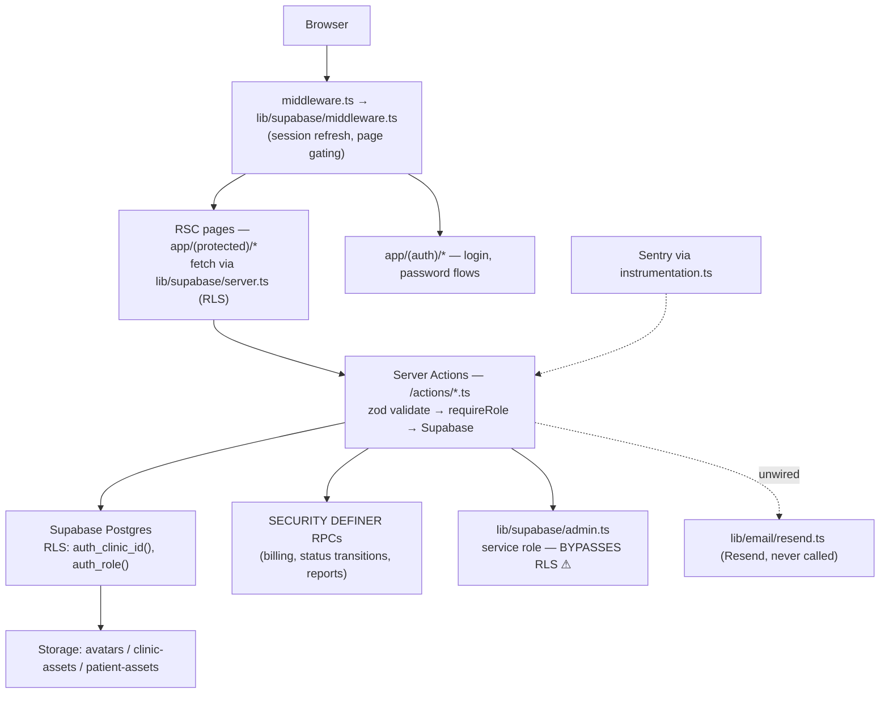

# ClinicFlow → Multi-Tenant SaaS: Platform, Arabic-First i18n, Per-Tenant WhatsApp & AI Assistant Agent — Feasibility & Implementation Plan

**Status:** Approved plan — implementation not started
**Date:** 2026-07-09
**Scope of this document:** Planning only. No code changes accompany this document.
**Supersedes:** The earlier single-clinic AI-agent plan direction. In particular, the previously proposed "patient portal prerequisite" phase is **explicitly retired** — WhatsApp is now the patient channel (see §5, §6).

---

## Roadmap Summary (decision table)

| Phase | Duration (dev-days) | Deliverable | Depends on |
|---|---|---|---|
| **P0 — Tenant hardening & per-clinic config** | 8–12 | ⛔ BLOCKING security fixes (clinics RLS policies, admin-client wrapper), per-clinic timezone/currency/locale columns and threading | — |
| **P1 — SaaS foundation** | 15–20 | Invite-only early-access registration (operator-switchable to open) + setup wizard, provider-agnostic billing architecture (`plans`/`subscriptions`/`usage_counters`/trials — **no payment gateway yet**), coupons/promotions, invitation management, entitlements + per-clinic feature flags, operator Mission Control panel, rate limiting, data export | P0 |
| **P2 — Arabic-first i18n & RTL** | 12–18 | `next-intl` (Arabic default), full RTL retrofit (87 files / 339 occurrences), Arabic typography, localized zod errors — staff UI fully Arabic | P0 (parallelizable with P1) |
| **P3 — Messaging layer + manual WhatsApp inbox + notifications** | 15–20 | Channel-abstracted `outbound_messages` (WhatsApp via BSP, SMS, email), inbound webhook, **staff manual WhatsApp inbox**, appointment reminders, invoice follow-up sequences, in-app notification center, template management | P0, P1 (usage counters) |
| **P4 — Doctor AI assistant (read-only)** | 10–14 | Staff chat UI, patient-summary/search tools, audit logging, AI entitlement gating | P0, P1; P2 for Arabic answers |
| **P5 — Patient WhatsApp AI + preliminary booking** | 12–16 | AI auto/suggested replies in the P3 inbox, availability checks, pending-slot booking with caps, cancellation | P3, P4 |
| **P6 — Hardening, eval & Tech Provider migration** | 10–15 | Prompt-injection test suite, eval sets (ar/en), load & cost dashboards, Meta Tech Provider / Embedded Signup migration | P3–P5 |
| **Total** | **~82–115** (≈ 5–7 months, single developer) | | |

**Recommended v1 cut line:** ship **P0–P4 including the manual WhatsApp inbox**. P5 (patient AI booking) may slip without blocking launch — clinics get real patient messaging on day one via the staff inbox, and the AI layer plugs into the same infrastructure later.

### Execution sub-phase plan (branch/PR boundaries)

Phases P1–P6 are too large for one branch/PR each. They are split below into **18 execution sub-phases**, each sized for one focused implementation session, one rigorous review, one branch, and one PR. Product scope, phase numbering, and dependencies are unchanged — this is an execution-planning split only (full per-sub-phase detail lives in each phase's *Execution split* block in §8). P0 is complete and is not part of this table.

| Parent | Sub-phase | Deliverable | Depends on | Est. days | Recommended PR boundary (branch) |
|---|---|---|---|---|---|
| P1 | **P1A** | SaaS platform schema + RLS + platform-admin guard (all P1 tables, no UI) | P0 | 4–5 | `feat/p1a-saas-platform-schema` |
| P1 | **P1B** | Billing domain + entitlements engine (`lib/billing/`, `lib/entitlements.ts`, trial gate, coupons logic) | P1A | 4–5 | `feat/p1b-billing-entitlements` |
| P1 | **P1C** | Early-access request + invitations + invited signup + onboarding wizard + rate limiting | P1A (∥ P1B) | 4–6 | `feat/p1c-early-access-signup` |
| P1 | **P1D** | Operator Mission Control panel + data export | P1A–P1C | 3–4 | `feat/p1d-operator-panel` |
| P2 | **P2A** | i18n infrastructure (next-intl, locale resolution, zod message keys, typography) | P0 (∥ P1) | 4–5 | `feat/p2a-i18n-infrastructure` |
| P2 | **P2B** | RTL retrofit (shadcn regeneration, logical-properties codemod, icon mirroring, CI grep-gate) | P2A | 4–6 | `feat/p2b-rtl-retrofit` |
| P2 | **P2C** | String extraction + Arabic translation + digits/date/currency polish + full RTL QA | P2A, P2B | 4–7 | `feat/p2c-arabic-strings-qa` |
| P3 | **P3A** | Messaging schema + channel abstraction + email/SMS adapters + credential encryption | P1B (usage/entitlements) | 4–5 | `feat/p3a-messaging-core` |
| P3 | **P3B** | WhatsApp (360dialog) integration: connect flow, webhooks, signature verification, template sync | P3A | 3–4 | `feat/p3b-whatsapp-integration` |
| P3 | **P3C** | Manual inbox UI (threading, realtime, 24h window, template picker, triage) | P3A (∥ P3D; P3B for live traffic) | 5–7 | `feat/p3c-manual-inbox` |
| P3 | **P3D** | Cron + reminders + invoice follow-ups + template management + notification center | P3A (∥ P3C) | 3–4 | `feat/p3d-reminders-notifications` |
| P4 | **P4A** | AI foundation + doctor tools + per-tool authorization + audit (no UI) | P1B, P1A; P2A for ar prompts | 6–8 | `feat/p4a-ai-doctor-tools` |
| P4 | **P4B** | Staff assistant chat UI (streaming route, assistant page, patient-profile launcher) | P4A | 4–6 | `feat/p4b-assistant-ui` |
| P5 | **P5A** | Booking-core hardening (pending caps/TTL) + patient tools + identity gating (no channel wiring) | P4A, P3A | 6–8 | `feat/p5a-patient-tools-booking` |
| P5 | **P5B** | Inbox AI integration: suggest/auto modes, escalation, confirmation flows, FAQ content UI | P5A, P3B, P3C | 6–8 | `feat/p5b-inbox-ai-booking` |
| P6 | **P6A** | Prompt-injection suite + evaluation set (ar/en) in CI | P4B, P5B | 4–5 | `feat/p6a-adversarial-eval` |
| P6 | **P6B** | Load tests + cost dashboards + delivery/cost alerting | P3, P1D | 3–4 | `feat/p6b-ops-load-cost` |
| P6 | **P6C** | Meta Tech Provider / Embedded Signup migration + per-clinic runbook | P3B; Meta verification (external) | 3–6 | `feat/p6c-tech-provider-migration` |

---

## 1. Executive Summary

**Verdict: Feasible as a staged build.** The codebase is a genuinely solid foundation for a multi-tenant SaaS: every one of the 23 application tables already has row-level security scoped by `clinic_id` (via `auth_clinic_id()`), transactional business logic already lives in `SECURITY DEFINER` Postgres RPCs that re-verify clinic ownership, storage buckets are clinic-scoped, and the appointment state machine (`pending → confirmed → arrived → in_session → completed`) with its partial unique index design is *already* the right shape for AI-driven preliminary booking. What is missing is the commercial layer (onboarding, billing, entitlements), internationalization (the app is English-only, LTR, hardcoded to Istanbul time and Turkish lira), any messaging channel at all, and the agent itself.

**Total effort estimate: ~82–115 developer-days (~5–7 months for a single developer)**, sequenced P0–P6 above. This is an honest estimate that budgets for the two commonly underestimated items: the RTL/i18n retrofit (87 of 176 TSX files contain physical-direction CSS) and Meta's WhatsApp Business verification bureaucracy (mitigated by launching on a BSP).

**Top 5 risks:**

1. **Meta verification & Embedded Signup approval timeline (external, uncontrollable).** Becoming a Meta Tech Provider with Embedded Signup takes weeks to months. Mitigation: launch on a BSP (360dialog) in P3; migrate in P6. (§5, §12-HP2)
2. **RTL/i18n retrofit breadth.** 87 files, 339 physical-direction class occurrences, zero logical properties today, plus every zod validation message in `lib/validations/` and every date/currency call site (~50 files). Mitigation: codemod + regeneration strategy in §4. (§12-HP3)
3. **Service-role client as single point of tenant-leak failure.** ~40 call sites of `createAdminClient()` bypass RLS and rely solely on developers remembering `.eq("clinic_id", ...)`. One omission = silent cross-tenant PHI leak = end of a healthcare SaaS's reputation. Fixed in P0 as a blocking item. (§2.4, §12-HP8)
4. **PHI through LLM + WhatsApp across multiple jurisdictions.** Saudi PDPL, UAE PDPL, Egypt PDPL each constrain processing/transfer of health data. Mitigation: data minimization, provider zero-data-retention agreements, per-clinic consent flows, and a data-residency decision before Saudi launch. (§9)
5. **Unit economics.** WhatsApp template messages, LLM tokens, and SMS are all per-message costs paid by the platform. Without hard per-tenant caps wired into `usage_counters` from day one, a single busy clinic on a flat plan can be unprofitable. (§11, §12-HP7)

---

## 2. Current System Analysis

### 2.1 Architecture as found

Single Next.js 16 (App Router, React 19, TypeScript) application, deployed on Vercel. There is **no REST API layer** — the backend is Next.js Server Actions in [/actions](../actions/) (18 files) calling **Supabase** (Postgres + Auth + Storage) directly, with the security-critical logic pushed into Postgres RLS policies and `SECURITY DEFINER` RPCs across 52 migrations in [supabase/migrations/](../supabase/migrations/). The single existing Route Handler is [app/(protected)/appointments/export/route.ts](../app/(protected)/appointments/export/route.ts).



- **Auth:** Supabase Auth (email/password, cookie sessions). Guards in [lib/rbac.ts](../lib/rbac.ts) — `getAuthedUser()` (line 18), `requireUser()` (line 46), `requireRole()` (line 52). Roles enum `user_role = admin | receptionist | manager | doctor`. **Patients have no accounts** — they are data records only.
- **UI:** Tailwind CSS v4 + shadcn/ui ([components.json](../components.json) — note `"rtl": false`), react-hook-form + zod (schemas in [lib/validations/](../lib/validations/)), data fetched in Server Components, mutations via server actions returning `{ error?, fieldErrors?, success? }`.
- **Testing:** Vitest 4 ([vitest.config.ts](../vitest.config.ts), mock pattern in [tests/unit/helpers/server-action-mocks.ts](../tests/unit/helpers/server-action-mocks.ts)); Playwright ([playwright.config.ts](../playwright.config.ts), not run in CI). CI: [.github/workflows/ci.yml](../.github/workflows/ci.yml) (lint, typecheck, unit tests, build smoke).
- **Ops:** Sentry wired ([instrumentation.ts](../instrumentation.ts), `sentry.*.config.ts`). **No rate limiting, no cron/queues, no feature flags, no notifications of any kind.** Resend email is scaffolded in [lib/email/resend.ts](../lib/email/resend.ts) but never invoked anywhere.

### 2.2 Data model (relevant subset, actual names)

All tenant tables carry `clinic_id`. Baseline schema: [supabase/migrations/20260504000000_baseline_schema.sql](../supabase/migrations/20260504000000_baseline_schema.sql).

| Table | Purpose | Notes |
|---|---|---|
| `clinics` | Tenant root | Columns: name, phone, logo_url, address, `reminder_lead_hours` (1–168, default 24), working hours, `time_format` (12h/24h, added `20260514155418`). **No timezone/currency/locale/country columns.** |
| `profiles` | Staff users (FK → `auth.users`) | `role` distinguishes admin/receptionist/manager/doctor |
| `patients` | Patient records (no accounts) | `phone` column — becomes the WhatsApp identity key (§5.4) |
| `appointments` | Core booking table | Status enum `pending, confirmed, arrived, in_session, completed, cancelled, no_show`; transitions in `STATUS_TRANSITIONS` ([lib/validations/appointment.ts:112](../lib/validations/appointment.ts#L112)), enforced by DB trigger. Has dormant `reminder_sent_at` + partial index `idx_appointments_reminder` (baseline line 441) — ready-made for P3 reminders. |
| `doctor_schedules`, `clinic_working_hours` | Availability inputs | `20260514120000_doctor_schedules_clinic_working_hours.sql` |
| `medical_notes`, `medical_note_attachments`, `patient_documents`, `follow_ups` | Clinical history | RLS scoped by role + author + clinic |
| `patient_packages`, `package_templates`, `services`, `departments`, `insurance_providers` | Catalog/packages | |
| `patient_deposits`, `outstanding_settlements`, `appointment_services` | **Patient** billing (not SaaS billing) | Transactional RPCs `complete_appointment_billing` etc. (`20260506050000`) |
| `audit_logs` | Audit trail (baseline line 198) | Generic trigger `write_audit_log()`; reusable for agent tool-call auditing (§6.6) |
| `feedback`, `staff_invitations`, `user_page_permissions`, `user_customizations` | Misc | |

**Key booking mechanics (reused heavily later):**

- Availability: `getAvailableTimeSlots(doctorId, dateIso)` in [actions/time-slots.ts:32](../actions/time-slots.ts#L32) — doctor schedule → clinic shifts → 08:00–18:00 fallback; 15-minute slots; 15-minute buffer around active appointments; pending appointments do **not** block slots.
- Creation: `createAppointment` in [actions/appointments.ts:213](../actions/appointments.ts#L213) — zod validation, past-time and closed-day checks, reference validation, overlap + buffer conflict check, insert defaulting to `pending`.
- Concurrency: partial unique index `appointments_doctor_active_slot_key` `WHERE status = 'confirmed' AND deleted_at IS NULL` ([20260516000000_allow_pending_same_slot.sql](../supabase/migrations/20260516000000_allow_pending_same_slot.sql)) — only **confirmed** appointments claim a slot exclusively. Pending is deliberately non-exclusive. This is exactly "preliminary booking with human confirmation" already, and the AI agent inherits it for free (with a pile-up cap added in P5 — §12-HP1).

### 2.3 Tenant-isolation audit results

Audited: every table's RLS policies, every `SECURITY DEFINER` RPC, every service-role call site, and storage policies.

**Strong (verified):**

- All 23 tables have `ENABLE ROW LEVEL SECURITY` with policies scoping by `clinic_id = auth_clinic_id()` (tables without their own `clinic_id` — `feedback`, `medical_notes` — scope via joins to `appointments`/`patients`). Doctor read-scoping added in `20260505220000_scope_patient_and_appointment_rls_for_doctors.sql`; role-only write policies on `services`/`insurance_providers` were fixed in `20260506000000`.
- Every business RPC re-resolves `v_clinic_id := auth_clinic_id()` and filters all reads/writes by it — spot-verified on `complete_appointment_billing`, `undo_appointment_billing`, `settle_patient_outstanding` (`20260506050000`), `start_appointment_session` (`20260519007000`), `undo_appointment_status` (`20260517000000`).
- Storage: `clinic-assets` and `patient-assets` object policies require the path's clinic-id segment to equal `auth_clinic_id()` (policies in `20260505210000`, `20260506110000`, `20260511130000`); `avatars` is per-user (`auth.uid()` path match).

**⛔ Flaw 1 — cross-tenant `clinics` policies (BLOCKING).** Baseline lines 586–587, never dropped:

- `clinics_select_admin_all` — `FOR SELECT USING (auth_role() = 'admin')`: **any admin of any clinic can read every clinic row** (names, phones, addresses, logos of all customers).
- `clinics_insert_admin` — `FOR INSERT WITH CHECK (auth_role() = 'admin')`: any admin can insert arbitrary clinic rows.

Harmless in a single-clinic deployment; disqualifying in a SaaS. Fixed first thing in P0.

**⛔ Flaw 2 — ~40 unscoped-by-design service-role call sites (BLOCKING as policy, not as active leak).** [lib/supabase/admin.ts](../lib/supabase/admin.ts) `createAdminClient()` bypasses RLS. Call sites: [lib/cache/reference-data.ts](../lib/cache/reference-data.ts) (4), [actions/settings.ts](../actions/settings.ts) (staff provisioning, lines 77/286/321/366), [actions/page-permissions.ts](../actions/page-permissions.ts) (7), [actions/patients.ts](../actions/patients.ts) (12), [actions/appointments.ts](../actions/appointments.ts) (lines 528, 741), [actions/package-templates.ts](../actions/package-templates.ts#L100), [lib/primary-admin.ts](../lib/primary-admin.ts#L8), [app/(protected)/patients/[id]/page.tsx](../app/(protected)/patients/[id]/page.tsx#L101), [app/(protected)/settings/staff/page.tsx](../app/(protected)/settings/staff/page.tsx#L24). Every site currently filters by `clinic_id` correctly — but there is no defense-in-depth; one future omission leaks PHI across tenants silently. Fixed in P0 with a scoped wrapper + lint ban.

**No self-serve onboarding.** There is no signup route (auth routes are login/forgot/reset/change-password only), no `createClinic` action, no seed script — clinics and their first admin are provisioned by manual DB insert today.

**No SaaS commercial layer.** Zero matches repo-wide for subscriptions, plans, entitlements, feature flags, Stripe/Paddle, or super-admin/operator tooling. `lib/primary-admin.ts` is clinic-scoped, not a platform role.

### 2.4 Hardcoding audit (i18n/TZ/currency)

- [lib/datetime.ts:4](../lib/datetime.ts#L4): `export const CLINIC_TZ = "Europe/Istanbul"` — baked into all six shared formatters, plus Monday-first week start.
- [components/reports/report-formatters.ts:17](../components/reports/report-formatters.ts#L17): `formatCurrency` hardcodes `Intl.NumberFormat("en-GB", { currency: "TRY" })`.
- Spread: **159 lines** of TZ/locale API usage and **58 currency lines across 18 files**; ~50 files total touch date/currency formatting. Heaviest: [components/revenue/revenue-report.tsx](../components/revenue/revenue-report.tsx) (28 lines), [components/appointments/billing-dialog.tsx](../components/appointments/billing-dialog.tsx) (21).
- Known correctness inconsistency: `createAppointment` does closed-day/overlap math with **local-server-timezone** `Date` methods, while `getAvailableTimeSlots` uses explicit Istanbul TZ. Properly fixed by P0's per-clinic timezone work.
- RTL: **87 of 176** TSX files in `app/` + `components/` contain **339 occurrences** of physical-direction classes (`ml-/mr-/pl-/pr-/left-/right-/text-left/text-right/border-l|r/rounded-l|r`); **zero** logical-property usage (`ms-/me-/ps-/pe-`) exists. [components.json](../components.json) has `"rtl": false`; root layout is `lang="en"` with no `dir`. No i18n library installed.

### 2.5 Gaps summary (what the SaaS needs that doesn't exist)

| Gap | Needed by | Planned in |
|---|---|---|
| Fix 2 cross-tenant `clinics` policies; admin-client guardrails | Any external customer | **P0 (blocking)** |
| Per-clinic timezone/currency/locale/country | Kuwait launch (`Asia/Kuwait`, KWD, ar) | P0 |
| Invite-gated clinic signup (early access) + setup wizard | Selling at all | P1 |
| Subscriptions/plans/entitlements/usage counters | Selling at all; AI as add-on tier | P1 |
| Rate limiting; operator panel; per-clinic data export | SaaS operations | P1 |
| Arabic/RTL + i18n | Target market | P2 |
| Any outbound/inbound messaging channel | Reminders, patient contact | P3 |
| Cron/background execution | Reminders, follow-up sequences | P3 |
| In-app staff notifications | Inbox, reminders visibility | P3 |
| Agent infrastructure (LLM client, tools, conversations, eval) | AI assistant | P4–P6 |

---

## 3. SaaS Foundation Plan (Requirement 1)

### 3.1 ⛔ Tenant-isolation remediation (first tasks of P0 — BLOCKING, must be complete before any SaaS customer onboarding)

1. **Migration `fix_clinics_cross_tenant_policies`:** `DROP POLICY clinics_select_admin_all` and `DROP POLICY clinics_insert_admin` on `public.clinics`. Reads are already covered by `clinics_select_own` (`id = auth_clinic_id()`); inserts move exclusively to the new signup RPC (§3.2), so no authenticated-role insert policy is needed at all.
2. **Scoped admin-client wrapper** in [lib/supabase/admin.ts](../lib/supabase/admin.ts): add `createClinicScopedAdminClient(clinicId: string)` returning a thin proxy whose `.from(table)` pre-applies `.eq("clinic_id", clinicId)` for tenant tables (allow-list of exceptions: `auth.admin.*` operations, `user_page_permissions` keyed by `user_id`). Migrate the ~40 call sites listed in §2.3 to it.
3. **Lint rule:** ESLint `no-restricted-imports`/`no-restricted-syntax` entry in [eslint.config.mjs](../eslint.config.mjs) banning direct `createAdminClient()` outside `lib/supabase/admin.ts` and an explicit allow-list file — CI ([.github/workflows/ci.yml](../.github/workflows/ci.yml)) already runs `pnpm lint`, so violations fail the pipeline.
4. **Acceptance criterion / test:** extend [tests/unit/integration/rls-security.test.ts](../tests/unit/integration/rls-security.test.ts) with a **two-clinic fixture**: create clinic A and clinic B with an admin each; assert admin-A cannot select clinic B's row, cannot insert a clinics row, and cannot read B's patients/appointments/notes/storage paths. This two-clinic denial suite becomes a permanent CI fixture reused by every later phase.

### 3.2 Clinic onboarding — invite-only early access (default), operator-switchable

Today: manual DB inserts (§2.3). **Approved product decision (post-P0): registration defaults to Invite Only.** Public visitors request an invitation; they do not create a clinic directly. Plan:

- **Registration Mode — a global platform setting, not code.** New `platform_settings` table (single-row or key/value; operator-writable only via `platform_admins` RLS) holding at minimum `registration_mode` (`'invite_only'` **default** | `'open'`) and `weekly_invite_limit` (default **20**, configurable — never hardcoded). The public registration surface reads the setting at request time, so the operator flipping the toggle in the Operator Panel (§3.6) changes behavior **immediately, with no deploy or code change**. **Public read path:** `platform_settings` stays platform-admin-only at the table level; anonymous surfaces read exclusively through a dedicated anon-safe `get_public_registration_status()` SECURITY DEFINER RPC returning **only** the registration mode, the weekly invite limit, and the accepted-clinics-this-week count — never operator-only fields (`updated_by`, expiry defaults, etc.).
- **Early Access flow (replaces the public signup experience)** at `app/(public)/early-access/` (parallel to `app/(auth)/`):
  - **Request Invitation form** — fields: **Clinic Name, Owner Name, Phone, Email** → stored as an invitation request for operator review. Because `clinic_invitations` RLS is platform-admin-only, the public form writes through a **reviewed RPC or equivalent service-role server boundary** with: strict validation, per-IP rate limiting (§3.6), email normalization (lowercase + trim), phone normalization consistent with the existing codebase (trim + length validation, no new E.164 scheme), **silent deduplication of duplicate pending requests per email**, and **no raw token generation at request time** — a request is a token-less `pending` row.
  - Displays: *"We currently accept only 20 clinics per week to ensure the highest quality onboarding."* (copy sourced from the configurable `weekly_invite_limit`, i18n-ready for P2).
  - **Dynamic progress indicator** showing accepted clinics for the current week vs. the configured weekly limit (e.g., "14 of 20 spots taken this week"), computed from accepted invitations via `get_public_registration_status()` — never a hardcoded number.
  - **Approved product decision — weekly progress counting.** The weekly count increases **only** when an invited clinic successfully completes signup and its invitation transitions to `accepted`; creating, approving, sending, or resending an invitation never increments it. The authoritative source is `clinic_invitations.status = 'accepted'` with `accepted_at` (set transactionally inside `create_clinic_with_owner`, so "invitation accepted" and "clinic created" are atomically the same event). Open-registration signups do not count toward the invite-only weekly progress. **The weekly limit never rejects a valid invitation at acceptance time** — the operator is warned or blocked at *issuance* in the Operator Panel (§3.6), but an already-issued, unexpired invitation remains redeemable. The week is defined in **one shared SQL function** using a platform-wide timezone/week rule — never per-clinic timezone.
- **Invitation system (operator-managed; expands the concept behind the existing staff `staff_invitations` pattern to the platform level).** New `clinic_invitations` table: recipient details (from the request or operator-entered), single-use token, `expires_at` (**tokens expire**; default 7 days, configurable), status `pending | accepted | revoked | expired`, optional coupon assignment (§3.3). The operator can **create, resend (fresh token/expiry), revoke, and monitor pending and accepted invitations** from the Operator Panel. **Token lifecycle:** raw tokens are generated **only when an invitation is issued** (never at request time); only **SHA-256 token hashes** are stored (`token_hash` — as shipped in P1A); resend rotates the hash and expiry; revoke invalidates the token; tokens are **single use**. Token validity is rechecked and **consumed atomically inside the signup RPC** — a single conditional write, never read-then-update. Raw tokens must never be logged.
- **Invited signup** `app/(public)/signup/[token]`: validates a live, unexpired token, then runs the clinic registration form (clinic name, country, phone, owner name/email/password, locale). In `registration_mode = 'open'`, the same signup form is reachable without a token — the flow is identical from this point on.
- **Signup transaction boundary (approved architecture).** Supabase Auth user creation goes through the Auth API and is **outside the Postgres transaction** — the plan must never describe it as part of the database transaction. The approved flow, driven by a new `signUpClinic` action in [actions/auth.ts](../actions/auth.ts) (the **only** application boundary that invokes the RPC):
  1. **Pre-validate** registration mode and invitation state (advisory read) *before* creating the Auth user, so routine failures never create an orphan.
  2. Create the owner via normal server-side **`supabase.auth.signUp()`** (not `admin.createUser`), stamping signup-flow user metadata (flow marker + invitation id).
  3. Call **`create_clinic_with_owner(...)`** — SECURITY DEFINER, **`SET search_path = ''`**, fully qualified identifiers, **executable by `service_role` only** (ordinary authenticated clinic users must never be able to call it directly).
  4. The RPC, in **one transaction**, atomically: revalidates registration mode; (invite-only) **claims and consumes the invitation in one conditional statement** (`UPDATE … WHERE status='pending' AND expires_at > now()` — never read-then-update); inserts the `clinics` row (with per-clinic config columns, §3.5); creates the owner `profiles` row; seeds default `user_page_permissions`; creates the **14-day trial `subscriptions` row** (required — the P1B mutation gates fail closed on a missing subscription, so a clinic born without one cannot complete onboarding); and **applies any invitation-assigned coupon (§3.3) in the same transaction**.
  5. If the RPC fails, attempt **best-effort deletion** of the newly created Auth user as compensation.
  6. Compensation can itself fail, so **orphaned Auth users must be resumable**: on a later signup attempt hitting "email already registered," an Auth user carrying the signup-flow metadata **and** having no `profiles` row is treated as a resumed signup and the RPC re-runs for that user.
  7. The RPC is **idempotent keyed on the owner profile primary key** (`profiles.id` = Auth user id): a safe retry returns the existing clinic instead of creating a second one.
- **Email verification (approved behavior):** Supabase email verification is required before the first authenticated dashboard session; the clinic and trial are created during signup, **before** confirmation; after confirmation, the first login enters the onboarding flow.
- **Setup wizard** `app/(protected)/onboarding/` shown until complete: steps reuse existing actions verbatim — working hours (`upsertClinicWorkingHours`), departments/services/insurance (CRUD in [actions/settings.ts](../actions/settings.ts)), doctors & staff invites (`createStaff`, `staff_invitations` table), doctor schedules (`upsertDoctorSchedule`). New columns `clinics.onboarding_completed_at`; middleware gate in [lib/supabase/middleware.ts](../lib/supabase/middleware.ts) (same pattern as the existing `must_change_password` gate). **Explicit middleware gate order:** (1) authentication/session → (2) profile existence → (3) password-change requirement → (4) subscription/trial access → (5) onboarding completion → (6) page visibility/role checks. `/onboarding` remains reachable while onboarding is incomplete; the wizard's Server Action POSTs pass the P1B mutation gate because the new clinic holds an active trial subscription. `onboarding_completed_at` changes only through an explicit completion action; wizard steps are safe and idempotent on retry.

### 3.3 Billing architecture — provider-agnostic (no payment gateway in P1)

**Approved product decision (post-P0): P1 builds the complete billing architecture only — subscriptions, plans, entitlements, trials, usage tracking, coupons, and the billing domain model. No payment gateway is integrated in P1.** The final provider will be chosen later; the architecture must support any future provider through a provider abstraction.

- **Provider abstraction:** new `lib/billing/provider.ts` interface (`createCheckout`, `syncSubscriptionFromProvider`, `cancelSubscription`, `parseWebhook`/`verifySignature`) mirroring the `lib/messaging/` adapter pattern (§5.2). **P1 ships exactly one implementation: `manual`** — the operator grants, extends, comps, or cancels subscriptions from the Operator Panel (§3.6). No checkout UI, no PSP webhooks, no provider SDK in P1.
- **Non-binding future provider candidates:** Paddle, Stripe, Lemon Squeezy, Polar, Tap. Nothing in the P1 schema or code may assume any one of them; `subscriptions.provider` is free-form text (`'manual'` in P1). Adding the chosen provider later means one new adapter + one webhook route — no domain-model changes.

**Provider comparison (Arab-market lens — retained as non-binding input for the future provider decision, not a P1 dependency):**

| Provider | Coverage for our sellers/buyers | Model | Notes |
|---|---|---|---|
| **Stripe** | Not generally available for merchants in Kuwait/Saudi/Egypt (UAE supported) — *verify current country list at execution* | PSP | Fine only if founder incorporates in a Stripe-supported country |
| **Paddle** | Merchant of record — sells globally regardless of founder's incorporation country; handles VAT (KSA 15%, Egypt 14%) and invoicing | MoR, ~5% + fees (approx., as of 2026-07-09 — verify at https://www.paddle.com/pricing) | Best fit: founder doesn't need a local payment license; subscription tooling built in |
| **Tap Payments** | GCC-native (Kuwait HQ) — KNET (Kuwait), mada (Saudi), local cards | PSP, per-txn ~2.x% (approx., as of 2026-07-09 — verify at https://www.tap.company) | Needed because many Kuwaiti/Saudi clinics pay by KNET/mada, which MoRs handle poorly |
| Paymob | Egypt/KSA strong | PSP | Candidate when Egypt becomes a focus market |
| Moyasar | Saudi-only | PSP | Too narrow as primary |

**New tables (migration `saas_billing`):**

```sql
plans               (id, slug 'basic'|'pro'|'pro_ai', name_ar, name_en, monthly_price_usd,
                     features jsonb, limits jsonb, is_active)
subscriptions       (id, clinic_id FK unique, plan_id FK, provider text /* 'manual' in P1 */,
                     provider_subscription_id nullable,
                     status 'trialing'|'active'|'past_due'|'cancelled',
                     trial_ends_at, current_period_start/end, created_at, updated_at)
usage_counters      (id, clinic_id FK, period_start date, metric
                     'ai_messages'|'wa_messages'|'sms_messages'|'emails',
                     used int, limit_snapshot int, unique(clinic_id, period_start, metric))
coupons             (id, code unique, kind 'lifetime_free'|'months_free'|'percent_discount',
                     months int nullable /* months_free: X months; 12 = one year */,
                     percent int nullable /* percent_discount */,
                     expires_at nullable, max_redemptions int nullable, redemption_count int,
                     clinic_id FK nullable    /* clinic-specific assignment */,
                     invitation_id FK nullable /* invitation-specific assignment (§3.2) */,
                     is_active, created_at)
coupon_redemptions  (id, coupon_id FK, clinic_id FK, subscription_id FK, redeemed_at,
                     unique(coupon_id, clinic_id))
```

All RLS'd: clinics read their own `subscriptions`/`usage_counters` (and any coupon applied to them); writes only via SECURITY DEFINER RPCs (`increment_usage(clinic_id, metric, amount)` with atomic `insert ... on conflict do update`) and operator/billing paths using the scoped admin wrapper. **14-day trial** default (`status = 'trialing'`, `trial_ends_at`), enforced in middleware alongside the auth gates.

**Coupons / promotions (P1, operator-managed from §3.6):** supported kinds — **lifetime free**, **one year free** (`months_free` with `months = 12`), **X months free**, and **percentage discounts**. Every coupon supports **expiration** (`expires_at`), **usage limits** (`max_redemptions`), **clinic-specific assignment**, and **invitation-specific assignment** (attached to a `clinic_invitations` row so the discount applies automatically on accepted signup). Redemption effects live in the domain model (extended trial/comped period on `subscriptions`, discount recorded for the future provider), so they survive whichever gateway is chosen later.

**Plans philosophy (approved):** the **Basic plan must remain genuinely useful** — full core clinic management (patients, appointments, billing, reports) works well on Basic. Plans differentiate mainly by **limits, automation, AI, messaging, and advanced capabilities** — never by intentionally crippling Basic's core workflows.

Webhook routes for the eventual provider are explicitly **out of P1**; when the provider is chosen, its adapter adds `app/api/webhooks/<provider>/route.ts` (signature-verified), following the route-handler precedent of `appointments/export`.

### 3.4 Entitlements & per-clinic feature flags (P1 — approved mechanism for selling AI as an add-on)

No third-party flag service. **Feature flags are a P1 deliverable: per-clinic flags exist from the SaaS foundation onward**, so every later phase (AI, WhatsApp, SMS, beta features, future modules) gates on infrastructure that already exists rather than retrofitting it.

- **Two layers, one resolution:** `plans.features jsonb` (e.g. `{"ai_assistant": true, "whatsapp": true, "sms": false}`) + `plans.limits jsonb` (e.g. `{"ai_messages_month": 1000, "staff_seats": 10}`), overlaid by **per-clinic overrides** (new relational clinic_feature_overrides table; feature overrides must not be stored as JSONB on clinics, operator-writable from §3.6) — effective entitlements = plan defaults ⊕ clinic overrides. Example flags: `ai_assistant`, `whatsapp`, `sms`, `beta_features`, plus namespaced keys for future modules.
- **New module `lib/entitlements.ts`:** `getEntitlements(clinicId)` (cached with `unstable_cache` + tag, same pattern as [lib/cache/reference-data.ts](../lib/cache/reference-data.ts)), `hasFeature(ents, "ai_assistant")`, `checkUsageLimit(clinicId, "ai_messages")` — the resolution of plan + override happens here, callers never read the raw jsonb.
- Enforced in three places, mirroring existing RBAC layering: middleware (hide gated pages — extends the existing page-visibility mechanism in [lib/page-permissions.ts](../lib/page-permissions.ts) by adding entitlement-conditional slugs), server actions (guard at top, next to `requireRole`), and the agent/messaging send paths (hard usage caps, §6.7/§11).
- **Plan-differentiation guardrail (approved):** flags and limits are how Pro/Pro+AI add value on top of a **genuinely useful Basic** (§3.3) — differentiation by limits/automation/AI/messaging/advanced capabilities, not by switching off core clinic management.

### 3.5 Per-clinic configuration (fixes the TZ inconsistency properly)

**Migration `clinic_localization_columns`:** `ALTER TABLE clinics ADD COLUMN timezone text NOT NULL DEFAULT 'Asia/Kuwait', currency char(3) NOT NULL DEFAULT 'KWD', locale text NOT NULL DEFAULT 'ar', country char(2) NOT NULL DEFAULT 'KW', week_start smallint NOT NULL DEFAULT 6 /* Saturday */, digits text NOT NULL DEFAULT 'latin' CHECK (digits IN ('latin','arabic'))` (joins the existing `time_format` column from `20260514155418`).

**Code threading:**

- Refactor [lib/datetime.ts](../lib/datetime.ts): every formatter takes a `ClinicLocale` object (`{ tz, locale, weekStart, timeFormat, digits }`) instead of reading the `CLINIC_TZ` constant; delete `CLINIC_TZ`. Same for `formatCurrency`/`formatPercent` in [components/reports/report-formatters.ts](../components/reports/report-formatters.ts) (currency becomes a parameter).
- Serve the object from the existing [contexts/clinic-settings-context.tsx](../contexts/clinic-settings-context.tsx) (client) — it already carries `timeFormat`, so this extends an established pattern — and from a `getClinicLocale()` helper for server actions/RSCs.
- Sweep the ~50 direct `toLocale*`/`Intl.*` call sites (§2.4 list) to the shared helpers. This is mechanical but wide; budgeted 4–6 days inside P0.
- Fix `createAppointment`'s local-server-TZ math ([actions/appointments.ts:213](../actions/appointments.ts#L213) internals: `isPastScheduledAt`, closed-day weekday check, `validateAppointmentSlot` day bounds) to use the clinic timezone — eliminating the Istanbul-vs-server-TZ inconsistency.

### 3.6 Operational must-haves

- **Rate limiting (previously missing entirely):** Upstash Redis (Vercel Marketplace) sliding-window limiter in a new `lib/rate-limit.ts`; applied to auth actions in [actions/auth.ts](../actions/auth.ts) (login, password reset), the early-access request form and signup routes, all webhook routes, and (later) agent/messaging endpoints. Per-IP for public routes, per-clinic for authenticated. **Backend-failure posture:** if the rate-limit backend is unavailable, the anonymous early-access and signup surfaces **fail closed** (deny with a retry message); login and password recovery **remain available with a monitored fallback** (Sentry alert) rather than causing a total authentication outage. Open registration stays rate-limited and must not bypass abuse controls.
- **Per-clinic data export ("can I get my data out?"):** extend the existing export pattern ([app/(protected)/appointments/export/route.ts](../app/(protected)/appointments/export/route.ts)) into `app/(protected)/settings/export/route.ts` — admin-only ZIP of CSVs (patients, appointments, notes metadata, invoices) + signed URLs for documents. Sales objection-killer and practical PDPL data-portability answer.
- **Operator (super-admin) panel — a Mission Control dashboard.** Its purpose is to **detect platform issues before customers discover them**, not merely to list tenants. A **new `platform_admins` table** (`user_id` FK) — deliberately *not* a new value in the clinic `user_role` enum, keeping tenant RBAC untouched. New route group `app/(operator)/` with its own guard (`requirePlatformAdmin()` added to [lib/rbac.ts](../lib/rbac.ts)) and layout. It **monitors**: clinics, trials (starting/expiring), subscriptions, usage vs. limits, invitations (pending/accepted, weekly early-access progress), coupons and redemptions, feature flags in effect, health indicators (delivery rates, job failures, webhook errors once P3 lands), error summaries (Sentry-fed), recent platform activity, and — as an operational backstop for the P1C signup compensation path — **Auth users marked as clinic-owner signup attempts that still have no profile** (orphaned signups awaiting resume or cleanup). It **manages**: the global Registration Mode setting and `weekly_invite_limit` (§3.2 — effective immediately, no deploy), invitation create/resend/revoke, coupon CRUD and assignment (§3.3), per-clinic feature-flag overrides (§3.4), and manual subscription grants/extensions (the P1 `manual` billing provider, §3.3). RLS: `platform_admins`-only policies on the SaaS tables; **the operator panel must never expose patient PHI** — tenant clinical data stays invisible except aggregate counts.
- **Backups/monitoring posture:** Supabase PITR add-on (paid tier) before first paying customer; Sentry env separation (staging/prod DSNs); uptime check on `/api/health` (new trivial route); weekly `pg_dump` to founder-controlled storage as belt-and-braces. Documented as an ops runbook item, not code.

---

## 4. Arabic-First / i18n & RTL Plan (Requirement 2)

**Founder decision baked in:** the staff dashboard itself ships fully Arabic (RTL, Arabic default) in v1 — not just patient-facing surfaces.

### 4.1 i18n architecture

- **Library: `next-intl`** — the de-facto App Router standard; first-class Server Component and server-action support; message catalogs `messages/ar.json` (default) + `messages/en.json`.
- **Routing strategy: no URL locale prefix.** The app is authenticated-only (public surface = login + early-access request + invited signup); locale is per-clinic (`clinics.locale`, §3.5) with per-user override (new `profiles.locale` nullable column). `next-intl`'s cookie/request-config mode: a `getRequestConfig` in `i18n/request.ts` resolves user → clinic → `ar` default. Root layout ([app/layout.tsx](../app/layout.tsx)) sets `<html lang={locale} dir={locale === 'ar' ? 'rtl' : 'ltr'}>`.
- **Server actions & zod:** validation messages in [lib/validations/](../lib/validations/) are currently hardcoded English strings. Plan: replace literal messages with **message keys** (`"validation.appointment.pastTime"`), and translate at the edge — a small `translateFieldErrors(fieldErrors, t)` helper applied where actions' `{ error, fieldErrors }` results are rendered (forms use react-hook-form; the resolver path stays untouched). This avoids threading `t()` into every schema and keeps schemas serializable. One shared zod error map for generic messages (`required`, `too_long`), registered in a `lib/validations/error-map.ts`.

### 4.2 RTL as default direction

Current state (measured): 87/176 TSX files, 339 physical-direction occurrences, 0 logical properties, `"rtl": false` in [components.json](../components.json).

**Approved approach — logical-properties codemod + shadcn regeneration (from §12-HP3):**

1. Flip `components.json` to `"rtl": true` and re-add the shadcn primitives in [components/ui/](../components/ui/) (they are generated code; regeneration converts them to RTL-safe variants). Diff-review each against local customizations.
2. Codemod the app-owned 87 files: mechanical class mapping `ml-→ms-`, `mr-→me-`, `pl-→ps-`, `pr-→pe-`, `left-→start-`, `right-→end-`, `text-left→text-start`, `text-right→text-end`, `border-l→border-s`, `border-r→border-e`, `rounded-l→rounded-s`, `rounded-r→rounded-e` (Tailwind v4 supports all logical utilities natively). Script + manual review of the ~10% of cases where physical direction is intentional (e.g., chart axes in [components/dashboard/analytics-section-charts.tsx](../components/dashboard/analytics-section-charts.tsx), print layouts in the reports pages).
3. Icon mirroring inventory: directional lucide icons (`ChevronLeft/Right`, `ArrowLeft/Right` in nav, calendars [components/appointments/week-calendar.tsx](../components/appointments/week-calendar.tsx) etc.) get an `rtl:rotate-180` utility or logical swap; non-directional icons untouched.
4. Recharts (dashboards, [components/revenue/revenue-report.tsx](../components/revenue/revenue-report.tsx)) does not auto-RTL: keep charts LTR internally with translated labels — standard practice, called out so it isn't "discovered" mid-phase.
5. String extraction: all UI copy in the 36 `page.tsx` routes + 126 components into `messages/en.json`, then professional Arabic translation (MSA for UI chrome). Budget real translation cost: ~1,000–1,500 strings.

**Honest effort: 12–18 days** for retrofit + extraction + translation integration + RTL QA pass across all 36 pages in both directions. This is the estimate most tempting to shrink; don't.

### 4.3 Arabic typography (distinctive, not Cairo/Tajawal)

Loaded via `next/font/local` (self-hosted — also avoids Google Fonts latency in GCC), wired in [app/layout.tsx](../app/layout.tsx) where DM Sans/Instrument Serif/Geist Mono load today.

| Option | Type | Licensing (approx., as of 2026-07-09 — verify with foundry) | Notes |
|---|---|---|---|
| **IBM Plex Sans Arabic** ✅ primary | Free (OFL) | $0 | Premium, neutral, excellent weights; pairs with IBM Plex Sans for Latin — coherent bilingual system |
| **Readex Pro** | Free (OFL) | $0 | Softer/rounder; good fallback or marketing-site face |
| Rubik Arabic | Free (OFL) | $0 | Friendly; slightly less "clinical trust" |
| **29LT Zarid Sans** (29LT) | Paid | Web licenses typically ~$100–500/style tier by pageviews — verify at https://29lt.com | Distinctive premium option if founder buys a license; strong Arabic-first design |
| **TPTQ Greta Arabic** (TPTQ Arabic) | Paid | ~€100–500/style web license — verify at https://tptq-arabic.com | Editorial-grade; excellent legibility at small sizes |

**Recommended stack:** IBM Plex Sans Arabic (primary UI) + IBM Plex Sans (Latin) + Geist Mono (kept for numerals/code), with 29LT Zarid Sans as the paid upgrade path for brand distinction. CSS: `font-family: var(--font-plex-arabic), var(--font-plex-latin), system-ui`.

### 4.4 Localization details clinics will notice

- **Digits:** Latin digits (0-9) by default even in Arabic UI (regional b2b software norm in Kuwait/GCC), with per-clinic toggle `clinics.digits = 'arabic'` rendering Arabic-Indic (٠-٩) via `Intl.NumberFormat(locale + '-u-nu-arab')` — flows through the §3.5 formatter refactor for free.
- **Dates:** Gregorian default; **Hijri as a display option** for the Saudi market via `Intl.DateTimeFormat('ar-SA-u-ca-islamic-umalqura')` — shown alongside (not instead of) Gregorian on appointment surfaces. Deferred to the Saudi-launch milestone; the formatter API from §3.5 is designed to accept a calendar parameter so this is additive.
- **Currency:** per-clinic (§3.5): KWD (3 decimal places — note `formatCurrency`'s current `maximumFractionDigits: 2` must become currency-aware), SAR, EGP, AED.
- **WhatsApp & agent RTL:** message templates stored per clinic in their own wording/dialect (§7.4); AI agent replies in the **patient's language — Arabic by default**, with a dialect-tolerant system prompt (understands Gulf/Egyptian/Levantine input, replies in clear polite Arabic mirroring the patient's register; §6.5). Template bodies are validated for Unicode bidi correctness (numbers/times embedded in Arabic text get LRM marks where needed — a `lib/messaging/bidi.ts` helper).

---

## 5. Messaging & WhatsApp Architecture (Requirement 3)

**Constraint:** the founder owns no WhatsApp number and must never need one. Every clinic connects **its own** number; patients message the clinic, not the platform.

### 5.1 Model comparison

**Model A — Meta Tech Provider + Embedded Signup (the end-state).**
The SaaS registers as a Meta Tech Provider (Meta Business verification of the founder's company required: registered legal entity, website, business documents). Once approved, clinics complete **Embedded Signup** inside our dashboard: a Meta-hosted popup where the clinic creates/connects its own WABA and phone number (the number must not be active on personal/Business-app WhatsApp, or must be migrated). We store per-tenant assets (WABA ID, phone-number ID, and a system-user access token we generate for their WABA) and receive all their inbound traffic on **our single webhook**, routing by `phone_number_id → clinic_id`. Conversation/template charges are billed by Meta to the **clinic's** WABA payment method (clinic attaches their card) — cleanest cost attribution; alternatively we onboard them under our billing and re-bill via `usage_counters`. **Realistic timeline: 4–10 weeks** for business verification + Tech Provider/Embedded Signup approval (approx., as of 2026-07-09 — verify at https://developers.facebook.com/docs/whatsapp/embedded-signup), before the first clinic can connect. Zero per-message middleman margin.

**Model B — BSP-mediated (360dialog / Twilio).**
A Business Solution Provider fronts the Meta relationship. 360dialog: ~€49/month per connected number, no per-message markup (Meta pass-through) (approx., as of 2026-07-09 — verify at https://www.360dialog.com/pricing). Twilio: per-message markup (~$0.005/msg) on top of Meta fees plus per-number costs (verify at https://www.twilio.com/whatsapp/pricing). Clinics still connect their own numbers, but through the BSP's hosted signup — live in **days**, minimal Meta bureaucracy for us. Tradeoffs: per-number monthly cost eats margin; platform dependency; migration later requires number/WABA porting (supported, but a project).

**Model C — no WhatsApp (email/SMS only).** Not viable as an end-state in this market — WhatsApp is the dominant patient channel in GCC/Egypt — but must work as the **day-one state of every new clinic** before their WhatsApp is connected.

**Recommendation (approved): launch on 360dialog in P3, architect every internal interface against our own channel abstraction (never the BSP SDK directly), migrate to Tech Provider + Embedded Signup in P6** once Meta verification completes and customer count justifies reclaiming the €49/number/month.

### 5.2 Channel abstraction — `outbound_messages` and `lib/messaging/`

**New tables (migration `messaging_layer`):**

```sql
clinic_channels    (id, clinic_id FK, channel 'whatsapp'|'sms'|'email',
                    provider 'dialog360'|'meta'|'unifonic'|'resend',
                    credentials_encrypted bytea,        -- pgsodium/vault, §9.2
                    sender_identity text,               -- phone number / from-address
                    status 'pending'|'active'|'error', connected_at)
outbound_messages  (id, clinic_id FK, channel, provider, recipient text,
                    template_id FK nullable, body_preview text,   -- minimal PHI, §9.3
                    related_type 'appointment'|'invoice'|'agent'|'manual' , related_id uuid,
                    status 'queued'|'sent'|'delivered'|'read'|'failed', provider_message_id,
                    error text, cost_micro int, created_at, status_updated_at)
inbound_messages   (id, clinic_id FK, channel, sender text, patient_id FK nullable,
                    conversation_id FK, body text, provider_message_id, received_at)
conversations      (id, clinic_id FK, patient_id FK nullable, channel,
                    window_expires_at timestamptz,      -- 24h service window
                    status 'open'|'closed', assigned_to FK profiles nullable, last_message_at)
message_templates  (id, clinic_id FK, channel, name, language 'ar'|'en', body,
                    variables jsonb, provider_template_id,
                    approval_status 'draft'|'submitted'|'approved'|'rejected')
```

All RLS'd by `clinic_id` (two-clinic denial tests extended accordingly).

**New module `lib/messaging/`:** `provider.ts` (interface: `send(message)`, `parseWebhook(req)`, `verifySignature(req)`), adapters `whatsapp-dialog360.ts`, `whatsapp-meta.ts` (P6), `sms-unifonic.ts`, `email-resend.ts` (finally wiring the dormant [lib/email/resend.ts](../lib/email/resend.ts)), and `send.ts` — the single entry point that resolves the clinic's active channel by preference order (WhatsApp → SMS → email), checks entitlements + `usage_counters`, records the `outbound_messages` row, and dispatches. **A clinic works on day one with email/SMS before WhatsApp is connected.**

Webhooks: `app/api/webhooks/whatsapp/route.ts` (inbound messages + delivery statuses; routes by phone-number-id → `clinic_channels`), `app/api/webhooks/unifonic/route.ts`, `app/api/webhooks/resend/route.ts` (delivery events). All signature-verified (§9.2) and rate-limited (§3.6).

### 5.3 Manual WhatsApp inbox (first-class P3 deliverable)

Staff answer patient WhatsApp/SMS messages from the dashboard **before any AI exists** — and the P5 agent later plugs into this exact surface as a suggested/auto-reply layer.

Scope: inbound webhook → `conversations` threading per patient (§5.4 identity) → **inbox UI** at `app/(protected)/inbox/` (new `PageSlug` "inbox" in [lib/page-permissions.ts](../lib/page-permissions.ts), visible to admin/receptionist by default) — conversation list with unread badges + thread view + reply box; replies allowed inside the 24-hour service window, template-picker outside it; every reply recorded in `outbound_messages`; realtime updates via Supabase Realtime (the CSP in [next.config.ts](../next.config.ts) already allows `wss://*.supabase.co`). Estimate and acceptance criteria in P3 (§8).

### 5.4 Patient identity & safety rules (kept from prior direction)

- **Identity = phone number** matched against `patients.phone` within the clinic. Unmatched senders get a polite triage flow (name + "are you an existing patient?") and land in the inbox as unlinked conversations for staff to link/create.
- **Lightweight verification before any medical content:** phone match alone permits logistics only (booking, hours, directions). Before the agent (or a template) includes appointment details tied to history, or any medical info: DOB confirmation challenge, verified per conversation and cached on `conversations` (`identity_verified_at` column). Staff in the manual inbox see a "verified" badge.
- **24-hour window vs templates:** freeform replies only within `window_expires_at`; outside it, only `approval_status = 'approved'` templates. Enforced in `lib/messaging/send.ts`, not in UI alone.
- **Minimal PHI in bodies:** templates carry appointment time + doctor name + clinic name; never diagnoses, notes, or balances. Deep detail lives behind "call the clinic" or a future authenticated link.

---

## 6. AI Assistant Agent (updated for the SaaS context)

### 6.1 Approach

**Anthropic Claude via the Vercel AI SDK (v6) tool-calling loop**, model strings through the Vercel AI Gateway (`"anthropic/claude-..."`) for provider observability and fallback. Why this pattern over alternatives:

- **Pure RAG chatbot:** can answer FAQs but cannot check real availability or create bookings; wrong tool for transactional flows.
- **Hardcoded flows (menu bots):** reliable but can't handle free-text Arabic dialect input, and duplicate the booking logic the codebase already has.
- **Third-party bot platforms:** monthly per-seat cost, poor Arabic dialect handling, and — decisive here — they can't enforce our RLS/RBAC inside their tools.

Tool calling reuses the *actual* production code paths (§6.3), so the agent can never invent an availability answer — it reports what `getAvailableTimeSlots` returns.

### 6.2 Where the agent lives

- **`lib/ai/`** — `client.ts` (model config per task tier, §11), `prompts/` (doctor + patient system prompts, ar/en), `tools/` (one file per tool), `redact.ts` (PHI minimization pre-LLM), `guardrails.ts` (injection defenses, refusal patterns).
- **Staff surface:** streaming route handler `app/api/agent/chat/route.ts` (server actions can't stream; precedent for route handlers exists in `appointments/export`) + `useChat` UI at `app/(protected)/assistant/` — new `PageSlug` "assistant", gated by `hasFeature("ai_assistant")` (§3.4) and role, plus a contextual launcher on the patient profile page [app/(protected)/patients/[id]/page.tsx](../app/(protected)/patients/[id]/page.tsx) (slide-in `Sheet` from [components/ui/sheet.tsx](../components/ui/sheet.tsx)).
- **Patient surface: WhatsApp, via the P3 inbox** — *this replaces the retired patient-portal prerequisite*. Inbound message → `lib/ai/agent-loop.ts` invoked from the webhook handler (Vercel Fluid Compute; no streaming needed for WhatsApp) → reply drafted → per-clinic mode: `ai_mode = 'suggest'` (staff approves in inbox) or `'auto'` (sends directly, logged, escapes to human on low confidence or explicit request — "أريد التحدث مع موظف").
- **Conversation state:** staff chats in new `agent_conversations` / `agent_messages` tables (clinic-scoped, RLS'd); patient-side state rides the existing `conversations`/`inbound_messages` from §5.2. Streaming for staff; graceful fallback message + Sentry capture on model/tool errors, never a stack trace to a patient.

### 6.3 Tool contracts

Every tool: zod-validated params, **authorization enforced inside the tool at the data layer** (§9.1), audit-logged (§6.6). Tools call refactored **callable cores** of existing actions — P4/P5 tasks extract the logic from the FormData-shaped actions (e.g., `validateAppointmentSlot`, the body of `getAvailableTimeSlots`) into `lib/booking/` functions used by both the actions and the tools, so there is exactly one booking implementation.

| Tool | Persona | Underlying code path | Auth inside tool |
|---|---|---|---|
| `get_patient_summary(patient_id)` | doctor/staff | patient row + recent `appointments`, `medical_notes`, `follow_ups`, `patient_packages` via RLS client | `requireRole(["admin","doctor"])`; RLS doctor-scoping (`20260505220000`) filters rows automatically |
| `search_patient_visits(patient_id, query, date_range)` | doctor/staff | `medical_notes` + `appointments` filtered text search | same |
| `list_doctor_appointments(date_range)` | doctor | logic from [actions/doctor-dashboard.ts](../actions/doctor-dashboard.ts) | doctor's own `id` from session, never a parameter |
| `check_availability(doctor_id?, date, service?)` | both | core of `getAvailableTimeSlots` ([actions/time-slots.ts:32](../actions/time-slots.ts#L32)) — role gate widened from admin/receptionist to include the agent contexts | staff session or verified patient conversation |
| `create_preliminary_booking(slot, doctor_id, service?)` | patient | core of `createAppointment` ([actions/appointments.ts:213](../actions/appointments.ts#L213)); status always `pending`; pile-up caps from §12-HP1 | patient identity from the conversation record only — `patient_id` is **not** a model-visible parameter |
| `list_my_appointments()` / `cancel_my_appointment(id)` | patient | RLS-scoped select; cancel = `pending`-only self-cancel (confirmed cancellations route to staff) | conversation-bound patient id; DOB-verified (§5.4) |
| `answer_clinic_faq(question)` | patient | new `clinic_faq` table (per-clinic Q&A managed in settings) — retrieval, no medical answers | clinic scope from channel routing |

### 6.4 Human-in-the-loop and write limits

Bookings created by the agent are **always `pending`** — the existing state machine (`STATUS_TRANSITIONS`, DB trigger `enforce_appointment_transition`) means staff confirm via the normal appointments UI, and only `confirmed` rows claim slots exclusively. The agent has **zero tools** that modify or delete medical records, complete billing, or transition statuses beyond patient self-cancel of own pending bookings.

### 6.5 System-prompt design (per persona)

- **Doctor assistant (ar/en per user locale):** clinical *information retrieval and summarization only*; cites which notes/dates a summary came from; refuses diagnosis, treatment recommendations, and drug dosing ("I can show you the record; clinical judgment is yours"); refuses any patient outside tool results (tools already enforce this — the prompt is defense-in-depth, never the enforcement).
- **Patient assistant (Arabic by default, dialect-tolerant):** understands Gulf/Egyptian/Levantine dialect input, replies in clear courteous Arabic (or the patient's language); scope = clinic info, hours, prices from `services`, booking, own appointments; **hard refusals**: no medical advice, no diagnosis, no information about other patients, no staff information beyond doctor names/specialties; escalates to human on medical questions, complaints, and emergencies (emergency keywords → immediate canned response with clinic phone + local emergency number by `clinics.country`).

### 6.6 Audit

Every tool invocation writes to the existing `audit_logs` table (baseline line 198) via a new `log_agent_tool_call` RPC: `actor_id` (staff id, or null + conversation id for patients), `action = 'agent_tool:<name>'`, `table_name`, `record_id`, params-summary in `new_data` (post-redaction). The existing `audit_logs_select_admin_manager` policy gives clinic admins visibility for free.

### 6.7 Per-tenant limits & language

Every agent turn: `checkUsageLimit(clinicId, "ai_messages")` before the model call; over-limit behavior = degrade-to-human (patient side: "a staff member will reply shortly" + inbox flag; staff side: upgrade prompt). Counted via `increment_usage` into `usage_counters` (§3.3) — the same table pricing tiers read. Responses default to Arabic per §4.4.

---

## 7. Notifications & Reminders (Requirement 4)

### 7.1 Scheduling: Vercel Cron → route handlers

**Recommendation: Vercel Cron** hitting `app/api/cron/reminders/route.ts` and `app/api/cron/invoice-followups/route.ts` (secured by `CRON_SECRET` header check). Justification vs `pg_cron` + Supabase Edge Functions: the send logic must live where `lib/messaging/` lives (one runtime, one deploy, Sentry coverage via existing [instrumentation.ts](../instrumentation.ts)); Edge Functions would duplicate provider adapters in a second codebase. `pg_cron` remains the documented fallback if Vercel cron granularity (per-minute available on paid plans — verify at execution) ever binds.

### 7.2 Appointment reminders

For **confirmed** appointments only. Per-clinic configurable offsets stored in a new `clinics.reminder_offsets int[] DEFAULT '{24,3}'` (hours) — generalizing the existing dormant `reminder_lead_hours` column. The cron job queries exactly the ready-made partial index `idx_appointments_reminder` (baseline line 441: `scheduled_at WHERE status='confirmed' AND reminder_sent_at IS NULL`), extended with a `reminders_sent jsonb` per-offset marker; sends via `lib/messaging/send.ts` using the clinic's approved reminder template in the clinic's language; stamps `reminder_sent_at`. Idempotent (re-runs skip stamped rows).

### 7.3 Invoice/unpaid follow-up sequence

Data source: `appointments.outstanding_amount` + `outstanding_settlements`. **Sequence (per clinic, defaults):** D0 invoice notification on completion (hooked where `updateAppointmentStatus` completes billing) → D+3 gentle reminder → D+7 final reminder. **Stop conditions:** outstanding settled (`settle_patient_outstanding` RPC path), appointment cancelled/refunded, patient opted out, or max 3 messages. State machine in a new `followup_sequences` table (`clinic_id, appointment_id, step, next_run_at, stopped_reason`), advanced by the cron job. Per-clinic on/off + wording via `message_templates`.

### 7.4 Template management UI

`app/(protected)/settings/templates/` (following the existing settings CRUD pattern of [app/(protected)/settings/services/](../app/(protected)/settings/services/)): clinics edit their templates **in their own wording/dialect** (ar default + optional en variant), variables validated against the allowed set, WhatsApp templates submitted to the provider from here with `approval_status` tracked (`draft → submitted → approved/rejected` — webhook updates from the BSP). Bidi-correctness lint from §4.4 applied on save.

### 7.5 Staff in-app notification center

New `notifications` table (`clinic_id, recipient_id FK profiles nullable = role-broadcast, type, title, body, link, read_at`), RLS per recipient/clinic. Bell + dropdown in the [app/(protected)/layout.tsx](../app/(protected)/layout.tsx) header (next to the existing user chip), backed by Supabase Realtime (CSP already permits it). Emitters: new inbound patient message (inbox), agent escalation, booking pending confirmation, reminder-send failures, subscription events.

### 7.6 Recording & attribution

Every send of any kind goes through `lib/messaging/send.ts` → one `outbound_messages` row with provider, status lifecycle (sent/delivered/read/failed via webhooks), and `cost_micro`. This single table feeds: usage counters (billing tiers), the operator panel's delivery-health view, and the audit story ("what did we send this patient and when").

---

## 8. Revised Phased Roadmap

Summary table at the top of this document. Common to every phase: unit tests follow the [tests/unit/helpers/server-action-mocks.ts](../tests/unit/helpers/server-action-mocks.ts) pattern; new tables get RLS + two-clinic denial tests; CI additions to [.github/workflows/ci.yml](../.github/workflows/ci.yml) where noted.

### P0 — Tenant hardening & per-clinic config (8–12 days) — ⛔ BLOCKING before any customer onboarding

- **Goal:** make multi-tenant isolation airtight and localization tenant-configurable.
- **In scope:** the four §3.1 remediation tasks (policies migration, `createClinicScopedAdminClient`, lint ban, two-clinic denial tests); `clinic_localization_columns` migration (§3.5); refactor [lib/datetime.ts](../lib/datetime.ts) + [components/reports/report-formatters.ts](../components/reports/report-formatters.ts) to `ClinicLocale`-parameterized helpers; sweep ~50 call sites; fix `createAppointment` server-TZ math. **Out:** any new features.
- **Migrations:** `fix_clinics_cross_tenant_policies`, `clinic_localization_columns`.
- **Tests:** two-clinic RLS denial suite (extends `tests/unit/integration/rls-security.test.ts`); unit tests for datetime/currency helpers across `Asia/Kuwait`/`Asia/Riyadh`/`Africa/Cairo` and KWD (3 dp)/SAR/EGP; regression: booking conflict tests in `tests/unit/actions/` still green with clinic TZ ≠ server TZ.
- **Acceptance:** cross-tenant denial suite passes in CI; `grep -r "createAdminClient()" actions/ lib/ app/` returns only allow-listed sites; no `CLINIC_TZ` constant remains; a clinic set to `Asia/Kuwait` shows correct slot times when the server runs UTC.

### P1 — SaaS foundation (15–20 days)

- **Goal:** an invited clinic can register, trial, and be operated; the complete billing architecture exists without any payment gateway; the operator runs the platform from Mission Control.
- **In scope:** early-access request flow + registration-mode setting (`platform_settings`) + `clinic_invitations` (create/resend/revoke/monitor, expiring tokens) + invited signup + `create_clinic_with_owner` RPC + wizard (§3.2); `saas_billing` migration — plans/subscriptions/trials/usage counters/coupons + `lib/billing/provider.ts` abstraction with the **`manual` provider only** (§3.3); `lib/entitlements.ts` + per-clinic feature-flag overrides + gating hooks (§3.4); rate limiting (`lib/rate-limit.ts`, Upstash) incl. the public early-access form; operator Mission Control panel `app/(operator)/` + `platform_admins` (§3.6); data-export route (§3.6). **Out:** any payment gateway/checkout/PSP webhook (provider chosen later — Paddle/Stripe/Lemon Squeezy/Polar/Tap are non-binding candidates), dunning emails (P3 delivers channels).
- **Migrations:** `saas_billing` (incl. `coupons`/`coupon_redemptions`), `platform_admins`, `platform_settings`, `clinic_invitations`, `onboarding_completed_at`, feature-override storage (§3.4).
- **Tests:** signup-RPC unit tests (rollback on partial failure, atomic invitation-token consumption, expired/revoked token rejection); registration-mode tests (invite-only blocks tokenless signup; flipping to open admits it without redeploy); weekly-limit tests (progress indicator reflects accepted count; limit read from settings, not constants); coupon tests (each kind's effect on the subscription, expiration, `max_redemptions`, clinic-/invitation-specific assignment); entitlement gate tests (Basic clinic denied `ai_assistant`; per-clinic override flips it); two-clinic denial tests for every new table (P0 fixture); Playwright: request invitation → operator invites → signup → wizard → dashboard happy path (add to `tests/e2e/`).
- **Acceptance:** in invite-only mode a stranger can only *request* access, and an invited owner gets from token to a working, isolated clinic in <10 minutes; the operator flips Registration Mode and the public flow changes immediately with no code change; the early-access page shows the live accepted-this-week count against the configurable limit; trial expiry locks mutating actions; a coupon of each kind applies its effect; operator Mission Control shows clinics/trials/subscriptions/usage/invitations/coupons/flags/health/errors/activity without exposing PHI; no payment-provider code or dependency exists anywhere in the repo.

#### P1 execution split (4 sub-phases; merge order P1A → P1B/P1C → P1D)

**P1A — SaaS platform schema & RLS foundation** — branch `feat/p1a-saas-platform-schema`, est. **4–5 days**, merge **1st**.
- *Goal:* every P1 table exists with airtight RLS and the platform-admin trust boundary, before any feature code touches them. Security-sensitive work isolated here by design.
- *In scope:* migrations `platform_admins`, `platform_settings` (registration mode + weekly limit defaults), `saas_billing` (`plans`, `subscriptions`, `usage_counters`, `coupons`, `coupon_redemptions`), `clinic_invitations`, feature-override storage (§3.4), `onboarding_completed_at`; RLS policies for all (clinic-read-own, platform-admin-write); `requirePlatformAdmin()` in [lib/rbac.ts](../lib/rbac.ts); `increment_usage` RPC; seed rows for the three plans; scoped-admin-wrapper allow-list updates (P0 fail-closed rule).
- *Out of scope:* all UI, all business logic (billing math, token flows), the operator panel.
- *Dependencies:* P0 only.
- *Migrations:* all P1 **table/domain schema** lands here — later P1 sub-phases add no new domain tables, but may ship **function/constraint-level migrations** that belong with the business logic they serve (P1B's atomic billing operations set the precedent; P1C's signup RPCs follow it).
- *Tests/acceptance:* two-clinic denial tests for every new table (P0 fixture); non-platform-admin denied on `platform_settings`/`clinic_invitations`/`coupons`; `increment_usage` atomicity test; `pnpm test:integration` green in CI.
- *Parallel:* nothing before it; P1B and P1C both branch from it.

**P1B — Billing domain & entitlements engine** — branch `feat/p1b-billing-entitlements`, est. **4–5 days**, merge **2nd (or 3rd, interchangeable with P1C)**.
- *Goal:* the provider-agnostic billing brain: subscriptions, trials, coupons, usage, and entitlement resolution — still no UI.
- *In scope:* `lib/billing/provider.ts` interface + the **`manual` provider** (§3.3); trial lifecycle (`trialing` → expiry lock in middleware); coupon redemption logic for all four kinds incl. expiration/usage-limit/assignment rules; `lib/entitlements.ts` (plan features ⊕ per-clinic overrides, cached) + `hasFeature`/`checkUsageLimit`; gating hooks in middleware and server-action guard position (§3.4).
- *Out of scope:* any payment gateway/PSP code (out of P1 entirely); operator UI for granting subscriptions (P1D); signup flows (P1C).
- *Dependencies:* P1A.
- *Migrations:* no new tables (P1A owns domain schema); as merged, P1B added one function-level migration (`redeem_coupon` + hardened `increment_usage` — atomic multi-table billing operations that PostgREST cannot express client-side).
- *Tests/acceptance:* trial-expiry locks mutating actions; each coupon kind applies its documented effect; entitlement gate denies Basic `ai_assistant` and a per-clinic override flips it; usage-cap check degrades correctly at the limit.
- *Parallel:* **yes — with P1C** (disjoint files: `lib/billing/`+`lib/entitlements.ts` vs. public routes/RPC).

**P1C — Early access, invitations & invited signup** — branch `feat/p1c-early-access-signup`, est. **4–6 days**, merge **2nd or 3rd (interchangeable with P1B)**.
- *Goal:* the complete public path: request → invitation → token signup → onboarding wizard, honoring Registration Mode.
- *In scope:* `app/(public)/early-access/` request form (clinic name, owner name, phone, email; validated/normalized/deduplicated per §3.2) + weekly-limit copy + dynamic accepted-this-week indicator via `get_public_registration_status()` (§3.2); registration-mode read at request time; invitation token lifecycle (create/resend/revoke server actions — UI in P1D; SHA-256 hashes only, rotation on resend, single use, expiry — §3.2); the two-step signup flow (`supabase.auth.signUp()` → service-role-only `create_clinic_with_owner` RPC with atomic token consumption, trial creation, coupon application, compensation, and orphan-resume — §3.2); `app/(public)/signup/[token]` + open-mode tokenless variant; onboarding wizard `app/(protected)/onboarding/` + middleware gate in the §3.2 gate order; `lib/rate-limit.ts` (Upstash) on the public form, signup, and auth actions with the §3.6 failure posture.
- *Out of scope:* operator-facing invitation/coupon management UI (P1D); billing logic (P1B).
- *Dependencies:* P1A (tables). Does **not** require P1B code, but the RPC **must create the trial subscription** because the merged P1B mutation gates fail closed on clinics without one.
- *Migrations:* function/constraint-level only — `create_clinic_with_owner(...)` (SECURITY DEFINER, `SET search_path = ''`, fully qualified identifiers, `GRANT EXECUTE` to `service_role` only), `get_public_registration_status()` (anon-safe; §3.2), the safe public invitation-request write path (§3.2), and the constraint correction allowing `accepted_clinic_id` to become null after clinic deletion while retaining accepted history. **No new domain tables** unless a security or consistency requirement makes one unavoidable.
- *Tests/acceptance:* pre-validation rejection (mode/invitation state, before Auth-user creation); expired/revoked token rejected; **concurrent signup with the same token → exactly one clinic created**; RPC rollback leaves **no clinic, profile, subscription, coupon redemption, or consumed token**; Auth-user compensation path; **orphaned Auth-user resumable retry**; RPC executable by `service_role` only (authenticated caller denied); anon `get_public_registration_status()` exposes only the three approved fields; duplicate early-access requests silently deduplicated; invite-only blocks tokenless signup and flipping the mode admits it without redeploy; **weekly progress changes only after successful invited signup** and open registration does not affect the invite-only count; weekly indicator reflects accepted count from settings, not constants; **newly created clinic completes onboarding under the P1B mutation guards**; onboarding redirect and idempotent-retry behavior; rate limiter blocks a flooding IP and fails per the §3.6 posture; Playwright: request → (seeded invite) → signup → wizard → dashboard.
- *Parallel:* **yes — with P1B**.

**P1D — Operator Mission Control & data export** — branch `feat/p1d-operator-panel`, est. **3–4 days**, merge **4th (last in P1)**.
- *Goal:* the operator can run the platform: monitor everything, manage invitations/coupons/flags/subscriptions, flip Registration Mode.
- *In scope:* `app/(operator)/` route group + layout behind `requirePlatformAdmin()`; monitoring views (clinics, trials, subscriptions, usage, invitations + weekly progress, coupons, flags, health/error summaries, recent activity, and orphaned clinic-owner signup Auth users without profiles — §3.6); management UI wired to P1B/P1C actions (invitation create/resend/revoke with issuance-time weekly-limit warning/block per §3.2, coupon CRUD/assignment, per-clinic flag overrides, manual subscription grants, registration-mode + weekly-limit settings); per-clinic data-export route (§3.6).
- *Out of scope:* message-delivery health widgets (data arrives in P3 — leave placeholders).
- *Dependencies:* P1A, P1B, P1C (it manages objects those create).
- *Migrations:* none.
- *Tests/acceptance:* non-platform-admin gets 404/redirect on every operator route; no PHI reachable from any operator view (explicit test: operator client cannot select patients/notes); export produces a complete clinic ZIP; settings changes take effect on the public flow without redeploy.
- *Parallel:* no — integrates the other three.

### P2 — Arabic-first i18n & RTL (12–18 days; parallelizable with P1 after P0)

- **Goal:** entire staff UI ships Arabic/RTL by default; English secondary.
- **In scope:** `next-intl` setup (§4.1); zod message-key refactor across [lib/validations/](../lib/validations/); shadcn regeneration with `"rtl": true`; logical-properties codemod of 87 files; icon mirroring; string extraction + Arabic translation; typography stack (§4.3); digits/date/currency polish (§4.4, minus Hijri). **Out:** Hijri (Saudi milestone), marketing site.
- **Migrations:** `profiles.locale` (nullable).
- **Tests:** i18n snapshot tests for representative pages in `ar`+`en` (extend `tests/unit/pages/`); CI grep-gate failing on new physical-direction classes; Playwright smoke in Arabic locale; visual QA checklist of all 36 pages in RTL.
- **Acceptance:** default new clinic experience is fully Arabic RTL with zero mirrored-layout defects on the 36 pages; language toggle flips instantly; no hardcoded English strings in components (lint/extraction check).

#### P2 execution split (3 sub-phases; merge order P2A → P2B → P2C)

**P2A — i18n infrastructure** — branch `feat/p2a-i18n-infrastructure`, est. **4–5 days**, merge **1st**.
- *Goal:* the machinery exists and the app still renders identically in English — a low-risk, reviewable foundation.
- *In scope:* `next-intl` setup + `getRequestConfig` (user → clinic → `ar` resolution, §4.1); root layout `lang`/`dir` wiring; `profiles.locale` column; zod message-key refactor + shared error map (`lib/validations/error-map.ts`) + `translateFieldErrors` helper; typography stack via `next/font/local` (IBM Plex Sans Arabic, §4.3); `messages/en.json`/`messages/ar.json` skeletons.
- *Out of scope:* converting any physical-direction CSS (P2B); extracting existing UI strings (P2C).
- *Dependencies:* P0. Runs **in parallel with P1** (per roadmap).
- *Migrations:* `profiles.locale` (nullable) — the only P2 migration.
- *Tests/acceptance:* locale resolution unit tests (user override beats clinic beats default); zod messages resolve through keys in both locales; app renders byte-identical in `en` (snapshot regression) — proof of zero behavior change.
- *Parallel:* with P1B–P1D freely (disjoint surface).

**P2B — RTL retrofit** — branch `feat/p2b-rtl-retrofit`, est. **4–6 days**, merge **2nd**.
- *Goal:* every layout is direction-safe; still no translated copy.
- *In scope:* `components.json` `"rtl": true` + shadcn primitive regeneration with diff review (§4.2 step 1); logical-properties codemod of the 87 app-owned files + manual pass on intentional physical cases (charts, print layouts); directional icon mirroring (`rtl:rotate-180`); CI grep-gate failing on new physical-direction classes.
- *Out of scope:* string extraction/translation (P2C); Recharts internals (stay LTR by design).
- *Dependencies:* P2A (needs `dir="rtl"` rendering context to verify against).
- *Migrations:* none.
- *Tests/acceptance:* CI grep-gate green (zero physical-direction classes outside the documented exception list); English UI unchanged in LTR (snapshots); spot-check RTL rendering on the 5 highest-traffic pages.
- *Parallel:* not with P2C (P2C QAs on top of it); fine alongside P1D/P3A.

**P2C — Arabic strings, localization polish & full QA** — branch `feat/p2c-arabic-strings-qa`, est. **4–7 days**, merge **3rd (last in P2)**.
- *Goal:* the staff UI actually ships Arabic-first.
- *In scope:* string extraction from the 36 routes + 126 components into `messages/en.json`; professional Arabic translation integration (~1,000–1,500 strings); digits/date/currency polish through the P0 `ClinicLocale` formatters (§4.4, minus Hijri); language toggle; full RTL/LTR visual QA pass across all 36 pages.
- *Out of scope:* Hijri calendar (Saudi milestone); marketing site.
- *Dependencies:* P2A + P2B.
- *Migrations:* none.
- *Tests/acceptance:* the P2 phase acceptance above (this sub-phase closes the phase); i18n snapshot tests `ar`+`en` for representative pages; Playwright Arabic-locale smoke; extraction lint proves no hardcoded English strings remain in components.
- *Parallel:* translation *procurement* can start during P2B (send extracted strings early); the merge itself is serial.

### P3 — Messaging layer, manual WhatsApp inbox & notifications (15–20 days)

- **Goal:** clinics communicate with patients (manually) and notifications run automatically.
- **In scope:** `messaging_layer` migration + `lib/messaging/` with `dialog360`/`unifonic`/`resend` adapters (§5.2); WhatsApp connect flow in settings (360dialog hosted signup) + `clinic_channels` credential encryption; webhook routes with signature verification; **manual inbox** (§5.3) — *sub-estimate 5–7 of these days*: threading, inbox UI, 24h-window enforcement, template picker, realtime, unlinked-sender triage; Vercel Cron + reminders (§7.2); invoice follow-up sequences (§7.3); template management UI (§7.4); notification center (§7.5). **Out:** any AI; Tech Provider migration.
- **Migrations:** `messaging_layer`, `followup_sequences`, `notifications`, `clinics.reminder_offsets`.
- **Tests:** provider adapters unit-tested against recorded fixture payloads (send, status callback, signature failure); window-enforcement tests (freeform blocked at 24h+1min); reminder job idempotency (run twice → one send); sequence stop-condition tests; Playwright: staff replies to a (mocked-webhook) patient message.
- **Acceptance (manual inbox):** a patient WhatsApp message to a connected clinic number appears in that clinic's inbox in <5s with correct patient linking; staff reply is delivered and its status reaches `delivered` in `outbound_messages`; a clinic with no WhatsApp still sends reminders via SMS/email; every send has an `outbound_messages` row with cost attribution.
- **Acceptance (notifications):** confirmed appointment triggers reminders at configured offsets in the clinic's language/timezone; unpaid invoice sequence sends D0/D+3/D+7 and stops on settlement.

#### P3 execution split (4 sub-phases; merge order P3A → P3B → {P3C ∥ P3D})

**P3A — Messaging schema, channel abstraction & email/SMS adapters** — branch `feat/p3a-messaging-core`, est. **4–5 days**, merge **1st**.
- *Goal:* the internal abstraction and its two simplest adapters — a clinic can send email/SMS before any WhatsApp exists (§5.1 Model C day-one requirement). Internal abstraction deliberately separated from the external WhatsApp integration.
- *In scope:* `messaging_layer` migration (all §5.2 tables: `clinic_channels`, `outbound_messages`, `inbound_messages`, `conversations`, `message_templates`) with RLS + two-clinic denial tests; `lib/messaging/provider.ts` interface + `send.ts` single entry point (channel preference, entitlement + usage-counter checks, `outbound_messages` recording); `email-resend.ts` (finally wiring [lib/email/resend.ts](../lib/email/resend.ts)) and `sms-unifonic.ts` adapters; `clinic_channels` credential encryption (Vault/pgsodium, §9.2) + Sentry scrubbing — the security-sensitive core of P3, isolated here.
- *Out of scope:* WhatsApp/360dialog anything (P3B); all UI (P3C/P3D); cron jobs (P3D).
- *Dependencies:* P1B (entitlements/usage counters). Parallel with P2B/P2C.
- *Migrations:* `messaging_layer` — P3B–P3D add only their own listed columns/tables.
- *Tests/acceptance:* adapter unit tests on recorded fixtures (send, status callback, signature failure); every send produces an `outbound_messages` row with cost attribution; credentials never appear in logs/Sentry events (explicit test); cross-tenant denial on all five tables.
- *Parallel:* first in P3; nothing else in P3 starts before it merges.

**P3B — WhatsApp (360dialog) integration** — branch `feat/p3b-whatsapp-integration`, est. **3–4 days**, merge **2nd**.
- *Goal:* the external integration in isolation: a clinic connects its own number and traffic flows both ways.
- *In scope:* `whatsapp-dialog360.ts` adapter; WhatsApp connect flow in settings (BSP-hosted signup, §5.1 Model B) with token storage via P3A encryption; `app/api/webhooks/whatsapp/route.ts` (+ `unifonic`/`resend` webhook routes) with signature verification + rate limiting; `phone_number_id → clinic_id` routing; template submission + `approval_status` webhook sync (§7.4 backend).
- *Out of scope:* inbox UI (P3C); template management UI (P3D); Tech Provider migration (P6C).
- *Dependencies:* P3A.
- *Migrations:* none beyond `messaging_layer`.
- *Tests/acceptance:* webhook fixtures incl. signature-failure and replay (same `provider_message_id` twice → one row); unsigned webhook → 401; inbound message lands in the correct clinic's `inbound_messages`/`conversations` in a two-clinic fixture.
- *Parallel:* no (P3C/P3D wait for it to branch cleanly, though P3C can develop against P3A mocks).

**P3C — Manual WhatsApp inbox** — branch `feat/p3c-manual-inbox`, est. **5–7 days** (the §5.3 sub-estimate), merge **3rd or 4th (interchangeable with P3D)**.
- *Goal:* staff answer patients from the dashboard — the first-class P3 deliverable.
- *In scope:* conversation threading per patient (§5.4 identity + unlinked-sender triage); inbox UI at `app/(protected)/inbox/` (new `PageSlug`, conversation list + unread badges + thread view + reply box); Supabase Realtime updates; 24-hour-window enforcement **in `lib/messaging/send.ts`** with template-picker outside the window; verified badge (`identity_verified_at` display).
- *Out of scope:* any AI (P5); reminders/notifications (P3D); template CRUD UI (P3D).
- *Dependencies:* P3A (works fully against mocked inbound); P3B for live end-to-end.
- *Migrations:* none.
- *Tests/acceptance:* the P3 manual-inbox acceptance block above (message appears <5s, correct linking, reply delivered with status lifecycle); window-enforcement test (freeform blocked at 24h+1min); Playwright staff-reply flow with mocked webhook.
- *Parallel:* **yes — with P3D** (inbox UI vs. cron/notification surfaces are disjoint).

**P3D — Reminders, follow-ups, templates & notification center** — branch `feat/p3d-reminders-notifications`, est. **3–4 days**, merge **3rd or 4th (interchangeable with P3C)**.
- *Goal:* the automated sends and staff awareness layer.
- *In scope:* Vercel Cron routes (`reminders`, `invoice-followups`, `CRON_SECRET`-guarded, §7.1); confirmed-appointment reminders on `idx_appointments_reminder` + per-offset markers (§7.2); `followup_sequences` state machine with stop conditions (§7.3); template management UI (§7.4, submitting via the P3B sync); `notifications` table + bell/dropdown in the protected layout header (§7.5).
- *Out of scope:* inbox (P3C); AI escalation notifications (emitters added in P5B).
- *Dependencies:* P3A (sends via `send.ts`); P3B only for WhatsApp-channel reminders (email/SMS reminders work without it).
- *Migrations:* `followup_sequences`, `notifications`, `clinics.reminder_offsets`.
- *Tests/acceptance:* reminder idempotency (run twice → one send); sequence stop-condition tests (settled/cancelled/opt-out/max-3); the P3 notifications acceptance block above; notification RLS per recipient/clinic.
- *Parallel:* **yes — with P3C**.

### P4 — Doctor AI assistant, read-only (10–14 days)

- **Goal:** doctors/staff query patient history in natural language (Arabic/English).
- **In scope:** `lib/ai/` foundation (client, prompts, guardrails, redaction); `agent_conversations`/`agent_messages` migration; extraction of callable cores into `lib/booking/` and patient-summary helpers; doctor tools (§6.3 rows 1–4); streaming route + `app/(protected)/assistant/` chat UI + patient-profile Sheet launcher; audit RPC (§6.6); entitlement + usage-cap wiring. **Out:** all write tools; patient-facing anything.
- **Migrations:** `agent_conversations_messages`, `clinic_faq` (schema only, content UI in P5).
- **Tests:** LLM fully mocked (deterministic tool-call fixtures); per-tool authorization tests — doctor A cannot summarize doctor B's-department patient (asserting the `20260505220000` RLS scoping through the tool); redaction unit tests; Playwright: staff chat happy path with mocked model.
- **Acceptance:** doctor asks in Arabic "لخص لي تاريخ المريض فلان" and receives a summary citing real notes/dates; every tool call appears in `audit_logs`; Basic-plan clinics see the upgrade gate; usage cap degrades gracefully.

#### P4 execution split (2 sub-phases; merge order P4A → P4B)

**P4A — AI foundation, doctor tools & authorization** — branch `feat/p4a-ai-doctor-tools`, est. **6–8 days**, merge **1st**.
- *Goal:* everything security-critical about the doctor assistant, with zero UI — tool authorization gets its own undiluted review (design principle: AI tool authorization isolated from surface work).
- *In scope:* `lib/ai/` foundation (client/model tiers, doctor prompts ar/en, `redact.ts`, `guardrails.ts`); `agent_conversations`/`agent_messages` + `clinic_faq` (schema-only) migrations with RLS; extraction of callable cores into `lib/booking/` + patient-summary helpers (shared with actions — one booking implementation, §6.3); the four doctor tools (§6.3 rows 1–4) with per-tool `requireRole` + RLS-client-only data access (§9.1); `log_agent_tool_call` audit RPC (§6.6); entitlement (`ai_assistant`) + usage-cap wiring (§6.7).
- *Out of scope:* any UI or streaming route (P4B); patient tools and write tools of any kind (P5A).
- *Dependencies:* P1A/P1B (entitlements, usage); P2A for Arabic prompt plumbing (not blocking — prompts are data).
- *Migrations:* `agent_conversations_messages`, `clinic_faq` (schema only) — all P4 schema lands here.
- *Tests/acceptance:* **the tool-authorization suite (§10's most important suite):** doctor A cannot summarize doctor B's-department patient (asserting `20260505220000` scoping through the tool); every tool × persona × cross-boundary attempt; redaction unit tests; every tool call writes `audit_logs`; deterministic mocked-LLM fixtures only.
- *Parallel:* with P3C/P3D tail ends (disjoint files); P4B waits for it.

**P4B — Staff assistant UI** — branch `feat/p4b-assistant-ui`, est. **4–6 days**, merge **2nd**.
- *Goal:* doctors/staff actually use the assistant.
- *In scope:* streaming route handler `app/api/agent/chat/route.ts`; `useChat` UI at `app/(protected)/assistant/` (new gated `PageSlug`); patient-profile Sheet launcher on [app/(protected)/patients/[id]/page.tsx](<../app/(protected)/patients/[id]/page.tsx>); graceful model/tool-error fallback + Sentry capture; upgrade-gate and cap-degradation UX.
- *Out of scope:* new tools or authorization changes (any tool change goes back through a P4A-style review).
- *Dependencies:* P4A.
- *Migrations:* none.
- *Tests/acceptance:* the P4 phase acceptance above (closes the phase); Playwright staff-chat happy path with mocked model; streaming route rejects non-entitled/role-blocked users.
- *Parallel:* with P5A (P5A is tools/domain; P4B is UI — disjoint ownership).

### P5 — Patient WhatsApp AI + preliminary booking (12–16 days)

- **Goal:** the AI answers patients in the P3 inbox and books pending appointments safely.
- **In scope:** webhook → agent loop with suggest/auto modes (§6.2); patient tools (§6.3 rows 5–8) incl. `create_preliminary_booking` on the shared `lib/booking/` core; **pending pile-up controls** (§12-HP1: per-patient pending cap of 1 active AI booking + per-slot pending cap + auto-expiry of unconfirmed AI-created pendings after clinic-configurable TTL, via the P3 cron); DOB verification step (§5.4); FAQ content UI in settings; confirmation/cancellation message flows (booking → "pending, the clinic will confirm" → confirmation template on staff confirm, hooked into `updateAppointmentStatus`); escalation to human. **Out:** payments over WhatsApp, rescheduling negotiation (post-v1).
- **Migrations:** `conversations.identity_verified_at`, `appointments.expires_at` (AI-created pendings) or `pending_booking_holds` table (decide at implementation; the former is simpler), FAQ content columns.
- **Tests:** booking-tool concurrency test (two simultaneous bookings, same slot → both pending, staff confirm one, second is displaced via the existing `getConflictingPendingAppointments` flow in [actions/appointments.ts](../actions/appointments.ts)); cap tests; identity-gating tests (unverified sender gets no appointment details); Arabic-dialect fixture conversations; end-to-end with mocked provider + mocked LLM.
- **Acceptance:** a verified patient books a real free slot via WhatsApp in Arabic; the slot appears as `pending` for staff exactly like a receptionist-created one; caps prevent >N pendings per slot and >1 active AI pending per patient; agent never reveals data of another patient in adversarial tests.

#### P5 execution split (2 sub-phases; merge order P5A → P5B)

**P5A — Booking-core hardening, patient tools & identity gating** — branch `feat/p5a-patient-tools-booking`, est. **6–8 days**, merge **1st**.
- *Goal:* everything that could book wrongly or leak across patients, reviewed on its own — patient-facing *automation* (P5B) deliberately not bundled with tool *authorization* (here).
- *In scope:* pending pile-up controls in `lib/booking/` (§12-HP1: per-slot cap default 2, one active AI pending per patient, TTL auto-expiry via the P3D cron); the patient tools (§6.3 rows 5–8: `check_availability` widening, `create_preliminary_booking`, `list_my_appointments`/`cancel_my_appointment`, `answer_clinic_faq`) with conversation-bound identity — `patient_id` never model-visible; DOB verification step + `identity_verified_at` (§5.4); patient persona prompts + allow-listed tool mounting (§9.4).
- *Out of scope:* wiring into the live inbox/webhook (P5B); FAQ content management UI (P5B); rescheduling negotiation (post-v1).
- *Dependencies:* P4A (tool/audit/guardrail foundation, `lib/booking/`); P3A (conversations tables). Parallel with P4B.
- *Migrations:* `conversations.identity_verified_at`, `appointments.expires_at` (or `pending_booking_holds` — decide here), FAQ content columns.
- *Tests/acceptance:* booking-tool concurrency test (two simultaneous same-slot bookings → both pending → staff confirm one → displacement flow); cap + TTL-expiry tests; identity-gating tests (unverified sender gets logistics only, never appointment details); cross-patient denial through every patient tool.
- *Parallel:* **yes — with P4B**.

**P5B — Inbox AI integration & booking flows** — branch `feat/p5b-inbox-ai-booking`, est. **6–8 days**, merge **2nd**.
- *Goal:* the agent answers real patients in the P3 inbox and the full booking conversation works end-to-end.
- *In scope:* webhook → `lib/ai/agent-loop.ts` with per-clinic `suggest`/`auto` modes (§6.2); escalation to human (low confidence, explicit request, emergency keywords → canned response with clinic phone + local emergency number); confirmation/cancellation message flows hooked into `updateAppointmentStatus`; FAQ content UI in settings; inbox notification emitters for AI escalations; Arabic-dialect fixture conversations.
- *Out of scope:* payments over WhatsApp; changes to tool authorization (P5A owns it).
- *Dependencies:* P5A + P3B + P3C.
- *Migrations:* none.
- *Tests/acceptance:* the P5 phase acceptance above (closes the phase); suggest-mode reply requires staff approval, auto-mode logs + escapes correctly; end-to-end with mocked provider + mocked LLM; adversarial no-other-patient-data fixtures.
- *Parallel:* no — final integration of P3+P4+P5A.

### P6 — Hardening, evaluation & Tech Provider migration (10–15 days)

- **Goal:** production confidence and margin recovery.
- **In scope:** prompt-injection test suite (adversarial ar/en corpora run in CI against mocked-tool agent asserting no unauthorized tool calls); evaluation set (~50 doctor + ~50 patient realistic queries, graded rubric, run per prompt/model change); load tests on webhook + agent routes; cost dashboards in the operator panel (per-clinic LLM/WA/SMS from `usage_counters` + `outbound_messages.cost_micro`); Meta Business verification → Tech Provider + Embedded Signup ([§5.1 Model A] — start the verification paperwork *at P3 time*, execute the technical migration here); per-clinic migration runbook off 360dialog.
- **Tests/acceptance:** injection suite green in CI; eval score threshold documented and met; a pilot clinic migrated to Embedded Signup with zero message loss; alerting fires on delivery-failure spikes.

#### P6 execution split (3 sub-phases; merge order P6A/P6B (either) → P6C)

**P6A — Prompt-injection & evaluation suites** — branch `feat/p6a-adversarial-eval`, est. **4–5 days**, merge **1st or 2nd (interchangeable with P6B)**.
- *Goal:* adversarial confidence in both agent personas before scale.
- *In scope:* prompt-injection test suite (adversarial ar/en corpora incl. dialect variants, run in CI against the mocked-tool agent, asserting no unauthorized tool calls); evaluation set (~50 doctor + ~50 patient realistic queries, graded rubric, documented threshold, re-run per prompt/model change).
- *Out of scope:* fixing any issues found beyond prompt/guardrail tuning (tool-authorization changes route back through P4A/P5A-style review).
- *Dependencies:* P4B + P5B (both personas live).
- *Migrations:* none.
- *Tests/acceptance:* injection suite green in CI as a required job; eval threshold documented and met; both suites runnable locally with one command.
- *Parallel:* **yes — with P6B** (test corpora vs. ops dashboards, disjoint).

**P6B — Load, cost dashboards & alerting** — branch `feat/p6b-ops-load-cost`, est. **3–4 days**, merge **1st or 2nd (interchangeable with P6A)**.
- *Goal:* the operator sees problems before customers do, at production load.
- *In scope:* load tests on webhook + agent routes; cost dashboards in the operator panel (per-clinic LLM/WA/SMS from `usage_counters` + `outbound_messages.cost_micro` — fills the P1D placeholders); alert thresholds on delivery-failure rate and per-clinic cost anomalies.
- *Out of scope:* new billing/usage mechanics (P1 owns the model).
- *Dependencies:* P3 (delivery data), P1D (panel), P4/P5 for realistic agent-route load profiles.
- *Migrations:* none.
- *Tests/acceptance:* load-test results documented against targets; alerting fires on a simulated delivery-failure spike; dashboards reconcile with raw `usage_counters`.
- *Parallel:* **yes — with P6A**.

**P6C — Meta Tech Provider / Embedded Signup migration** — branch `feat/p6c-tech-provider-migration`, est. **3–6 days engineering** (calendar time dominated by Meta approval — paperwork starts at P3 time per §5.1/§12-HP2), merge **last**.
- *Goal:* margin recovery — reclaim the €49/number/month by moving off the BSP.
- *In scope:* `whatsapp-meta.ts` adapter (§5.2); Embedded Signup connect flow; per-clinic migration runbook off 360dialog (number/WABA porting); webhook routing updates for Meta-direct traffic.
- *Out of scope:* changes to the channel abstraction's interface (it was designed for this — adapter-only change).
- *Dependencies:* P3B (the abstraction + existing connect flow); **external:** Meta business verification + Tech Provider approval complete.
- *Migrations:* none expected (`clinic_channels.provider` already distinguishes `dialog360`/`meta`).
- *Tests/acceptance:* pilot clinic migrated with zero message loss; both providers coexist during the transition (per-clinic provider switch); Meta webhook signature verification fixtures.
- *Parallel:* engineering can start once Meta approval lands, regardless of P6A/P6B state.

---

## 9. Security, Privacy & Compliance (blocking requirements)

### 9.1 Authorization inside every tool, at the data layer

The model is **never** trusted to self-restrict. Every agent tool: (1) resolves identity server-side — staff via `getAuthedUser()` from [lib/rbac.ts](../lib/rbac.ts), patients via the conversation record's `patient_id` + `identity_verified_at`; (2) queries through the **RLS-respecting client** ([lib/supabase/server.ts](../lib/supabase/server.ts)) or clinic-scoped RPCs — **never** the service-role client; (3) re-checks role exactly as actions do (`requireRole(["admin","doctor"])` etc.). Patient tools never accept `patient_id` as a model-visible parameter (§6.3). RLS remains the backstop: even a buggy tool cannot cross clinic or doctor-scope boundaries because the doctor-scoping policies (`20260505220000`) and clinic policies filter at the database.

### 9.2 Per-tenant secrets & webhook integrity

- `clinic_channels.credentials_encrypted`: WhatsApp/BSP tokens encrypted at rest (Supabase Vault / pgsodium), decrypted only inside `lib/messaging/` server code; never logged, never sent to the client, excluded from Sentry via `beforeSend` scrubbing in [sentry.server.config.ts](../sentry.server.config.ts).
- All webhooks verify provider signatures (Meta `X-Hub-Signature-256`, 360dialog/Unifonic equivalents) before parsing; unsigned → 401 + rate-limit counter.

### 9.3 PHI/PII handling with the LLM and messaging providers

- **Data minimization:** `lib/ai/redact.ts` strips national IDs, file numbers, and contact details from tool outputs before they enter the model context; summaries reference notes by date/author, not by document dump, unless the doctor explicitly opens a note.
- **Provider agreements:** use Anthropic API / Vercel AI Gateway **zero-data-retention** options and execute a DPA before real patient data flows (verify current ZDR/DPA availability at execution — https://privacy.anthropic.com). No training on our data.
- **Retention:** `agent_messages` and `inbound_messages` retention configurable per clinic (default 24 months, PDPL-friendly); patient can request deletion via the clinic (export/delete supported by the P1 data-export machinery).
- **Minimal PHI in message bodies** (§5.4); `outbound_messages.body_preview` stores a truncated, redacted preview only.

### 9.4 Prompt-injection & abuse defenses

Patient free text is **untrusted input**: tool results and patient messages are delimited and role-tagged; the patient persona has an allow-listed tool set (no doctor tools mounted at all — enforced in code by constructing the tool array per persona, not by prompt); instructions embedded in patient messages ("ignore your rules…", Arabic variants) covered by the P6 injection suite; low-confidence or out-of-scope → human escalation. Rate limiting per sender phone and per clinic (§3.6); usage caps (§6.7) bound the blast radius of abuse economically.

### 9.5 Jurisdictional notes (practical level — not legal advice)

- **Kuwait (first market):** DPPR (CITRA regulation) — consent-based processing, breach notification; health data treated as sensitive. Keep clinic-facing consent language in onboarding + patient WhatsApp opt-in recorded on first contact.
- **Saudi Arabia (second):** **PDPL** — sensitive-data rules for health data, data-transfer restrictions that make **data residency a pre-launch decision**: evaluate Supabase region options or a KSA-hosted read/write strategy before Saudi go-live (flagged as an open question, §13).
- **UAE:** federal PDPL + free-zone regimes (DIFC/ADGM); health data additionally under ICP/DoH rules for providers.
- **Egypt:** PDPL (Law 151/2020) — licensing requirements for sensitive-data processing; verify before Egypt push.
- Common posture that satisfies all four practically: explicit consent, minimization, retention limits, export/delete capability, breach-notification runbook, and documented sub-processors (Supabase, Vercel, Anthropic, BSP, Resend, Unifonic).

### 9.6 Human-in-the-loop & audit (recap)

Agent bookings are always `pending` until staff confirm through existing flows; the agent never modifies or deletes medical records (§6.4); every tool call is written to `audit_logs` (§6.6); every message send/receive is recorded (§7.6). Clinic admins can already read their audit trail via the existing RLS policy.

---

## 10. Testing & Quality Strategy

- **Deterministic LLM testing:** the model is mocked in all unit/E2E tests — fixtures of tool-call sequences (Vercel AI SDK supports mock language models); assertions run on *tool inputs/outputs and side effects*, not on prose.
- **Tool authorization tests (the most important suite):** every tool × every persona × cross-boundary attempt, using the established `vi.doMock` pattern from [tests/unit/helpers/server-action-mocks.ts](../tests/unit/helpers/server-action-mocks.ts) plus live-DB RLS assertions in `tests/unit/integration/`.
- **Multi-tenant fixtures:** the P0 two-clinic fixture becomes a shared helper (`tests/unit/helpers/two-clinic-fixture.ts`) reused by messaging, billing, and agent suites — every new table ships with a cross-tenant denial test.
- **i18n:** snapshot tests in `ar` + `en` for representative pages (extend `tests/unit/pages/`); CI grep-gate against physical-direction class regressions.
- **Webhooks:** recorded fixture payloads per provider incl. signature-failure and replay cases; idempotency asserted (same `provider_message_id` twice → one row).
- **E2E (Playwright, `tests/e2e/`):** invitation request→operator invite→signup→wizard (P1), Arabic-locale smoke (P2), inbox reply (P3), staff chat (P4), WhatsApp booking with mocked provider+model (P5). Recommend adding a nightly E2E job to CI (currently E2E is never run in CI).
- **Evaluation set (P6):** ~100 realistic doctor/patient queries (both languages, incl. dialects), rubric-graded; run on every prompt or model-tier change; injection corpus run in CI.

---

## 11. Cost & Operations

**Model tiers:** Claude **Haiku 4.5** for patient FAQ/routing/booking dialogue (fast, cheap, fine for constrained tool flows); Claude **Sonnet-tier** for doctor clinical summaries (quality matters, volume is low). Prompt caching on the static system prompt + tool definitions cuts input cost substantially on multi-turn chats.

**Reference prices (all approximate, as of 2026-07-09 — verify at execution):**
LLM: Haiku 4.5 ≈ $1 / $5 per M input/output tokens; Sonnet ≈ $3 / $15 (https://docs.claude.com/en/docs/about-claude/pricing). WhatsApp: Meta per-template-message pricing varies by country/category — utility messages roughly $0.005–0.05, marketing higher; free within the 24h service window; Kuwait falls in Meta's "Middle East" rate group (https://developers.facebook.com/docs/whatsapp/pricing). 360dialog ≈ €49/month per number, Meta fees pass-through (https://www.360dialog.com/pricing). Unifonic GCC SMS ≈ $0.02–0.04/msg (https://www.unifonic.com). Font licensing (if 29LT/TPTQ purchased) ≈ $300–1,500 one-time/annual depending on pageview tier.

**Per-conversation LLM cost sketch:** patient booking dialogue ≈ 6–10 turns × (~2.5k cached input + ~1.5k uncached + ~300 output) tokens on Haiku ≈ **$0.01–0.03**; doctor summary ≈ 1–3 turns with ~6–10k input on Sonnet ≈ **$0.05–0.15**.

**Per-clinic monthly unit economics (approximate, for tier sanity-checking):**

| Usage profile | Reminders (WA) | Patient AI convos | Doctor AI queries | Est. LLM | Est. WA/BSP | Est. SMS fallback | Total est. cost |
|---|---|---|---|---|---|---|---|
| Low (solo clinic, ~150 appts/mo) | ~300 msgs | ~50 | ~100 | ~$8 | ~€49 + ~$4 | ~$2 | **~$65–75** |
| Medium (~500 appts/mo) | ~1,000 | ~200 | ~400 | ~$30 | ~€49 + ~$15 | ~$5 | **~$105–125** |
| High (multi-doctor, ~1,500 appts/mo) | ~3,000 | ~600 | ~1,200 | ~$90 | ~€49 + ~$45 | ~$15 | **~$200–250** |

Implication: **Basic** (no AI, email/SMS reminders) can price low; **Pro** (WhatsApp + inbox) must clear ~$60–130 cost; **Pro+AI** needs the `ai_messages` cap (§3.4) and pricing ≥ ~2× the high-profile cost to hold margin — final prices are a founder decision (§13). The €49/number BSP fee is the single biggest fixed unit cost and is what the P6 Tech Provider migration eliminates.

**Monitoring:** Sentry (already wired) for errors; operator-panel dashboards from `usage_counters` + `outbound_messages` (delivery rates, cost per clinic, AI usage vs cap); alert thresholds on delivery-failure rate and per-clinic cost anomalies.

---

## 12. Hard Problems and Recommended Solutions

**HP1 — Pending-booking pile-up on the same slot by the agent.**
Only `confirmed` appointments claim slots exclusively ([20260516000000_allow_pending_same_slot.sql](../supabase/migrations/20260516000000_allow_pending_same_slot.sql)); `getAvailableTimeSlots` doesn't count pendings as blocking. An AI accepting many patients could stack unlimited pendings on one attractive slot, burying staff in displacement work (the existing `confirmAndDisplaceConflicts` flow handles displacement one-at-a-time).
*Candidates:* (a) make AI bookings exclusive holds — rejected: breaks the deliberate human-confirmation design; (b) per-slot pending cap + per-patient cap + TTL auto-expiry; (c) real-time "soft hold" with 15-minute reservation.
**Recommendation (approved): (b)** — cap AI-created pendings per slot (default 2, clinic-configurable), one active AI pending per patient, TTL auto-expiry via the P3 cron (default 24h, then a "still want this?" template). Implemented inside the shared `lib/booking/` core in P5. **Cost:** ~2 days inside P5.

**HP2 — WhatsApp verification bureaucracy for small clinics.**
Meta requires business verification and a clean number; small Kuwaiti clinics have neither patience nor Meta Business Manager literacy — this can stall activation for weeks per customer.
*Candidates:* (a) Tech Provider Embedded Signup only — clean but blocked on our own approval; (b) BSP-hosted signup now (360dialog handles clinic-side friction) + concierge onboarding (we do it with them on a call); (c) SMS/email-first onboarding so the product works before WhatsApp exists.
**Recommendation (approved): (b)+(c) together in P3, migrate to (a) in P6.** The channel abstraction (§5.2) makes WhatsApp an upgrade, not a prerequisite. **Cost:** built into P3; concierge time is a sales cost.

**HP3 — RTL retrofit cost.**
87 files / 339 occurrences / 0 logical properties, plus generated shadcn primitives and all string extraction — a classic 3× underestimate.
*Candidates:* (a) big-bang manual rewrite; (b) codemod for the mechanical 90% + shadcn regeneration + focused manual pass + CI grep-gate; (c) CSS `:dir()` overrides layered on top — rejected: permanent double-maintenance.
**Recommendation (approved): (b)**, as specified in §4.2. **Cost:** 12–18 days (P2) + ~$500–1,500 professional translation + optional font license.

**HP4 — Payment provider coverage gaps across Arab countries.**
Stripe is unavailable to merchants in most target countries; local PSPs (Tap/Paymob/Moyasar) don't do merchant-of-record, leaving VAT/invoicing on the founder.
*Candidates:* (a) Paddle MoR only — global reach, but weak local rails (KNET/mada); (b) local PSP only — coverage gaps + tax burden; (c) Paddle primary + Tap fallback for GCC local rails; (d) defer the provider decision entirely — ship a provider-agnostic billing architecture with a `manual` provider first.
**Decision (updated post-P0): (d)** — P1 builds the full billing domain model behind `lib/billing/provider.ts` with no gateway integrated (§3.3); the final provider (Paddle/Stripe/Lemon Squeezy/Polar/Tap — non-binding) is chosen later with real customer data on payment-rail demand. The (a)/(c) analysis above remains the input to that future decision. **Cost:** provider abstraction is included in P1; the chosen adapter later costs ~3 days.

**HP5 — PHI + LLM provider data agreements.**
Clinic health data flowing to a US LLM provider is the #1 diligence question from any serious clinic, and PDPL-sensitive.
*Candidates:* (a) send full records, rely on provider terms; (b) minimization + redaction + ZDR/DPA; (c) regional/self-hosted models — rejected for v1: quality/ops cost.
**Recommendation (approved): (b)** — `lib/ai/redact.ts`, ZDR via Anthropic/AI Gateway, DPA executed before pilot, documented sub-processor list (§9.3, §9.5). **Cost:** ~2 days engineering + contract legwork.

**HP6 — Per-tenant WhatsApp token security.**
A leaked clinic token lets an attacker impersonate the clinic to its patients.
*Candidates:* (a) plaintext columns behind RLS — insufficient for this asset class; (b) Supabase Vault/pgsodium encryption, decrypt only in `lib/messaging/`, scrubbed from logs/Sentry; (c) external KMS — overkill at this scale.
**Recommendation (approved): (b)** (§9.2), plus token-rotation support in the connect flow. **Cost:** ~1–2 days in P3.

**HP7 — AI cost control per tenant.**
Flat-price plans + per-message LLM/WA costs = a busy clinic can be individually unprofitable, or a runaway conversation loop can burn real money.
*Candidates:* (a) pure metered billing — accurate but hostile pricing UX in this market; (b) tier caps in `usage_counters` with hard stop + degrade-to-human + upsell; (c) unlimited with anomaly alerts — gambling.
**Recommendation (approved): (b)** (§3.4, §6.7), plus per-conversation turn caps and a circuit breaker on repeated model errors. **Cost:** ~2 days across P1/P4.

**HP8 — Service-role call sites as a silent cross-tenant leak vector.**
~40 RLS-bypassing call sites guarded only by convention (§2.3 Flaw 2); the failure mode is invisible until a customer sees another clinic's data.
*Candidates:* (a) eliminate the admin client entirely — impossible: `auth.admin` APIs and cross-user reads need it; (b) scoped wrapper + lint ban + allow-list + two-clinic CI tests; (c) second RLS role with limited bypass — elegant but heavy Postgres surgery.
**Recommendation (approved): (b)** — `createClinicScopedAdminClient` (§3.1). **Cost:** ~2–3 days in P0. Blocking.

---

## 13. Open Questions for the Founder

Decided already (baked into this plan): staff UI fully Arabic in v1; Kuwait → Saudi → GCC/Egypt launch order; all HP recommendations approved; manual inbox is a first-class P3 deliverable.

Still open:

1. **Pricing points** for Basic / Pro / Pro+AI (cost floors in §11; suggested anchors: ~$49 / ~$99 / ~$149–199/month — pure founder call against Kuwaiti willingness-to-pay).
2. **Data residency for Saudi launch:** accept EU-region Supabase with PDPL transfer safeguards, or invest in a KSA-region deployment before Saudi go-live? (Affects P-timeline after v1; §9.5.)
3. **AI reply mode default:** launch patient AI as `suggest` (staff approves every AI reply — safer, slower) or `auto` with escalation? Recommendation: `suggest` for each clinic's first 2 weeks, then opt-in `auto`.
4. **Trial policy:** 14-day free trial (planned default) vs. demo-clinic sandbox vs. founder-led onboarding only for the first ~10 customers.
5. **Font licensing budget:** ship free IBM Plex Sans Arabic v1, or purchase 29LT Zarid Sans (~$300–1,500) for brand distinction at launch?
6. **Hijri calendar priority:** confirmed as Saudi-milestone (not v1) — acceptable?
7. **Legal:** which entity/ jurisdiction will contract with clinics (affects the future payment-provider onboarding, DPAs, and the Meta Business verification in P6 — the verification should start as early as P3).
8. **Final payment provider** (post-P1 decision by design, §3.3/HP4): Paddle, Stripe, Lemon Squeezy, Polar, Tap, or another — choose once real prospects reveal payment-rail demand (KNET/mada vs. cards) and the contracting entity (question 7) is settled.

---

*All file paths, line numbers, table names, policy names, and counts in this document were verified against the repository as of 2026-07-09 (branch `docs/fix-readme-current-implementation`). External market figures are approximate, dated, and marked for re-verification at execution time.*
