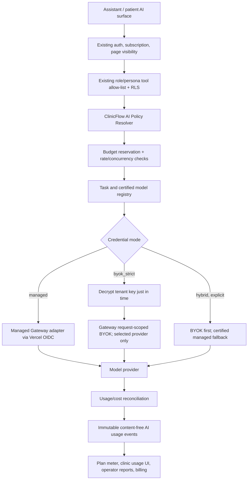

# Phase 4.5 Architecture Proposal — AI Platform & Provider Architecture

**Date:** 2026-07-18  
**Status:** Recommended architecture; planning only  
**Roadmap position:** Between P4 and P5  
**Plan reference:** `docs/AI_AGENT_PLAN.md` — Roadmap Summary, §3.4, §6, §8 P4.5, §11, §12-HP10, §13-Q14–Q20  
**Implementation status:** Not started. This proposal adds no production code, runtime behavior, database migration, settings page, provider credential, plan mutation, commit, or deployment.

## Executive decision

ClinicFlow should adopt a **managed-first hybrid AI product strategy**:

- **Starter:** no AI.
- **Professional:** ClinicFlow-managed AI with a pooled monthly allowance and a hard cap/add-on path.
- **Enterprise:** managed AI, strict BYOK, or explicitly contracted hybrid fallback.

The technical platform should use **Vercel AI Gateway as the default transport**, while ClinicFlow owns the business- and security-critical control plane: tenant entitlements, role/persona policy, page visibility, tool authorization, model certification, credential mode, budget reservation, usage/cost accounting, and billing disposition.

BYOK should not be the default. It is an Enterprise capability for clinics with procurement requirements, existing provider contracts, committed spend, or specific data-processing terms. Hybrid fallback must never be silent: strict BYOK is the default BYOK mode, and ClinicFlow-funded fallback requires explicit opt-in, pricing, and data-routing disclosure.

This is the best long-term strategy because it preserves a simple Professional onboarding experience while meeting Enterprise requirements without binding ClinicFlow's plans or domain model to Anthropic, OpenAI, Google, Vercel, or any individual model id.

## Current-state fit

ClinicFlow already has the right foundations:

- `lib/entitlements.ts` resolves `plans.features`/`plans.limits` plus `clinic_feature_overrides` and fails closed on inactive subscriptions or lookup failures.
- P4 uses `ai_assistant` and `ai_messages_month`, with an atomic reservation/compensation path around the model call.
- P4 authorization separates clinic entitlement, saved Assistant page visibility, role/persona tool mounting, and RLS-backed tool access.
- `lib/ai/client.ts` already uses AI SDK `"provider/model"` strings and environment overrides rather than a direct provider SDK.
- P3A established a versioned, server-only AES-256-GCM credential envelope and safe metadata boundary for tenant messaging credentials.
- The catalog has three stable slugs: `basic`, `pro`, and `pro_ai`.

The missing pieces are commercial policy, tenant provider modes, safe BYOK lifecycle, certified failover, precise request/token/cost accounting, and a plan transition that does not break existing subscriptions or tests.

## Options evaluated

| Option | Advantages | Problems | Decision |
|---|---|---|---|
| ClinicFlow-managed only | Lowest onboarding friction; centralized privacy, evals, support, and failover | Blocks customers with direct provider agreements, procurement controls, or committed spend | Reject as the only mode |
| BYOK only | Provider cost goes directly to clinic; customer controls provider contract | Poor small-clinic onboarding; fragmented quality/support; every clinic must operate AI infrastructure | Reject |
| Unrestricted provider/model marketplace | Maximum apparent flexibility | Impossible to certify every combination; inconsistent tool behavior, Arabic quality, privacy, cost, and support | Reject |
| Managed-first hybrid | Simple default plus Enterprise control; one product policy and usage ledger | More implementation/security work | **Recommend** |

## Commercial strategy

### Plan mapping

Keep the existing internal slugs stable and change product names/entitlements additively:

| Internal slug | Market name | Included AI | Provider mode | Recommended billing model |
|---|---|---|---|---|
| `basic` | Starter | None | None | Existing platform/seat charge only |
| `pro` | Professional | Staff Assistant; P5 patient AI in `suggest` mode | Managed | Included clinic-level AI-credit pool; hard cap; prepaid add-ons or upgrade |
| `pro_ai` | Enterprise | Professional features; P5 `auto` mode only after safety gates; higher/custom capacity | Managed, strict BYOK, explicit hybrid | Contracted allowance/overage or BYOK platform fee |

This avoids a destructive slug rename and gives the existing `pro` and `pro_ai` rows a clean long-term meaning.

### Two-part price structure

Retain the approved platform pricing basis—per active staff user, primary-admin seat free—but do not pretend variable AI cost is a seat-only cost. Use:

1. **Platform/seat charge:** access to ClinicFlow and plan capabilities.
2. **Clinic-level AI allowance:** pooled across entitled staff and patient workflows.
3. **Add-on or contracted overage:** prepaid packs for Professional; negotiated metering for Enterprise.

BYOK removes ClinicFlow's provider-token liability for that traffic, but it does not remove the value or cost of ClinicFlow's orchestration, authorization, redaction, audit, evaluations, support, and usage reporting. Enterprise BYOK therefore still carries an AI platform fee.

### Product rules

- Never market “unlimited AI.”
- Do not expose raw tokens as the primary customer concept.
- Use a plain “AI allowance used / remaining” experience backed internally by cost-weighted AI credits.
- Warn at 70% and 90%.
- At 100%, staff AI shows an add-on/upgrade state; patient AI hands the conversation to staff.
- Do not automatically overbill Professional clinics.
- Enterprise overage requires explicit contract terms.
- A failed provider call is not a billable completed interaction, but every attempt is recorded for cost reconciliation.

## Recommended architecture

### 1. ClinicFlow AI Policy Resolver

All AI entry points call one server-only policy boundary. It receives only server-derived context:

- clinic id and actor id;
- role/persona and surface;
- task class;
- locale;
- data-sensitivity class;
- requested tool set from the role-owned registry.

It resolves:

- subscription state;
- feature/limit entitlements plus clinic overrides;
- saved page visibility where applicable;
- allowed credential modes;
- active clinic provider configuration;
- approved task/model alias and fallbacks;
- ZDR/no-training/jurisdiction requirements;
- remaining request/cost budget.

The browser, prompt, model, cookie, query string, or submitted provider/model id cannot influence these decisions.

### 2. Provider abstraction

ClinicFlow needs a thin internal abstraction above AI Gateway. The abstraction should normalize:

- execution request and streaming result;
- provider/model route metadata;
- usage tokens and cost;
- latency and status;
- fallback attempts;
- typed provider errors;
- privacy-policy evidence returned by the transport.

Provider SDK objects and Gateway-specific response shapes must not escape this layer. This keeps a future regional, direct-provider, or self-hosted adapter possible without changing tools, prompts, entitlements, usage accounting, or UI.

AI Gateway remains the recommended first adapter because current official documentation supports unified model access, routing/fallbacks, spend monitoring, Vercel OIDC authentication, and request-scoped BYOK. It also supports team- and request-level ZDR/no-training controls. These are useful infrastructure controls, but they do not replace ClinicFlow authorization or billing:

- [AI Gateway overview](https://vercel.com/docs/ai-gateway)
- [Authentication and BYOK](https://vercel.com/docs/ai-gateway/authentication-and-byok)
- [Provider options and request-scoped BYOK](https://vercel.com/docs/ai-gateway/models-and-providers/provider-options)
- [Zero Data Retention controls](https://vercel.com/changelog/zero-data-retention-no-prompt-training-on-ai-gateway)

External capabilities, model ids, pricing, and compliance coverage must be re-verified at P4.5 execution time.

### 3. Certified task/model registry

Product code should ask for a task class, not a raw model:

- `staff_clinical_summary`
- `staff_administrative`
- `patient_booking`
- `patient_faq`

Each production policy maps a task to:

- primary logical model alias;
- approved fallback aliases;
- allowed serving providers;
- required capabilities such as streaming/tool calling;
- maximum context/output/steps;
- ZDR/no-training requirement;
- allowed credential modes;
- evaluation suite version and minimum score;
- effective date and rollback target.

A model enters production only after Arabic/English quality, dialect tolerance where relevant, tool-call accuracy, authorization behavior, refusal behavior, latency, and cost tests. Clinics cannot select arbitrary models because that would invalidate support and safety claims.

### 4. Credential modes

#### Managed

- ClinicFlow authenticates to AI Gateway using Vercel OIDC.
- ClinicFlow pays provider/Gateway usage.
- Only ClinicFlow-certified routes are available.
- Managed allowance and cost budget apply.

#### BYOK strict

- Available to Enterprise only.
- The clinic selects one supported provider and supplies its own key.
- The request injects that credential through request-scoped BYOK and pins the approved provider route.
- No managed/system credential fallback is permitted.
- Provider cost is paid through the clinic's provider account.
- ClinicFlow fair-use, request, concurrency, safety, and platform limits still apply.

#### Hybrid

- Enterprise-only and explicitly contracted.
- BYOK is attempted first.
- A managed fallback is allowed only from a certified list and only after persisted clinic opt-in.
- The fallback consumes managed allowance/overage and writes an audit/usage event identifying the route change.
- Clinic-facing copy explains that a different billing and data-processing route may be used.

## AI entitlement model

### Resolution chain

The authoritative chain is:

1. Active subscription/trial.
2. Plan features/limits.
3. Operator clinic overrides.
4. Provider mode allowed and configured.
5. Assistant page visible to the user.
6. Role/persona allows the surface and tool.
7. RLS permits the requested records.
8. Usage/rate/concurrency budget available.

Each layer is independent and tested independently. Provider configuration never grants entitlement, visibility, role, or data access.

### Additive feature vocabulary

Retain `ai_assistant` during migration as a compatibility umbrella. Add namespaced capabilities:

- `ai.staff_assistant`
- `ai.patient_suggest`
- `ai.patient_auto`
- `ai.managed`
- `ai.byok`
- `ai.hybrid_fallback`

Recommended limits:

- `ai_credits_month`
- `ai_requests_month` as a simple UX/fair-use ceiling
- `ai_concurrent_requests`
- `ai_turn_steps_max`
- `ai_output_tokens_max`

The existing `ai_messages_month` remains supported until all callers and plan data migrate. No destructive enum/key rename is required.

## Usage limits and billing ledger

### Why `ai_messages` is insufficient

One assistant turn can vary significantly by context size, tool-loop steps, output length, model tier, retries, and fallback. Counting turns is useful for customer UX but insufficient for financial control.

### Authoritative content-free event

Record one immutable event per provider attempt/request with:

- idempotent request/attempt id;
- clinic id and internal actor id;
- pseudonymous external tracking ids/tags;
- surface, persona, and task class;
- credential mode;
- provider/model actually used;
- input, output, cached-input, and reasoning tokens when reported;
- start/end/latency/status/error class;
- fallback parent/sequence;
- estimated and final cost in integer micros;
- reserved and reconciled AI credits;
- billing disposition (`managed_included`, `managed_addon`, `managed_overage`, `byok`, `nonbillable_failed`).

Do not store prompt text, completion text, tool inputs/outputs, patient ids, patient names, message bodies, or provider keys in this ledger.

### Budget algorithm

1. Estimate the worst-case cost from prompt/context estimate, task policy, maximum output, and maximum steps.
2. Atomically reserve the required credits before opening the provider stream.
3. Reject or degrade if the reservation would cross the clinic cap.
4. Reconcile to actual provider-reported usage on success.
5. Release unused reservation on normal completion.
6. Release or classify failed/aborted attempts according to actual provider billing evidence.
7. Make stale reservations reclaimable by lease/timeout.

This closes concurrent-request overspend and provides deterministic billing evidence.

## API-key security model

### Storage

- Use a dedicated `AI_PROVIDER_CREDENTIALS_KEY`; never reuse the messaging credential key.
- Use a versioned AES-256-GCM envelope, following P3A's established pattern.
- Bind authenticated additional data to clinic id, provider id, and credential id so ciphertext cannot be moved across tenants/providers.
- Store ciphertext in a credential-bearing table with no authenticated read policy.
- Expose only a safe server projection: provider, status, masked fingerprint, timestamps, and sanitized error state.
- Keep a KMS/Vault-backed master-key migration seam for later scale/compliance needs.

### Lifecycle

- Only the primary clinic admin may create, test, rotate, revoke, or delete a key.
- Require recent authentication for rotate/revoke/delete.
- Accept the raw key once over TLS and never return it.
- Validate with a minimal provider operation; return typed errors only.
- Rotate using validate-new → atomically activate-new → retire-old.
- Decrypt only in server memory immediately before a request and discard after use.
- Deletion destroys ciphertext; immutable audit retains non-secret metadata only.

### Logging and incident controls

- Scrub credentials from server logs, Sentry, audit data, request errors, and client payloads.
- Never put keys in URLs, query strings, cookies, local storage, analytics, or form rehydration.
- Gateway `user`/tags use HMAC-pseudonymous identifiers, not clinic names, emails, phone numbers, or patient identifiers.
- Add repeated-auth/quota failure circuit breakers so a bad key does not create a retry storm.
- Provide a rotation/revocation incident runbook and operator-visible health metadata without operator key access.

## Integration with customization and authorization

P4.5 must preserve the three independent decisions already established in the roadmap:

- **Entitlement:** the clinic plan/override permits the AI capability/provider mode.
- **Visibility:** the primary clinic admin exposes the registered Assistant/settings page to an eligible user.
- **Data authorization:** role/tool/RLS rules control data and operations after entry.

Specific rules:

- Continue using `user_page_permissions` with the legacy `user_customizations` fallback.
- If provider configuration receives its own page, register it as a stable settings/page definition with localized copy and direct-route denial; do not create a private toggle outside the customization system.
- Key mutation remains primary-admin-only even if a settings page is visible to another eligible role.
- Every AI tool rechecks role, subscription, AI entitlement, Assistant visibility, and RLS as it does now.
- `clinic_feature_overrides` may enable/disable capability but cannot inject a model id or key.
- Operators may change plan/feature/policy metadata and see provider health/cost aggregates, but may never read tenant key ciphertext/plaintext or AI conversation content.

## Provider strategy and future extensibility

### Initial strategy

- Keep the current Anthropic-backed P4 model policy only as a bootstrap default.
- Implement the managed Gateway adapter first.
- Certify a small primary/fallback set per task rather than all available models.
- Launch Enterprise BYOK with one provider family first.
- Require ZDR/no-training for any route carrying clinical or patient context.
- Prefer availability and evaluated correctness over lowest-token-price routing for clinical tasks.

### Extension rule

Adding a provider later should require:

1. Credential schema/validation support if BYOK differs.
2. Adapter normalization.
3. Security/legal review.
4. Task-specific ar/en evaluations.
5. Cost/latency characterization.
6. Certified registry entry and rollback target.

It should not require changes to plan slugs, tools, prompts' authorization rules, Assistant UI, subscription schema, or billing-provider code.

## Roadmap changes

The master roadmap now:

- inserts P4.5 between P4 and P5;
- changes the recommended v1 cut line from P0–P4 to P0–P4.5;
- makes P5 depend on P4.5;
- adds P4.5A, P4.5B, and P4.5C, taking the execution-sub-phase count from 25 to 28;
- adds 11–16 developer-days, changing the total from ~117–165 to ~128–181;
- moves authoritative LLM cost reporting from generic `ai_messages` counters to the P4.5 usage ledger;
- keeps P6 responsible for mature eval/load/cost dashboards, using the P4.5 data source.

## Implementation order

### P4.5A — AI platform foundation, provider policy, and usage accounting (4–6 days)

1. Define normalized task, policy, route, usage, and error contracts.
2. Add the certified task/model registry.
3. Add the managed Gateway adapter and privacy/fallback policy.
4. Route existing P4 agent creation through the policy boundary without behavior change.
5. Add immutable usage events and atomic budget reservation/reconciliation.
6. Prove current P4 authorization and UI behavior remain unchanged.

### P4.5B — Secure provider connections and BYOK/hybrid routing (4–5 days)

1. Add credential metadata/encrypted storage and safe projections.
2. Add primary-admin key create/test/rotate/revoke lifecycle.
3. Implement request-scoped BYOK strict mode.
4. Add separately enabled hybrid fallback.
5. Add credential/fallback audit and secret-leak tests.
6. Publish rotation and compromise runbooks.

### P4.5C — Commercial integration, entitlements, and operations (3–5 days)

1. Map stable slugs to Starter/Professional/Enterprise product names.
2. Add namespaced AI capabilities and limits with a compatibility period.
3. Define Professional allowance/add-on and Enterprise BYOK/overage domain rules.
4. Add clinic usage/cap and provider-health surfaces through the existing settings/customization rules.
5. Add operator cost/provider reports through the existing report registry.
6. Reconcile plan → entitlement → provider mode → budget → usage → billing scenarios.

P5 starts only after P4.5C acceptance.

## Risks and mitigations

| Risk | Impact | Mitigation |
|---|---|---|
| Credential leak | Provider account compromise and PHI exposure | Dedicated envelope key, AAD tenant binding, no authenticated credential reads, one-way UI, scrub tests, rotation runbook |
| Silent BYOK fallback | Surprise ClinicFlow charge and changed data route | Strict BYOK default; separate explicit hybrid entitlement/config; audited route change |
| Provider/model behavior drift | Tool errors, Arabic regressions, unsafe replies | Certified registry, versioned eval suite, controlled rollout, rollback target |
| Turn-count cost mismatch | Unprofitable “small” plan usage | Cost-weighted credits plus request/token ledger and pre-call reservation |
| Concurrent overspend | Clinic exceeds cap before counters update | Atomic worst-case reservation and reconciliation |
| BYOK support fragmentation | High support cost | Enterprise only; one provider family first; certified combinations only |
| Gateway/vendor dependency | Transport lock-in or outage | ClinicFlow abstraction, normalized events/errors, certified fallback/direct adapter seam |
| ZDR/provider coverage changes | Non-compliant routing | Fail-closed privacy policy, provider allowlist, execution-time re-verification |
| Operator overreach | Platform staff see secrets or PHI | Metadata-only operator projections; no credential or conversation content |
| Plan migration confusion | Existing subscriptions/tests break | Stable slugs; additive display names/features; compatibility umbrella |
| Patient automation cost/incident amplification | High spend or unsafe replies | P4.5 before P5; Professional `suggest`; Enterprise `auto` only after P6 gates |

## Open questions

1. What Professional AI-credit pool follows from pilot p50/p95 cost data?
2. Should add-ons be prepaid packs, automatic recharge, or upgrade-only at launch?
3. Which provider family is the first Enterprise BYOK target?
4. Which exact provider/model routes meet the required ZDR/no-training, DPA, residency, Arabic, and tool-use criteria?
5. Does Enterprise managed usage use prepaid allowance, invoice overage, or a committed minimum?
6. Is hybrid fallback ever offered outside Enterprise?
7. What clinic-facing disclosure/acceptance is required before hybrid changes the provider/billing route?
8. Which entity signs provider and data-processing agreements in managed and BYOK modes for each target country?
9. Is patient `auto` mode Enterprise-only at launch? The recommendation is yes.
10. Who may view provider-health metadata besides the primary clinic admin? The recommendation is manager read-only, primary admin mutation-only, subject to the existing settings/page rules.
11. How long are content-free usage/audit events retained for invoice disputes and compliance?
12. When should the app-layer master key move to a managed KMS/Vault?

## Final recommendation

Approve the managed-first hybrid architecture and the three-part P4.5 execution order.

The durable product contract should be:

- Starter is a useful non-AI clinic product.
- Professional provides a turnkey, ClinicFlow-managed AI experience with a clear pooled cap.
- Enterprise adds control—BYOK, contractual capacity, and optional explicit fallback—without bypassing ClinicFlow authorization, safety, or platform billing.
- ClinicFlow owns policy and accounting; AI Gateway is a replaceable transport adapter, not the entitlement or security authority.
- Raw model ids and provider keys never become plan semantics or client-controlled inputs.
- Patient-facing AI does not begin until provider routing, credentials, usage accounting, and commercial behavior are accepted in P4.5.

This gives ClinicFlow the best balance of adoption, margin control, enterprise readiness, security, and future provider flexibility.
