# Pre-P2 WS5 Review — Calendar Readability

**Status:** REVIEWED  
**Workstream:** WS5 (`docs/PRE_P2_POLISH.md` §7-WS5)  
**Review cycle:** 1  
**Review date:** 2026-07-13  
**Final verdict:** **APPROVED FOR MERGE**

This file is the authoritative WS5 review record. Re-reviews must preserve this cycle,
retain stable finding IDs, and append a dated cycle rather than deleting history.

## Review Cycle 1

### 1. Review scope and implementation summary

Reviewed the integrated week, day, month, and appointment-create slot presentation against
the approved WS5 scope. The implementation adds one shared calendar visual system, strong
but balanced grid tokens, WCAG-readable labels, today/current-time treatments, visual-only
working-hours bands, higher-contrast events/statuses, selected-slot feedback, and production
Playwright evidence in both themes and at 320px.

No appointment behavior, booking logic, slot availability, conflict calculation, timezone
format, RLS, tenancy, RBAC, middleware, or business action was changed.

### 2. Exact files changed

Product code:

- `app/globals.css`
- `components/appointments/calendar-visuals.tsx` (new)
- `components/appointments/week-calendar.tsx`
- `components/appointments/day-calendar.tsx`
- `components/appointments/month-calendar.tsx`
- `components/appointments/appointment-form.tsx`
- `components/appointments/status-badge.tsx`

Tests:

- `tests/unit/components/appointment-calendar-readability.test.tsx` (new)
- `tests/e2e/smoke.spec.ts`

Documentation/evidence:

- `docs/reports/PRE_P2_WS5_IMPLEMENTATION.md` (new)
- `docs/reviews/PRE_P2_WS5_REVIEW.md` (new)
- `docs/reviews/assets/pre-p2-ws5/week-light-before.png`
- `docs/reviews/assets/pre-p2-ws5/week-light-after.png`
- `docs/reviews/assets/pre-p2-ws5/week-dark-before.png`
- `docs/reviews/assets/pre-p2-ws5/week-dark-after.png`
- `docs/reviews/assets/pre-p2-ws5/day-light-before.png`
- `docs/reviews/assets/pre-p2-ws5/day-light-after.png`
- `docs/reviews/assets/pre-p2-ws5/day-dark-before.png`
- `docs/reviews/assets/pre-p2-ws5/day-dark-after.png`
- `docs/reviews/assets/pre-p2-ws5/month-light-before.png`
- `docs/reviews/assets/pre-p2-ws5/month-light-after.png`
- `docs/reviews/assets/pre-p2-ws5/month-dark-before.png`
- `docs/reviews/assets/pre-p2-ws5/month-dark-after.png`
- `docs/reviews/assets/pre-p2-ws5/day-light-responsive-320.png`

### 3. Stable finding IDs

No required or optional WS5 findings remain open in Review Cycle 1.

Resolved during implementation (recorded for stability, not open):

- **PREP2-WS5-R1 — RESOLVED:** partial page-local opacity edits were consolidated into
  shared calendar tokens and helpers.
- **PREP2-WS5-R2 — RESOLVED:** arbitrary department colors are no longer used as event
  text colors; theme foreground text now carries content contrast.
- **PREP2-WS5-R3 — RESOLVED:** per-day opening/closing gaps are visually distinct, not
  treated as free working time.
- **PREP2-WS5-R4 — RESOLVED:** create-flow time slots now have an explicit checked/selected
  trigger and option state.

### 4. Acceptance criteria checklist

- [x] All three views audited and implemented (week, day, month)
- [x] Shared visual tokens/helpers; no inconsistent per-view opacity system
- [x] Two-level grid-line hierarchy in light and dark themes
- [x] Hour labels ≥11px, medium weight, tabular, full computed opacity
- [x] Hour-label contrast measured before/after and final contrast ≥4.5:1
- [x] Clear today header and body state in every view
- [x] Visible current-time indicator in every view; week/day use line + dot
- [x] Current-time visual refreshes once per minute
- [x] Working, break, non-working, and closed hierarchy is clear
- [x] Selected create-flow time slot is clear
- [x] Appointment/event/status contrast improved in both themes
- [x] Hover, focus, and opened-event states remain visible
- [x] 320px horizontal-scroll containment verified; no body overflow
- [x] No heavy shadows/chrome or visually cluttered result
- [x] Appointment behavior, booking, slot, timezone, RLS, tenancy, RBAC, middleware,
      and business logic preserved
- [x] No P2, Arabic, RTL, or deferred feature work introduced
- [x] Before/after screenshot pair per view per theme recorded below
- [x] Targeted calendar unit/component tests green
- [x] Relevant production Playwright flow green
- [x] Typecheck, lint, full unit suite, build, and `git diff --check` green

### 5. Contrast measurements

Method: WCAG 2.1 relative luminance, converting the authored OKLCH tokens to sRGB and
compositing the audited/final alpha over the calendar card background.

| Theme | Audited before | Final after | WCAG AA normal text |
|---|---:|---:|---|
| Light hour label | 1.80:1 | **6.26:1** | PASS |
| Dark hour label | 3.42:1 | **8.04:1** | PASS |

The final calendar uses `text-foreground/70` for small secondary labels because the app's
light `muted-foreground` token at full opacity measures only 3.70:1 over white. This scoped
choice avoids a global token change while meeting the 4.5:1 floor.

### 6. Visual verification

The before captures reproduce the exact audited baseline styling during capture only;
after captures are the production implementation. All were produced by the final
production-build Playwright flow with deterministic fixture data.

| View | Light before | Light after | Dark before | Dark after |
|---|---|---|---|---|
| Week | 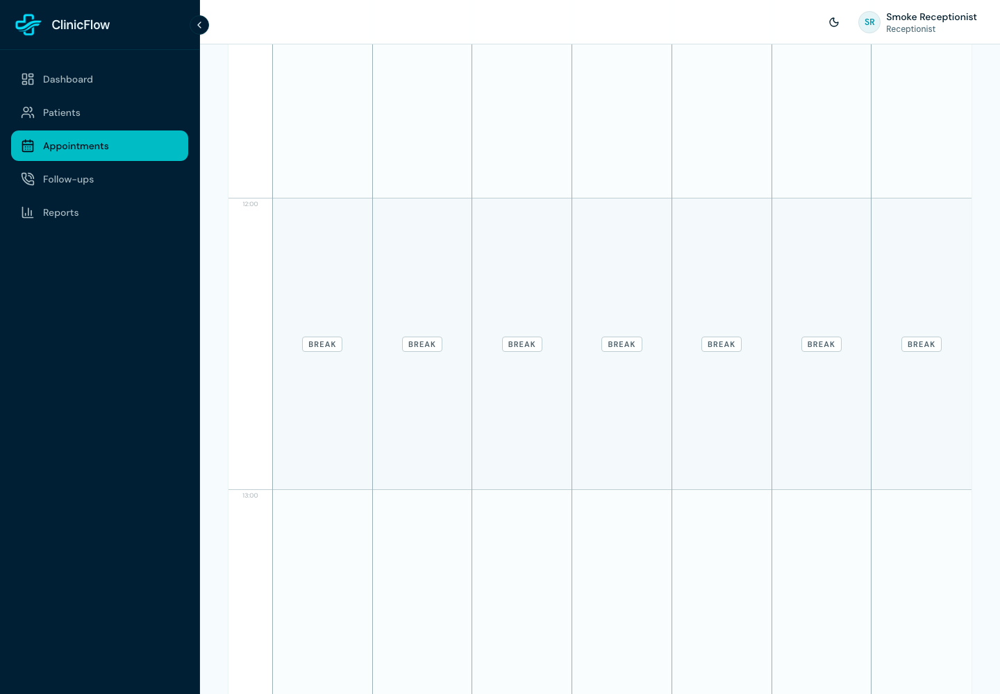 | 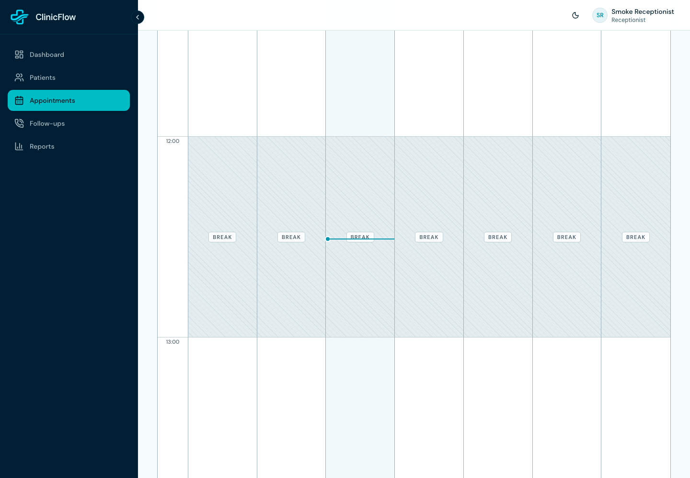 | 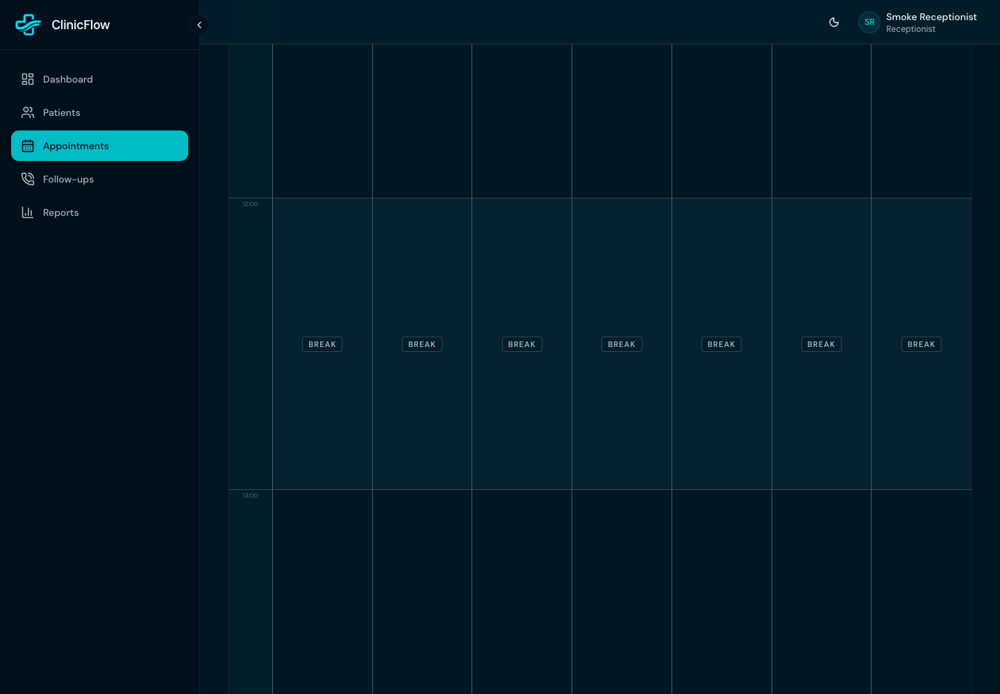 | 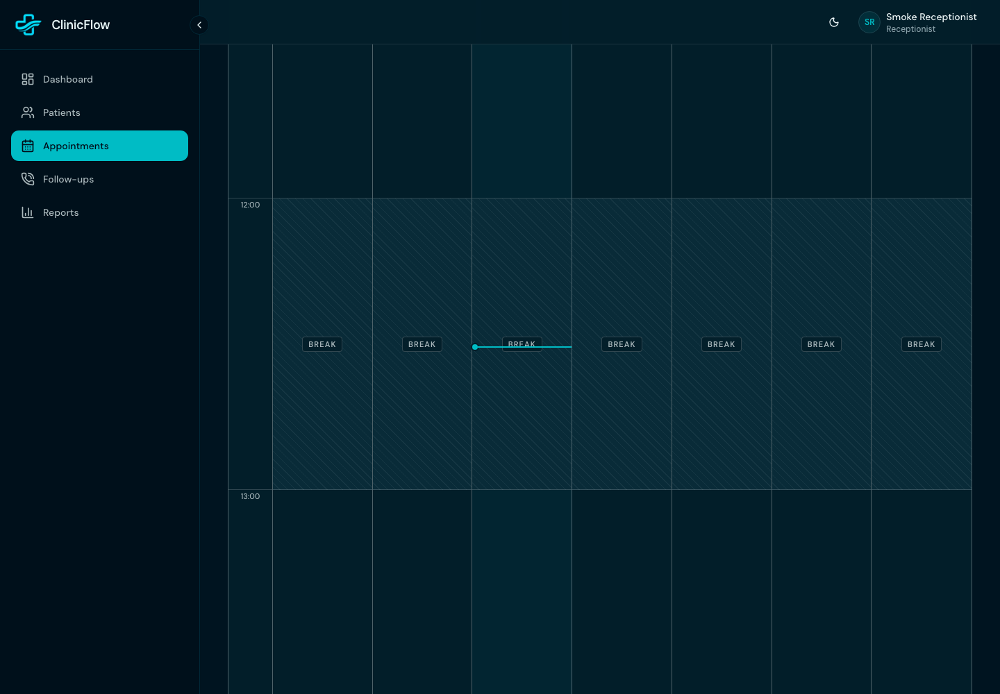 |
| Day | 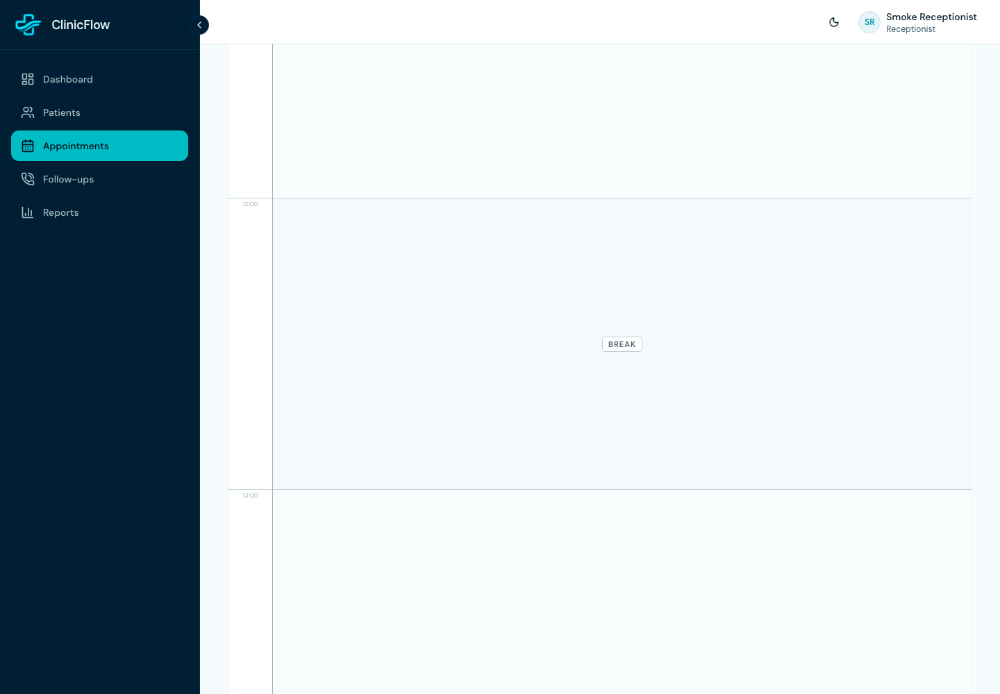 | 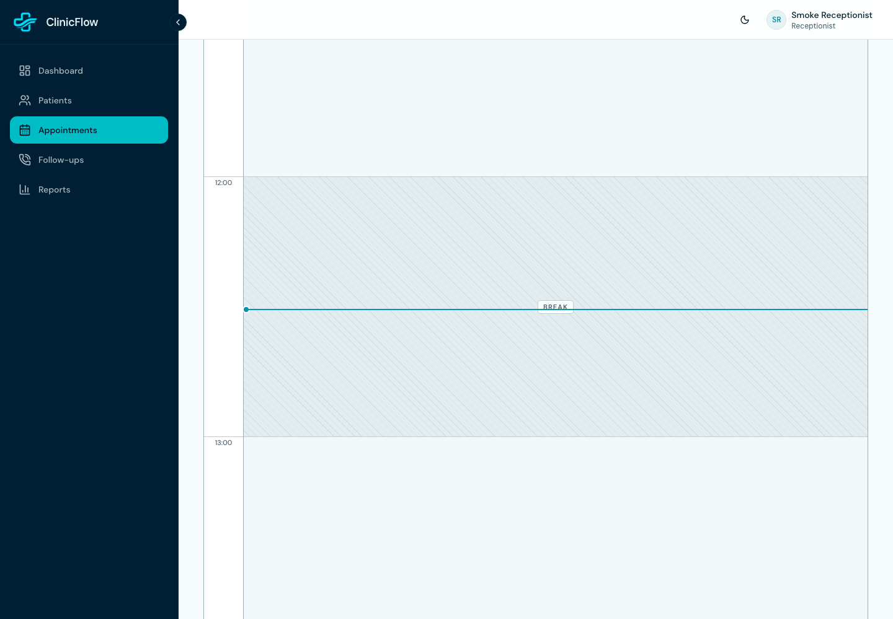 | 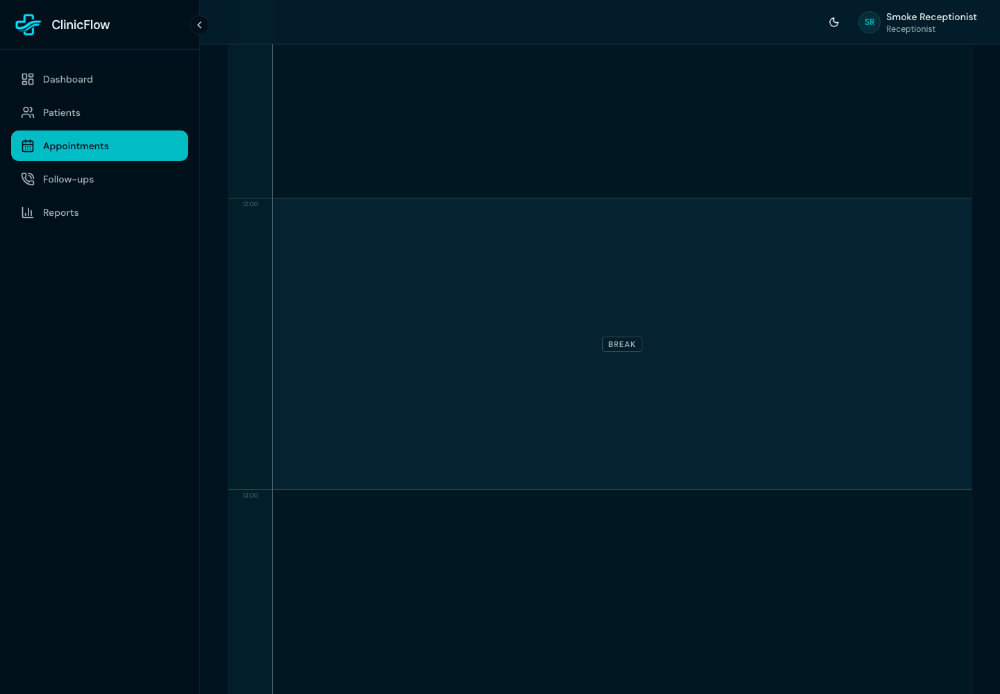 | 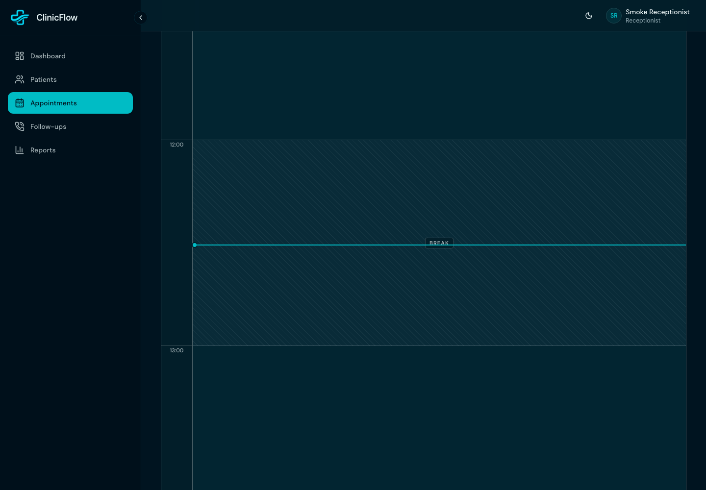 |
| Month | 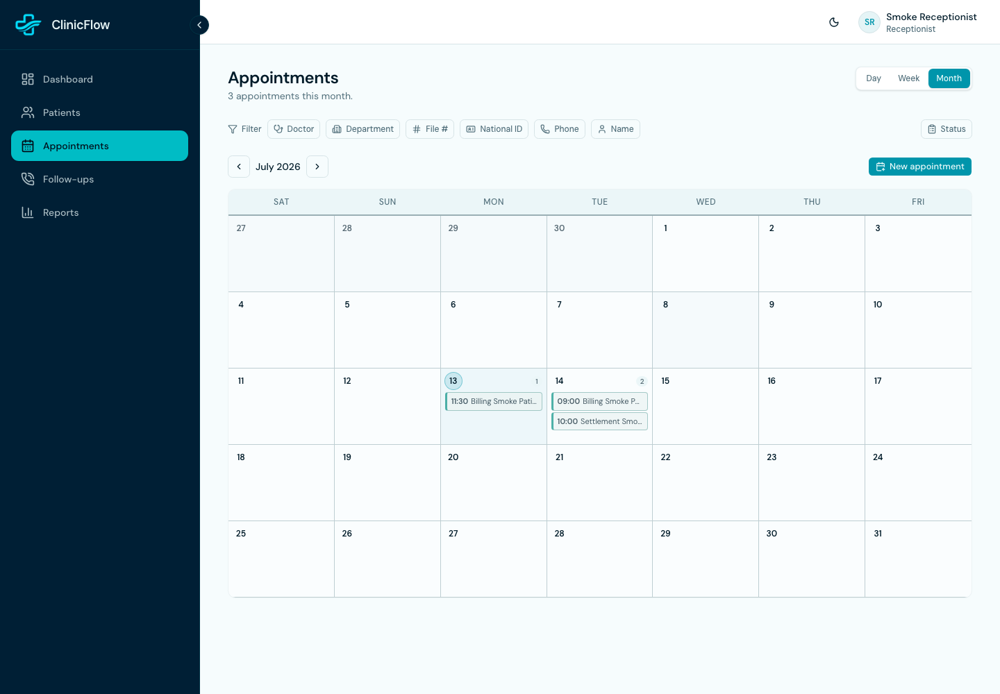 | 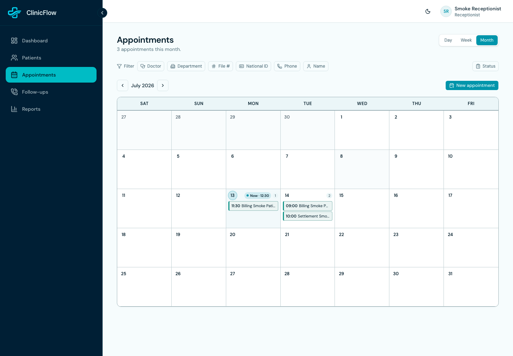 | 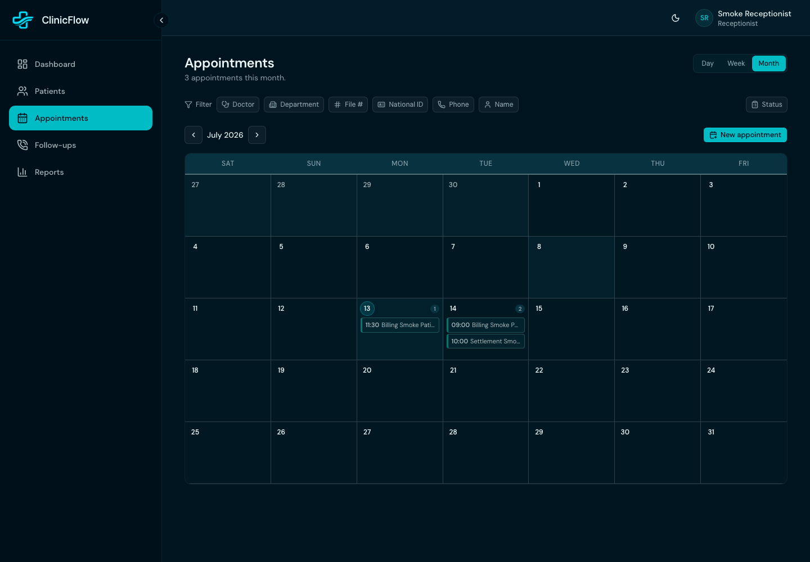 | 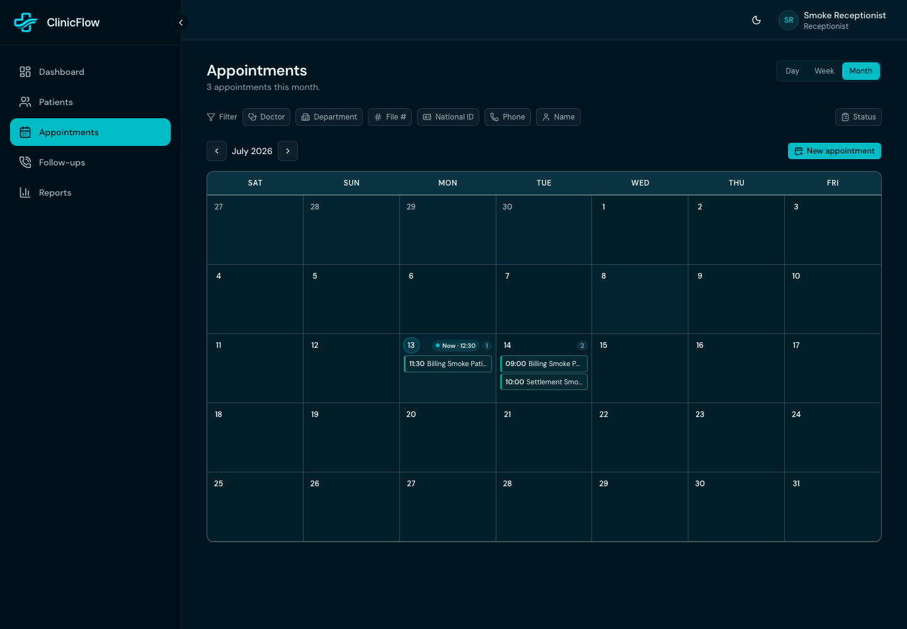 |

Responsive evidence: 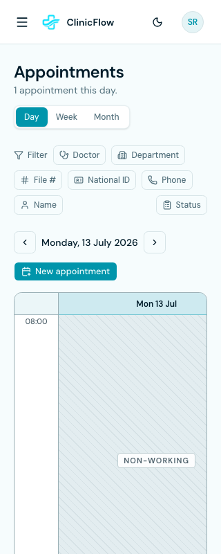

### 7. Validation summary — commands and exact results

| Command | Result |
|---|---|
| `pnpm exec vitest run tests/unit/components/appointment-calendar-readability.test.tsx tests/unit/components/appointment-calendar-performance.test.ts` | **PASS** — 2 files, 10 tests |
| `pnpm exec vitest run tests/unit/components/appointment-calendar-readability.test.tsx tests/unit/components/appointment-calendar-performance.test.ts tests/unit/actions/time-slots.test.ts tests/unit/actions/appointment-form-autofill.test.tsx` | **PASS** — 4 files, 19 tests |
| `pnpm test` | **PASS** — 85 files, 466 tests (final run: 16.46s) |
| `pnpm typecheck` | **PASS** — exit 0; no diagnostics |
| `pnpm lint` | **PASS WITH WARNINGS** — 0 errors; 4 pre-existing warnings in dashboard, follow-up, patient-form, and department-form files |
| `PORT=3101 node --env-file=.env.local node_modules/@playwright/test/cli.js test --workers=1 --grep "WS5 calendar readability"` | **PASS** — clean production `next build` + `next start`; Chromium 1/1 in 4.3s, 22.5s total |
| `git diff --check` | **PASS** — no whitespace errors (final post-document run recorded below) |

Additional facts:

- The production E2E log contained the pre-existing `last_login_update_failed` (`42501`)
  warning already inventoried by P1.5 reviews; it did not fail or alter the flow.
- The in-app browser plugin had no available browser instance (`agent.browsers.list()` →
  `[]`). Visual verification therefore used the repository's Chromium Playwright suite.
- No integration/database suite was run because WS5 adds no server/database behavior;
  the production Playwright flow exercised the real local tenant fixture and cleanup.

### 8. Required findings

None.

### 9. Optional polish findings

None.

### 10. Known issues

No WS5 implementation issue remains. The lint warnings and login-update server log noted
above pre-date WS5 and are outside this workstream.

### 11. Git state

- Current branch: `main` tracking `origin/main` (`## main...origin/main`).
- Working tree: dirty by design, containing the preserved uncommitted WS0–WS4 work and
  the WS5 modified/untracked files enumerated in this review.
- Staging area: empty (`git diff --cached --name-only` returned no paths).
- No commit, push, merge, branch, reset, restore, stash, clean, or staging action occurred.

### 12. Final verdict

**APPROVED FOR MERGE**

WS5 meets every approved acceptance criterion, has final production-browser evidence in
both themes and at mobile width, and preserves appointment/security/business behavior.
Stop here; WS6 was not started.

## Re-review history

- **Review Cycle 1 — 2026-07-13:** initial WS5 implementation review. Four implementation
  findings were resolved before verdict; no required or optional finding remains.
